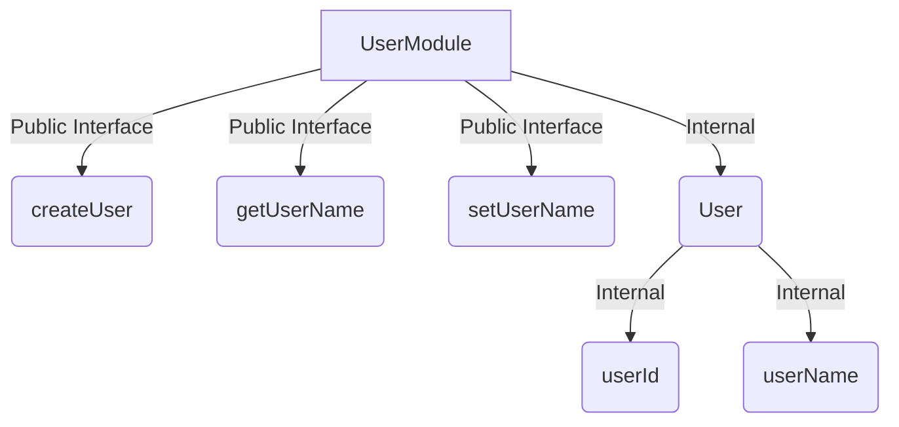

## 5.9 Module Pattern for Encapsulation

In the realm of software design, the **Module Pattern** is a structural pattern that plays a crucial role in organizing code, encapsulating implementation details, and providing a clean public interface. In Haskell, this pattern is particularly powerful due to the language's emphasis on immutability and type safety. Let's delve into the intricacies of the Module Pattern in Haskell, exploring its benefits, implementation strategies, and best practices.

### Understanding the Module Pattern

The Module Pattern is a design pattern used to encapsulate code within a module, exposing only the necessary parts of the module to the outside world. This pattern helps in maintaining a clean separation between the internal implementation and the external interface, promoting code reusability and maintainability.

#### Key Concepts

- **Encapsulation**: Encapsulation is the process of hiding the internal details of a module, exposing only what is necessary. This prevents external code from depending on the internal workings of the module, allowing for changes without affecting other parts of the system.
  
- **Public Interface**: The public interface of a module is the set of functions, types, and values that are exposed to the outside world. This interface defines how other modules can interact with the encapsulated code.

- **Implementation Details**: These are the internal workings of a module that are hidden from the outside world. By keeping these details private, we can change the implementation without affecting the module's users.

### Benefits of the Module Pattern in Haskell

1. **Encapsulation**: Haskell's module system allows developers to hide implementation details, exposing only the necessary parts of a module. This encapsulation helps in maintaining a clear separation between the interface and implementation.

2. **Code Organization**: Modules provide a way to organize code into logical units, making it easier to navigate and understand large codebases.

3. **Reusability**: By defining clear interfaces, modules can be reused across different parts of a program or even in different projects.

4. **Maintainability**: Encapsulation and clear interfaces make it easier to maintain and update code, as changes to the implementation do not affect the module's users.

5. **Namespace Management**: Modules help in managing namespaces, preventing name clashes and making it easier to understand where functions and types are defined.

### Implementing the Module Pattern in Haskell

In Haskell, modules are defined using the `module` keyword. A module can export functions, types, and values, while keeping other parts of the code private. Let's explore how to implement the Module Pattern in Haskell with a practical example.

#### Example: Encapsulating Data Access Logic

Consider a scenario where we need to encapsulate data access logic for a simple user management system. We want to expose only the necessary functions for interacting with user data, while keeping the internal data representation and access logic hidden.

```haskell
-- UserModule.hs
module UserModule (
    User,
    createUser,
    getUserName,
    setUserName
) where

-- Internal data representation
data User = User { userId :: Int, userName :: String }

-- Public interface
createUser :: Int -> String -> User
createUser id name = User { userId = id, userName = name }

getUserName :: User -> String
getUserName user = userName user

setUserName :: User -> String -> User
setUserName user newName = user { userName = newName }
```

In this example, the `User` data type and its associated functions are encapsulated within the `UserModule`. The module exports only the `User` type and the functions `createUser`, `getUserName`, and `setUserName`, keeping the internal representation of `User` hidden.

#### Key Participants

- **Module Declaration**: The `module` keyword is used to declare a module and specify its exports.
- **Data Types and Functions**: Define data types and functions within the module, exposing only those that are part of the public interface.
- **Encapsulation**: Use Haskell's module system to hide implementation details, ensuring that only the public interface is accessible.

### Best Practices for Using the Module Pattern

1. **Define Clear Interfaces**: Clearly define what functions, types, and values should be part of the public interface. This helps in maintaining a clean separation between the interface and implementation.

2. **Use Descriptive Names**: Use descriptive names for modules and their exports to make it clear what each module is responsible for.

3. **Limit Exports**: Export only what is necessary. Keeping the public interface small reduces the surface area for potential bugs and makes the module easier to understand.

4. **Organize Code Logically**: Group related functions and types within the same module. This helps in maintaining a logical structure and makes it easier to navigate the codebase.

5. **Document Interfaces**: Provide documentation for the public interface of each module. This helps other developers understand how to use the module without needing to delve into the implementation details.

### Haskell Unique Features

Haskell's module system is designed to support encapsulation and modularity, with several unique features that enhance the Module Pattern:

- **Type Safety**: Haskell's strong static typing ensures that modules interact safely, catching errors at compile time.

- **Immutability**: The immutable nature of Haskell's data structures complements the Module Pattern, as it prevents unintended side effects.

- **Lazy Evaluation**: Haskell's lazy evaluation model allows modules to define potentially infinite data structures, which can be consumed as needed.

- **Type Classes**: Haskell's type classes enable polymorphic interfaces, allowing modules to define generic operations that work across different types.

### Design Considerations

When using the Module Pattern in Haskell, consider the following:

- **Balance Between Encapsulation and Flexibility**: While encapsulation is important, ensure that the module's interface is flexible enough to accommodate future changes.

- **Avoid Over-Encapsulation**: Over-encapsulation can lead to modules that are difficult to use or extend. Strive for a balance between hiding implementation details and providing a usable interface.

- **Consider Performance**: Encapsulation can sometimes introduce performance overhead. Consider the performance implications of your design, especially in performance-critical applications.

### Differences and Similarities with Other Patterns

The Module Pattern shares similarities with other design patterns, such as:

- **Facade Pattern**: Both patterns provide a simplified interface to a complex system. However, the Module Pattern focuses on encapsulating implementation details, while the Facade Pattern provides a unified interface to a set of interfaces.

- **Adapter Pattern**: The Adapter Pattern is used to adapt one interface to another, while the Module Pattern is focused on encapsulation and providing a clean public interface.

### Try It Yourself

To deepen your understanding of the Module Pattern, try modifying the example code:

- **Add New Functions**: Add a function to update the user's ID, ensuring that it is encapsulated within the module.
- **Change Data Representation**: Modify the internal representation of the `User` data type, and observe how the public interface remains unaffected.
- **Experiment with Type Classes**: Introduce a type class to define generic operations for different user types.

### Visualizing Module Encapsulation

To better understand how the Module Pattern encapsulates implementation details, let's visualize the relationship between the public interface and the internal implementation.



**Diagram Description**: This diagram illustrates the encapsulation within the `UserModule`. The public interface consists of the `createUser`, `getUserName`, and `setUserName` functions, while the internal implementation details, such as the `User` data type and its fields, are hidden.

### Knowledge Check

Before we conclude, let's reinforce our understanding with a few questions:

- **What is the primary purpose of the Module Pattern?**
- **How does Haskell's module system support encapsulation?**
- **What are the benefits of limiting exports in a module?**

### Conclusion

The Module Pattern is a powerful tool in Haskell for encapsulating implementation details and providing a clean public interface. By leveraging Haskell's module system, developers can create modular, maintainable, and reusable code. As you continue to explore Haskell's design patterns, remember to embrace the principles of encapsulation and clear interfaces, ensuring that your code remains robust and adaptable.

## Quiz: Module Pattern for Encapsulation



### What is the primary purpose of the Module Pattern in Haskell?

- [x] To encapsulate implementation details and provide a public interface
- [ ] To improve performance by optimizing code execution
- [ ] To facilitate database interactions
- [ ] To enable dynamic typing

> **Explanation:** The Module Pattern is primarily used to encapsulate implementation details and provide a clean public interface, promoting modularity and maintainability.

### Which keyword is used to declare a module in Haskell?

- [x] module
- [ ] import
- [ ] export
- [ ] package

> **Explanation:** The `module` keyword is used to declare a module in Haskell and specify its exports.

### What is a key benefit of using the Module Pattern?

- [x] Encapsulation of internal details
- [ ] Increased runtime speed
- [ ] Dynamic type checking
- [ ] Simplified syntax

> **Explanation:** The Module Pattern helps in encapsulating internal details, allowing for changes without affecting the module's users.

### How does Haskell's type system enhance the Module Pattern?

- [x] By ensuring type safety and catching errors at compile time
- [ ] By allowing dynamic type changes at runtime
- [ ] By providing automatic memory management
- [ ] By enabling direct hardware access

> **Explanation:** Haskell's strong static typing ensures type safety, catching errors at compile time and enhancing the Module Pattern.

### What should be considered when defining a module's public interface?

- [x] Limit exports to what is necessary
- [ ] Export all internal details for flexibility
- [ ] Use complex naming conventions
- [ ] Avoid documentation

> **Explanation:** Limiting exports to what is necessary helps maintain a clean separation between the interface and implementation.

### Which of the following is a similarity between the Module Pattern and the Facade Pattern?

- [x] Both provide a simplified interface
- [ ] Both focus on performance optimization
- [ ] Both are used for database interactions
- [ ] Both enable dynamic typing

> **Explanation:** Both the Module Pattern and the Facade Pattern provide a simplified interface, though their focus differs.

### What is a potential downside of over-encapsulation?

- [x] Modules may become difficult to use or extend
- [ ] Increased runtime speed
- [ ] Simplified syntax
- [ ] Enhanced dynamic typing

> **Explanation:** Over-encapsulation can lead to modules that are difficult to use or extend, reducing flexibility.

### How can Haskell's lazy evaluation benefit the Module Pattern?

- [x] By allowing modules to define potentially infinite data structures
- [ ] By enabling dynamic type changes
- [ ] By providing automatic memory management
- [ ] By ensuring direct hardware access

> **Explanation:** Haskell's lazy evaluation allows modules to define potentially infinite data structures, which can be consumed as needed.

### What is a best practice when using the Module Pattern?

- [x] Organize code logically within modules
- [ ] Export all internal details for flexibility
- [ ] Use complex naming conventions
- [ ] Avoid documentation

> **Explanation:** Organizing code logically within modules helps maintain a clear structure and makes it easier to navigate the codebase.

### True or False: The Module Pattern in Haskell is primarily used for performance optimization.

- [ ] True
- [x] False

> **Explanation:** The Module Pattern is primarily used for encapsulation and providing a clean public interface, not for performance optimization.



Remember, mastering the Module Pattern in Haskell is just one step in your journey to becoming an expert in functional programming. Keep exploring, experimenting, and building upon these concepts to create robust and scalable systems.
