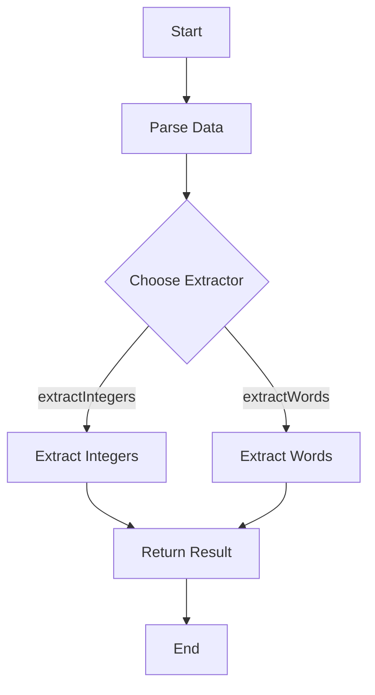

## 6.10 Template Method Pattern with Higher-Order Functions

In the realm of software design patterns, the Template Method Pattern is a behavioral pattern that defines the skeleton of an algorithm in a method, deferring some steps to subclasses. This pattern allows subclasses to redefine certain steps of an algorithm without changing its structure. In Haskell, we can leverage higher-order functions to achieve similar behavior, providing a flexible and powerful way to define algorithms with customizable steps.

### Understanding the Template Method Pattern

**Intent**: The Template Method Pattern aims to define the skeleton of an algorithm in a base class, allowing subclasses to override specific steps without altering the algorithm's structure.

**Key Participants**:
- **Abstract Class**: Defines the template method and declares abstract methods for steps that subclasses should implement.
- **Concrete Class**: Implements the abstract methods to provide specific behavior for the algorithm's steps.

**Applicability**: Use the Template Method Pattern when:
- You have an algorithm with invariant steps and some customizable parts.
- You want to avoid code duplication by centralizing common behavior in a base class.
- You need to enforce a specific sequence of steps in an algorithm.

### Haskell Approach with Higher-Order Functions

In Haskell, we can use higher-order functions to achieve the same flexibility as the Template Method Pattern. Higher-order functions are functions that take other functions as arguments or return functions as results. This allows us to define a generic function that encapsulates the invariant parts of an algorithm, while accepting specific behaviors as parameters.

#### Example: Data Processing with Customizable Extraction

Let's consider a scenario where we need to process data. The parsing step is fixed, but the data extraction varies based on the type of data we are dealing with. We can define a higher-order function to encapsulate this behavior.

```haskell
-- Define a type alias for a data extraction function
type Extractor a = String -> a

-- Template method using a higher-order function
processData :: Extractor a -> String -> a
processData extractor rawData =
  let parsedData = parse rawData
  in extractor parsedData

-- Fixed parsing step
parse :: String -> String
parse = id  -- For simplicity, assume parsing is identity

-- Specific data extraction implementations
extractIntegers :: Extractor [Int]
extractIntegers = map read . words

extractWords :: Extractor [String]
extractWords = words

-- Usage examples
main :: IO ()
main = do
  let rawData = "1 2 3 4 5"
  print $ processData extractIntegers rawData  -- Output: [1, 2, 3, 4, 5]
  print $ processData extractWords rawData     -- Output: ["1", "2", "3", "4", "5"]
```

In this example, `processData` is the template method that defines the algorithm's skeleton. It takes an `Extractor` function as a parameter, allowing us to customize the data extraction step. The `parse` function represents the fixed part of the algorithm, while `extractIntegers` and `extractWords` provide specific implementations for data extraction.

### Visualizing the Template Method Pattern

To better understand the flow of the Template Method Pattern with higher-order functions, let's visualize the process using a flowchart.



**Diagram Description**: This flowchart illustrates the process of the Template Method Pattern using higher-order functions. The data is first parsed, and then the appropriate extractor function is chosen to extract the desired information.

### Design Considerations

When using higher-order functions to implement the Template Method Pattern in Haskell, consider the following:

- **Function Composition**: Leverage Haskell's powerful function composition capabilities to build complex algorithms from simple functions.
- **Type Safety**: Use Haskell's strong type system to ensure that the functions passed as parameters are compatible with the expected types.
- **Reusability**: Design your higher-order functions to be reusable across different contexts by keeping them generic and parameterized.

### Haskell Unique Features

Haskell's unique features, such as lazy evaluation and strong static typing, enhance the implementation of the Template Method Pattern:

- **Lazy Evaluation**: Allows you to define potentially infinite data structures and only evaluate what is necessary, optimizing performance.
- **Type Classes**: Use type classes to define a set of functions that can operate on different types, providing polymorphic behavior similar to subclassing in object-oriented languages.

### Differences and Similarities

The Template Method Pattern in Haskell using higher-order functions differs from its traditional object-oriented implementation in the following ways:

- **No Inheritance**: Haskell does not use inheritance. Instead, it relies on higher-order functions and type classes to achieve polymorphism.
- **Function Parameters**: Instead of overriding methods in subclasses, Haskell uses function parameters to customize behavior.

### Try It Yourself

To deepen your understanding of the Template Method Pattern with higher-order functions, try modifying the code examples:

- Implement a new extractor function that extracts floating-point numbers from the data.
- Modify the `parse` function to perform more complex parsing, such as removing punctuation or converting text to lowercase.

### Knowledge Check

Before moving on, let's reinforce what we've learned:

- How does the Template Method Pattern benefit from higher-order functions in Haskell?
- What are the advantages of using Haskell's type system in implementing this pattern?
- How can lazy evaluation optimize the performance of algorithms using this pattern?

### Embrace the Journey

Remember, mastering design patterns in Haskell is a journey. As you explore the Template Method Pattern with higher-order functions, you'll gain insights into the power of functional programming and how it can be applied to solve complex problems. Keep experimenting, stay curious, and enjoy the process!

## Quiz: Template Method Pattern with Higher-Order Functions



### What is the primary intent of the Template Method Pattern?

- [x] To define the skeleton of an algorithm, allowing specific steps to be customized.
- [ ] To encapsulate a group of individual factories.
- [ ] To provide a way to access the elements of an aggregate object sequentially.
- [ ] To define a family of algorithms, encapsulate each one, and make them interchangeable.

> **Explanation:** The Template Method Pattern defines the skeleton of an algorithm, allowing subclasses or functions to customize specific steps.

### How does Haskell implement the Template Method Pattern?

- [x] By using higher-order functions to define a generic function that takes specific behaviors as parameters.
- [ ] By using inheritance and abstract classes.
- [ ] By using interfaces and polymorphism.
- [ ] By using reflection and dynamic typing.

> **Explanation:** Haskell uses higher-order functions to implement the Template Method Pattern, allowing specific behaviors to be passed as parameters.

### What is a key advantage of using higher-order functions in Haskell?

- [x] They allow for flexible and reusable code by passing functions as parameters.
- [ ] They enable dynamic typing and runtime type checking.
- [ ] They provide a way to implement inheritance.
- [ ] They allow for direct manipulation of memory.

> **Explanation:** Higher-order functions in Haskell allow for flexible and reusable code by enabling functions to be passed as parameters.

### What role does lazy evaluation play in Haskell's implementation of the Template Method Pattern?

- [x] It allows for potentially infinite data structures and only evaluates what is necessary.
- [ ] It forces immediate evaluation of all expressions.
- [ ] It provides dynamic typing capabilities.
- [ ] It enables direct memory access.

> **Explanation:** Lazy evaluation in Haskell allows for potentially infinite data structures and only evaluates what is necessary, optimizing performance.

### Which Haskell feature enhances type safety in the Template Method Pattern?

- [x] Strong static typing
- [ ] Dynamic typing
- [ ] Reflection
- [ ] Inheritance

> **Explanation:** Haskell's strong static typing enhances type safety by ensuring that functions passed as parameters are compatible with expected types.

### What is a common use case for the Template Method Pattern?

- [x] When you have an algorithm with invariant steps and some customizable parts.
- [ ] When you need to create a complex object from simple objects.
- [ ] When you want to provide a unified interface to a set of interfaces in a subsystem.
- [ ] When you need to define a one-to-many dependency between objects.

> **Explanation:** The Template Method Pattern is commonly used when you have an algorithm with invariant steps and some customizable parts.

### How can you customize behavior in Haskell's Template Method Pattern?

- [x] By passing specific functions as parameters to a higher-order function.
- [ ] By overriding methods in subclasses.
- [ ] By using reflection to modify behavior at runtime.
- [ ] By using dynamic typing to change behavior.

> **Explanation:** In Haskell, you can customize behavior by passing specific functions as parameters to a higher-order function.

### What is the role of the `parse` function in the provided example?

- [x] It represents the fixed part of the algorithm.
- [ ] It customizes the data extraction step.
- [ ] It defines the skeleton of the algorithm.
- [ ] It provides a way to access elements sequentially.

> **Explanation:** The `parse` function in the example represents the fixed part of the algorithm, which is not customizable.

### What is a benefit of using type classes in Haskell's Template Method Pattern?

- [x] They provide polymorphic behavior similar to subclassing in object-oriented languages.
- [ ] They allow for dynamic typing and runtime type checking.
- [ ] They enable direct memory manipulation.
- [ ] They provide a way to implement inheritance.

> **Explanation:** Type classes in Haskell provide polymorphic behavior similar to subclassing in object-oriented languages, enhancing flexibility.

### True or False: Haskell's Template Method Pattern relies on inheritance.

- [x] False
- [ ] True

> **Explanation:** Haskell's Template Method Pattern does not rely on inheritance; it uses higher-order functions and type classes instead.


