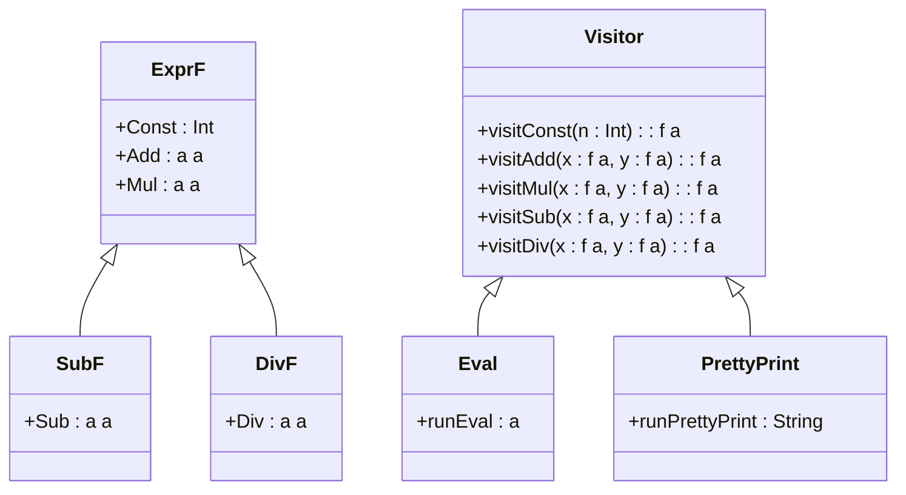

## 6.11 Visitor Pattern with Type Classes and Data Types à la Carte

In this section, we delve into the Visitor Pattern, a behavioral design pattern that allows you to separate algorithms from the objects on which they operate. We will explore how this pattern can be implemented in Haskell using Type Classes and Data Types à la Carte, a technique that facilitates the creation of extensible and modular data types.

### Visitor Concept

The Visitor Pattern is a way of separating an algorithm from an object structure on which it operates. This pattern is particularly useful when you have a complex object structure and you want to perform various operations on these objects without changing their classes. The Visitor Pattern allows you to add new operations to existing object structures without modifying the structures themselves.

#### Key Participants

- **Visitor**: An interface or abstract class that declares a visit operation for each type of concrete element in the object structure.
- **ConcreteVisitor**: Implements the operations defined in the Visitor interface.
- **Element**: An interface or abstract class that declares an accept operation that takes a visitor as an argument.
- **ConcreteElement**: Implements the accept operation, which calls the appropriate visit operation on the visitor.

### Data Types à la Carte

Data Types à la Carte is a technique for building extensible data types in a modular fashion. It allows you to define data types in a way that they can be easily extended with new functionality without modifying existing code. This technique is particularly useful in functional programming languages like Haskell, where immutability and type safety are paramount.

#### Implementation with Type Classes

In Haskell, we can use type classes to define operations that can be performed on data types. By leveraging type classes, we can create a modular and extensible design that allows us to add new operations to data types without modifying their definitions.

### Implementing the Visitor Pattern in Haskell

Let's explore how we can implement the Visitor Pattern in Haskell using Type Classes and Data Types à la Carte. We will use an example of an Abstract Syntax Tree (AST) for a simple arithmetic language and demonstrate how to extend it with new operations like optimization or code generation.

#### Step 1: Define the Base Data Types

First, we define the base data types for our AST. We will use the `Functor` type class to enable mapping over our data types.

```haskell
{-# LANGUAGE TypeOperators #-}
{-# LANGUAGE DeriveFunctor #-}

-- Define the base functor for expressions
data ExprF a
  = Const Int
  | Add a a
  | Mul a a
  deriving (Functor, Show)

-- Define a type alias for expressions
type Expr = ExprF Expr
```

#### Step 2: Define the Visitor Type Class

Next, we define a type class for the visitor. This type class will declare the operations that can be performed on our data types.

```haskell
-- Define the Visitor type class
class Visitor f where
  visitConst :: Int -> f a
  visitAdd :: f a -> f a -> f a
  visitMul :: f a -> f a -> f a
```

#### Step 3: Implement Concrete Visitors

We can now implement concrete visitors by creating instances of the `Visitor` type class. For example, we can create a visitor for evaluating expressions.

```haskell
-- Define a type for evaluation results
newtype Eval a = Eval { runEval :: a }

-- Implement the Visitor instance for evaluation
instance Visitor Eval where
  visitConst n = Eval n
  visitAdd (Eval x) (Eval y) = Eval (x + y)
  visitMul (Eval x) (Eval y) = Eval (x * y)
```

#### Step 4: Define the Accept Function

We need to define an `accept` function that will allow our data types to accept a visitor and perform the appropriate operation.

```haskell
-- Define the accept function
accept :: Visitor f => Expr -> f a
accept (Const n) = visitConst n
accept (Add x y) = visitAdd (accept x) (accept y)
accept (Mul x y) = visitMul (accept x) (accept y)
```

#### Step 5: Test the Implementation

Let's test our implementation by evaluating an expression.

```haskell
-- Define a sample expression
expr :: Expr
expr = Add (Const 1) (Mul (Const 2) (Const 3))

-- Evaluate the expression
main :: IO ()
main = print $ runEval (accept expr)
```

### Extending the AST with Data Types à la Carte

Now that we have a basic implementation of the Visitor Pattern, let's extend our AST using Data Types à la Carte. This will allow us to add new operations to our AST without modifying the existing code.

#### Step 1: Define New Data Types

We can define new data types for additional operations, such as subtraction and division.

```haskell
-- Define new data types for subtraction and division
data SubF a = Sub a a deriving (Functor, Show)
data DivF a = Div a a deriving (Functor, Show)
```

#### Step 2: Create a Combined Data Type

We can use the `:+:` operator to combine our data types into a single extensible data type.

```haskell
-- Define the combined data type
data (f :+: g) a = InL (f a) | InR (g a) deriving (Functor, Show)

-- Define a type alias for the extended expression
type ExtendedExpr = ExprF :+: SubF :+: DivF
```

#### Step 3: Extend the Visitor Type Class

We extend the `Visitor` type class to include operations for the new data types.

```haskell
-- Extend the Visitor type class
instance (Visitor f, Visitor g) => Visitor (f :+: g) where
  visitConst n = InL (visitConst n)
  visitAdd x y = InL (visitAdd x y)
  visitMul x y = InL (visitMul x y)
  visitSub x y = InR (visitSub x y)
  visitDiv x y = InR (visitDiv x y)
```

#### Step 4: Implement Concrete Visitors for New Operations

We implement concrete visitors for the new operations, such as evaluation and pretty printing.

```haskell
-- Implement the Visitor instance for evaluation with new operations
instance Visitor Eval where
  visitSub (Eval x) (Eval y) = Eval (x - y)
  visitDiv (Eval x) (Eval y) = Eval (x `div` y)

-- Implement the Visitor instance for pretty printing
newtype PrettyPrint a = PrettyPrint { runPrettyPrint :: String }

instance Visitor PrettyPrint where
  visitConst n = PrettyPrint (show n)
  visitAdd (PrettyPrint x) (PrettyPrint y) = PrettyPrint ("(" ++ x ++ " + " ++ y ++ ")")
  visitMul (PrettyPrint x) (PrettyPrint y) = PrettyPrint ("(" ++ x ++ " * " ++ y ++ ")")
  visitSub (PrettyPrint x) (PrettyPrint y) = PrettyPrint ("(" ++ x ++ " - " ++ y ++ ")")
  visitDiv (PrettyPrint x) (PrettyPrint y) = PrettyPrint ("(" ++ x ++ " / " ++ y ++ ")")
```

#### Step 5: Test the Extended Implementation

Let's test our extended implementation by evaluating and pretty printing an expression.

```haskell
-- Define a sample extended expression
extendedExpr :: ExtendedExpr
extendedExpr = InL (Add (InR (Sub (Const 5) (Const 3))) (InR (Div (Const 10) (Const 2))))

-- Evaluate the extended expression
main :: IO ()
main = do
  print $ runEval (accept extendedExpr)
  putStrLn $ runPrettyPrint (accept extendedExpr)
```

### Visualizing the Visitor Pattern with Data Types à la Carte

To better understand the Visitor Pattern with Data Types à la Carte, let's visualize the structure of our data types and visitors.



### Design Considerations

When implementing the Visitor Pattern with Type Classes and Data Types à la Carte in Haskell, consider the following:

- **Extensibility**: This approach allows you to easily extend your data types with new operations without modifying existing code.
- **Modularity**: By using type classes and modular data types, you can create a clean and maintainable codebase.
- **Type Safety**: Haskell's strong type system ensures that your operations are type-safe, reducing the risk of runtime errors.
- **Performance**: While this approach provides flexibility and extensibility, it may introduce some performance overhead due to the use of type classes and higher-order functions.

### Haskell Unique Features

Haskell's unique features, such as type classes, higher-order functions, and strong static typing, make it an ideal language for implementing the Visitor Pattern with Data Types à la Carte. These features allow you to create modular and extensible designs that are both type-safe and expressive.

### Differences and Similarities

The Visitor Pattern in Haskell differs from its implementation in object-oriented languages in that it leverages type classes and higher-order functions instead of interfaces and inheritance. This allows for greater flexibility and extensibility, as you can easily add new operations without modifying existing code.

### Try It Yourself

Now that you have a solid understanding of the Visitor Pattern with Type Classes and Data Types à la Carte in Haskell, try experimenting with the code examples provided. Here are some suggestions for modifications:

- Add new operations to the AST, such as exponentiation or modulus.
- Implement additional concrete visitors, such as a visitor for generating code or optimizing expressions.
- Explore the performance implications of using this pattern in larger applications.

### References and Links

For further reading on the Visitor Pattern and Data Types à la Carte, check out the following resources:

- [Data Types à la Carte](http://www.cs.ru.nl/~W.Swadling/ATAI2009.pdf)
- [Haskell Type Classes](https://wiki.haskell.org/Type_class)
- [Functional Programming in Haskell](https://www.haskell.org/documentation/)

### Knowledge Check

Before moving on, take a moment to reflect on what you've learned. Consider the following questions:

- How does the Visitor Pattern separate algorithms from object structures?
- What are the benefits of using Data Types à la Carte in Haskell?
- How can you extend an AST with new operations without modifying existing code?

### Embrace the Journey

Remember, this is just the beginning. As you progress, you'll build more complex and interactive applications using Haskell's powerful features. Keep experimenting, stay curious, and enjoy the journey!

## Quiz: Visitor Pattern with Type Classes and Data Types à la Carte



### What is the primary purpose of the Visitor Pattern?

- [x] To separate algorithms from the object structures they operate on
- [ ] To encapsulate object creation
- [ ] To define a family of algorithms
- [ ] To provide a way to access the elements of an aggregate object sequentially

> **Explanation:** The Visitor Pattern is used to separate algorithms from the object structures they operate on, allowing new operations to be added without modifying the structures.

### How does Data Types à la Carte benefit Haskell programming?

- [x] It allows for extensible and modular data types
- [ ] It simplifies object-oriented programming
- [ ] It enhances runtime performance
- [ ] It restricts the use of higher-order functions

> **Explanation:** Data Types à la Carte allows for extensible and modular data types, enabling new functionality to be added without modifying existing code.

### Which Haskell feature is crucial for implementing the Visitor Pattern?

- [x] Type Classes
- [ ] Mutable State
- [ ] Dynamic Typing
- [ ] Inheritance

> **Explanation:** Type Classes are crucial for implementing the Visitor Pattern in Haskell, as they allow for defining operations on data types in a modular and extensible way.

### What is a key advantage of using Type Classes in Haskell?

- [x] They provide a way to define polymorphic functions
- [ ] They enforce dynamic typing
- [ ] They allow for mutable state
- [ ] They simplify syntax

> **Explanation:** Type Classes provide a way to define polymorphic functions, enabling code reuse and extensibility.

### What is the role of the `accept` function in the Visitor Pattern?

- [x] To allow data types to accept a visitor and perform operations
- [ ] To create new instances of data types
- [ ] To manage state transitions
- [ ] To enforce type safety

> **Explanation:** The `accept` function allows data types to accept a visitor and perform the appropriate operations defined by the visitor.

### What does the `:+:` operator do in the context of Data Types à la Carte?

- [x] It combines multiple data types into a single extensible data type
- [ ] It performs arithmetic addition
- [ ] It concatenates strings
- [ ] It defines a new type class

> **Explanation:** The `:+:` operator is used to combine multiple data types into a single extensible data type, allowing for modular design.

### How can you extend an AST with new operations in Haskell?

- [x] By using Data Types à la Carte and Type Classes
- [ ] By modifying existing data type definitions
- [ ] By using inheritance
- [ ] By creating new interfaces

> **Explanation:** You can extend an AST with new operations in Haskell by using Data Types à la Carte and Type Classes, which allow for modular and extensible design.

### What is a potential drawback of using the Visitor Pattern in Haskell?

- [x] It may introduce performance overhead
- [ ] It restricts code reusability
- [ ] It enforces mutable state
- [ ] It complicates syntax

> **Explanation:** While the Visitor Pattern provides flexibility and extensibility, it may introduce some performance overhead due to the use of type classes and higher-order functions.

### True or False: The Visitor Pattern in Haskell uses interfaces and inheritance.

- [ ] True
- [x] False

> **Explanation:** False. The Visitor Pattern in Haskell uses type classes and higher-order functions instead of interfaces and inheritance, which are common in object-oriented languages.

### Which of the following is NOT a benefit of using the Visitor Pattern with Data Types à la Carte?

- [ ] Extensibility
- [ ] Modularity
- [ ] Type Safety
- [x] Dynamic Typing

> **Explanation:** Dynamic Typing is not a benefit of using the Visitor Pattern with Data Types à la Carte. Haskell is a statically typed language, and type safety is one of its benefits.




