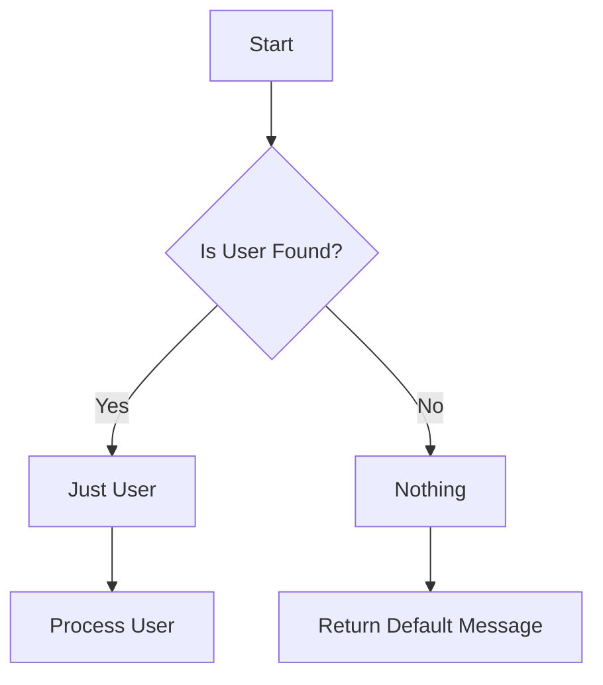

## 6.12 Null Object Pattern with Maybe Monad

In the world of software design, handling the absence of a value is a common challenge. The Null Object Pattern is a design pattern that provides a default object to avoid null references, thereby preventing null pointer exceptions. In Haskell, the Maybe Monad elegantly encapsulates the presence or absence of a value, offering a robust solution to this problem. This section delves into the Null Object Pattern using the Maybe Monad, exploring its implementation, benefits, and practical applications in Haskell.

### Understanding the Null Object Pattern

The Null Object Pattern is a behavioral design pattern that provides an object as a surrogate for the absence of a value. Instead of using a null reference to indicate the absence of an object, a special null object is used, which implements the expected interface but does nothing. This approach eliminates the need for null checks and simplifies code logic.

#### Key Participants

- **Null Object**: An object that implements the expected interface but does nothing.
- **Client**: The code that interacts with the object, unaware of whether it's dealing with a real object or a null object.

#### Applicability

- Use the Null Object Pattern when you want to avoid null references and simplify code logic.
- It is particularly useful in scenarios where an object is optional, and you want to provide a default behavior.

### The Maybe Monad in Haskell

Haskell's Maybe Monad is a powerful construct that represents optional values. It encapsulates the presence or absence of a value, eliminating the need for null checks and providing a safe way to handle optional data.

#### Structure of Maybe

The Maybe type is defined as follows:

```haskell
data Maybe a = Nothing | Just a
```

- `Nothing` represents the absence of a value.
- `Just a` encapsulates a value of type `a`.

#### Benefits of Using Maybe

- **Safety**: Eliminates null pointer exceptions by providing a type-safe way to handle optional values.
- **Clarity**: Makes the code more readable and expressive by clearly indicating when a value might be absent.
- **Composability**: Integrates seamlessly with Haskell's functional programming paradigm, allowing for elegant composition of functions.

### Implementing the Null Object Pattern with Maybe

To implement the Null Object Pattern using the Maybe Monad, we represent optional values with the Maybe type. This approach eliminates the need for null checks and provides a clear, type-safe way to handle the absence of a value.

#### Example: Safe Retrieval from a Database

Consider a scenario where we need to retrieve a user from a database. The user might not exist, so we represent the result as a Maybe type.

```haskell
-- Define a User type
data User = User { userId :: Int, userName :: String } deriving (Show)

-- Function to retrieve a user by ID
getUserById :: Int -> Maybe User
getUserById id = if id == 1
                 then Just (User 1 "Alice")
                 else Nothing

-- Function to greet a user
greetUser :: Maybe User -> String
greetUser Nothing = "User not found."
greetUser (Just user) = "Hello, " ++ userName user ++ "!"

-- Example usage
main :: IO ()
main = do
  let user = getUserById 1
  putStrLn (greetUser user)
```

In this example, `getUserById` returns a `Maybe User`, indicating that the user might be absent. The `greetUser` function handles both cases, providing a default message when the user is not found.

### Design Considerations

When using the Null Object Pattern with the Maybe Monad, consider the following:

- **Type Safety**: Ensure that all optional values are represented using the Maybe type to maintain type safety.
- **Pattern Matching**: Use pattern matching to handle both the presence and absence of a value.
- **Composability**: Leverage Haskell's functional programming features to compose functions that operate on Maybe values.

### Haskell Unique Features

Haskell's strong static typing and type inference make the Maybe Monad a natural fit for handling optional values. The language's emphasis on immutability and pure functions further enhances the safety and clarity of using Maybe.

### Differences and Similarities

The Null Object Pattern and the Maybe Monad both address the problem of handling the absence of a value. However, the Maybe Monad provides a more type-safe and expressive solution, integrating seamlessly with Haskell's functional programming paradigm.

### Try It Yourself

Experiment with the code example by modifying the `getUserById` function to return different results. Observe how the `greetUser` function handles each case, and try adding additional logic to handle different scenarios.

### Visualizing the Maybe Monad

To better understand how the Maybe Monad works, let's visualize its structure and flow using a Mermaid.js diagram.



This diagram illustrates the decision-making process when retrieving a user. If the user is found, we proceed with processing the user. If not, we return a default message.

### Knowledge Check

- What is the Null Object Pattern, and how does it simplify code logic?
- How does the Maybe Monad provide a type-safe way to handle optional values?
- What are the benefits of using the Maybe Monad in Haskell?

### Summary

The Null Object Pattern with the Maybe Monad offers a powerful solution for handling optional values in Haskell. By providing a type-safe and expressive way to represent the absence of a value, it eliminates null pointer exceptions and simplifies code logic. As you continue to explore Haskell's functional programming features, consider how the Maybe Monad can enhance the safety and clarity of your code.

### References and Links

- [Haskell Maybe Monad Documentation](https://hackage.haskell.org/package/base/docs/Data-Maybe.html)
- [Functional Programming in Haskell](https://www.fpcomplete.com/haskell/)
- [Design Patterns: Elements of Reusable Object-Oriented Software](https://en.wikipedia.org/wiki/Design_Patterns)

### Quiz: Null Object Pattern with Maybe Monad



### What is the primary purpose of the Null Object Pattern?

- [x] To provide a default object to avoid null references
- [ ] To enhance performance by reducing memory usage
- [ ] To simplify user interface design
- [ ] To improve network communication

> **Explanation:** The Null Object Pattern provides a default object to avoid null references and prevent null pointer exceptions.

### How does the Maybe Monad represent the absence of a value?

- [x] Using the `Nothing` constructor
- [ ] Using the `Just` constructor
- [ ] Using the `Null` constructor
- [ ] Using the `Empty` constructor

> **Explanation:** The Maybe Monad uses the `Nothing` constructor to represent the absence of a value.

### What is a key benefit of using the Maybe Monad in Haskell?

- [x] It provides a type-safe way to handle optional values
- [ ] It increases the speed of program execution
- [ ] It reduces the size of the compiled code
- [ ] It simplifies the user interface design

> **Explanation:** The Maybe Monad provides a type-safe way to handle optional values, eliminating null pointer exceptions.

### In the provided example, what does the `greetUser` function return if the user is not found?

- [x] "User not found."
- [ ] "Hello, User!"
- [ ] "Error: User not found."
- [ ] "No user available."

> **Explanation:** The `greetUser` function returns "User not found." when the user is not found.

### Which of the following is a key participant in the Null Object Pattern?

- [x] Null Object
- [ ] Singleton
- [ ] Factory
- [ ] Adapter

> **Explanation:** The Null Object is a key participant in the Null Object Pattern, providing a default object to avoid null references.

### What is the structure of the Maybe type in Haskell?

- [x] `data Maybe a = Nothing | Just a`
- [ ] `data Maybe a = Null | Just a`
- [ ] `data Maybe a = Empty | Just a`
- [ ] `data Maybe a = None | Just a`

> **Explanation:** The Maybe type in Haskell is defined as `data Maybe a = Nothing | Just a`.

### How can you handle both the presence and absence of a value in Haskell?

- [x] Using pattern matching
- [ ] Using if-else statements
- [ ] Using loops
- [ ] Using exceptions

> **Explanation:** Pattern matching is used in Haskell to handle both the presence and absence of a value.

### What does the `Just` constructor in the Maybe Monad represent?

- [x] The presence of a value
- [ ] The absence of a value
- [ ] An error state
- [ ] A null reference

> **Explanation:** The `Just` constructor represents the presence of a value in the Maybe Monad.

### True or False: The Maybe Monad integrates seamlessly with Haskell's functional programming paradigm.

- [x] True
- [ ] False

> **Explanation:** True. The Maybe Monad integrates seamlessly with Haskell's functional programming paradigm, allowing for elegant composition of functions.

### What is a common use case for the Null Object Pattern in software design?

- [x] Handling optional values without null checks
- [ ] Improving graphical user interfaces
- [ ] Enhancing database performance
- [ ] Simplifying network protocols

> **Explanation:** A common use case for the Null Object Pattern is handling optional values without null checks, simplifying code logic.



Remember, this is just the beginning. As you progress, you'll build more complex and interactive applications using Haskell's powerful features. Keep experimenting, stay curious, and enjoy the journey!
