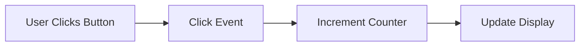

## 6.13 Functional Reactive Programming Patterns

Functional Reactive Programming (FRP) is a powerful paradigm for building interactive and responsive systems. It allows developers to handle time-varying values and asynchronous events declaratively, making it easier to reason about complex interactions in software. In this section, we will delve into the concepts, implementation, and libraries associated with FRP in Haskell, and provide a comprehensive guide to mastering these patterns.

### FRP Concepts

FRP is centered around the idea of modeling dynamic systems that react to changes over time. It abstracts the notion of time and events, allowing developers to express how data flows through a system in a declarative manner. Key concepts in FRP include:

- **Behaviors**: Represent time-varying values. A behavior is a value that changes over time, such as the position of a mouse cursor or the current time.
- **Events**: Represent discrete occurrences. An event is something that happens at a specific point in time, such as a mouse click or a key press.
- **Signals**: Combine behaviors and events to represent continuous and discrete changes in a system.

### Implementation

Implementing FRP patterns involves using libraries that provide abstractions for behaviors, events, and signals. These libraries allow developers to compose complex reactive systems by defining how different parts of the system respond to changes in data or user interactions.

#### Key Libraries

1. **Reflex**: A powerful FRP library for Haskell that is particularly well-suited for building web applications. Reflex provides a rich set of combinators for working with dynamic data and events.

2. **Yampa**: A domain-specific language embedded in Haskell for modeling hybrid systems. Yampa is based on the concept of signal functions, which are functions that transform input signals into output signals.

3. **reactive-banana**: A lightweight FRP library that focuses on simplicity and ease of use. It provides a straightforward API for working with events and behaviors.

### Example: Developing a Reactive UI

Let's explore how to develop a reactive user interface using the Reflex library. We'll create a simple application that updates a counter in response to user clicks.

#### Setting Up the Environment

First, ensure you have the necessary dependencies installed. You can use the following `cabal` command to set up your project:

```bash
cabal init
cabal install reflex reflex-dom
```

#### Building the Reactive UI

Here's a basic example of a reactive UI using Reflex:

```haskell
{-# LANGUAGE OverloadedStrings #-}
{-# LANGUAGE RecursiveDo #-}

import Reflex.Dom

main :: IO ()
main = mainWidget $ el "div" $ mdo
  -- Create a button and capture click events
  clickEvent <- button "Click me!"

  -- Use foldDyn to maintain a dynamic counter value
  counter <- foldDyn (+) (0 :: Int) (1 <$ clickEvent)

  -- Display the current counter value
  display counter
```

**Explanation:**

- **Button**: We create a button labeled "Click me!" and capture its click events.
- **foldDyn**: This function is used to maintain a dynamic value that updates in response to events. Here, it increments the counter by 1 each time the button is clicked.
- **display**: This function displays the current value of the counter.

### Visualizing FRP Patterns

To better understand how FRP patterns work, let's visualize the flow of data in our reactive UI using a Mermaid.js diagram.



**Diagram Description**: This diagram illustrates the flow of data in the reactive UI. When the user clicks the button, a click event is generated, which triggers the counter to increment. The updated counter value is then displayed.

### Advanced FRP Patterns

As you become more comfortable with basic FRP patterns, you can explore more advanced techniques such as:

- **Combining Events**: Use combinators to merge multiple event streams into a single stream.
- **Filtering Events**: Apply predicates to filter events based on specific conditions.
- **Switching Behaviors**: Dynamically change behaviors in response to events.

#### Example: Combining and Filtering Events

Let's enhance our reactive UI by adding a reset button that resets the counter to zero.

```haskell
{-# LANGUAGE OverloadedStrings #-}
{-# LANGUAGE RecursiveDo #-}

import Reflex.Dom

main :: IO ()
main = mainWidget $ el "div" $ mdo
  -- Create buttons for incrementing and resetting the counter
  clickEvent <- button "Click me!"
  resetEvent <- button "Reset"

  -- Combine click and reset events
  let incrementEvent = 1 <$ clickEvent
      resetEvent' = const 0 <$ resetEvent
      combinedEvent = leftmost [incrementEvent, resetEvent']

  -- Use foldDyn to maintain a dynamic counter value
  counter <- foldDyn ($) (0 :: Int) combinedEvent

  -- Display the current counter value
  display counter
```

**Explanation:**

- **leftmost**: This combinator merges multiple event streams, prioritizing the first event that occurs.
- **($)**: We use the function application operator to apply the event's function to the current counter value.

### Haskell Unique Features

Haskell's strong type system and purity make it particularly well-suited for FRP. The use of monads and applicative functors allows for elegant composition of reactive components. Additionally, Haskell's lazy evaluation model enables efficient handling of potentially infinite data streams.

### Design Considerations

When implementing FRP patterns, consider the following:

- **Performance**: FRP systems can become complex, leading to performance bottlenecks. Profile and optimize your code to ensure responsiveness.
- **Scalability**: Design your system to handle increasing complexity and data volume gracefully.
- **Maintainability**: Keep your codebase modular and well-documented to facilitate future changes and enhancements.

### Differences and Similarities

FRP patterns are often compared to traditional event-driven programming. While both paradigms deal with events, FRP provides a higher level of abstraction, allowing developers to express complex interactions declaratively. This can lead to more concise and maintainable code.

### Try It Yourself

Experiment with the provided code examples by modifying them to add new features or behaviors. For instance, try adding a slider that adjusts the increment value of the counter, or implement a timer that automatically updates the counter every second.

### Knowledge Check

- What are the key components of FRP?
- How does FRP differ from traditional event-driven programming?
- What are some common libraries used for FRP in Haskell?

### Embrace the Journey

Remember, mastering FRP patterns is a journey. As you explore these concepts, you'll gain a deeper understanding of how to build responsive and scalable systems. Keep experimenting, stay curious, and enjoy the process!

## Quiz: Functional Reactive Programming Patterns



### What is a key concept in Functional Reactive Programming?

- [x] Behaviors
- [ ] Classes
- [ ] Interfaces
- [ ] Inheritance

> **Explanation:** Behaviors represent time-varying values in FRP.

### Which library is commonly used for FRP in Haskell?

- [x] Reflex
- [ ] React
- [ ] Angular
- [ ] Vue

> **Explanation:** Reflex is a popular FRP library in Haskell.

### What does the `foldDyn` function do in Reflex?

- [x] Maintains a dynamic value that updates in response to events
- [ ] Creates a static value
- [ ] Deletes a dynamic value
- [ ] Converts a dynamic value to a static one

> **Explanation:** `foldDyn` is used to maintain a dynamic value that updates in response to events.

### What is the purpose of the `leftmost` combinator?

- [x] Merges multiple event streams, prioritizing the first event
- [ ] Splits an event stream into multiple streams
- [ ] Filters events based on conditions
- [ ] Converts events to behaviors

> **Explanation:** `leftmost` merges multiple event streams, prioritizing the first event that occurs.

### How does FRP differ from traditional event-driven programming?

- [x] FRP provides a higher level of abstraction
- [ ] FRP is more complex
- [ ] FRP is less efficient
- [ ] FRP uses more memory

> **Explanation:** FRP provides a higher level of abstraction, allowing for more concise and maintainable code.

### What is a signal in FRP?

- [x] A combination of behaviors and events
- [ ] A static value
- [ ] A function
- [ ] A class

> **Explanation:** Signals combine behaviors and events to represent continuous and discrete changes.

### Which of the following is a benefit of using FRP?

- [x] Easier reasoning about complex interactions
- [ ] Increased code complexity
- [ ] Reduced performance
- [ ] Increased memory usage

> **Explanation:** FRP allows for easier reasoning about complex interactions in software.

### What is a common use case for FRP?

- [x] Building interactive and responsive systems
- [ ] Writing low-level system code
- [ ] Developing static websites
- [ ] Creating batch processing scripts

> **Explanation:** FRP is commonly used for building interactive and responsive systems.

### What is the role of the `display` function in Reflex?

- [x] Displays the current value of a dynamic variable
- [ ] Hides a dynamic variable
- [ ] Deletes a dynamic variable
- [ ] Converts a dynamic variable to a static one

> **Explanation:** The `display` function is used to show the current value of a dynamic variable.

### True or False: Haskell's lazy evaluation model is beneficial for FRP.

- [x] True
- [ ] False

> **Explanation:** Haskell's lazy evaluation model enables efficient handling of potentially infinite data streams in FRP.


