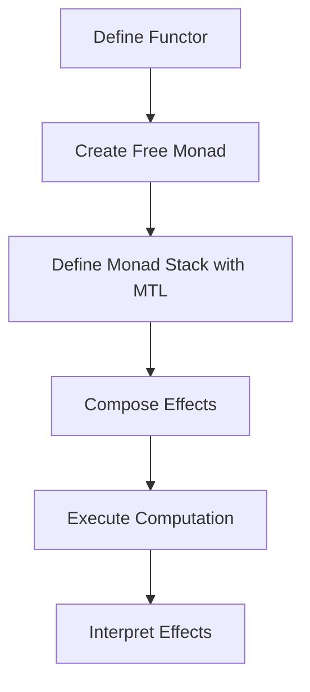

## 6.14 Effect Management with Free Monads and MTL

In the world of functional programming, managing side effects in a clean and composable manner is crucial. Haskell, with its strong emphasis on purity and type safety, offers powerful tools for effect management: Free Monads and the Monad Transformer Library (MTL). This section delves into these advanced techniques, providing expert developers with the knowledge to build scalable and maintainable Haskell applications.

### Effect Management

Effect management in Haskell involves handling side effects—such as logging, state manipulation, and IO operations—without compromising the purity of functions. By separating the description of computations from their execution, developers can create more modular and testable code.

### Free Monads

Free Monads provide a way to construct monads from functors, allowing developers to define computations abstractly and execute them later. This separation of concerns enables greater flexibility and composability.

#### Key Concepts

- **Functor**: A type class representing data structures that can be mapped over.
- **Monad**: A type class that represents computations as a series of steps.
- **Free Monad**: A construction that allows any functor to be turned into a monad.

#### Benefits of Free Monads

- **Separation of Concerns**: Define the structure of computations independently from their execution.
- **Composability**: Combine different effects in a modular way.
- **Testability**: Easily mock and test different parts of the computation.

#### Implementing Free Monads

Let's explore how to implement Free Monads in Haskell with a simple example. We'll create a small DSL (Domain-Specific Language) for a logging system.

```haskell
{-# LANGUAGE DeriveFunctor #-}

-- Define a functor for logging actions
data LogF next = Log String next deriving (Functor)

-- Define a Free Monad using the LogF functor
type LogFree = Free LogF

-- Smart constructor for logging
logMsg :: String -> LogFree ()
logMsg msg = liftF (Log msg ())

-- Interpreter for executing the logging actions
runLog :: LogFree a -> IO a
runLog (Pure a) = return a
runLog (Free (Log msg next)) = do
    putStrLn msg
    runLog next

-- Example usage
main :: IO ()
main = runLog $ do
    logMsg "Starting the application..."
    logMsg "Performing some operations..."
    logMsg "Application finished."
```

In this example, `LogF` is a functor representing logging actions. The `Free` type constructor turns `LogF` into a monad, allowing us to compose logging actions. The `runLog` function interprets these actions, executing them in the `IO` monad.

### Monad Transformer Library (MTL)

The Monad Transformer Library (MTL) provides a set of monad transformers that allow developers to stack monad behaviors. This approach enables the combination of multiple effects, such as state, error handling, and logging, in a single computation.

#### Key Concepts

- **Monad Transformer**: A type constructor that adds additional behavior to an existing monad.
- **MTL**: A library that provides a collection of monad transformers and associated type classes.

#### Benefits of MTL

- **Modularity**: Combine different effects without tightly coupling them.
- **Reusability**: Reuse existing monad transformers to build complex computations.
- **Simplicity**: Simplify code by using a consistent interface for different effects.

#### Implementing MTL

Let's implement a simple application using MTL to handle logging, error handling, and configuration.

```haskell
{-# LANGUAGE FlexibleContexts #-}

import Control.Monad.Reader
import Control.Monad.Except
import Control.Monad.Writer

-- Define a configuration type
data Config = Config { appName :: String }

-- Define a custom error type
data AppError = ConfigError String | RuntimeError String

-- Define a type alias for the application monad stack
type AppM = ReaderT Config (ExceptT AppError (Writer [String]))

-- Function to log messages
logMsg :: MonadWriter [String] m => String -> m ()
logMsg msg = tell [msg]

-- Function to read configuration
getConfig :: MonadReader Config m => m String
getConfig = asks appName

-- Function to run the application
runApp :: AppM () -> Config -> (Either AppError (), [String])
runApp app config = runWriter (runExceptT (runReaderT app config))

-- Example application
exampleApp :: AppM ()
exampleApp = do
    name <- getConfig
    logMsg $ "Starting " ++ name
    throwError $ RuntimeError "An error occurred"

-- Main function
main :: IO ()
main = do
    let config = Config "MyApp"
    let (result, logs) = runApp exampleApp config
    mapM_ putStrLn logs
    case result of
        Left err -> putStrLn $ "Error: " ++ show err
        Right _  -> putStrLn "Application finished successfully."
```

In this example, we define a monad stack `AppM` using `ReaderT`, `ExceptT`, and `Writer`. This stack allows us to handle configuration, errors, and logging in a single computation. The `runApp` function executes the application, returning both the result and the logs.

### Combining Free Monads and MTL

While Free Monads and MTL are powerful on their own, combining them can lead to even more flexible and maintainable code. By using Free Monads to define the structure of computations and MTL to manage effects, developers can achieve a high level of modularity and composability.

#### Example: A Combined Approach

Let's create an application that uses both Free Monads and MTL to handle logging, error handling, and configuration.

```haskell
{-# LANGUAGE DeriveFunctor, FlexibleContexts #-}

import Control.Monad.Free
import Control.Monad.Reader
import Control.Monad.Except
import Control.Monad.Writer

-- Define a functor for logging actions
data LogF next = Log String next deriving (Functor)

-- Define a Free Monad using the LogF functor
type LogFree = Free LogF

-- Smart constructor for logging
logMsg :: String -> LogFree ()
logMsg msg = liftF (Log msg ())

-- Interpreter for executing the logging actions
runLog :: MonadWriter [String] m => LogFree a -> m a
runLog (Pure a) = return a
runLog (Free (Log msg next)) = do
    tell [msg]
    runLog next

-- Define a configuration type
data Config = Config { appName :: String }

-- Define a custom error type
data AppError = ConfigError String | RuntimeError String

-- Define a type alias for the application monad stack
type AppM = ReaderT Config (ExceptT AppError (Writer [String]))

-- Function to read configuration
getConfig :: MonadReader Config m => m String
getConfig = asks appName

-- Function to run the application
runApp :: AppM () -> Config -> (Either AppError (), [String])
runApp app config = runWriter (runExceptT (runReaderT app config))

-- Example application
exampleApp :: AppM ()
exampleApp = do
    name <- getConfig
    runLog $ do
        logMsg $ "Starting " ++ name
        logMsg "Performing some operations..."
    throwError $ RuntimeError "An error occurred"

-- Main function
main :: IO ()
main = do
    let config = Config "MyApp"
    let (result, logs) = runApp exampleApp config
    mapM_ putStrLn logs
    case result of
        Left err -> putStrLn $ "Error: " ++ show err
        Right _  -> putStrLn "Application finished successfully."
```

In this example, we use Free Monads to define the logging actions and MTL to manage configuration and error handling. The `runLog` function interprets the logging actions within the `Writer` monad, allowing us to combine different effects seamlessly.

### Design Considerations

When using Free Monads and MTL, consider the following:

- **Complexity**: While these techniques offer great flexibility, they can introduce complexity. Ensure that the benefits outweigh the added complexity.
- **Performance**: Free Monads can introduce overhead due to their abstract nature. Profile and optimize as needed.
- **Readability**: Maintain clear and concise code to ensure readability, especially when combining multiple effects.

### Haskell Unique Features

Haskell's strong type system and emphasis on purity make it uniquely suited for effect management. The language's support for higher-kinded types and type classes allows for powerful abstractions like Free Monads and MTL.

### Differences and Similarities

Free Monads and MTL are often compared due to their ability to manage effects. However, they serve different purposes:

- **Free Monads**: Focus on separating the description of computations from their execution.
- **MTL**: Focus on stacking and managing multiple effects in a single computation.

### Try It Yourself

Experiment with the examples provided by:

- Modifying the logging messages to include timestamps.
- Adding additional effects, such as state management, using `StateT`.
- Creating a new Free Monad for a different domain, such as database operations.

### Visualizing Effect Management

To better understand the flow of effect management, consider the following diagram illustrating the interaction between Free Monads and MTL:



This diagram shows the process of defining a functor, creating a Free Monad, defining a monad stack with MTL, composing effects, executing the computation, and interpreting the effects.

### References

- [MTL Library](https://hackage.haskell.org/package/mtl)
- [Free Monads in Haskell](https://www.haskellforall.com/2020/03/free-monads.html)

### Knowledge Check

- What are the benefits of using Free Monads in Haskell?
- How does MTL help in managing multiple effects?
- What are some potential drawbacks of using Free Monads?
- How can Free Monads and MTL be combined effectively?

### Embrace the Journey

Remember, mastering effect management in Haskell is a journey. As you explore Free Monads and MTL, you'll gain deeper insights into functional programming and build more robust applications. Keep experimenting, stay curious, and enjoy the process!

## Quiz: Effect Management with Free Monads and MTL



### What is the primary purpose of Free Monads in Haskell?

- [x] To separate the description of computations from their execution
- [ ] To manage side effects directly
- [ ] To provide a set of monad transformers
- [ ] To optimize performance

> **Explanation:** Free Monads allow developers to define computations abstractly, separating the description from execution.

### Which library provides a set of monad transformers in Haskell?

- [ ] Free
- [x] MTL
- [ ] Lens
- [ ] Conduit

> **Explanation:** The Monad Transformer Library (MTL) provides a collection of monad transformers for stacking monad behaviors.

### What is a key benefit of using MTL?

- [x] Modularity in combining different effects
- [ ] Direct execution of IO operations
- [ ] Improved performance over Free Monads
- [ ] Simplified syntax for monads

> **Explanation:** MTL allows for modular combination of different effects without tightly coupling them.

### How can Free Monads and MTL be combined?

- [x] By using Free Monads to define computations and MTL to manage effects
- [ ] By replacing MTL with Free Monads
- [ ] By using MTL to define computations and Free Monads to manage effects
- [ ] By avoiding their combination

> **Explanation:** Free Monads can define the structure of computations, while MTL manages the effects, allowing for flexible and modular code.

### What is a potential drawback of using Free Monads?

- [x] Performance overhead due to abstraction
- [ ] Lack of composability
- [ ] Inability to handle side effects
- [ ] Complexity in syntax

> **Explanation:** Free Monads can introduce performance overhead due to their abstract nature.

### What does the `runLog` function do in the Free Monad example?

- [x] Interprets logging actions and executes them
- [ ] Defines logging actions
- [ ] Combines logging with error handling
- [ ] Optimizes logging performance

> **Explanation:** The `runLog` function interprets and executes the logging actions defined by the Free Monad.

### What is the role of `MonadWriter` in the MTL example?

- [x] To handle logging by collecting messages
- [ ] To manage configuration settings
- [ ] To handle errors
- [ ] To execute IO operations

> **Explanation:** `MonadWriter` is used to handle logging by collecting messages in the MTL example.

### What type of effects can MTL manage?

- [x] Logging, error handling, and configuration
- [ ] Only IO operations
- [ ] Only state management
- [ ] Only logging

> **Explanation:** MTL can manage a variety of effects, including logging, error handling, and configuration.

### How does `ReaderT` contribute to the monad stack in the MTL example?

- [x] By providing access to configuration data
- [ ] By handling errors
- [ ] By managing state
- [ ] By executing IO operations

> **Explanation:** `ReaderT` provides access to configuration data in the monad stack.

### True or False: Free Monads and MTL are interchangeable and serve the same purpose.

- [ ] True
- [x] False

> **Explanation:** Free Monads and MTL serve different purposes; Free Monads separate computation description from execution, while MTL manages multiple effects.


