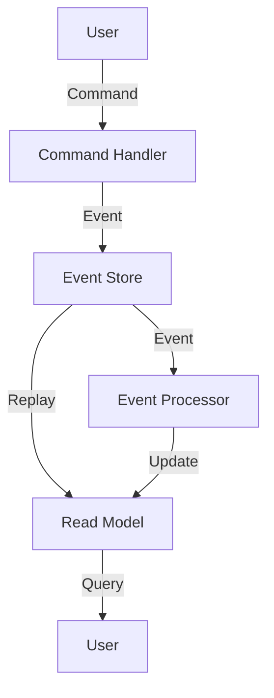

## 6.15 Event Sourcing and CQRS in Haskell

In the realm of software architecture, **Event Sourcing** and **Command Query Responsibility Segregation (CQRS)** are two powerful patterns that can significantly enhance the scalability, performance, and maintainability of your systems. When implemented in Haskell, these patterns leverage the language's strong type system and functional paradigm to provide robust solutions for complex applications.

### Understanding Event Sourcing

**Event Sourcing** is a design pattern where the state of a system is stored as a sequence of events. Instead of persisting the current state of an object, every change is captured as an event and stored in an event store. This approach provides a complete history of changes, allowing you to reconstruct the state at any point in time.

#### Key Concepts of Event Sourcing

- **Event Store**: A database or storage system that records all events. It acts as the source of truth for the system's state.
- **Event Replay**: The process of reconstructing the current state by replaying all events from the event store.
- **Immutability**: Events are immutable once recorded, ensuring a reliable audit trail.
- **Eventual Consistency**: The system may not be immediately consistent but will eventually reach a consistent state as events are processed.

#### Benefits of Event Sourcing

- **Auditability**: Complete history of changes for auditing and debugging.
- **Scalability**: Efficient handling of high write loads by appending events.
- **Flexibility**: Ability to change the state model without altering historical data.

### Command Query Responsibility Segregation (CQRS)

**CQRS** is a pattern that separates the read and write operations of a system. By segregating commands (write operations) from queries (read operations), CQRS optimizes performance and scalability.

#### Key Concepts of CQRS

- **Command**: An operation that changes the state of the system. Commands are typically handled asynchronously.
- **Query**: An operation that retrieves data without modifying the state. Queries can be optimized for performance.
- **Read Model**: A denormalized view of the data optimized for queries.
- **Write Model**: The authoritative source of data changes, often aligned with the event sourcing model.

#### Benefits of CQRS

- **Performance Optimization**: Separate models for reading and writing allow for optimized data access patterns.
- **Scalability**: Independent scaling of read and write operations.
- **Flexibility**: Different models can evolve independently, accommodating changing requirements.

### Implementing Event Sourcing and CQRS in Haskell

Haskell's type system and functional programming paradigm make it an excellent choice for implementing Event Sourcing and CQRS. Let's explore how to model events and commands using Haskell's features.

#### Modeling Events and Commands

In Haskell, we can use algebraic data types to define events and commands. This approach provides strong type safety and expressiveness.

```haskell
-- Define an event type
data AccountEvent
  = AccountCreated { accountId :: Int, initialBalance :: Double }
  | MoneyDeposited { accountId :: Int, amount :: Double }
  | MoneyWithdrawn { accountId :: Int, amount :: Double }
  deriving (Show, Eq)

-- Define a command type
data AccountCommand
  = CreateAccount { accountId :: Int, initialBalance :: Double }
  | DepositMoney { accountId :: Int, amount :: Double }
  | WithdrawMoney { accountId :: Int, amount :: Double }
  deriving (Show, Eq)
```

#### Event Store Implementation

An event store can be implemented using a simple list or a more sophisticated database. For simplicity, let's use a list to store events.

```haskell
type EventStore = [AccountEvent]

-- Function to append an event to the store
appendEvent :: AccountEvent -> EventStore -> EventStore
appendEvent event store = store ++ [event]
```

#### Handling Commands

Commands are processed to generate events. We can define a function to handle each command and produce the corresponding event.

```haskell
handleCommand :: AccountCommand -> EventStore -> Either String (EventStore, AccountEvent)
handleCommand (CreateAccount accId initBalance) store =
  if any (\e -> case e of AccountCreated id _ -> id == accId; _ -> False) store
  then Left "Account already exists"
  else let event = AccountCreated accId initBalance
       in Right (appendEvent event store, event)

handleCommand (DepositMoney accId amount) store =
  if not (any (\e -> case e of AccountCreated id _ -> id == accId; _ -> False) store)
  then Left "Account does not exist"
  else let event = MoneyDeposited accId amount
       in Right (appendEvent event store, event)

handleCommand (WithdrawMoney accId amount) store =
  if not (any (\e -> case e of AccountCreated id _ -> id == accId; _ -> False) store)
  then Left "Account does not exist"
  else let event = MoneyWithdrawn accId amount
       in Right (appendEvent event store, event)
```

#### Replaying Events

To reconstruct the current state, we replay the events from the event store.

```haskell
data AccountState = AccountState
  { balance :: Double
  } deriving (Show, Eq)

-- Function to apply an event to the account state
applyEvent :: AccountState -> AccountEvent -> AccountState
applyEvent state (AccountCreated _ initBalance) = state { balance = initBalance }
applyEvent state (MoneyDeposited _ amount) = state { balance = balance state + amount }
applyEvent state (MoneyWithdrawn _ amount) = state { balance = balance state - amount }

-- Function to replay events and reconstruct the state
replayEvents :: EventStore -> AccountState
replayEvents = foldl applyEvent (AccountState 0)
```

### Visualizing Event Sourcing and CQRS

To better understand the flow of Event Sourcing and CQRS, let's visualize the architecture using a Mermaid.js diagram.



**Diagram Description**: This diagram illustrates the flow of commands and events in an Event Sourcing and CQRS architecture. Users issue commands that are processed by the command handler, generating events stored in the event store. Events are replayed to update the read model, which users query for information.

### Haskell Unique Features

Haskell's strong type system and functional paradigm offer unique advantages for implementing Event Sourcing and CQRS:

- **Type Safety**: Algebraic data types ensure that only valid events and commands are processed.
- **Immutability**: Events are inherently immutable, aligning with Haskell's functional nature.
- **Lazy Evaluation**: Efficient handling of large event streams through lazy evaluation.
- **Concurrency**: Haskell's concurrency primitives, such as Software Transactional Memory (STM), facilitate scalable event processing.

### Design Considerations

When implementing Event Sourcing and CQRS in Haskell, consider the following:

- **Event Schema Evolution**: Plan for changes in event schemas over time. Use versioning or backward-compatible changes.
- **Consistency Models**: Choose between strong and eventual consistency based on application requirements.
- **Performance**: Optimize event storage and retrieval for high-performance applications.
- **Error Handling**: Implement robust error handling for command processing and event replay.

### Differences and Similarities

Event Sourcing and CQRS are often used together but can be applied independently. Event Sourcing focuses on storing state changes as events, while CQRS emphasizes separating read and write operations. Both patterns complement each other by providing a scalable and flexible architecture.

### Try It Yourself

Experiment with the provided code examples by modifying the event types or adding new commands. Try implementing a new feature, such as account transfers, and observe how the system handles the changes.

### Knowledge Check

- What are the key benefits of using Event Sourcing?
- How does CQRS optimize system performance?
- What role does Haskell's type system play in implementing these patterns?

### Embrace the Journey

Remember, mastering Event Sourcing and CQRS in Haskell is a journey. As you explore these patterns, you'll gain insights into building scalable and maintainable systems. Keep experimenting, stay curious, and enjoy the process!

## Quiz: Event Sourcing and CQRS in Haskell



### What is the primary purpose of Event Sourcing?

- [x] To store system state as a sequence of events
- [ ] To separate read and write operations
- [ ] To optimize query performance
- [ ] To handle concurrency issues

> **Explanation:** Event Sourcing focuses on storing the state of a system as a sequence of events, providing a complete history of changes.

### How does CQRS improve system scalability?

- [x] By separating read and write operations
- [ ] By storing events in a database
- [ ] By using a single data model for all operations
- [ ] By eliminating the need for event replay

> **Explanation:** CQRS improves scalability by separating read and write operations, allowing each to be optimized independently.

### Which Haskell feature is particularly beneficial for Event Sourcing?

- [x] Immutability
- [ ] Dynamic typing
- [ ] Object-oriented programming
- [ ] Weak type inference

> **Explanation:** Haskell's immutability aligns well with the immutable nature of events in Event Sourcing.

### What is a key advantage of using Event Sourcing?

- [x] Complete audit trail of changes
- [ ] Immediate consistency
- [ ] Simplified data models
- [ ] Reduced storage requirements

> **Explanation:** Event Sourcing provides a complete audit trail of changes, allowing for detailed analysis and debugging.

### In CQRS, what is the role of the Read Model?

- [x] To provide optimized data access for queries
- [ ] To handle command processing
- [ ] To store events
- [ ] To manage concurrency

> **Explanation:** The Read Model in CQRS is optimized for queries, providing efficient data access.

### How can Haskell's type system aid in implementing CQRS?

- [x] By ensuring only valid commands and events are processed
- [ ] By allowing dynamic typing
- [ ] By simplifying concurrency management
- [ ] By reducing code complexity

> **Explanation:** Haskell's type system provides strong guarantees that only valid commands and events are processed, enhancing reliability.

### What is a potential challenge when using Event Sourcing?

- [x] Event schema evolution
- [ ] Immediate consistency
- [ ] Simplified command handling
- [ ] Reduced storage requirements

> **Explanation:** Managing changes in event schemas over time can be challenging in Event Sourcing.

### Which pattern complements Event Sourcing by optimizing read and write operations?

- [x] CQRS
- [ ] MVC
- [ ] Singleton
- [ ] Factory

> **Explanation:** CQRS complements Event Sourcing by separating read and write operations, optimizing each independently.

### True or False: Event Sourcing and CQRS can be used independently.

- [x] True
- [ ] False

> **Explanation:** While often used together, Event Sourcing and CQRS can be applied independently based on system requirements.

### What is the main benefit of using Haskell for Event Sourcing and CQRS?

- [x] Strong type safety and functional paradigm
- [ ] Dynamic typing and flexibility
- [ ] Object-oriented design patterns
- [ ] Simplified concurrency management

> **Explanation:** Haskell's strong type safety and functional paradigm provide robust solutions for implementing Event Sourcing and CQRS.



By understanding and implementing Event Sourcing and CQRS in Haskell, you can build systems that are not only scalable and performant but also maintainable and resilient. Keep exploring these patterns and leverage Haskell's unique features to create innovative solutions.
