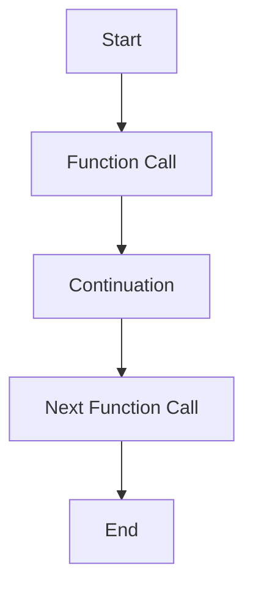

## 6.17 Continuation Passing Style (CPS)

In this section, we delve into Continuation Passing Style (CPS), a powerful technique in Haskell that allows for explicit control over the flow of a program. CPS is particularly useful for implementing complex control structures such as backtracking, coroutines, and asynchronous IO operations. Let's explore how CPS can be leveraged to enhance your Haskell applications.

### Understanding Continuation Passing Style (CPS)

**Continuation Passing Style (CPS)** is a style of programming where functions are written to take an additional argument: a continuation. This continuation represents the "rest of the computation" and is a function itself. Instead of returning a result directly, a CPS function will pass the result to the continuation.

#### Key Concepts

- **Continuation**: A function that represents the future steps of computation.
- **CPS Transformation**: The process of converting a direct-style function into CPS.
- **Explicit Control Flow**: By using continuations, you gain explicit control over the order and timing of computations.

### Benefits of CPS

- **Explicit Control Flow**: CPS allows you to manage control flow explicitly, making it easier to implement advanced control structures.
- **Non-blocking IO**: CPS is instrumental in implementing non-blocking IO operations, which are crucial for high-performance applications.
- **Backtracking and Coroutines**: CPS facilitates features like backtracking and coroutines, which are difficult to implement in direct style.

### Implementing CPS in Haskell

Let's start by transforming a simple function into CPS. Consider a basic addition function:

```haskell
-- Direct style addition
add :: Int -> Int -> Int
add x y = x + y
```

To convert this function into CPS, we introduce a continuation:

```haskell
-- CPS style addition
addCPS :: Int -> Int -> (Int -> r) -> r
addCPS x y cont = cont (x + y)
```

Here, `cont` is the continuation that takes the result of `x + y` and continues the computation.

### Example: Non-blocking IO with CPS

One of the practical applications of CPS is in implementing non-blocking IO operations. Let's create a simple example that reads from a file asynchronously using CPS.

```haskell
import System.IO
import Control.Concurrent

-- CPS style readFile
readFileCPS :: FilePath -> (String -> IO ()) -> IO ()
readFileCPS path cont = do
    handle <- openFile path ReadMode
    contents <- hGetContents handle
    forkIO $ cont contents
    hClose handle
```

In this example, `readFileCPS` reads a file and passes its contents to the continuation `cont`, which is executed in a separate thread using `forkIO`.

### Visualizing CPS

To better understand CPS, let's visualize the flow of a CPS-transformed function using a diagram.



**Diagram Description**: This diagram illustrates the flow of a CPS-transformed function. The function call is followed by the continuation, which leads to the next function call, and finally, the computation ends.

### Advanced CPS Techniques

#### Early Exits from Deep Recursion

CPS can be used to implement early exits from deep recursion, which is particularly useful in algorithms like depth-first search.

```haskell
-- Example of early exit using CPS
depthFirstSearch :: (Eq a) => a -> [a] -> (Bool -> r) -> r
depthFirstSearch target [] cont = cont False
depthFirstSearch target (x:xs) cont
    | target == x = cont True
    | otherwise = depthFirstSearch target xs cont
```

In this example, `depthFirstSearch` uses CPS to exit early if the target is found, avoiding unnecessary recursive calls.

#### Backtracking with CPS

CPS is also effective for implementing backtracking algorithms, such as solving puzzles or constraint satisfaction problems.

```haskell
-- Simple backtracking example
solvePuzzle :: (Eq a) => [a] -> (a -> Bool) -> ([a] -> r) -> r
solvePuzzle [] _ cont = cont []
solvePuzzle (x:xs) isValid cont
    | isValid x = solvePuzzle xs isValid (\solution -> cont (x:solution))
    | otherwise = solvePuzzle xs isValid cont
```

This function attempts to solve a puzzle by recursively checking each element against a validity condition, using CPS to backtrack when necessary.

### Haskell Unique Features in CPS

Haskell's strong static typing and higher-order functions make it an ideal language for implementing CPS. The type system ensures that continuations are used correctly, and higher-order functions allow for elegant CPS transformations.

### Differences and Similarities with Other Patterns

CPS is often compared to other control flow patterns such as monads and coroutines. While monads provide a way to sequence computations, CPS offers more explicit control over the flow, making it suitable for scenarios where non-linear control flow is required.

### Design Considerations

- **When to Use CPS**: Use CPS when you need explicit control over the flow of a program, such as in asynchronous IO or complex control structures.
- **Performance Considerations**: CPS can introduce overhead due to the additional function calls. Consider the performance implications when using CPS in performance-critical applications.

### Try It Yourself

Experiment with the CPS examples provided. Try modifying the `readFileCPS` function to handle multiple files concurrently. Explore how CPS can be used to implement other control structures, such as coroutines or generators.

### Knowledge Check

- **Question**: What is the primary benefit of using CPS in Haskell?
- **Exercise**: Convert a simple recursive function into CPS and observe the changes in control flow.

### Embrace the Journey

Remember, mastering CPS is just one step in your journey to becoming a Haskell expert. As you continue to explore Haskell's rich set of features, you'll discover new ways to leverage CPS and other advanced patterns to build robust and scalable applications. Keep experimenting, stay curious, and enjoy the journey!

## Quiz: Continuation Passing Style (CPS)



### What is the primary purpose of Continuation Passing Style (CPS)?

- [x] To manage control flow explicitly
- [ ] To simplify function signatures
- [ ] To improve type inference
- [ ] To reduce memory usage

> **Explanation:** CPS is used to manage control flow explicitly by passing continuations that represent the rest of the computation.

### How does CPS facilitate non-blocking IO operations?

- [x] By using continuations to handle IO results asynchronously
- [ ] By reducing the number of IO operations
- [ ] By simplifying the IO monad
- [ ] By using lazy evaluation

> **Explanation:** CPS allows IO operations to be handled asynchronously by passing results to continuations, enabling non-blocking behavior.

### What is a continuation in CPS?

- [x] A function representing the rest of the computation
- [ ] A variable holding the result of a computation
- [ ] A data structure for managing state
- [ ] A type class for handling side effects

> **Explanation:** In CPS, a continuation is a function that represents the future steps of computation.

### Which of the following is a benefit of using CPS?

- [x] Facilitating backtracking and coroutines
- [ ] Simplifying type signatures
- [ ] Reducing code complexity
- [ ] Improving memory management

> **Explanation:** CPS facilitates advanced control structures like backtracking and coroutines by managing control flow explicitly.

### How does CPS handle early exits from deep recursion?

- [x] By using continuations to terminate recursion early
- [ ] By using lazy evaluation to skip unnecessary calls
- [ ] By optimizing tail recursion
- [ ] By using the IO monad

> **Explanation:** CPS can use continuations to exit recursion early when a condition is met, avoiding further recursive calls.

### What is a common use case for CPS in Haskell?

- [x] Implementing asynchronous IO operations
- [ ] Simplifying function signatures
- [ ] Enhancing type inference
- [ ] Reducing memory usage

> **Explanation:** CPS is commonly used for implementing asynchronous IO operations by managing control flow explicitly.

### How does CPS differ from monads in Haskell?

- [x] CPS provides explicit control over flow, while monads sequence computations
- [ ] CPS simplifies type signatures, while monads handle side effects
- [ ] CPS reduces memory usage, while monads improve performance
- [ ] CPS enhances type inference, while monads manage state

> **Explanation:** CPS provides explicit control over the flow of a program, whereas monads are used to sequence computations and handle side effects.

### What is a potential drawback of using CPS?

- [x] Increased overhead due to additional function calls
- [ ] Reduced type safety
- [ ] Increased memory usage
- [ ] Simplified error handling

> **Explanation:** CPS can introduce overhead due to the additional function calls required for continuations.

### Can CPS be used to implement coroutines in Haskell?

- [x] Yes
- [ ] No

> **Explanation:** CPS can be used to implement coroutines by managing control flow explicitly through continuations.

### True or False: CPS is only useful for IO operations in Haskell.

- [ ] True
- [x] False

> **Explanation:** CPS is not limited to IO operations; it can be used for various control structures, including backtracking and coroutines.


