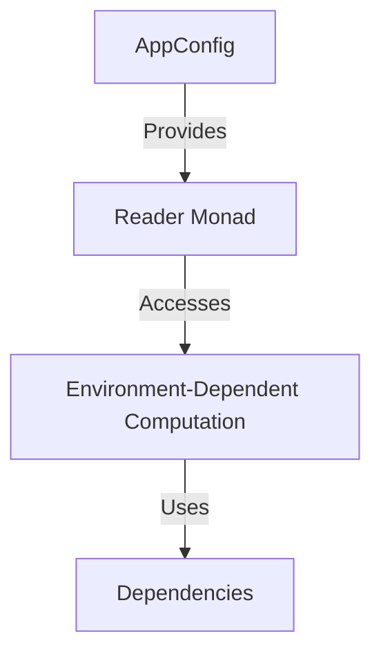

## 6.18 Dependency Injection Using the Reader Monad

In the realm of software design, **Dependency Injection (DI)** is a powerful technique that allows for the decoupling of components by supplying the necessary dependencies from the outside. This approach enhances modularity and testability, making it a staple in modern software architecture. In Haskell, the **Reader Monad** provides an elegant way to implement dependency injection, leveraging the language's strengths in functional programming.

### Understanding Dependency Injection

**Dependency Injection** is a design pattern used to achieve Inversion of Control (IoC) between classes and their dependencies. Instead of a class instantiating its dependencies directly, they are provided externally, often through constructor parameters or setter methods. This separation of concerns allows for greater flexibility and easier testing, as dependencies can be swapped out or mocked as needed.

### The Role of the Reader Monad

The **Reader Monad** in Haskell is a monad that allows functions to implicitly access shared read-only state, often referred to as the environment. This makes it an ideal candidate for implementing dependency injection, as it can encapsulate environment-dependent computations and pass configuration or dependencies implicitly.

#### Key Characteristics of the Reader Monad

- **Encapsulation of Environment**: The Reader Monad encapsulates computations that depend on an external environment, allowing functions to access this environment without explicitly passing it as a parameter.
- **Immutability**: The environment is read-only, ensuring that computations remain pure and side-effect-free.
- **Composability**: The Reader Monad supports function composition, making it easy to build complex computations from simpler ones.

### Implementing Dependency Injection with the Reader Monad

To illustrate the use of the Reader Monad for dependency injection, let's consider a scenario where we are building a web application that requires access to a database. The database connection details, such as the connection string, are provided by the environment.

#### Step-by-Step Implementation

1. **Define the Environment**: Start by defining a data type that represents the environment, including all necessary dependencies.

```haskell
-- Define the environment with necessary dependencies
data AppConfig = AppConfig
  { dbConnectionString :: String
  , apiEndpoint :: String
  }
```

2. **Create the Reader Monad**: Use the `Reader` type to create a monad that carries the environment.

```haskell
-- Define the Reader monad with AppConfig as the environment
type App a = Reader AppConfig a
```

3. **Access the Environment**: Implement functions that access the environment using the `ask` function from the Reader Monad.

```haskell
-- Function to get the database connection string from the environment
getDbConnectionString :: App String
getDbConnectionString = asks dbConnectionString

-- Function to get the API endpoint from the environment
getApiEndpoint :: App String
getApiEndpoint = asks apiEndpoint
```

4. **Compose Functions**: Use the Reader Monad to compose functions that perform operations using the environment.

```haskell
-- Function to perform a database operation using the connection string
performDbOperation :: App ()
performDbOperation = do
  connStr <- getDbConnectionString
  liftIO $ putStrLn $ "Connecting to database with connection string: " ++ connStr

-- Function to call an API using the endpoint
callApi :: App ()
callApi = do
  endpoint <- getApiEndpoint
  liftIO $ putStrLn $ "Calling API at endpoint: " ++ endpoint
```

5. **Run the Application**: Execute the Reader Monad by providing the environment.

```haskell
-- Main function to run the application
main :: IO ()
main = do
  let config = AppConfig "db://localhost:5432" "https://api.example.com"
  runReaderT (performDbOperation >> callApi) config
```

### Visualizing the Reader Monad

To better understand how the Reader Monad facilitates dependency injection, consider the following diagram:



**Diagram Explanation**: The `AppConfig` provides the environment to the `Reader Monad`, which accesses it to perform computations that depend on the environment. These computations utilize the dependencies encapsulated within the environment.

### Design Considerations

- **When to Use**: The Reader Monad is ideal for scenarios where functions need to access shared, read-only state. It is particularly useful in applications with complex configurations or multiple dependencies.
- **Pitfalls**: Overuse of the Reader Monad can lead to tightly coupled code if not managed carefully. Ensure that the environment remains immutable and that functions are composed cleanly.
- **Testing**: The Reader Monad simplifies testing by allowing dependencies to be easily mocked or replaced, facilitating unit testing and test-driven development.

### Haskell's Unique Features

Haskell's strong type system and emphasis on immutability make it well-suited for implementing dependency injection with the Reader Monad. The language's support for higher-order functions and monads allows for elegant and concise code that is both expressive and maintainable.

### Differences and Similarities

The Reader Monad is often compared to other dependency injection techniques, such as constructor injection or service locators. Unlike these approaches, the Reader Monad provides a purely functional solution that aligns with Haskell's principles of immutability and referential transparency.

### Try It Yourself

Experiment with the provided code examples by modifying the `AppConfig` to include additional dependencies, such as logging or configuration settings. Observe how the Reader Monad simplifies the process of accessing these dependencies throughout your application.

### Knowledge Check

- **Question**: What are the benefits of using the Reader Monad for dependency injection in Haskell?
- **Challenge**: Modify the example to include a logging dependency and demonstrate how it can be accessed using the Reader Monad.

### Embrace the Journey

Remember, mastering the Reader Monad for dependency injection is just the beginning. As you continue to explore Haskell's rich ecosystem, you'll discover new patterns and techniques that will enhance your ability to build robust, scalable applications. Keep experimenting, stay curious, and enjoy the journey!

## Quiz: Dependency Injection Using the Reader Monad



### What is the primary purpose of the Reader Monad in Haskell?

- [x] To encapsulate environment-dependent computations
- [ ] To manage mutable state
- [ ] To handle asynchronous operations
- [ ] To perform input/output operations

> **Explanation:** The Reader Monad is used to encapsulate computations that depend on an external environment, allowing functions to access this environment implicitly.

### How does the Reader Monad facilitate dependency injection?

- [x] By passing configuration or dependencies implicitly
- [ ] By modifying the environment at runtime
- [ ] By providing mutable state management
- [ ] By handling exceptions and errors

> **Explanation:** The Reader Monad allows dependencies to be passed implicitly through the environment, enabling dependency injection without explicit parameter passing.

### Which function is used to access the environment in the Reader Monad?

- [x] `ask`
- [ ] `tell`
- [ ] `put`
- [ ] `get`

> **Explanation:** The `ask` function is used to access the environment within the Reader Monad.

### What is a potential pitfall of overusing the Reader Monad?

- [x] Tightly coupled code
- [ ] Increased memory usage
- [ ] Difficulty in handling errors
- [ ] Reduced performance

> **Explanation:** Overusing the Reader Monad can lead to tightly coupled code if the environment is not managed carefully.

### What type of state does the Reader Monad encapsulate?

- [x] Read-only state
- [ ] Mutable state
- [ ] Asynchronous state
- [ ] Transient state

> **Explanation:** The Reader Monad encapsulates read-only state, ensuring that computations remain pure and side-effect-free.

### Which of the following is NOT a benefit of using the Reader Monad for dependency injection?

- [ ] Improved modularity
- [ ] Easier testing
- [x] Enhanced performance
- [ ] Decoupled components

> **Explanation:** While the Reader Monad improves modularity, testability, and decoupling, it does not inherently enhance performance.

### How can the Reader Monad simplify testing?

- [x] By allowing dependencies to be easily mocked or replaced
- [ ] By providing built-in testing functions
- [ ] By automatically generating test cases
- [ ] By ensuring all functions are pure

> **Explanation:** The Reader Monad simplifies testing by allowing dependencies to be mocked or replaced, facilitating unit testing.

### What is the relationship between the Reader Monad and Inversion of Control (IoC)?

- [x] The Reader Monad implements IoC by allowing dependencies to be injected
- [ ] The Reader Monad is unrelated to IoC
- [ ] The Reader Monad enforces IoC through mutable state
- [ ] The Reader Monad prevents IoC by hard-coding dependencies

> **Explanation:** The Reader Monad implements IoC by allowing dependencies to be injected from the environment, rather than being hard-coded.

### True or False: The Reader Monad can be used to modify the environment at runtime.

- [ ] True
- [x] False

> **Explanation:** The Reader Monad encapsulates read-only state, meaning the environment cannot be modified at runtime.

### Which Haskell feature makes the Reader Monad particularly suitable for dependency injection?

- [x] Strong type system and immutability
- [ ] Lazy evaluation
- [ ] Pattern matching
- [ ] List comprehensions

> **Explanation:** Haskell's strong type system and emphasis on immutability make it well-suited for implementing dependency injection with the Reader Monad.


