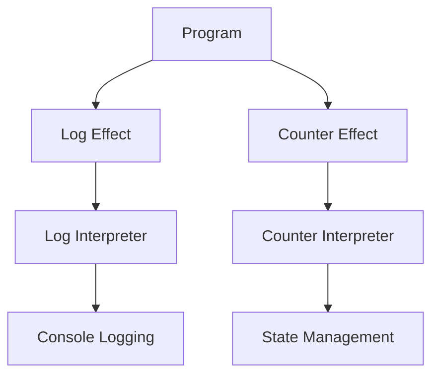

## 6.19 Handling Side Effects with Effect Systems (e.g., Polysemy, Eff)

In the realm of functional programming, managing side effects is a crucial aspect of maintaining purity and composability. Haskell, being a purely functional language, provides various mechanisms to handle side effects, with effect systems like **Polysemy** and **Eff** standing out as powerful tools. These libraries allow developers to write effectful code that can be interpreted in multiple ways, enhancing flexibility and testability.

### Understanding Effect Systems

**Effect systems** are frameworks that enable the management of side effects in a structured and composable manner. They abstract the notion of side effects, allowing developers to define what effects their code can have and how these effects should be handled. This abstraction facilitates writing code that is both expressive and easy to reason about.

#### Key Concepts

1. **Effects**: Represent the operations that can cause side effects, such as logging, state manipulation, or IO operations.
2. **Interpreters**: Define how effects are executed. They can interpret effects in various ways, such as purely for testing or with real-world side effects in production.
3. **Effect Handlers**: Manage the execution of effects, providing a way to compose and sequence them.

### Libraries: Polysemy and Eff

#### Polysemy

[Polysemy](https://hackage.haskell.org/package/polysemy) is a modern effect system library for Haskell that emphasizes simplicity and performance. It allows developers to define and interpret effects in a highly composable manner.

- **Advantages**:
  - **High Performance**: Polysemy is designed to be fast, leveraging advanced Haskell features.
  - **Simplicity**: The API is straightforward, making it easy to define and use effects.
  - **Flexibility**: Supports a wide range of effects and interpretations.

#### Eff

[Eff](https://hackage.haskell.org/package/extensible-effects) is another popular effect system library that focuses on extensibility and modularity. It allows developers to define extensible effects that can be composed and reused across different parts of an application.

- **Advantages**:
  - **Extensibility**: Easily extendable with new effects and handlers.
  - **Modularity**: Encourages modular design, making it easy to manage complex effectful code.
  - **Compatibility**: Works well with existing Haskell libraries and tools.

### Implementing Effect Systems

To effectively use effect systems like Polysemy and Eff, it's essential to understand how to define effect types and interpreters. Let's explore these concepts with examples.

#### Defining Effect Types

Effect types represent the operations that can cause side effects. In Polysemy, you define effects using data types and the `makeSem` function to generate effectful functions.

```haskell
{-# LANGUAGE TemplateHaskell #-}

import Polysemy

-- Define a simple logging effect
data Log m a where
  LogInfo :: String -> Log m ()

makeSem ''Log
```

In this example, we define a `Log` effect with a single operation `LogInfo` that logs a message. The `makeSem` function generates a function `logInfo` that can be used to perform the logging operation.

#### Writing Interpreters

Interpreters define how effects are executed. They can interpret effects in various ways, such as logging to the console or collecting logs in a list for testing.

```haskell
import Polysemy
import Polysemy.Output

-- Interpreter that logs to the console
runLogConsole :: Member (Embed IO) r => Sem (Log ': r) a -> Sem r a
runLogConsole = interpret $ \case
  LogInfo msg -> embed $ putStrLn msg
```

In this example, `runLogConsole` is an interpreter that logs messages to the console using `putStrLn`.

#### Composing Effects

Effect systems allow you to compose multiple effects, enabling complex interactions between different parts of your application.

```haskell
import Polysemy.State

-- Define a state effect
data Counter m a where
  Increment :: Counter m ()
  GetCount :: Counter m Int

makeSem ''Counter

-- Interpreter for the counter effect
runCounter :: Member (State Int) r => Sem (Counter ': r) a -> Sem r a
runCounter = interpret $ \case
  Increment -> modify (+1)
  GetCount -> get
```

Here, we define a `Counter` effect with operations to increment and get the count. The `runCounter` interpreter manages the state using the `State` effect.

### Example: Pure and Real-World Effects

Let's consider an example where we write code that can be run purely for testing and with real effects in production.

```haskell
import Polysemy
import Polysemy.State
import Polysemy.Output

-- Define a program that uses logging and state effects
program :: Members '[Log, Counter] r => Sem r ()
program = do
  logInfo "Starting program"
  increment
  count <- getCount
  logInfo $ "Current count: " ++ show count

-- Pure interpreter for testing
runPure :: Sem '[Log, Counter, State Int, Output String] a -> ([String], a)
runPure = run . runOutputMonoid pure . runState 0 . runCounter . runLogOutput

-- Real-world interpreter for production
runRealWorld :: Sem '[Log, Counter, Embed IO] a -> IO a
runRealWorld = runM . runCounter . runLogConsole
```

In this example, `program` is a simple program that logs messages and manipulates a counter. We define two interpreters: `runPure` for testing, which collects logs in a list, and `runRealWorld` for production, which logs to the console.

### Visualizing Effect Systems

To better understand how effect systems work, let's visualize the flow of effects and interpreters using a diagram.



**Diagram Description**: This diagram illustrates the flow of effects in a program. The `Program` node represents the main program, which uses `Log Effect` and `Counter Effect`. These effects are interpreted by `Log Interpreter` and `Counter Interpreter`, which handle console logging and state management, respectively.

### References and Further Reading

- [Polysemy Documentation](https://hackage.haskell.org/package/polysemy)
- [Eff Documentation](https://hackage.haskell.org/package/extensible-effects)
- [Functional Programming with Effects](https://www.fpcomplete.com/blog/2017/06/readers-guide-to-extensible-effects)

### Knowledge Check

- **Question**: What are the main components of an effect system?
- **Exercise**: Implement a new effect for file reading and writing using Polysemy.

### Embrace the Journey

Remember, mastering effect systems is a journey. As you progress, you'll gain a deeper understanding of how to manage side effects in a functional programming context. Keep experimenting, stay curious, and enjoy the journey!

## Quiz: Handling Side Effects with Effect Systems (e.g., Polysemy, Eff)



### What is an effect system in Haskell?

- [x] A framework for managing side effects in a structured and composable manner.
- [ ] A library for performing IO operations.
- [ ] A tool for optimizing Haskell code.
- [ ] A syntax extension for Haskell.

> **Explanation:** An effect system is a framework that allows developers to manage side effects in a structured and composable way, abstracting the notion of side effects.

### Which library is known for its simplicity and performance in handling effects?

- [x] Polysemy
- [ ] Eff
- [ ] MTL
- [ ] QuickCheck

> **Explanation:** Polysemy is known for its simplicity and performance, making it a popular choice for handling effects in Haskell.

### What is the role of an interpreter in an effect system?

- [x] To define how effects are executed.
- [ ] To generate effectful functions.
- [ ] To optimize code execution.
- [ ] To manage memory allocation.

> **Explanation:** An interpreter defines how effects are executed, allowing for different interpretations of effectful code.

### How can effects be composed in an effect system?

- [x] By using multiple effect handlers.
- [ ] By writing separate functions for each effect.
- [ ] By using global variables.
- [ ] By relying on external libraries.

> **Explanation:** Effects can be composed by using multiple effect handlers, enabling complex interactions between different parts of an application.

### What is a key advantage of using effect systems like Polysemy and Eff?

- [x] They enhance flexibility and testability of code.
- [ ] They simplify syntax.
- [ ] They improve runtime performance.
- [ ] They reduce memory usage.

> **Explanation:** Effect systems like Polysemy and Eff enhance the flexibility and testability of code by abstracting side effects.

### Which function is used in Polysemy to generate effectful functions?

- [x] makeSem
- [ ] runM
- [ ] interpret
- [ ] embed

> **Explanation:** The `makeSem` function is used in Polysemy to generate effectful functions from effect types.

### What does the `runLogConsole` interpreter do in the provided example?

- [x] Logs messages to the console using `putStrLn`.
- [ ] Collects logs in a list for testing.
- [ ] Writes logs to a file.
- [ ] Sends logs to a remote server.

> **Explanation:** The `runLogConsole` interpreter logs messages to the console using `putStrLn`.

### How does the `runPure` interpreter handle logs in the example?

- [x] It collects logs in a list.
- [ ] It writes logs to a file.
- [ ] It sends logs to a remote server.
- [ ] It discards logs.

> **Explanation:** The `runPure` interpreter collects logs in a list, making it suitable for testing.

### What is the purpose of the `Counter` effect in the example?

- [x] To manage a counter state.
- [ ] To log messages.
- [ ] To perform IO operations.
- [ ] To handle exceptions.

> **Explanation:** The `Counter` effect is used to manage a counter state, with operations to increment and get the count.

### True or False: Effect systems can only be used for logging and state management.

- [ ] True
- [x] False

> **Explanation:** False. Effect systems can be used for a wide range of side effects, including logging, state management, IO operations, and more.


