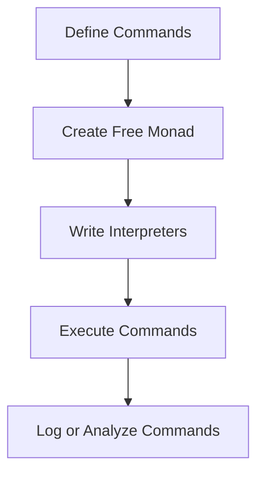

## 6.2 Command Pattern Using Free Monads

In this section, we delve into the Command Pattern using Free Monads in Haskell, a powerful technique for encapsulating requests as objects. This approach allows us to parameterize clients with queues, requests, and operations, providing flexibility and modularity in software design.

### Command Pattern Concept

The Command Pattern is a behavioral design pattern that turns a request into a stand-alone object containing all the information about the request. This encapsulation allows for parameterizing clients with different requests, queuing requests, and logging the history of requests. It also supports undoable operations.

### Free Monads

Free Monads are a way to represent computations as data structures, enabling us to interpret and manipulate sequences of commands. They provide a flexible and powerful abstraction for building complex systems by separating the description of computations from their execution.

#### Key Concepts of Free Monads

- **Representation of Commands**: Free Monads allow us to represent commands as data structures, making it easy to manipulate and interpret them.
- **Interpretation**: With Free Monads, we can write interpreters to execute, log, or analyze the commands, providing flexibility in how we handle different operations.

### Implementation

To implement the Command Pattern using Free Monads in Haskell, we follow these steps:

1. **Define a Free Monad**: Create a data structure to represent commands and their sequence.
2. **Write Interpreters**: Develop interpreters to execute, log, or analyze the commands.

Let's explore these steps in detail with an example.

#### Step 1: Define a Free Monad

First, we define a data structure to represent our commands. In this example, we'll implement an action queue in a game, where each action is a command in the free monad.

```haskell
{-# LANGUAGE GADTs #-}
{-# LANGUAGE DeriveFunctor #-}

-- Define the command data type
data GameAction next where
    Move :: String -> next -> GameAction next
    Attack :: String -> next -> GameAction next
    Wait :: next -> GameAction next
    deriving Functor

-- Define the Free Monad
data Free f a = Pure a | Free (f (Free f a))

-- Functor instance for Free
instance Functor f => Functor (Free f) where
    fmap f (Pure a) = Pure (f a)
    fmap f (Free x) = Free (fmap (fmap f) x)

-- Applicative instance for Free
instance Functor f => Applicative (Free f) where
    pure = Pure
    Pure f <*> x = fmap f x
    Free f <*> x = Free (fmap (<*> x) f)

-- Monad instance for Free
instance Functor f => Monad (Free f) where
    return = Pure
    Pure a >>= f = f a
    Free x >>= f = Free (fmap (>>= f) x)
```

In this code, we define a `GameAction` data type with three commands: `Move`, `Attack`, and `Wait`. Each command takes a `String` argument and a continuation `next`. We then define a `Free` monad to represent sequences of these commands.

#### Step 2: Write Interpreters

Next, we write interpreters to execute, log, or analyze the commands. Here, we'll create a simple interpreter that executes the commands.

```haskell
-- Interpreter for executing game actions
executeGameAction :: Free GameAction a -> IO a
executeGameAction (Pure a) = return a
executeGameAction (Free (Move direction next)) = do
    putStrLn $ "Moving " ++ direction
    executeGameAction next
executeGameAction (Free (Attack target next)) = do
    putStrLn $ "Attacking " ++ target
    executeGameAction next
executeGameAction (Free (Wait next)) = do
    putStrLn "Waiting..."
    executeGameAction next
```

This interpreter pattern matches on the `Free` monad and executes each command, printing the action to the console.

### Example: Implementing an Action Queue in a Game

Let's see how we can use our free monad to create an action queue in a game.

```haskell
-- Define a sequence of game actions
gameActions :: Free GameAction ()
gameActions = do
    Free (Move "north" (Pure ()))
    Free (Attack "dragon" (Pure ()))
    Free (Wait (Pure ()))

-- Execute the game actions
main :: IO ()
main = executeGameAction gameActions
```

In this example, we define a sequence of game actions using our `Free` monad and execute them using the `executeGameAction` interpreter.

### Visualizing the Command Pattern with Free Monads

To better understand the flow of the Command Pattern using Free Monads, let's visualize the process with a diagram.



This diagram illustrates the steps involved in implementing the Command Pattern using Free Monads: defining commands, creating a free monad, writing interpreters, executing commands, and optionally logging or analyzing them.

### Haskell Unique Features

Haskell's strong static typing and type inference make it an ideal language for implementing the Command Pattern using Free Monads. The language's support for algebraic data types and pattern matching allows us to define and manipulate commands with ease.

### Design Considerations

When using the Command Pattern with Free Monads, consider the following:

- **Separation of Concerns**: Free Monads allow you to separate the description of computations from their execution, promoting modularity and flexibility.
- **Extensibility**: You can easily extend the set of commands by adding new constructors to the command data type.
- **Performance**: While Free Monads provide flexibility, they may introduce performance overhead due to the additional abstraction layer.

### Differences and Similarities

The Command Pattern using Free Monads is similar to other patterns that encapsulate operations, such as the Strategy Pattern. However, Free Monads provide a more flexible and composable approach, allowing for complex sequences of operations to be represented and manipulated as data.

### Try It Yourself

To deepen your understanding, try modifying the code examples:

- Add new commands to the `GameAction` data type, such as `Defend` or `Heal`.
- Create a new interpreter that logs commands to a file instead of printing them to the console.
- Experiment with different sequences of commands and observe how the interpreter handles them.

### References

For further reading on Free Monads and their applications, check out the following resources:

- [Understanding Free Monads](https://blog.jle.im/entry/practical-free-monads.html)

### Knowledge Check

Before moving on, let's review some key takeaways:

- The Command Pattern encapsulates requests as objects, allowing for flexible command execution.
- Free Monads represent commands as data structures, enabling interpretation and manipulation.
- Haskell's strong typing and pattern matching make it well-suited for implementing this pattern.

## Quiz: Command Pattern Using Free Monads



### What is the primary purpose of the Command Pattern?

- [x] To encapsulate requests as objects
- [ ] To improve performance
- [ ] To simplify code
- [ ] To enhance security

> **Explanation:** The Command Pattern encapsulates requests as objects, allowing for flexible command execution and manipulation.

### What are Free Monads used for in the Command Pattern?

- [x] Representing commands as data structures
- [ ] Improving performance
- [ ] Simplifying syntax
- [ ] Enhancing security

> **Explanation:** Free Monads represent commands as data structures, enabling interpretation and manipulation of sequences of commands.

### Which Haskell feature is particularly useful for implementing the Command Pattern?

- [x] Algebraic data types
- [ ] Lazy evaluation
- [ ] List comprehensions
- [ ] Implicit parameters

> **Explanation:** Algebraic data types allow for the definition and manipulation of commands in a structured way.

### What is a key benefit of using Free Monads?

- [x] Separation of description and execution
- [ ] Improved performance
- [ ] Simplified syntax
- [ ] Enhanced security

> **Explanation:** Free Monads separate the description of computations from their execution, promoting modularity and flexibility.

### How can you extend the set of commands in a Free Monad?

- [x] By adding new constructors to the command data type
- [ ] By modifying the interpreter
- [ ] By changing the monad instance
- [ ] By using a different programming language

> **Explanation:** You can extend the set of commands by adding new constructors to the command data type.

### What is a potential drawback of using Free Monads?

- [x] Performance overhead
- [ ] Lack of flexibility
- [ ] Difficulty in understanding
- [ ] Limited extensibility

> **Explanation:** Free Monads may introduce performance overhead due to the additional abstraction layer.

### Which of the following is NOT a command in the `GameAction` data type?

- [x] Defend
- [ ] Move
- [ ] Attack
- [ ] Wait

> **Explanation:** The `Defend` command is not defined in the `GameAction` data type in the provided example.

### What does the `executeGameAction` function do?

- [x] Executes game actions and prints them to the console
- [ ] Logs game actions to a file
- [ ] Analyzes game actions
- [ ] Deletes game actions

> **Explanation:** The `executeGameAction` function executes game actions and prints them to the console.

### What is a common use case for the Command Pattern?

- [x] Queuing requests
- [ ] Improving performance
- [ ] Simplifying syntax
- [ ] Enhancing security

> **Explanation:** The Command Pattern is commonly used for queuing requests and managing operations.

### True or False: Free Monads can only be used in Haskell.

- [ ] True
- [x] False

> **Explanation:** Free Monads are a concept that can be implemented in various programming languages, not just Haskell.



Remember, mastering the Command Pattern using Free Monads in Haskell is just the beginning. As you continue to explore and experiment, you'll discover even more powerful ways to leverage this pattern in your software designs. Keep experimenting, stay curious, and enjoy the journey!
