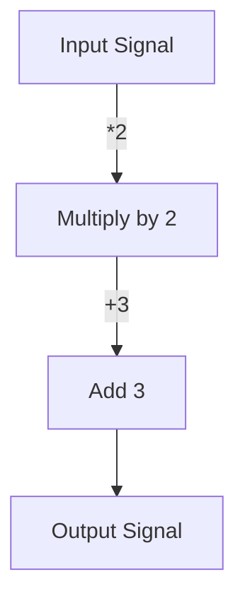

## 6.20 Arrows and Their Role in Haskell Design Patterns

Arrows are a powerful abstraction in Haskell that generalize monads and provide a robust framework for structuring computations. They are particularly useful in scenarios where the input and output types are fixed, such as in stream processing or circuit design. In this section, we will delve into the concept of Arrows, explore their implementation, and demonstrate their application in Haskell design patterns.

### Understanding Arrows

Arrows were introduced as a generalization of monads to handle computations that are not easily expressed with monads. While monads are suitable for sequencing computations, Arrows provide a more flexible structure, allowing for more complex data flows and transformations.

#### Key Concepts

- **Arrows vs. Monads**: While both Arrows and Monads are abstractions for computations, Arrows are more general. They allow for operations that involve multiple inputs and outputs, whereas monads are limited to single-threaded computations.
- **Arrow Type Class**: The `Arrow` type class is the foundation of Arrows in Haskell. It defines a set of combinators that facilitate the composition and transformation of computations.

### Implementing Arrows in Haskell

To implement Arrows in Haskell, we use the `Arrow` type class, which is part of the `Control.Arrow` module. This module provides several combinators that allow us to define and manipulate Arrow-based computations.

#### Arrow Type Class

The `Arrow` type class is defined as follows:

```haskell
class Category a => Arrow a where
    arr :: (b -> c) -> a b c
    first :: a b c -> a (b, d) (c, d)
```

- **`arr`**: Lifts a function to an arrow.
- **`first`**: Applies an arrow to the first component of a pair.

#### Additional Combinators

In addition to the basic Arrow operations, the `Control.Arrow` module provides several additional combinators:

- **`second`**: Applies an arrow to the second component of a pair.
- **`(***)`**: Combines two arrows into one that operates on pairs.
- **`(&&&)`**: Combines two arrows into one that duplicates its input.

### Practical Applications of Arrows

Arrows are particularly useful in scenarios where computations involve fixed input and output types. They are commonly used in functional reactive programming (FRP), signal processing, and circuit design.

#### Example: Signal Processing

Consider a simple signal processing application where we want to apply a series of transformations to an input signal. We can use Arrows to model this computation:

```haskell
import Control.Arrow

-- Define a simple signal processing pipeline
processSignal :: Arrow a => a Double Double
processSignal = arr (*2) >>> arr (+3)

-- Apply the pipeline to an input signal
main :: IO ()
main = do
    let inputSignal = 5.0
    let outputSignal = processSignal inputSignal
    print outputSignal
```

In this example, we define a signal processing pipeline using the `arr` combinator to lift functions into the Arrow context. We then compose these functions using the `>>>` operator to create a pipeline.

#### Example: Building Complex Data Flows

Arrows can also be used to build complex data flows, such as those found in FRP systems. By using Arrows, we can model data flows as a series of transformations and compositions.

```haskell
import Control.Arrow

-- Define a data flow pipeline
dataFlow :: Arrow a => a (Int, Int) Int
dataFlow = arr (uncurry (+)) >>> arr (*2)

-- Apply the data flow to an input
main :: IO ()
main = do
    let input = (3, 4)
    let result = dataFlow input
    print result
```

In this example, we define a data flow pipeline that takes a pair of integers as input, adds them together, and then multiplies the result by 2. We use the `uncurry` function to convert a curried function into a function on pairs, and then lift it into the Arrow context using `arr`.

### Visualizing Arrows in Haskell

To better understand the flow of data through Arrow-based computations, we can visualize the process using diagrams. Below is a simple flowchart representing the signal processing pipeline from the previous example.



This diagram illustrates the sequence of transformations applied to the input signal, resulting in the output signal.

### Design Considerations

When using Arrows in Haskell, it's important to consider the following:

- **Complexity**: Arrows can introduce additional complexity compared to monads. They are best suited for scenarios where the benefits of their flexibility outweigh the added complexity.
- **Performance**: While Arrows provide a powerful abstraction, they may introduce performance overhead in certain cases. It's important to profile and optimize Arrow-based computations as needed.

### Haskell Unique Features

Haskell's strong type system and support for higher-order functions make it an ideal language for implementing Arrows. The `Control.Arrow` module provides a rich set of combinators that facilitate the composition and transformation of Arrow-based computations.

### Differences and Similarities

Arrows are often compared to monads due to their similar role in structuring computations. However, they differ in their flexibility and applicability. While monads are suitable for sequencing computations, Arrows excel in scenarios involving multiple inputs and outputs or fixed input and output types.

### Try It Yourself

To deepen your understanding of Arrows, try modifying the code examples provided in this section. Experiment with different transformations and compositions to see how they affect the output. Consider implementing a more complex data flow or signal processing pipeline using Arrows.

### References and Further Reading

For more information on Arrows and their implementation in Haskell, refer to the following resources:

- [Control.Arrow Documentation](https://hackage.haskell.org/package/base/docs/Control-Arrow.html)
- [Haskell Wiki: Arrows](https://wiki.haskell.org/Arrow)

### Knowledge Check

Before moving on, take a moment to review the key concepts covered in this section. Consider the following questions:

- What are the key differences between Arrows and Monads?
- How can Arrows be used to model complex data flows?
- What are some practical applications of Arrows in Haskell?

### Embrace the Journey

Remember, mastering Arrows and their role in Haskell design patterns is a journey. As you continue to explore and experiment with Arrows, you'll gain a deeper understanding of their power and flexibility. Keep experimenting, stay curious, and enjoy the journey!

## Quiz: Arrows and Their Role in Haskell Design Patterns



### What is the primary purpose of Arrows in Haskell?

- [x] To generalize monads and handle computations with fixed input and output types.
- [ ] To replace monads entirely in Haskell programming.
- [ ] To simplify the syntax of Haskell code.
- [ ] To provide a graphical user interface for Haskell applications.

> **Explanation:** Arrows generalize monads and are particularly useful for computations with fixed input and output types.

### Which combinator is used to lift a function into an Arrow?

- [x] `arr`
- [ ] `first`
- [ ] `second`
- [ ] `>>>`

> **Explanation:** The `arr` combinator is used to lift a function into an Arrow.

### How do Arrows differ from Monads?

- [x] Arrows allow for operations with multiple inputs and outputs.
- [ ] Arrows are a subset of Monads.
- [ ] Arrows are only used for graphical applications.
- [ ] Arrows are less flexible than Monads.

> **Explanation:** Arrows allow for operations with multiple inputs and outputs, unlike Monads which are limited to single-threaded computations.

### What is the role of the `first` combinator in Arrows?

- [x] To apply an arrow to the first component of a pair.
- [ ] To apply an arrow to the second component of a pair.
- [ ] To combine two arrows into one.
- [ ] To duplicate the input of an arrow.

> **Explanation:** The `first` combinator applies an arrow to the first component of a pair.

### In which scenarios are Arrows particularly useful?

- [x] Signal processing and circuit design.
- [ ] Simplifying Haskell syntax.
- [ ] Replacing all monadic computations.
- [ ] Building graphical user interfaces.

> **Explanation:** Arrows are particularly useful in signal processing and circuit design, where computations involve fixed input and output types.

### What is the purpose of the `>>>` operator in Arrows?

- [x] To compose two arrows sequentially.
- [ ] To lift a function into an Arrow.
- [ ] To apply an arrow to the first component of a pair.
- [ ] To duplicate the input of an arrow.

> **Explanation:** The `>>>` operator is used to compose two arrows sequentially.

### Which module provides the Arrow type class and combinators in Haskell?

- [x] `Control.Arrow`
- [ ] `Data.List`
- [ ] `Control.Monad`
- [ ] `Data.Maybe`

> **Explanation:** The `Control.Arrow` module provides the Arrow type class and combinators in Haskell.

### What is the result of applying the `dataFlow` arrow to the input `(3, 4)` in the example provided?

- [x] 14
- [ ] 7
- [ ] 12
- [ ] 8

> **Explanation:** The `dataFlow` arrow adds the pair `(3, 4)` to get `7`, then multiplies by `2` to get `14`.

### Can Arrows be used to model computations with varying input and output types?

- [ ] True
- [x] False

> **Explanation:** Arrows are best suited for computations with fixed input and output types.

### Are Arrows a replacement for Monads in Haskell?

- [ ] True
- [x] False

> **Explanation:** Arrows are not a replacement for Monads; they are a generalization that provides additional flexibility for certain types of computations.


