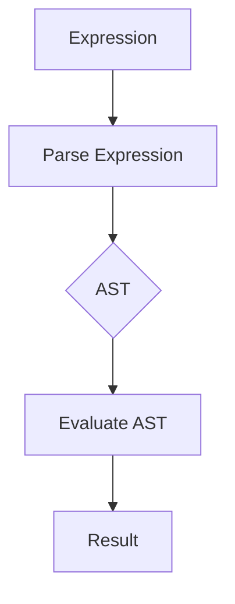

## 6.3 Interpreter Pattern with Recursive Evaluators

In this section, we delve into the **Interpreter Pattern** with a focus on **Recursive Evaluators** in Haskell. This pattern is pivotal for defining a representation of a language's grammar and creating an interpreter that processes expressions. We will explore how to implement this pattern in Haskell using algebraic data types (ADTs) and recursive evaluation functions.

### Interpreter Concept

The Interpreter Pattern is a design pattern that specifies how to evaluate sentences in a language. It involves defining a grammar for the language and implementing an interpreter that can process expressions written in that language. This pattern is particularly useful for designing domain-specific languages (DSLs) and scripting languages.

#### Key Participants

1. **Abstract Syntax Tree (AST)**: Represents the structure of the language's expressions.
2. **Context**: Contains information that's global to the interpreter.
3. **Interpreter**: Evaluates the expressions represented by the AST.

### Implementation in Haskell

Haskell's strong type system and support for functional programming make it an excellent choice for implementing the Interpreter Pattern. We will use algebraic data types to define the AST and recursive functions to evaluate expressions.

#### Using Algebraic Data Types (ADTs)

Algebraic data types are a cornerstone of Haskell's type system, allowing us to define complex data structures in a concise and expressive manner. In the context of the Interpreter Pattern, ADTs are used to represent the different components of the AST.

```haskell
-- Define an algebraic data type for expressions
data Expr
    = Val Int
    | Add Expr Expr
    | Sub Expr Expr
    | Mul Expr Expr
    | Div Expr Expr
    deriving (Show, Eq)
```

In this example, `Expr` is an ADT representing a simple arithmetic language with integer values and basic operations: addition, subtraction, multiplication, and division.

#### Writing Recursive Evaluation Functions

Recursive evaluation functions are used to traverse the AST and compute the result of expressions. Pattern matching is employed to handle different types of expressions.

```haskell
-- Evaluate an expression
eval :: Expr -> Int
eval (Val n) = n
eval (Add x y) = eval x + eval y
eval (Sub x y) = eval x - eval y
eval (Mul x y) = eval x * eval y
eval (Div x y) = eval x `div` eval y
```

Each constructor of the `Expr` type is matched, and the corresponding operation is performed recursively.

### Example: Simple Calculator

Let's build a simple calculator that can parse and evaluate mathematical expressions using the Interpreter Pattern.

#### Step 1: Define the Grammar

First, we define the grammar of our language using an ADT. This grammar includes integer values and basic arithmetic operations.

```haskell
data Expr
    = Val Int
    | Add Expr Expr
    | Sub Expr Expr
    | Mul Expr Expr
    | Div Expr Expr
    deriving (Show, Eq)
```

#### Step 2: Implement the Interpreter

Next, we implement the interpreter by writing a recursive evaluation function.

```haskell
eval :: Expr -> Int
eval (Val n) = n
eval (Add x y) = eval x + eval y
eval (Sub x y) = eval x - eval y
eval (Mul x y) = eval x * eval y
eval (Div x y) = eval x `div` eval y
```

#### Step 3: Test the Interpreter

Finally, we test our interpreter with some example expressions.

```haskell
main :: IO ()
main = do
    let expr1 = Add (Val 3) (Mul (Val 2) (Val 5))
    let expr2 = Sub (Val 10) (Div (Val 20) (Val 2))
    print $ eval expr1 -- Output: 13
    print $ eval expr2 -- Output: 0
```

### Visualizing the Interpreter Pattern

To better understand the flow of the Interpreter Pattern, let's visualize the process using a Mermaid.js diagram.



**Diagram Explanation**: The diagram illustrates the flow from parsing an expression to evaluating the AST and obtaining the result.

### Design Considerations

When implementing the Interpreter Pattern in Haskell, consider the following:

- **Complexity**: The pattern is suitable for simple languages. For more complex languages, consider using a parser generator or a more sophisticated approach.
- **Performance**: Recursive evaluation can be inefficient for large expressions. Consider optimizations such as memoization if necessary.
- **Error Handling**: Ensure that the interpreter handles errors gracefully, such as division by zero or invalid expressions.

### Haskell Unique Features

Haskell's features, such as pattern matching, immutability, and strong typing, make it well-suited for implementing the Interpreter Pattern. These features allow for concise and expressive code that is easy to reason about.

### Differences and Similarities

The Interpreter Pattern is often confused with the Visitor Pattern. While both involve traversing a data structure, the Interpreter Pattern focuses on evaluating expressions, whereas the Visitor Pattern is used for performing operations on elements of an object structure.

### Try It Yourself

Experiment with the code examples provided. Try adding new operations to the language, such as exponentiation or modulus. Modify the `eval` function to handle these new operations.

### Knowledge Check

- What are the key components of the Interpreter Pattern?
- How does Haskell's type system aid in implementing the Interpreter Pattern?
- What are some potential pitfalls when using recursive evaluation functions?

### Embrace the Journey

Remember, mastering the Interpreter Pattern is just one step in your journey as a Haskell developer. Keep exploring and experimenting with different patterns and techniques to enhance your skills.

## Quiz: Interpreter Pattern with Recursive Evaluators



### What is the primary purpose of the Interpreter Pattern?

- [x] To evaluate sentences in a language
- [ ] To manage object creation
- [ ] To define object interfaces
- [ ] To handle object communication

> **Explanation:** The Interpreter Pattern is used to evaluate sentences in a language by defining a grammar and implementing an interpreter.

### Which Haskell feature is crucial for implementing the Interpreter Pattern?

- [x] Algebraic Data Types
- [ ] Lazy Evaluation
- [ ] List Comprehensions
- [ ] Type Classes

> **Explanation:** Algebraic Data Types are crucial for representing the abstract syntax tree in the Interpreter Pattern.

### What is the role of recursive evaluation functions in the Interpreter Pattern?

- [x] To traverse the AST and compute results
- [ ] To define object interfaces
- [ ] To manage object creation
- [ ] To handle object communication

> **Explanation:** Recursive evaluation functions traverse the AST and compute the results of expressions.

### How does pattern matching aid in implementing the Interpreter Pattern?

- [x] It allows concise handling of different expression types
- [ ] It manages object creation
- [ ] It defines object interfaces
- [ ] It handles object communication

> **Explanation:** Pattern matching allows concise handling of different expression types in the AST.

### What is a potential pitfall of using recursive evaluation functions?

- [x] Inefficiency for large expressions
- [ ] Difficulty in defining object interfaces
- [ ] Complexity in managing object creation
- [ ] Challenges in handling object communication

> **Explanation:** Recursive evaluation functions can be inefficient for large expressions, leading to performance issues.

### Which pattern is often confused with the Interpreter Pattern?

- [x] Visitor Pattern
- [ ] Singleton Pattern
- [ ] Factory Pattern
- [ ] Observer Pattern

> **Explanation:** The Interpreter Pattern is often confused with the Visitor Pattern, although they serve different purposes.

### What is the primary output of the Interpreter Pattern?

- [x] The result of evaluating expressions
- [ ] A new object instance
- [ ] An object interface
- [ ] A communication protocol

> **Explanation:** The primary output of the Interpreter Pattern is the result of evaluating expressions.

### How can Haskell's immutability benefit the Interpreter Pattern?

- [x] It ensures consistent evaluation results
- [ ] It simplifies object creation
- [ ] It enhances object communication
- [ ] It defines object interfaces

> **Explanation:** Haskell's immutability ensures consistent evaluation results, which is beneficial for the Interpreter Pattern.

### What is a common use case for the Interpreter Pattern?

- [x] Designing domain-specific languages
- [ ] Managing object creation
- [ ] Defining object interfaces
- [ ] Handling object communication

> **Explanation:** The Interpreter Pattern is commonly used for designing domain-specific languages.

### True or False: The Interpreter Pattern is suitable for complex languages without modifications.

- [ ] True
- [x] False

> **Explanation:** The Interpreter Pattern is suitable for simple languages. For complex languages, additional techniques or tools may be needed.



By understanding and implementing the Interpreter Pattern with Recursive Evaluators in Haskell, you can create powerful interpreters for domain-specific languages and enhance your functional programming skills. Keep experimenting and exploring new patterns to further your expertise in Haskell.
