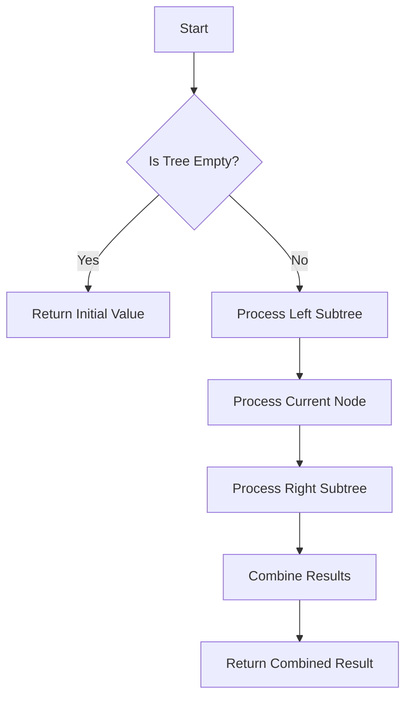

## 6.4 Iterator Pattern with Folds and Traversals

In the realm of software design patterns, the Iterator Pattern is a fundamental concept that provides a way to access elements of a collection sequentially without exposing its underlying representation. In Haskell, this pattern is elegantly implemented using folds and traversals, leveraging the power of functional programming to process collections in a concise and expressive manner.

### Iterator Concept

The Iterator Pattern is a behavioral design pattern that allows clients to traverse elements of a collection without needing to understand its internal structure. This abstraction is particularly useful when dealing with complex data structures, as it provides a uniform interface for iteration.

#### Haskell Approach

Haskell, being a purely functional language, approaches the Iterator Pattern differently from imperative languages. Instead of explicitly maintaining state and iterating over collections, Haskell utilizes higher-order functions such as folds (`foldr`, `foldl`) and traversals, abstracting over different data structures using the `Foldable` and `Traversable` type classes.

- **Folds**: Folds are powerful higher-order functions that reduce a collection to a single value by iteratively applying a function to its elements. They encapsulate the iteration logic, allowing for concise and expressive code.
- **Traversals**: Traversals provide a way to apply a function to each element of a data structure, potentially transforming it. The `Traversable` type class abstracts this concept, enabling generic traversal operations.

### Key Participants

- **Foldable Type Class**: Provides a generic interface for data structures that can be folded.
- **Traversable Type Class**: Extends `Foldable`, allowing for traversing and transforming data structures.
- **Folding Functions**: `foldr`, `foldl`, and `foldMap` are key functions used in folding operations.
- **Traversal Functions**: `traverse` and `mapM` are used for traversing and transforming collections.

### Applicability

The Iterator Pattern with folds and traversals is applicable in scenarios where:

- You need to process elements of a collection in a uniform manner.
- The internal representation of the collection should remain hidden.
- You want to leverage Haskell's functional programming capabilities for concise and expressive code.

### Sample Code Snippet

Let's explore a simple example of using folds and traversals in Haskell to iterate over elements in a tree structure and accumulate a result.

```haskell
-- Define a binary tree data structure
data Tree a = Empty | Node a (Tree a) (Tree a) deriving (Show)

-- Implement a fold function for the Tree
foldTree :: (b -> a -> b -> b) -> b -> Tree a -> b
foldTree _ z Empty = z
foldTree f z (Node x left right) = f (foldTree f z left) x (foldTree f z right)

-- Example: Sum all elements in the tree
sumTree :: Num a => Tree a -> a
sumTree = foldTree (\l x r -> l + x + r) 0

-- Example usage
main :: IO ()
main = do
    let tree = Node 1 (Node 2 Empty Empty) (Node 3 (Node 4 Empty Empty) Empty)
    print $ sumTree tree  -- Output: 10
```

In this example, we define a binary tree data structure and implement a fold function `foldTree` that recursively processes each node. The `sumTree` function uses `foldTree` to sum all elements in the tree.

### Design Considerations

When using folds and traversals in Haskell, consider the following:

- **Efficiency**: Choose between `foldr` and `foldl` based on the data structure and desired performance characteristics. `foldr` is often more suitable for lazy evaluation, while `foldl'` (strict version) can be more efficient for large lists.
- **Abstraction**: Utilize the `Foldable` and `Traversable` type classes to write generic code that works with any compatible data structure.
- **Composability**: Leverage Haskell's function composition to build complex operations from simple folds and traversals.

### Haskell Unique Features

Haskell's unique features, such as lazy evaluation and strong static typing, enhance the implementation of the Iterator Pattern:

- **Lazy Evaluation**: Allows for processing potentially infinite data structures without exhausting resources.
- **Type Classes**: Enable polymorphic functions that work with any data structure implementing the `Foldable` or `Traversable` interfaces.

### Differences and Similarities

The Iterator Pattern in Haskell differs from its implementation in imperative languages:

- **State Management**: Haskell abstracts state management through higher-order functions, eliminating the need for explicit iterators.
- **Functional Paradigm**: Emphasizes immutability and function composition, leading to more concise and expressive code.

### Visualizing Folds and Traversals

To better understand how folds and traversals work, let's visualize the process using a simple diagram.



This flowchart illustrates the recursive process of folding a tree structure, where each node is processed, and results are combined to produce a final value.

### Try It Yourself

Experiment with the provided code by modifying the tree structure or the folding function. For example, try implementing a function to find the maximum element in the tree or to count the number of nodes.

### Knowledge Check

- What are the advantages of using folds and traversals in Haskell?
- How does lazy evaluation impact the performance of folds?
- Can you implement a traversal function that transforms each element in a tree?

### Embrace the Journey

Remember, mastering Haskell's folds and traversals is just the beginning. As you progress, you'll discover more powerful patterns and techniques that will enhance your functional programming skills. Keep experimenting, stay curious, and enjoy the journey!

## Quiz: Iterator Pattern with Folds and Traversals



### What is the primary purpose of the Iterator Pattern?

- [x] To provide a way to access elements of a collection sequentially without exposing its underlying representation.
- [ ] To modify elements of a collection in place.
- [ ] To sort elements of a collection.
- [ ] To duplicate elements of a collection.

> **Explanation:** The Iterator Pattern allows sequential access to elements without exposing the collection's internal structure.

### Which Haskell type class is used for folding operations?

- [x] Foldable
- [ ] Traversable
- [ ] Functor
- [ ] Monad

> **Explanation:** The `Foldable` type class provides a generic interface for data structures that can be folded.

### What is the key difference between `foldr` and `foldl`?

- [x] `foldr` processes elements from right to left, while `foldl` processes from left to right.
- [ ] `foldr` is used for lists, and `foldl` is used for trees.
- [ ] `foldr` is for infinite lists, and `foldl` is for finite lists.
- [ ] `foldr` is a strict fold, and `foldl` is lazy.

> **Explanation:** `foldr` processes elements from right to left, making it suitable for lazy evaluation, while `foldl` processes from left to right.

### What is the role of the `Traversable` type class?

- [x] To allow traversing and transforming data structures.
- [ ] To provide a way to sort data structures.
- [ ] To enable parallel processing of data structures.
- [ ] To manage stateful computations.

> **Explanation:** The `Traversable` type class allows for traversing and transforming data structures.

### How does lazy evaluation benefit folds in Haskell?

- [x] It allows processing of potentially infinite data structures.
- [ ] It makes folds faster for small data structures.
- [ ] It simplifies the implementation of folds.
- [ ] It ensures strict evaluation of all elements.

> **Explanation:** Lazy evaluation allows folds to process potentially infinite data structures without exhausting resources.

### Which function is used to apply a function to each element of a data structure in a traversal?

- [x] traverse
- [ ] foldr
- [ ] map
- [ ] filter

> **Explanation:** The `traverse` function is used to apply a function to each element of a data structure in a traversal.

### What is a common use case for the Iterator Pattern in Haskell?

- [x] Processing elements of a collection in a uniform manner.
- [ ] Modifying elements of a collection in place.
- [ ] Sorting elements of a collection.
- [ ] Duplicating elements of a collection.

> **Explanation:** The Iterator Pattern is commonly used to process elements of a collection in a uniform manner.

### What is the benefit of using the `Foldable` type class?

- [x] It allows writing generic code that works with any compatible data structure.
- [ ] It simplifies the implementation of data structures.
- [ ] It enables parallel processing of data structures.
- [ ] It provides a way to sort data structures.

> **Explanation:** The `Foldable` type class allows writing generic code that works with any compatible data structure.

### How can you optimize folds for large lists in Haskell?

- [x] Use `foldl'` for strict evaluation.
- [ ] Use `foldr` for lazy evaluation.
- [ ] Use `foldMap` for parallel processing.
- [ ] Use `traverse` for transformation.

> **Explanation:** `foldl'` is a strict version of `foldl` that can be more efficient for large lists.

### True or False: The Iterator Pattern in Haskell requires explicit state management.

- [ ] True
- [x] False

> **Explanation:** Haskell abstracts state management through higher-order functions, eliminating the need for explicit iterators.


