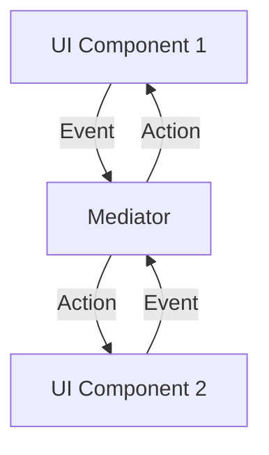

## 6.5 Mediator Pattern Using Event Systems

In the realm of software design patterns, the **Mediator Pattern** stands out as a powerful tool for managing complex interactions between objects. By encapsulating communication within a mediator, we can promote loose coupling and enhance the maintainability of our systems. In Haskell, this pattern can be effectively implemented using event-driven architectures and Functional Reactive Programming (FRP) libraries. Let's delve into the intricacies of the Mediator Pattern and explore how it can be applied in Haskell.

### Mediator Concept

The Mediator Pattern defines an object that encapsulates how a set of objects interact. This pattern is particularly useful in scenarios where multiple objects need to communicate with each other, but direct communication would lead to tight coupling and increased complexity. By introducing a mediator, we can centralize communication logic, allowing objects to interact through the mediator rather than directly with each other.

#### Key Participants

1. **Mediator**: The central object that manages communication between other objects.
2. **Colleagues**: The objects that interact with each other through the mediator.

#### Intent

- **Promote Loose Coupling**: By decoupling objects from each other, we can reduce dependencies and improve the flexibility of our system.
- **Centralize Control Logic**: The mediator acts as a hub for communication, simplifying the management of interactions.

### Implementation in Haskell

In Haskell, the Mediator Pattern can be implemented using event-driven architectures and FRP libraries. These tools allow us to manage interactions in a declarative and functional manner, leveraging Haskell's strengths in handling side effects and concurrency.

#### Event-Driven Architectures

Event-driven architectures are a natural fit for the Mediator Pattern. By using events to signal changes and actions, we can decouple the components of our system and allow them to interact through a central mediator.

#### Functional Reactive Programming (FRP)

FRP is a paradigm that allows us to work with time-varying values and events in a functional way. Libraries like `reactive-banana` provide abstractions for managing events and behaviors, making it easier to implement the Mediator Pattern in Haskell.

##### Example: Coordinating UI Components

Consider a GUI application where changes in one component need to affect others. By using the Mediator Pattern with an FRP library, we can coordinate these interactions efficiently.

```haskell
import Reactive.Banana
import Reactive.Banana.Frameworks

-- Define a type for UI events
data UIEvent = ButtonClick | TextInput String

-- Define a mediator function
mediator :: Event UIEvent -> MomentIO ()
mediator uiEvents = do
    -- Filter button click events
    let buttonClicks = filterE (== ButtonClick) uiEvents

    -- Filter text input events
    let textInputs = filterJust $ fmap (\case TextInput s -> Just s; _ -> Nothing) uiEvents

    -- Define reactions to events
    reactimate $ fmap (putStrLn . ("Button clicked: " ++)) buttonClicks
    reactimate $ fmap (putStrLn . ("Text input: " ++)) textInputs

-- Main function to set up the event network
main :: IO ()
main = do
    -- Create a new event network
    network <- compile $ do
        -- Create an event source for UI events
        (addUIEvent, uiEvents) <- newAddHandler
        mediator uiEvents

    -- Activate the network
    actuate network

    -- Simulate some UI events
    addUIEvent ButtonClick
    addUIEvent (TextInput "Hello, World!")
```

In this example, we define a simple mediator function that reacts to UI events. The `reactimate` function is used to specify actions in response to events, allowing us to centralize the interaction logic within the mediator.

### Visualizing the Mediator Pattern

To better understand the Mediator Pattern, let's visualize the flow of events and interactions in a typical application.



In this diagram, UI components send events to the mediator, which then determines the appropriate actions to take. This centralized approach simplifies the management of interactions and reduces coupling between components.

### Design Considerations

When implementing the Mediator Pattern in Haskell, consider the following:

- **Scalability**: Ensure that the mediator can handle a large number of events and interactions efficiently.
- **Concurrency**: Leverage Haskell's concurrency features to manage simultaneous events and actions.
- **Maintainability**: Keep the mediator logic simple and modular to facilitate maintenance and future enhancements.

### Haskell Unique Features

Haskell's unique features, such as strong static typing and lazy evaluation, make it well-suited for implementing the Mediator Pattern. The type system can help ensure that interactions are correctly defined, while lazy evaluation allows for efficient handling of events and actions.

### Differences and Similarities

The Mediator Pattern is often compared to the Observer Pattern, as both involve managing interactions between objects. However, the Mediator Pattern centralizes communication within a single object, while the Observer Pattern involves direct communication between observers and subjects.

### Try It Yourself

To deepen your understanding of the Mediator Pattern, try modifying the example code to add new types of events and reactions. Experiment with different FRP libraries and explore how they can be used to implement the pattern in various contexts.

### References

- [reactive-banana Library](https://hackage.haskell.org/package/reactive-banana)
- [Functional Reactive Programming in Haskell](https://wiki.haskell.org/Functional_Reactive_Programming)

### Knowledge Check

- How does the Mediator Pattern promote loose coupling?
- What are the key benefits of using FRP in implementing the Mediator Pattern?
- How can Haskell's type system aid in implementing the Mediator Pattern?

### Embrace the Journey

Remember, mastering design patterns is a journey. As you explore the Mediator Pattern and other patterns in Haskell, keep experimenting and learning. The more you practice, the more adept you'll become at building scalable and maintainable systems.

## Quiz: Mediator Pattern Using Event Systems



### What is the primary purpose of the Mediator Pattern?

- [x] To encapsulate how a set of objects interact
- [ ] To provide a way to create objects without specifying their concrete classes
- [ ] To define a family of algorithms and make them interchangeable
- [ ] To ensure a class has only one instance

> **Explanation:** The Mediator Pattern encapsulates how a set of objects interact, promoting loose coupling.

### Which Haskell feature is particularly useful for implementing the Mediator Pattern?

- [x] Functional Reactive Programming (FRP)
- [ ] Object-Oriented Programming
- [ ] Dynamic Typing
- [ ] Inheritance

> **Explanation:** FRP is useful for implementing the Mediator Pattern in Haskell due to its ability to manage interactions declaratively.

### How does the Mediator Pattern differ from the Observer Pattern?

- [x] The Mediator centralizes communication within a single object
- [ ] The Observer Pattern centralizes communication within a single object
- [ ] The Mediator Pattern involves direct communication between observers and subjects
- [ ] The Observer Pattern involves a mediator to manage interactions

> **Explanation:** The Mediator Pattern centralizes communication within a single object, unlike the Observer Pattern.

### What is a key benefit of using event-driven architectures in the Mediator Pattern?

- [x] They decouple components and allow interaction through a central mediator
- [ ] They tightly couple components for efficient communication
- [ ] They eliminate the need for a mediator
- [ ] They require direct communication between all components

> **Explanation:** Event-driven architectures decouple components and allow interaction through a central mediator.

### Which library is commonly used for FRP in Haskell?

- [x] reactive-banana
- [ ] React
- [ ] Angular
- [ ] Vue.js

> **Explanation:** The `reactive-banana` library is commonly used for FRP in Haskell.

### What is the role of the mediator in the Mediator Pattern?

- [x] To manage communication between other objects
- [ ] To act as a data storage
- [ ] To provide a user interface
- [ ] To handle database operations

> **Explanation:** The mediator manages communication between other objects.

### How can Haskell's type system aid in implementing the Mediator Pattern?

- [x] By ensuring interactions are correctly defined
- [ ] By allowing dynamic typing
- [ ] By supporting inheritance
- [ ] By enabling polymorphism

> **Explanation:** Haskell's type system ensures interactions are correctly defined, aiding in implementing the Mediator Pattern.

### What is a common use case for the Mediator Pattern in GUI applications?

- [x] Coordinating UI components
- [ ] Rendering graphics
- [ ] Handling user input
- [ ] Managing database connections

> **Explanation:** The Mediator Pattern is commonly used to coordinate UI components in GUI applications.

### Which of the following is a key participant in the Mediator Pattern?

- [x] Colleagues
- [ ] Observers
- [ ] Subjects
- [ ] Controllers

> **Explanation:** Colleagues are key participants in the Mediator Pattern, interacting through the mediator.

### True or False: The Mediator Pattern eliminates the need for direct communication between objects.

- [x] True
- [ ] False

> **Explanation:** The Mediator Pattern eliminates the need for direct communication between objects by centralizing interactions through a mediator.



By exploring the Mediator Pattern in Haskell, you can harness the power of event systems and FRP to build robust, scalable applications. Keep experimenting and learning, and you'll continue to grow as a Haskell developer.
