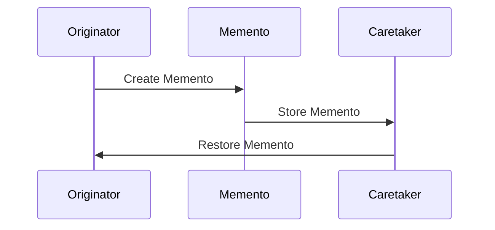

## 6.6 Memento Pattern with Immutable Data Structures

In this section, we delve into the Memento Pattern, a behavioral design pattern that allows capturing and restoring an object's state without violating encapsulation. In Haskell, we leverage immutable data structures to naturally preserve previous states, making it an ideal language for implementing this pattern. We will explore how to implement the Memento Pattern in Haskell, focusing on an example of an undo feature in a text editor.

### Memento Concept

The Memento Pattern is designed to capture an object's internal state so that it can be restored later. This is particularly useful in scenarios where you need to implement undo/redo functionality, such as in text editors or drawing applications. The key challenge is to achieve this without exposing the internal details of the object, thus maintaining encapsulation.

#### Key Participants

1. **Originator**: The object whose state needs to be saved and restored.
2. **Memento**: A representation of the Originator's state at a particular point in time.
3. **Caretaker**: Manages the mementos and is responsible for storing and restoring the Originator's state.

### Implementation in Haskell

Haskell's immutable data structures provide a natural fit for the Memento Pattern. Since data is immutable, previous states are inherently preserved, allowing us to capture snapshots of an object's state efficiently.

#### Leveraging Immutable Data Structures

In Haskell, we can represent the state of an object using immutable data structures, such as records or algebraic data types. These structures allow us to create snapshots of the state without the need for explicit copying or cloning, as is often required in imperative languages.

#### Using State Snapshots

To implement the Memento Pattern, we can define a data type to represent the state of the Originator. We then create functions to save and restore this state, effectively implementing the memento functionality.

### Example: Implementing an Undo Feature in a Text Editor

Let's consider a simple text editor that allows users to type text and undo their actions. We'll use the Memento Pattern to implement the undo functionality.

#### Step 1: Define the State

First, we define the state of the text editor using a simple data type:

```haskell
-- Define the state of the text editor
data EditorState = EditorState {
    textContent :: String
} deriving (Show, Eq)
```

#### Step 2: Implement the Originator

The Originator is responsible for creating and restoring mementos. In our case, the text editor acts as the Originator.

```haskell
-- Define the Originator with functions to save and restore state
type Memento = EditorState

saveState :: EditorState -> Memento
saveState = id

restoreState :: Memento -> EditorState
restoreState = id
```

#### Step 3: Implement the Caretaker

The Caretaker manages the mementos. It stores the history of states and provides functionality to undo actions.

```haskell
-- Define the Caretaker to manage state history
data Caretaker = Caretaker {
    history :: [Memento]
} deriving (Show)

-- Initialize the Caretaker with an empty history
initCaretaker :: Caretaker
initCaretaker = Caretaker { history = [] }

-- Add a new state to the history
addMemento :: Memento -> Caretaker -> Caretaker
addMemento memento caretaker = caretaker { history = memento : history caretaker }

-- Undo the last action by restoring the previous state
undo :: Caretaker -> (Maybe EditorState, Caretaker)
undo caretaker = case history caretaker of
    [] -> (Nothing, caretaker)
    (memento:rest) -> (Just memento, caretaker { history = rest })
```

#### Step 4: Demonstrate the Text Editor

Let's put everything together and demonstrate the text editor with undo functionality.

```haskell
-- Main function to demonstrate the text editor
main :: IO ()
main = do
    let initialState = EditorState { textContent = "" }
    let caretaker = initCaretaker

    -- Simulate typing text
    let state1 = EditorState { textContent = "Hello" }
    let caretaker1 = addMemento (saveState initialState) caretaker

    let state2 = EditorState { textContent = "Hello, World" }
    let caretaker2 = addMemento (saveState state1) caretaker1

    -- Display current state
    putStrLn $ "Current State: " ++ show state2

    -- Undo last action
    let (maybeState, caretaker3) = undo caretaker2
    case maybeState of
        Nothing -> putStrLn "Nothing to undo."
        Just prevState -> putStrLn $ "After Undo: " ++ show prevState
```

### Design Considerations

When implementing the Memento Pattern in Haskell, consider the following:

- **Efficiency**: Immutable data structures can be more memory-efficient than mutable ones, as they allow sharing of unchanged data between states.
- **Encapsulation**: Ensure that the internal state of the Originator is not exposed through the Memento.
- **Complexity**: While Haskell's immutability simplifies state management, it may introduce complexity in managing large state histories.

### Haskell Unique Features

Haskell's strong type system and immutability make it uniquely suited for implementing the Memento Pattern. The language's emphasis on pure functions and referential transparency ensures that state changes are predictable and easy to manage.

### Differences and Similarities

The Memento Pattern is often compared to the Command Pattern, as both involve capturing state. However, the Memento Pattern focuses on state snapshots, while the Command Pattern encapsulates actions. In Haskell, both patterns can be implemented using similar techniques, but the Memento Pattern leverages immutable data structures more directly.

### Visualizing the Memento Pattern

To better understand the Memento Pattern, let's visualize the interaction between the Originator, Memento, and Caretaker.



This diagram illustrates how the Originator creates a Memento, which is then stored by the Caretaker. The Caretaker can later restore the Memento to revert the Originator's state.

### Try It Yourself

To deepen your understanding, try modifying the text editor example:

- Add functionality to redo actions.
- Implement a more complex state, such as a drawing application with multiple shapes.
- Experiment with different data structures to manage the state history.

### Knowledge Check

- How does Haskell's immutability benefit the implementation of the Memento Pattern?
- What are the key differences between the Memento and Command Patterns?
- How can you ensure encapsulation when implementing the Memento Pattern?

### Embrace the Journey

Remember, mastering design patterns in Haskell is a journey. As you explore the Memento Pattern, you'll gain insights into state management and encapsulation. Keep experimenting, stay curious, and enjoy the journey!

## Quiz: Memento Pattern with Immutable Data Structures



### What is the primary purpose of the Memento Pattern?

- [x] To capture and restore an object's state without violating encapsulation.
- [ ] To encapsulate actions and commands.
- [ ] To manage dependencies between objects.
- [ ] To provide a way to access the elements of an aggregate object sequentially.

> **Explanation:** The Memento Pattern is designed to capture and restore an object's state without exposing its internal details, thus maintaining encapsulation.

### How does Haskell's immutability benefit the Memento Pattern?

- [x] It naturally preserves previous states, making it easier to capture snapshots.
- [ ] It allows for mutable state changes without side effects.
- [ ] It simplifies the creation of mutable data structures.
- [ ] It eliminates the need for state management.

> **Explanation:** Haskell's immutability ensures that previous states are preserved, allowing for efficient state snapshots without explicit copying.

### Which component is responsible for managing the history of states in the Memento Pattern?

- [ ] Originator
- [ ] Memento
- [x] Caretaker
- [ ] Observer

> **Explanation:** The Caretaker is responsible for managing the history of states and restoring them when needed.

### What is a key difference between the Memento and Command Patterns?

- [x] The Memento Pattern focuses on state snapshots, while the Command Pattern encapsulates actions.
- [ ] The Memento Pattern is used for dependency management, while the Command Pattern is not.
- [ ] The Command Pattern is used for state snapshots, while the Memento Pattern encapsulates actions.
- [ ] Both patterns serve the same purpose and are interchangeable.

> **Explanation:** The Memento Pattern captures state snapshots, while the Command Pattern encapsulates actions and commands.

### In the text editor example, what role does the `EditorState` play?

- [x] It represents the state of the Originator.
- [ ] It acts as the Caretaker.
- [ ] It is the Memento.
- [ ] It is responsible for managing state history.

> **Explanation:** The `EditorState` represents the state of the Originator (text editor) and is used to create Mementos.

### How can you ensure encapsulation when implementing the Memento Pattern?

- [x] By not exposing the internal state of the Originator through the Memento.
- [ ] By allowing direct access to the Originator's state.
- [ ] By using mutable data structures.
- [ ] By storing state in global variables.

> **Explanation:** Encapsulation is maintained by ensuring that the Memento does not expose the internal state of the Originator.

### What is the role of the Originator in the Memento Pattern?

- [x] To create and restore Mementos.
- [ ] To manage the history of states.
- [ ] To store Mementos.
- [ ] To encapsulate actions and commands.

> **Explanation:** The Originator is responsible for creating and restoring Mementos, capturing its state.

### Which Haskell feature is particularly beneficial for implementing the Memento Pattern?

- [x] Immutable data structures
- [ ] Mutable variables
- [ ] Dynamic typing
- [ ] Global state management

> **Explanation:** Immutable data structures in Haskell naturally preserve previous states, making them ideal for the Memento Pattern.

### What is a potential design consideration when using the Memento Pattern in Haskell?

- [x] Managing large state histories can introduce complexity.
- [ ] Mutable data structures are required.
- [ ] Encapsulation is not a concern.
- [ ] State changes are unpredictable.

> **Explanation:** While Haskell's immutability simplifies state management, managing large state histories can become complex.

### True or False: The Memento Pattern is only applicable in object-oriented programming.

- [ ] True
- [x] False

> **Explanation:** The Memento Pattern can be applied in functional programming languages like Haskell, leveraging immutable data structures.


