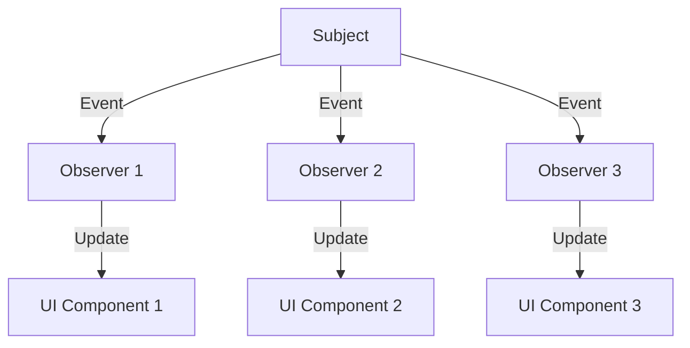

## 6.7 Observer Pattern with FRP Libraries

In this section, we delve into the Observer Pattern, a fundamental design pattern in software engineering, and explore its implementation using Functional Reactive Programming (FRP) libraries in Haskell. The Observer Pattern is pivotal in creating systems where changes in one part of the application automatically propagate to other parts, ensuring consistency and responsiveness.

### Observer Concept

The Observer Pattern establishes a one-to-many dependency between objects. When one object, known as the subject, changes state, all its dependents, known as observers, are automatically notified and updated. This pattern is particularly useful in scenarios where an object needs to broadcast changes to multiple other objects without being tightly coupled to them.

#### Key Participants

- **Subject**: The object that holds the state and notifies observers of changes.
- **Observer**: The objects that need to be updated when the subject changes.
- **ConcreteSubject**: A specific implementation of the subject that maintains state.
- **ConcreteObserver**: A specific implementation of an observer that reacts to changes in the subject.

### Functional Reactive Programming (FRP)

Functional Reactive Programming (FRP) is a paradigm for modeling time-varying values and automatically propagating changes. In Haskell, FRP is used to handle event streams and dynamic behaviors, making it an ideal fit for implementing the Observer Pattern.

#### FRP Libraries in Haskell

Haskell offers several libraries for implementing FRP, including:

- **Reactive-banana**: A library for practical FRP that is easy to integrate with existing Haskell applications.
- **Reflex**: A powerful FRP library designed for building interactive web applications.

These libraries provide abstractions for dealing with events and behaviors, allowing developers to focus on the logic of their applications rather than the intricacies of event handling.

### Implementation with Reactive-banana

Let's explore how to implement the Observer Pattern using the Reactive-banana library. Reactive-banana provides a straightforward way to work with events and behaviors, making it a popular choice for FRP in Haskell.

#### Setting Up Reactive-banana

First, ensure you have Reactive-banana installed. You can add it to your project by including it in your Cabal file or using Stack:

```bash
cabal install reactive-banana
```

#### Basic Example: Live Data Dashboard

Consider a scenario where we want to create a live data dashboard that updates whenever new data arrives. We'll use Reactive-banana to handle the event streams and update the UI accordingly.

```haskell
{-# LANGUAGE RecursiveDo #-}

import Reactive.Banana
import Reactive.Banana.Frameworks

-- Define the main function
main :: IO ()
main = do
    -- Create a new event network
    (addData, fireData) <- newAddHandler
    network <- compile $ myNetworkDescription addData
    actuate network

    -- Simulate incoming data
    fireData "New data point 1"
    fireData "New data point 2"

-- Define the network description
myNetworkDescription :: AddHandler String -> MomentIO ()
myNetworkDescription addData = mdo
    -- Create an event from the add handler
    eData <- fromAddHandler addData

    -- Define a behavior that accumulates data points
    bDataPoints <- accumB [] $ (:) <$> eData

    -- Print the accumulated data points whenever they change
    reactimate $ fmap print bDataPoints
```

In this example, we create an event network using Reactive-banana. The `newAddHandler` function sets up a mechanism for firing events, and `fromAddHandler` converts these events into an FRP event stream. The `accumB` function accumulates data points into a list, and `reactimate` prints the updated list whenever it changes.

#### Try It Yourself

Experiment with the code by adding more data points or modifying the behavior to filter or transform the data before printing. This hands-on approach will deepen your understanding of how Reactive-banana handles events and behaviors.

### Implementation with Reflex

Reflex is another powerful FRP library in Haskell, particularly suited for building interactive web applications. Let's see how we can use Reflex to implement the Observer Pattern.

#### Setting Up Reflex

Reflex is often used in conjunction with Reflex-DOM for web applications. To get started, you'll need to set up a Reflex project. You can find detailed instructions on the [Reflex FRP website](https://reflex-frp.org/).

#### Basic Example: Interactive Web Application

Consider a simple web application where a text input updates a display in real-time. We'll use Reflex to handle the dynamic behavior.

```haskell
{-# LANGUAGE OverloadedStrings #-}
{-# LANGUAGE RecursiveDo #-}

import Reflex.Dom

main :: IO ()
main = mainWidget $ el "div" $ mdo
    -- Create a text input widget
    ti <- textInput def

    -- Display the current value of the text input
    el "div" $ dynText $ _textInput_value ti
```

In this example, we use Reflex-DOM to create a simple web application. The `textInput` function creates a text input widget, and `dynText` displays the current value of the text input. Reflex automatically updates the display whenever the input changes, demonstrating the Observer Pattern in action.

#### Try It Yourself

Modify the example to include additional widgets or behaviors. For instance, you could add a button that resets the input or a checkbox that toggles the visibility of the text display.

### Visualizing the Observer Pattern with FRP

To better understand how the Observer Pattern works with FRP, let's visualize the flow of data and events.



In this diagram, the subject emits events that are propagated to multiple observers. Each observer updates its corresponding UI component, ensuring that the application remains consistent and responsive.

### Design Considerations

When implementing the Observer Pattern with FRP in Haskell, consider the following:

- **Decoupling**: FRP naturally decouples the subject from its observers, promoting modularity and reusability.
- **Performance**: Be mindful of performance, especially in applications with a large number of events or complex behaviors. Profiling and optimization may be necessary.
- **Complexity**: While FRP simplifies event handling, it can introduce complexity in understanding the flow of data and dependencies. Clear documentation and visualization can help mitigate this.

### Haskell Unique Features

Haskell's strong static typing and purity make it particularly well-suited for FRP. The type system ensures that event streams and behaviors are well-defined, reducing runtime errors. Additionally, Haskell's laziness allows for efficient handling of potentially infinite data streams.

### Differences and Similarities

The Observer Pattern in Haskell, when implemented with FRP, differs from traditional implementations in object-oriented languages. In Haskell, the focus is on event streams and behaviors rather than objects and methods. This shift in perspective can lead to more declarative and concise code.

### References and Further Reading

- [Reactive-banana Documentation](https://hackage.haskell.org/package/reactive-banana)
- [Reflex FRP](https://reflex-frp.org/)
- [Functional Reactive Programming in Haskell](https://wiki.haskell.org/Functional_Reactive_Programming)

### Knowledge Check

- What are the key participants in the Observer Pattern?
- How does FRP differ from traditional event handling?
- What are the benefits of using FRP in Haskell?

### Embrace the Journey

Remember, mastering the Observer Pattern with FRP in Haskell is just the beginning. As you continue to explore and experiment, you'll discover new ways to leverage FRP to build responsive and dynamic applications. Stay curious, keep experimenting, and enjoy the journey!

## Quiz: Observer Pattern with FRP Libraries



### What is the primary purpose of the Observer Pattern?

- [x] To define a one-to-many dependency between objects
- [ ] To encapsulate a request as an object
- [ ] To provide a way to access elements of an aggregate object sequentially
- [ ] To allow an object to alter its behavior when its internal state changes

> **Explanation:** The Observer Pattern is used to define a one-to-many dependency between objects so that when one object changes state, all its dependents are notified and updated automatically.

### Which Haskell library is commonly used for Functional Reactive Programming?

- [x] Reactive-banana
- [ ] Pandas
- [ ] NumPy
- [ ] TensorFlow

> **Explanation:** Reactive-banana is a popular library in Haskell for implementing Functional Reactive Programming (FRP).

### What is a key advantage of using FRP in Haskell?

- [x] It allows for modeling time-varying values and automatic propagation of changes.
- [ ] It simplifies the use of mutable state.
- [ ] It enhances the performance of imperative loops.
- [ ] It provides a way to directly manipulate hardware.

> **Explanation:** FRP allows for modeling time-varying values and automatically propagating changes, which is a key advantage in building responsive applications.

### In the Observer Pattern, what is the role of the subject?

- [x] To hold the state and notify observers of changes
- [ ] To receive updates from observers
- [ ] To encapsulate the logic for updating the UI
- [ ] To manage the lifecycle of observers

> **Explanation:** The subject in the Observer Pattern holds the state and is responsible for notifying observers of any changes.

### How does Reactive-banana handle event streams?

- [x] By providing abstractions for events and behaviors
- [ ] By using imperative loops
- [ ] By directly manipulating the DOM
- [ ] By using global variables

> **Explanation:** Reactive-banana provides abstractions for events and behaviors, allowing developers to focus on the logic of their applications.

### What is a common use case for the Observer Pattern with FRP?

- [x] Creating a live data dashboard
- [ ] Implementing a sorting algorithm
- [ ] Building a static website
- [ ] Designing a file system

> **Explanation:** A common use case for the Observer Pattern with FRP is creating a live data dashboard that updates automatically when new data arrives.

### What does the `accumB` function do in Reactive-banana?

- [x] It accumulates values over time into a behavior.
- [ ] It initializes a new event network.
- [ ] It creates a new UI component.
- [ ] It handles asynchronous exceptions.

> **Explanation:** The `accumB` function in Reactive-banana accumulates values over time into a behavior, which can be used to represent state.

### What is a potential challenge when using FRP in Haskell?

- [x] Understanding the flow of data and dependencies
- [ ] Managing mutable state
- [ ] Handling low-level memory operations
- [ ] Directly manipulating hardware

> **Explanation:** A potential challenge when using FRP in Haskell is understanding the flow of data and dependencies, which can become complex in large applications.

### Which of the following is a feature of Reflex?

- [x] It is designed for building interactive web applications.
- [ ] It is a library for numerical computations.
- [ ] It provides direct access to hardware.
- [ ] It is used for low-level memory management.

> **Explanation:** Reflex is a powerful FRP library designed for building interactive web applications.

### True or False: FRP in Haskell is primarily focused on mutable state management.

- [ ] True
- [x] False

> **Explanation:** False. FRP in Haskell is focused on modeling time-varying values and automatically propagating changes, rather than managing mutable state.


