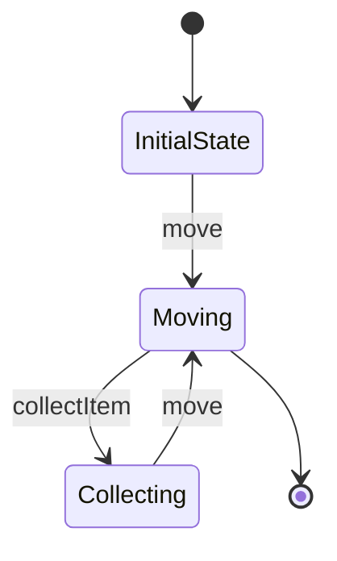

## 6.8 State Pattern Using the State Monad

In this section, we delve into the State Pattern using the State Monad in Haskell, a powerful tool for managing stateful computations in a purely functional programming environment. The State Monad allows us to encapsulate state transitions, making our code cleaner, more modular, and easier to reason about.

### Understanding the State Pattern

The State Pattern is a behavioral design pattern that allows an object to change its behavior when its internal state changes. This pattern is particularly useful in scenarios where an object's behavior is state-dependent, such as in games, simulations, or complex workflows.

#### Key Concepts

- **State Encapsulation**: The State Pattern encapsulates state-related behavior, allowing for dynamic behavior changes.
- **State Transition**: Objects can transition between different states, each with its own behavior.
- **Decoupling**: By separating state management from business logic, the State Pattern promotes cleaner code architecture.

### The State Monad in Haskell

Haskell, being a purely functional language, handles state differently from imperative languages. The State Monad is a construct that allows us to thread state through computations without explicitly passing it around.

#### State Monad Basics

The State Monad is defined as follows:

```haskell
newtype State s a = State { runState :: s -> (a, s) }
```

- **`s`**: Represents the state type.
- **`a`**: Represents the result type.
- **`runState`**: A function that takes an initial state and returns a result paired with a new state.

#### Monad Instance

The State Monad is an instance of the Monad type class, which provides the `bind` (`>>=`) and `return` operations:

```haskell
instance Monad (State s) where
    return a = State $ \s -> (a, s)
    (State h) >>= f = State $ \s ->
        let (a, newState) = h s
            (State g) = f a
        in g newState
```

### Implementing the State Pattern with the State Monad

Let's explore how to implement the State Pattern using the State Monad in Haskell through a practical example: simulating a simple game where the game state changes in response to player actions.

#### Game Simulation Example

Consider a game where a player can move in a grid, collect items, and encounter obstacles. We'll model the game state and player actions using the State Monad.

##### Defining the Game State

First, define the data types representing the game state:

```haskell
data Position = Position { x :: Int, y :: Int } deriving (Show, Eq)
data GameState = GameState { playerPosition :: Position, score :: Int } deriving (Show)

initialState :: GameState
initialState = GameState (Position 0 0) 0
```

##### Player Actions

Define actions that the player can perform, such as moving and collecting items:

```haskell
type Game a = State GameState a

move :: Int -> Int -> Game ()
move dx dy = do
    GameState (Position x y) score <- get
    let newPosition = Position (x + dx) (y + dy)
    put $ GameState newPosition score

collectItem :: Int -> Game ()
collectItem points = do
    GameState pos score <- get
    put $ GameState pos (score + points)
```

##### Running the Game

Create a function to run the game simulation:

```haskell
runGame :: Game a -> GameState -> (a, GameState)
runGame game initialState = runState game initialState

main :: IO ()
main = do
    let actions = do
            move 1 0
            collectItem 10
            move 0 1
            collectItem 5
    let (_, finalState) = runGame actions initialState
    print finalState
```

### Visualizing State Transitions

To better understand how the State Monad manages state transitions, let's visualize the process using a state transition diagram.



**Diagram Description**: This diagram illustrates the state transitions in our game simulation. The player starts in the `InitialState`, moves to a new position, collects items, and continues moving.

### Design Considerations

When using the State Monad, consider the following:

- **State Complexity**: As the state becomes more complex, consider breaking it into smaller, manageable parts.
- **Performance**: While the State Monad simplifies state management, be mindful of performance implications in large-scale applications.
- **Testing**: Use property-based testing to ensure state transitions behave as expected.

### Haskell Unique Features

Haskell's strong type system and purity make the State Monad a natural fit for managing state. The language's emphasis on immutability ensures that state changes are explicit and predictable.

### Differences and Similarities

The State Monad is similar to other monads like Maybe and Either in that it encapsulates computations. However, it is unique in its ability to manage state transitions seamlessly.

### Try It Yourself

Experiment with the code examples by modifying player actions or adding new game mechanics. Try implementing additional features such as obstacles or power-ups.

### Knowledge Check

- **Question**: How does the State Monad encapsulate state transitions in Haskell?
- **Exercise**: Modify the game simulation to include obstacles that decrease the player's score.

### Embrace the Journey

Remember, mastering the State Monad is just the beginning. As you progress, you'll discover more advanced patterns and techniques in Haskell. Keep experimenting, stay curious, and enjoy the journey!

## Quiz: State Pattern Using the State Monad



### What is the primary purpose of the State Monad in Haskell?

- [x] To manage stateful computations in a functional context
- [ ] To perform I/O operations
- [ ] To handle exceptions
- [ ] To manage concurrency

> **Explanation:** The State Monad is used to manage stateful computations without explicitly passing state around.

### How does the State Monad encapsulate state transitions?

- [x] By threading state through computations
- [ ] By using mutable variables
- [ ] By performing side effects
- [ ] By using global variables

> **Explanation:** The State Monad threads state through computations, allowing state transitions to be managed functionally.

### What is the role of the `runState` function in the State Monad?

- [x] It executes a stateful computation and returns the result and new state
- [ ] It initializes the state
- [ ] It performs I/O operations
- [ ] It handles exceptions

> **Explanation:** `runState` executes a stateful computation, returning both the result and the updated state.

### In the game simulation example, what does the `move` function do?

- [x] It updates the player's position
- [ ] It increases the player's score
- [ ] It decreases the player's score
- [ ] It resets the game state

> **Explanation:** The `move` function updates the player's position based on the given deltas.

### Which of the following is a key benefit of using the State Monad?

- [x] Encapsulation of state transitions
- [ ] Improved performance
- [ ] Simplified I/O operations
- [ ] Enhanced error handling

> **Explanation:** The State Monad encapsulates state transitions, making code cleaner and more modular.

### What is a potential drawback of using the State Monad?

- [x] Increased complexity in large-scale applications
- [ ] Difficulty in performing I/O operations
- [ ] Lack of error handling capabilities
- [ ] Poor performance

> **Explanation:** In large-scale applications, managing complex state with the State Monad can become challenging.

### How can you test state transitions in Haskell?

- [x] Use property-based testing
- [ ] Use mutable variables
- [ ] Use global variables
- [ ] Use side effects

> **Explanation:** Property-based testing is effective for ensuring state transitions behave as expected.

### What is a common use case for the State Pattern?

- [x] Simulating games with state-dependent behavior
- [ ] Performing I/O operations
- [ ] Handling exceptions
- [ ] Managing concurrency

> **Explanation:** The State Pattern is commonly used in scenarios where behavior depends on the state, such as games.

### How does Haskell's type system benefit the use of the State Monad?

- [x] It ensures state changes are explicit and predictable
- [ ] It allows mutable variables
- [ ] It simplifies I/O operations
- [ ] It enhances error handling

> **Explanation:** Haskell's type system ensures that state changes are explicit and predictable, benefiting the use of the State Monad.

### True or False: The State Monad is unique in its ability to manage state transitions seamlessly.

- [x] True
- [ ] False

> **Explanation:** The State Monad is unique in its ability to manage state transitions seamlessly in a functional context.


