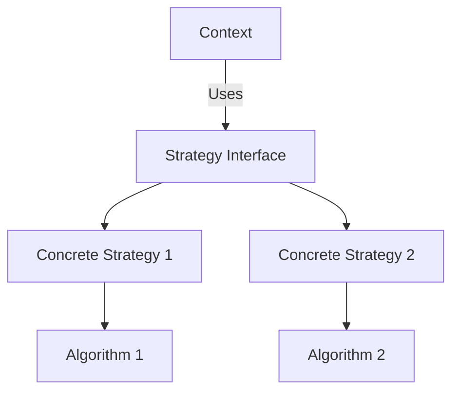

## 6.9 Strategy Pattern with Higher-Order Functions

In the realm of software design patterns, the Strategy Pattern stands out as a powerful tool for defining a family of algorithms, encapsulating each one, and making them interchangeable. This pattern is particularly well-suited to Haskell, where higher-order functions and functional programming paradigms naturally align with the pattern's intent. In this section, we will delve into the Strategy Pattern, explore its implementation using higher-order functions in Haskell, and provide practical examples to illustrate its application.

### Strategy Concept

The Strategy Pattern is a behavioral design pattern that enables selecting an algorithm's behavior at runtime. It defines a family of algorithms, encapsulates each one, and makes them interchangeable. This allows the algorithm to vary independently from the clients that use it. In Haskell, the Strategy Pattern can be elegantly implemented using higher-order functions, which are functions that take other functions as arguments or return them as results.

#### Key Participants

- **Strategy Interface**: Defines a common interface for all supported algorithms.
- **Concrete Strategies**: Implement the algorithm using the Strategy interface.
- **Context**: Maintains a reference to a Strategy object and delegates the algorithm to the Strategy interface.

### Implementation in Haskell

In Haskell, we can leverage higher-order functions to implement the Strategy Pattern. Higher-order functions allow us to pass different algorithms as parameters, making them interchangeable and flexible. Let's explore how to implement this pattern in Haskell.

#### Defining the Strategy Interface

In Haskell, the Strategy interface can be represented as a type alias for a function. For example, if we are implementing a sorting strategy, the Strategy interface could be a function that takes a list and returns a sorted list.

```haskell
type SortStrategy a = [a] -> [a]
```

#### Implementing Concrete Strategies

Concrete strategies are specific implementations of the Strategy interface. In our sorting example, we can define different sorting algorithms as concrete strategies.

```haskell
-- Bubble Sort Strategy
bubbleSort :: Ord a => SortStrategy a
bubbleSort [] = []
bubbleSort xs = bubbleSort (init xs') ++ [last xs']
  where
    xs' = foldl (\acc x -> if x < last acc then init acc ++ [x, last acc] else acc ++ [x]) [head xs] (tail xs)

-- Quick Sort Strategy
quickSort :: Ord a => SortStrategy a
quickSort [] = []
quickSort (x:xs) = quickSort [y | y <- xs, y <= x] ++ [x] ++ quickSort [y | y <- xs, y > x]
```

#### Context and Strategy Selection

The context is responsible for maintaining a reference to a Strategy object and delegating the algorithm to the Strategy interface. In Haskell, we can define a function that takes a strategy and a list, and applies the strategy to the list.

```haskell
sortWithStrategy :: SortStrategy a -> [a] -> [a]
sortWithStrategy strategy xs = strategy xs
```

### Example: Sorting Data with Different Comparison Strategies

Let's consider an example where we sort a list of integers using different comparison strategies. We will define a few comparison functions and use them as strategies.

```haskell
-- Ascending Order Strategy
ascending :: Ord a => a -> a -> Bool
ascending x y = x <= y

-- Descending Order Strategy
descending :: Ord a => a -> a -> Bool
descending x y = x >= y

-- Sort with Comparison Strategy
sortWithComparison :: (a -> a -> Bool) -> [a] -> [a]
sortWithComparison cmp = foldr insert []
  where
    insert x [] = [x]
    insert x ys@(y:ys')
      | cmp x y   = x : ys
      | otherwise = y : insert x ys'
```

#### Using the Strategy Pattern

Now, let's use the Strategy Pattern to sort a list of integers in both ascending and descending order.

```haskell
main :: IO ()
main = do
  let numbers = [5, 2, 9, 1, 5, 6]
  putStrLn "Original List:"
  print numbers

  putStrLn "\nSorted in Ascending Order:"
  print (sortWithComparison ascending numbers)

  putStrLn "\nSorted in Descending Order:"
  print (sortWithComparison descending numbers)
```

### Visualizing the Strategy Pattern

To better understand the Strategy Pattern, let's visualize the flow of data and the interaction between the context and strategies using a Mermaid.js diagram.



**Diagram Description**: The diagram illustrates the relationship between the context, strategy interface, and concrete strategies. The context uses the strategy interface, which can be implemented by multiple concrete strategies, each encapsulating a different algorithm.

### Design Considerations

When implementing the Strategy Pattern in Haskell, consider the following design considerations:

- **Flexibility**: The Strategy Pattern provides flexibility by allowing algorithms to be selected at runtime. This is particularly useful in scenarios where the algorithm needs to be changed dynamically.
- **Encapsulation**: By encapsulating algorithms in separate functions, the Strategy Pattern promotes clean and maintainable code.
- **Reusability**: Strategies can be reused across different contexts, reducing code duplication and improving modularity.

### Haskell Unique Features

Haskell's unique features, such as higher-order functions and strong static typing, make it an ideal language for implementing the Strategy Pattern. Higher-order functions allow for concise and expressive code, while strong static typing ensures type safety and reduces runtime errors.

### Differences and Similarities

The Strategy Pattern is often confused with the State Pattern, as both involve changing behavior at runtime. However, the key difference is that the Strategy Pattern focuses on selecting an algorithm, while the State Pattern focuses on changing the state of an object.

### Try It Yourself

To deepen your understanding of the Strategy Pattern, try modifying the code examples provided. Experiment with different sorting algorithms, such as merge sort or insertion sort, and implement them as concrete strategies. Additionally, try creating new comparison functions to sort data based on different criteria.

### Knowledge Check

- What is the primary purpose of the Strategy Pattern?
- How does Haskell's higher-order functions facilitate the implementation of the Strategy Pattern?
- What are the key differences between the Strategy Pattern and the State Pattern?

### Summary

In this section, we explored the Strategy Pattern and its implementation using higher-order functions in Haskell. We discussed the key participants of the pattern, provided practical examples, and highlighted Haskell's unique features that make it well-suited for this pattern. By understanding and applying the Strategy Pattern, you can create flexible and interchangeable algorithms in your Haskell applications.

Remember, this is just the beginning. As you progress, you'll build more complex and interactive applications. Keep experimenting, stay curious, and enjoy the journey!

## Quiz: Strategy Pattern with Higher-Order Functions



### What is the primary purpose of the Strategy Pattern?

- [x] To define a family of algorithms, encapsulate each one, and make them interchangeable.
- [ ] To manage object creation and initialization.
- [ ] To provide a way to access the elements of an aggregate object sequentially.
- [ ] To define the skeleton of an algorithm in an operation, deferring some steps to subclasses.

> **Explanation:** The Strategy Pattern is used to define a family of algorithms, encapsulate each one, and make them interchangeable, allowing the algorithm to vary independently from the clients that use it.

### How does Haskell's higher-order functions facilitate the implementation of the Strategy Pattern?

- [x] By allowing functions to be passed as parameters and returned as results.
- [ ] By providing a way to define classes and interfaces.
- [ ] By enabling dynamic typing and runtime type checking.
- [ ] By supporting object-oriented programming paradigms.

> **Explanation:** Haskell's higher-order functions allow functions to be passed as parameters and returned as results, making it easy to implement the Strategy Pattern by passing different algorithms as parameters.

### What is a key difference between the Strategy Pattern and the State Pattern?

- [x] The Strategy Pattern focuses on selecting an algorithm, while the State Pattern focuses on changing the state of an object.
- [ ] The Strategy Pattern is used for object creation, while the State Pattern is used for behavior modification.
- [ ] The Strategy Pattern is a structural pattern, while the State Pattern is a behavioral pattern.
- [ ] The Strategy Pattern is used for managing dependencies, while the State Pattern is used for managing state transitions.

> **Explanation:** The Strategy Pattern focuses on selecting an algorithm, while the State Pattern focuses on changing the state of an object, allowing different behaviors based on the object's state.

### Which of the following is a benefit of using the Strategy Pattern?

- [x] It promotes flexibility by allowing algorithms to be selected at runtime.
- [ ] It simplifies object creation and initialization.
- [ ] It provides a way to access the elements of an aggregate object sequentially.
- [ ] It defines the skeleton of an algorithm in an operation, deferring some steps to subclasses.

> **Explanation:** The Strategy Pattern promotes flexibility by allowing algorithms to be selected at runtime, enabling dynamic behavior changes.

### In Haskell, how can you represent a Strategy interface for sorting algorithms?

- [x] As a type alias for a function that takes a list and returns a sorted list.
- [ ] As a data type with multiple constructors for different algorithms.
- [ ] As a class with methods for each sorting algorithm.
- [ ] As a module with functions for each sorting algorithm.

> **Explanation:** In Haskell, a Strategy interface for sorting algorithms can be represented as a type alias for a function that takes a list and returns a sorted list, allowing different sorting strategies to be implemented as functions.

### What is a higher-order function in Haskell?

- [x] A function that takes other functions as arguments or returns them as results.
- [ ] A function that is defined within a class or interface.
- [ ] A function that operates on data structures like lists and trees.
- [ ] A function that is used for input/output operations.

> **Explanation:** A higher-order function in Haskell is a function that takes other functions as arguments or returns them as results, enabling powerful abstractions and flexible code.

### Which of the following is an example of a concrete strategy in the Strategy Pattern?

- [x] A specific sorting algorithm implemented as a function.
- [ ] A data type representing a list of elements.
- [ ] A class with methods for sorting data.
- [ ] A module with utility functions for data manipulation.

> **Explanation:** A concrete strategy in the Strategy Pattern is a specific implementation of an algorithm, such as a sorting algorithm implemented as a function.

### What is the role of the context in the Strategy Pattern?

- [x] To maintain a reference to a Strategy object and delegate the algorithm to the Strategy interface.
- [ ] To define the common interface for all supported algorithms.
- [ ] To implement the algorithm using the Strategy interface.
- [ ] To provide a way to access the elements of an aggregate object sequentially.

> **Explanation:** The context in the Strategy Pattern maintains a reference to a Strategy object and delegates the algorithm to the Strategy interface, allowing the algorithm to be selected at runtime.

### How can you modify the provided code examples to experiment with the Strategy Pattern?

- [x] By implementing new sorting algorithms as concrete strategies and creating new comparison functions.
- [ ] By changing the data types used in the examples.
- [ ] By adding more functions to the context.
- [ ] By removing the higher-order functions from the examples.

> **Explanation:** To experiment with the Strategy Pattern, you can implement new sorting algorithms as concrete strategies and create new comparison functions, allowing you to explore different strategies and their effects.

### True or False: The Strategy Pattern can only be used for sorting algorithms.

- [x] False
- [ ] True

> **Explanation:** False. The Strategy Pattern is a versatile design pattern that can be used for a wide range of algorithms and behaviors, not just sorting algorithms.


