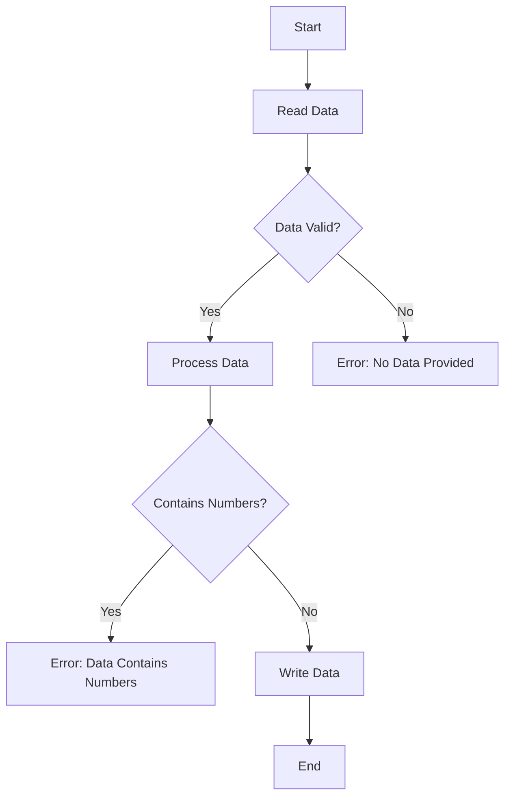

## 7.1 Monadic Design Patterns

### Overview

Monads are a fundamental concept in Haskell, providing a powerful abstraction for structuring and sequencing computations. They allow us to handle context, encapsulate side effects, and chain operations in a clean and expressive manner. In this section, we will delve into monadic design patterns, exploring how they can be used to build robust and maintainable Haskell applications.

### Patterns

Monadic design patterns revolve around the idea of chaining operations, managing context, and encapsulating side effects. Let's explore some common patterns:

1. **Chaining Operations**: Monads provide a way to sequence computations, allowing us to chain operations together. This is achieved through the `bind` operation (`>>=`), which takes a monadic value and a function, applying the function to the unwrapped value and returning a new monadic value.

2. **Handling Context**: Monads encapsulate context, such as optionality, error handling, or state. This allows us to write code that is agnostic to the specific context, focusing instead on the computation logic.

3. **Encapsulating Side Effects**: Monads like `IO` allow us to encapsulate side effects, ensuring that our pure functions remain pure and side effects are managed explicitly.

### Implementation

To implement monadic design patterns, we can leverage built-in monads like `Maybe`, `Either`, `List`, `IO`, and even create custom monads tailored to specific needs.

#### Using `Maybe` Monad

The `Maybe` monad is used to represent computations that may fail. It encapsulates an optional value, allowing us to chain operations that may return `Nothing`.

```haskell
safeDivide :: Double -> Double -> Maybe Double
safeDivide _ 0 = Nothing
safeDivide x y = Just (x / y)

compute :: Double -> Double -> Maybe Double
compute x y = do
  result1 <- safeDivide x y
  result2 <- safeDivide result1 2
  return result2
```

In this example, `compute` chains two division operations, gracefully handling division by zero.

#### Using `Either` Monad

The `Either` monad is used for computations that may fail with an error. It provides more information than `Maybe`, encapsulating either a successful result or an error.

```haskell
safeDivide :: Double -> Double -> Either String Double
safeDivide _ 0 = Left "Division by zero"
safeDivide x y = Right (x / y)

compute :: Double -> Double -> Either String Double
compute x y = do
  result1 <- safeDivide x y
  result2 <- safeDivide result1 2
  return result2
```

Here, `compute` provides error messages when division fails, improving error handling.

#### Using `List` Monad

The `List` monad represents non-deterministic computations, allowing us to work with multiple possible results.

```haskell
combinations :: [a] -> [b] -> [(a, b)]
combinations xs ys = do
  x <- xs
  y <- ys
  return (x, y)
```

This example generates all combinations of elements from two lists.

#### Using `IO` Monad

The `IO` monad encapsulates side effects, allowing us to perform input/output operations while maintaining purity in the rest of the code.

```haskell
main :: IO ()
main = do
  putStrLn "Enter a number:"
  input <- getLine
  let number = read input :: Int
  putStrLn $ "You entered: " ++ show number
```

In this example, `main` performs I/O operations, reading a number from the user and printing it.

#### Creating Custom Monads

Custom monads can be created to encapsulate specific behaviors or contexts. This involves defining a data type and implementing the `Monad` type class.

```haskell
newtype Logger a = Logger { runLogger :: (a, [String]) }

instance Functor Logger where
  fmap f (Logger (x, log)) = Logger (f x, log)

instance Applicative Logger where
  pure x = Logger (x, [])
  Logger (f, log1) <*> Logger (x, log2) = Logger (f x, log1 ++ log2)

instance Monad Logger where
  return = pure
  Logger (x, log1) >>= f =
    let Logger (y, log2) = f x
    in Logger (y, log1 ++ log2)

logMessage :: String -> Logger ()
logMessage msg = Logger ((), [msg])

computeWithLogging :: Int -> Logger Int
computeWithLogging x = do
  logMessage "Starting computation"
  let result = x * 2
  logMessage $ "Computed result: " ++ show result
  return result
```

In this example, `Logger` is a custom monad that logs messages during computation.

### Example: Building a Data Processing Pipeline

Let's build a data processing pipeline that handles possible failures gracefully using monadic design patterns.

```haskell
import Data.Char (toUpper)

type Pipeline a = Either String a

readData :: String -> Pipeline String
readData "" = Left "No data provided"
readData input = Right input

processData :: String -> Pipeline String
processData input
  | any (`elem` "0123456789") input = Left "Data contains numbers"
  | otherwise = Right (map toUpper input)

writeData :: String -> Pipeline ()
writeData output = Right (putStrLn $ "Processed data: " ++ output)

runPipeline :: String -> Pipeline ()
runPipeline input = do
  rawData <- readData input
  processedData <- processData rawData
  writeData processedData

main :: IO ()
main = do
  putStrLn "Enter some data:"
  input <- getLine
  case runPipeline input of
    Left err -> putStrLn $ "Error: " ++ err
    Right action -> action
```

In this example, the pipeline reads data, processes it by converting to uppercase, and writes the result. Errors are handled gracefully using the `Either` monad.

### Visualizing Monadic Operations

To better understand how monads work, let's visualize the flow of monadic operations using a diagram.



This diagram illustrates the flow of data through the pipeline, highlighting decision points and error handling.

### Design Considerations

When using monadic design patterns, consider the following:

- **Choose the Right Monad**: Select the appropriate monad for the context, such as `Maybe` for optional values or `Either` for error handling.
- **Keep Functions Pure**: Encapsulate side effects using monads like `IO`, keeping the rest of the code pure.
- **Leverage Monad Combinators**: Use combinators like `mapM`, `sequence`, and `foldM` to work with monadic values efficiently.
- **Avoid Monad Stacking Pitfalls**: Be cautious when stacking multiple monads, as it can lead to complex and hard-to-read code. Consider using monad transformers to manage complexity.

### Haskell Unique Features

Haskell's type system and purity make it uniquely suited for monadic design patterns. The strong static typing ensures that monadic operations are safe and predictable, while purity allows for clear separation of side effects.

### Differences and Similarities

Monadic design patterns are often compared to other functional patterns like applicative functors and arrows. While applicative functors allow for parallel composition, monads provide sequential composition with context. Arrows, on the other hand, generalize monads to allow for more complex data flows.

### Try It Yourself

Experiment with the code examples provided by modifying them to suit different scenarios. For instance, try adding additional processing steps to the pipeline or handling different types of errors.

### Knowledge Check

- What is the primary purpose of the `bind` operation in monads?
- How does the `Either` monad improve error handling compared to `Maybe`?
- What are some common pitfalls when stacking multiple monads?

### Embrace the Journey

Remember, mastering monadic design patterns is a journey. As you progress, you'll discover new ways to leverage monads for cleaner and more expressive code. Keep experimenting, stay curious, and enjoy the journey!

## Quiz: Monadic Design Patterns



### What is the primary purpose of the `bind` operation in monads?

- [x] To sequence computations by chaining operations
- [ ] To parallelize computations
- [ ] To encapsulate side effects
- [ ] To handle errors

> **Explanation:** The `bind` operation (`>>=`) is used to sequence computations by chaining operations together.

### How does the `Either` monad improve error handling compared to `Maybe`?

- [x] It provides more information by encapsulating an error message
- [ ] It allows for parallel error handling
- [ ] It simplifies error handling by returning `Nothing`
- [ ] It automatically retries failed computations

> **Explanation:** The `Either` monad provides more information by encapsulating an error message, unlike `Maybe`, which only indicates the presence or absence of a value.

### Which monad is used to encapsulate side effects in Haskell?

- [x] IO
- [ ] Maybe
- [ ] Either
- [ ] List

> **Explanation:** The `IO` monad is used to encapsulate side effects in Haskell, ensuring that pure functions remain pure.

### What is a common use case for the `List` monad?

- [x] Non-deterministic computations with multiple possible results
- [ ] Error handling with detailed messages
- [ ] Encapsulating side effects
- [ ] Managing state

> **Explanation:** The `List` monad is used for non-deterministic computations, allowing for multiple possible results.

### What is a key advantage of using monads in Haskell?

- [x] They provide a way to handle context and side effects in a pure functional language
- [ ] They allow for parallel computation
- [ ] They eliminate the need for error handling
- [ ] They simplify type inference

> **Explanation:** Monads provide a way to handle context and side effects in a pure functional language like Haskell.

### What is a potential pitfall when stacking multiple monads?

- [x] It can lead to complex and hard-to-read code
- [ ] It simplifies error handling
- [ ] It improves performance
- [ ] It eliminates side effects

> **Explanation:** Stacking multiple monads can lead to complex and hard-to-read code, making it important to manage complexity carefully.

### How can monad transformers help when working with multiple monads?

- [x] They allow for combining multiple monads into a single monadic context
- [ ] They eliminate the need for error handling
- [ ] They improve performance by parallelizing computations
- [ ] They simplify type inference

> **Explanation:** Monad transformers allow for combining multiple monads into a single monadic context, helping to manage complexity.

### What is a common combinator used to work with monadic values efficiently?

- [x] mapM
- [ ] fmap
- [ ] zipWith
- [ ] foldr

> **Explanation:** `mapM` is a common combinator used to work with monadic values efficiently, applying a monadic function to a list of values.

### What is a key difference between monads and applicative functors?

- [x] Monads provide sequential composition, while applicative functors allow for parallel composition
- [ ] Monads are used for error handling, while applicative functors are not
- [ ] Monads eliminate side effects, while applicative functors encapsulate them
- [ ] Monads simplify type inference, while applicative functors do not

> **Explanation:** Monads provide sequential composition with context, while applicative functors allow for parallel composition.

### True or False: Monads are unique to Haskell and not found in other programming languages.

- [ ] True
- [x] False

> **Explanation:** Monads are not unique to Haskell and can be found in other programming languages, although Haskell's type system and purity make them particularly powerful.


