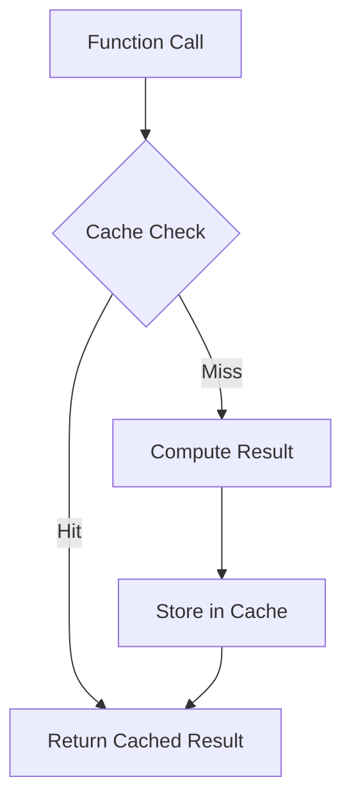

## 7.10 Memoization Techniques

Memoization is a powerful optimization technique used to improve the performance of programs by caching the results of expensive function calls and reusing them when the same inputs occur again. In Haskell, memoization can be particularly effective due to the language's support for lazy evaluation and its rich type system. This section will delve into the intricacies of memoization in Haskell, providing you with the tools and knowledge to implement it effectively in your applications.

### Understanding Memoization

**Concept**: Memoization involves storing the results of expensive function calls and returning the cached result when the same inputs are encountered again. This technique is especially useful for functions with overlapping subproblems, such as those found in dynamic programming.

**Benefits**:
- **Performance Improvement**: By avoiding redundant calculations, memoization can significantly reduce the time complexity of recursive functions.
- **Resource Efficiency**: Memoization can help in conserving computational resources by minimizing repeated evaluations.

**Challenges**:
- **Memory Usage**: Storing results can increase memory consumption, especially for functions with a large input space.
- **Cache Management**: Deciding when to cache and when to evict old entries can be complex.

### Memoization in Haskell

Haskell's lazy evaluation model makes it an ideal candidate for memoization. By default, Haskell evaluates expressions only when needed, which aligns well with the concept of caching results for future use.

#### Lazy Evaluation

Lazy evaluation is a strategy where expressions are not evaluated until their values are needed. This can be leveraged for memoization by ensuring that once a value is computed, it is stored and reused.

```haskell
-- Lazy Fibonacci sequence using infinite list
fibonacci :: [Integer]
fibonacci = 0 : 1 : zipWith (+) fibonacci (tail fibonacci)

-- Accessing the nth Fibonacci number
nthFibonacci :: Int -> Integer
nthFibonacci n = fibonacci !! n
```

In this example, the Fibonacci sequence is defined as an infinite list. Thanks to lazy evaluation, each Fibonacci number is computed only once and stored for future access.

#### Memoization Libraries

While lazy evaluation provides a basic form of memoization, Haskell also offers libraries like `MemoTrie` that provide more sophisticated memoization capabilities.

##### MemoTrie Library

`MemoTrie` is a Haskell library that provides a generic framework for memoizing functions. It uses tries (prefix trees) to store cached results, which can be particularly efficient for certain types of data.

To use `MemoTrie`, you need to install it first:

```bash
cabal update
cabal install MemoTrie
```

Here's an example of using `MemoTrie` to memoize a function:

```haskell
{-# LANGUAGE DeriveGeneric #-}

import Data.MemoTrie
import GHC.Generics (Generic)

-- Define a function to be memoized
expensiveFunction :: Int -> Int
expensiveFunction x = x * x  -- Example of an expensive computation

-- Memoize the function using MemoTrie
memoizedFunction :: Int -> Int
memoizedFunction = memo expensiveFunction

main :: IO ()
main = do
    print $ memoizedFunction 10  -- Computed and cached
    print $ memoizedFunction 10  -- Retrieved from cache
```

In this example, `expensiveFunction` is memoized using `MemoTrie`, allowing repeated calls with the same argument to be served from the cache.

### Implementing Memoization

#### Recursive Functions

Memoization is particularly useful for recursive functions, such as those used to compute Fibonacci numbers or solve combinatorial problems.

##### Fibonacci Sequence

The naive recursive implementation of the Fibonacci sequence is inefficient due to repeated calculations:

```haskell
-- Naive recursive Fibonacci
naiveFibonacci :: Int -> Integer
naiveFibonacci 0 = 0
naiveFibonacci 1 = 1
naiveFibonacci n = naiveFibonacci (n - 1) + naiveFibonacci (n - 2)
```

By memoizing the Fibonacci function, we can avoid redundant calculations:

```haskell
-- Memoized Fibonacci using a list
memoizedFibonacci :: Int -> Integer
memoizedFibonacci = (map fib [0 ..] !!)
  where
    fib 0 = 0
    fib 1 = 1
    fib n = memoizedFibonacci (n - 1) + memoizedFibonacci (n - 2)
```

In this implementation, the Fibonacci numbers are stored in a list, and each number is computed only once.

#### Using Data Structures

Memoization can also be implemented using data structures like arrays or maps to store cached results.

##### Using Arrays

Arrays provide a simple way to implement memoization for functions with integer inputs.

```haskell
import Data.Array

-- Memoized Fibonacci using an array
arrayFibonacci :: Int -> Integer
arrayFibonacci n = fibArray ! n
  where
    fibArray = array (0, n) [(i, fib i) | i <- [0..n]]
    fib 0 = 0
    fib 1 = 1
    fib i = fibArray ! (i - 1) + fibArray ! (i - 2)
```

In this example, an array is used to store Fibonacci numbers, allowing for efficient lookups.

##### Using Maps

Maps can be used for memoizing functions with non-integer inputs.

```haskell
import qualified Data.Map as Map

-- Memoized function using a map
memoizeWithMap :: (Ord a) => (a -> b) -> a -> b
memoizeWithMap f = let cache = Map.empty in \x -> Map.findWithDefault (f x) x cache
```

This function uses a map to store cached results, allowing for efficient retrieval.

### Design Considerations

When implementing memoization, consider the following:

- **Input Space**: Memoization is most effective when the input space is limited, allowing for efficient caching.
- **Memory Constraints**: Be mindful of memory usage, especially for functions with large input spaces.
- **Cache Eviction**: Implement strategies for evicting old cache entries to manage memory usage effectively.

### Haskell Unique Features

Haskell's lazy evaluation and strong type system make it uniquely suited for memoization. The ability to define infinite data structures and leverage libraries like `MemoTrie` provides powerful tools for optimizing performance.

### Differences and Similarities

Memoization is often confused with other caching techniques, but it is distinct in its focus on function calls. Unlike general caching, memoization specifically targets the reuse of function results.

### Try It Yourself

Experiment with the provided examples by modifying the functions or input values. Try implementing memoization for other recursive functions, such as factorial or combinatorial problems.

### Visualizing Memoization

To better understand how memoization works, consider the following diagram illustrating the process of caching function results:



This diagram shows the flow of a function call through the memoization process, highlighting the cache check and storage steps.

### Knowledge Check

- What is memoization, and how does it differ from other caching techniques?
- How does lazy evaluation in Haskell facilitate memoization?
- What are some common data structures used for implementing memoization?
- How can libraries like `MemoTrie` enhance memoization in Haskell?

### Embrace the Journey

Remember, memoization is just one of many optimization techniques available in Haskell. As you continue to explore functional programming, you'll discover new ways to enhance performance and efficiency. Keep experimenting, stay curious, and enjoy the journey!

## Quiz: Memoization Techniques



### What is the primary purpose of memoization?

- [x] To cache the results of expensive function calls
- [ ] To optimize memory usage
- [ ] To improve code readability
- [ ] To simplify function definitions

> **Explanation:** Memoization is used to cache the results of expensive function calls to avoid redundant calculations.

### How does lazy evaluation in Haskell support memoization?

- [x] By delaying computation until the result is needed
- [ ] By precomputing all possible results
- [ ] By storing all function calls in memory
- [ ] By simplifying function definitions

> **Explanation:** Lazy evaluation delays computation until the result is needed, which aligns well with caching results for reuse.

### Which library in Haskell is commonly used for memoization?

- [x] MemoTrie
- [ ] Data.List
- [ ] Control.Monad
- [ ] System.IO

> **Explanation:** `MemoTrie` is a library in Haskell that provides a framework for memoizing functions.

### What is a potential downside of memoization?

- [x] Increased memory usage
- [ ] Slower function execution
- [ ] Reduced code readability
- [ ] More complex function definitions

> **Explanation:** Memoization can increase memory usage due to storing cached results.

### Which data structure is NOT typically used for memoization?

- [ ] Arrays
- [ ] Maps
- [x] Linked Lists
- [ ] Tries

> **Explanation:** Linked lists are not typically used for memoization due to inefficient lookups.

### What is the role of a cache in memoization?

- [x] To store computed results for reuse
- [ ] To simplify function definitions
- [ ] To improve code readability
- [ ] To reduce memory usage

> **Explanation:** A cache stores computed results so they can be reused, avoiding redundant calculations.

### How can memoization improve the performance of recursive functions?

- [x] By avoiding redundant calculations
- [ ] By simplifying the recursion
- [ ] By reducing the number of recursive calls
- [ ] By increasing memory usage

> **Explanation:** Memoization avoids redundant calculations by caching results, improving performance.

### What is a trie in the context of memoization?

- [x] A data structure used to store cached results
- [ ] A type of recursive function
- [ ] A method of lazy evaluation
- [ ] A library for functional programming

> **Explanation:** A trie is a data structure used to efficiently store cached results in memoization.

### What is a key consideration when implementing memoization?

- [x] Managing memory usage
- [ ] Simplifying function definitions
- [ ] Improving code readability
- [ ] Reducing function calls

> **Explanation:** Managing memory usage is crucial when implementing memoization to avoid excessive memory consumption.

### True or False: Memoization is only useful for recursive functions.

- [ ] True
- [x] False

> **Explanation:** While memoization is particularly useful for recursive functions, it can be applied to any function with expensive computations and overlapping subproblems.


