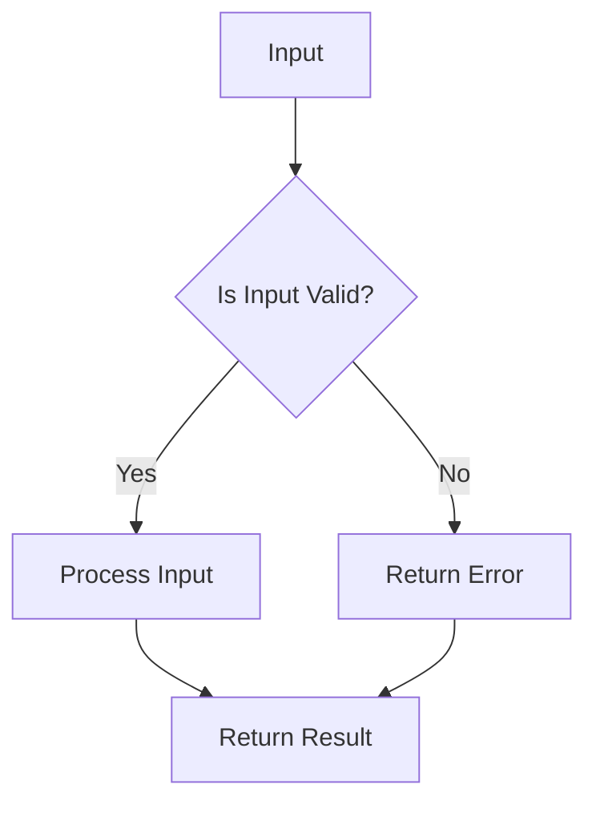

## 7.11 Partial Functions and Total Functions

In the realm of functional programming, particularly in Haskell, understanding the distinction between partial and total functions is crucial for building robust and reliable software systems. This section delves into these concepts, providing insights, examples, and best practices to help you master their application in Haskell.

### Introduction to Partial and Total Functions

#### Partial Functions

Partial functions are those that are not defined for all possible inputs of their domain. This means that for some inputs, a partial function may not return a result or may result in an error. In Haskell, common examples of partial functions include functions like `head`, `tail`, and `fromJust`, which can fail when applied to empty lists or `Nothing` values.

**Example of a Partial Function:**

```haskell
head :: [a] -> a
head (x:_) = x
head []    = error "Empty list"
```

In the example above, `head` is a partial function because it is not defined for an empty list.

#### Total Functions

Total functions, on the other hand, are defined for every possible input of their domain. They guarantee a result for any input, making them more reliable and predictable. Total functions are a hallmark of robust software design, as they eliminate runtime errors associated with undefined inputs.

**Example of a Total Function:**

```haskell
safeHead :: [a] -> Maybe a
safeHead (x:_) = Just x
safeHead []    = Nothing
```

Here, `safeHead` is a total function because it handles all possible inputs, including an empty list, by returning a `Maybe` type.

### Best Practices for Using Partial and Total Functions

#### Striving for Total Functions

1. **Reliability**: Total functions increase the reliability of your code by ensuring that all inputs are accounted for, reducing the risk of runtime errors.
2. **Predictability**: They make your code more predictable and easier to reason about, as they provide clear outcomes for all inputs.
3. **Maintainability**: Total functions improve maintainability by reducing the need for extensive error handling and debugging.

#### Implementing Total Functions

To convert partial functions into total functions, you can use types like `Maybe` or `Either` to handle potentially undefined cases. This approach allows you to explicitly represent the possibility of failure or absence of a value.

**Example: Safely Handling List Indexing**

```haskell
safeIndex :: [a] -> Int -> Maybe a
safeIndex xs i
  | i < 0 || i >= length xs = Nothing
  | otherwise               = Just (xs !! i)
```

In this example, `safeIndex` is a total function that safely handles list indexing by returning a `Maybe` type, which can be `Nothing` if the index is out of bounds.

### Code Examples and Exercises

Let's explore some code examples to solidify our understanding of partial and total functions.

#### Example 1: Converting a Partial Function to a Total Function

Consider the `fromJust` function, which is partial because it fails when given `Nothing`.

**Partial Function:**

```haskell
fromJust :: Maybe a -> a
fromJust (Just x) = x
fromJust Nothing  = error "Nothing"
```

**Total Function:**

```haskell
fromJustSafe :: Maybe a -> Either String a
fromJustSafe (Just x) = Right x
fromJustSafe Nothing  = Left "Nothing"
```

In the total version, `fromJustSafe` uses the `Either` type to handle the `Nothing` case explicitly.

#### Example 2: Handling Division Safely

Division by zero is a common source of partiality in functions. Let's create a total function for division.

**Partial Function:**

```haskell
divide :: Int -> Int -> Int
divide _ 0 = error "Division by zero"
divide x y = x `div` y
```

**Total Function:**

```haskell
safeDivide :: Int -> Int -> Either String Int
safeDivide _ 0 = Left "Division by zero"
safeDivide x y = Right (x `div` y)
```

The `safeDivide` function returns an `Either` type, providing a clear indication of failure when dividing by zero.

### Visualizing Partial and Total Functions

To better understand the concept of partial and total functions, let's visualize their behavior using a simple flowchart.



**Description:** This flowchart illustrates the decision-making process in a total function. It checks the validity of the input and either processes it or returns an error, ensuring that all inputs are handled.

### Haskell Unique Features

Haskell's strong static typing and type inference system make it particularly well-suited for implementing total functions. By leveraging types like `Maybe` and `Either`, you can explicitly represent the presence or absence of values, making your code more robust and expressive.

### Differences and Similarities

Partial and total functions are often confused with one another, but they serve distinct purposes. While partial functions can lead to runtime errors, total functions provide a safer and more predictable alternative. Understanding their differences is key to writing reliable Haskell code.

### Design Considerations

When designing functions in Haskell, consider the following:

- **Error Handling**: Use types like `Maybe` and `Either` to handle errors gracefully.
- **Type Safety**: Leverage Haskell's type system to enforce totality and prevent runtime errors.
- **Code Clarity**: Aim for clear and concise code by using total functions, which reduce the need for extensive error handling.

### Try It Yourself

Now that we've explored partial and total functions, try modifying the examples to handle different types of inputs or errors. Experiment with converting other partial functions into total functions using `Maybe` or `Either`.

### Knowledge Check

- What is the main difference between partial and total functions?
- How can you convert a partial function into a total function in Haskell?
- Why are total functions preferred in functional programming?

### Embrace the Journey

Remember, mastering partial and total functions is just the beginning of your journey in functional programming with Haskell. As you progress, you'll discover more advanced patterns and techniques that will further enhance your software engineering skills. Keep experimenting, stay curious, and enjoy the journey!

## Quiz: Partial Functions and Total Functions



### What is a partial function?

- [x] A function not defined for all possible inputs
- [ ] A function defined for all possible inputs
- [ ] A function that always returns a value
- [ ] A function that never returns a value

> **Explanation:** A partial function is not defined for all possible inputs, which can lead to runtime errors.

### What is a total function?

- [ ] A function not defined for all possible inputs
- [x] A function defined for all possible inputs
- [ ] A function that always returns a value
- [ ] A function that never returns a value

> **Explanation:** A total function is defined for all possible inputs, ensuring reliability and predictability.

### How can you convert a partial function to a total function in Haskell?

- [x] By using types like `Maybe` or `Either`
- [ ] By using the `error` function
- [ ] By ignoring invalid inputs
- [ ] By using recursion

> **Explanation:** Using types like `Maybe` or `Either` allows you to handle potentially undefined cases explicitly.

### Why are total functions preferred in functional programming?

- [x] They increase reliability and predictability
- [ ] They are easier to write
- [ ] They require less code
- [ ] They are faster

> **Explanation:** Total functions increase reliability and predictability by handling all possible inputs.

### Which of the following is an example of a total function?

- [x] `safeHead :: [a] -> Maybe a`
- [ ] `head :: [a] -> a`
- [ ] `fromJust :: Maybe a -> a`
- [ ] `tail :: [a] -> a`

> **Explanation:** `safeHead` is a total function because it handles all possible inputs, including an empty list.

### What does the `Either` type represent in Haskell?

- [x] A value that can be one of two types, often used for error handling
- [ ] A value that can be any type
- [ ] A value that is always `Nothing`
- [ ] A value that is always `Just`

> **Explanation:** The `Either` type represents a value that can be one of two types, commonly used for error handling.

### What is the purpose of the `Maybe` type in Haskell?

- [x] To represent a value that may or may not be present
- [ ] To represent a value that is always present
- [ ] To represent a value that is always absent
- [ ] To represent a value that is always an error

> **Explanation:** The `Maybe` type is used to represent a value that may or may not be present, providing a way to handle optional values.

### How does Haskell's type system help in implementing total functions?

- [x] By enforcing type safety and preventing runtime errors
- [ ] By allowing dynamic typing
- [ ] By ignoring type mismatches
- [ ] By using weak typing

> **Explanation:** Haskell's type system enforces type safety, preventing runtime errors and helping implement total functions.

### What is a common pitfall of using partial functions?

- [x] They can lead to runtime errors
- [ ] They are always slower
- [ ] They are always faster
- [ ] They require more code

> **Explanation:** Partial functions can lead to runtime errors because they are not defined for all possible inputs.

### True or False: Total functions eliminate the need for error handling.

- [ ] True
- [x] False

> **Explanation:** While total functions reduce the need for error handling by handling all inputs, they do not eliminate it entirely.


