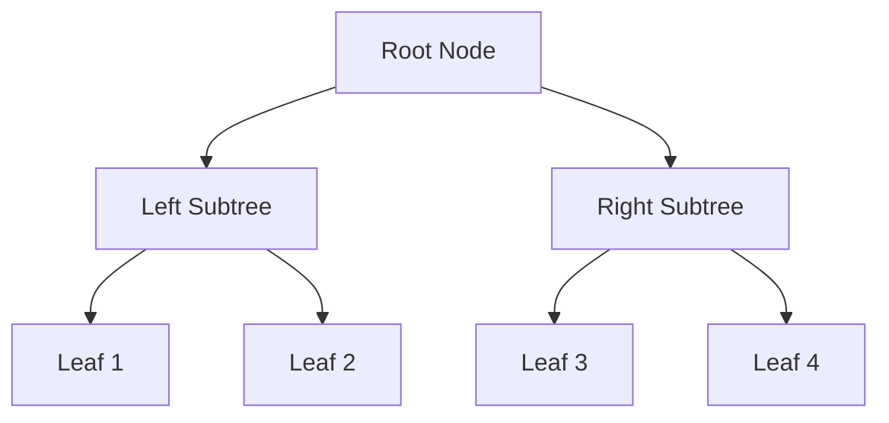
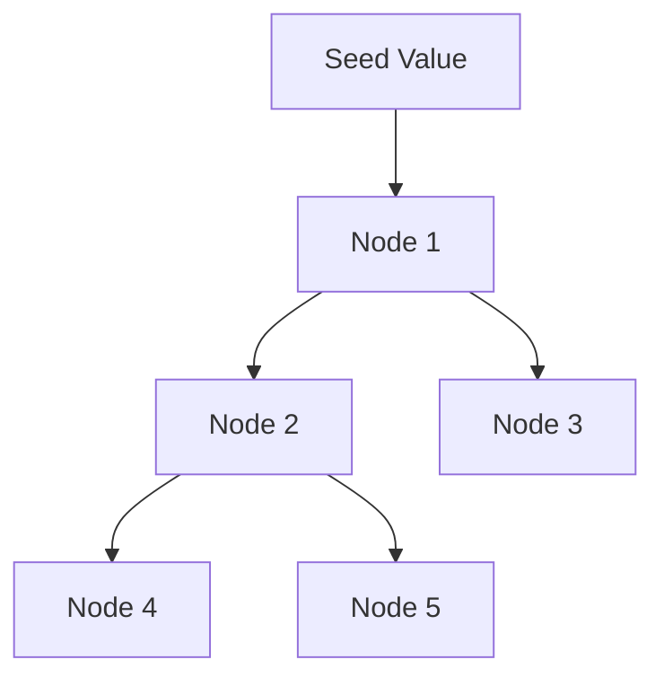

## 7.12 Recursion Schemes (Catamorphisms, Anamorphisms)

Recursion schemes are a powerful concept in functional programming, particularly in Haskell, that allow us to abstract common patterns of recursion. By understanding and utilizing recursion schemes, we can write more reusable, expressive, and maintainable code. In this section, we will delve into two fundamental recursion schemes: catamorphisms and anamorphisms. We will explore their concepts, implementations, and applications in processing complex data structures like syntax trees.

### Understanding Recursion Schemes

Recursion schemes provide a structured way to define recursive functions. They abstract the recursion pattern, allowing us to focus on the transformation logic rather than the recursion mechanics. This abstraction is particularly useful when dealing with complex data structures, as it promotes code reuse and reduces the likelihood of errors.

#### Key Concepts

- **Catamorphisms**: These are generalizations of folds. They allow us to deconstruct data structures in a systematic way.
- **Anamorphisms**: These are generalizations of unfolds. They enable us to construct data structures from a seed value.

By leveraging these concepts, we can handle a wide variety of recursive operations in a consistent and elegant manner.

### Catamorphisms: Generalizing Folds

Catamorphisms are a powerful tool for deconstructing data structures. They are essentially a fold operation that can be applied to any recursive data type. The idea is to replace the recursive structure with a single value, using a combining function.

#### Implementing Catamorphisms

To implement a catamorphism, we need to define a base functor for our data type and a folding function that specifies how to combine the elements.

```haskell
{-# LANGUAGE DeriveFunctor #-}

-- Define a base functor for a simple binary tree
data TreeF a r = LeafF a | NodeF r r
  deriving Functor

-- Define a fixed-point type
newtype Fix f = Fix { unFix :: f (Fix f) }

-- Define a catamorphism
cata :: Functor f => (f a -> a) -> Fix f -> a
cata alg = alg . fmap (cata alg) . unFix

-- Example: Sum of all elements in a binary tree
sumTree :: Fix (TreeF Int) -> Int
sumTree = cata alg
  where
    alg (LeafF n) = n
    alg (NodeF l r) = l + r
```

In this example, we define a binary tree using a base functor `TreeF`. The `cata` function is a generic catamorphism that takes an algebra (a function `f a -> a`) and applies it recursively to the fixed-point type `Fix f`.

#### Visualizing Catamorphisms

Let's visualize the process of applying a catamorphism to a binary tree:



In this diagram, the catamorphism traverses the tree from the leaves to the root, applying the algebra at each step to combine the values.

### Anamorphisms: Generalizing Unfolds

Anamorphisms are the dual of catamorphisms. They allow us to construct data structures from a seed value by repeatedly applying a function to generate the next level of the structure.

#### Implementing Anamorphisms

To implement an anamorphism, we define a coalgebra that specifies how to unfold a single step of the data structure.

```haskell
-- Define an anamorphism
ana :: Functor f => (a -> f a) -> a -> Fix f
ana coalg = Fix . fmap (ana coalg) . coalg

-- Example: Generate an infinite binary tree of natural numbers
natTree :: Int -> Fix (TreeF Int)
natTree = ana coalg
  where
    coalg n = NodeF (n + 1) (n + 2)
```

In this example, the `ana` function is a generic anamorphism that takes a coalgebra (a function `a -> f a`) and applies it recursively to generate a fixed-point type `Fix f`.

#### Visualizing Anamorphisms

The process of applying an anamorphism can be visualized as follows:



Here, the anamorphism starts with a seed value and unfolds the structure by applying the coalgebra at each step.

### Practical Applications

Recursion schemes are particularly useful in scenarios where we need to process or generate complex data structures. One common application is in the manipulation of syntax trees, such as those used in compilers or interpreters.

#### Example: Processing Syntax Trees

Consider a simple expression language with addition and multiplication:

```haskell
data ExprF r = ConstF Int | AddF r r | MulF r r
  deriving Functor

type Expr = Fix ExprF

-- Evaluate an expression
eval :: Expr -> Int
eval = cata alg
  where
    alg (ConstF n) = n
    alg (AddF x y) = x + y
    alg (MulF x y) = x * y

-- Generate an infinite expression tree
infiniteExpr :: Int -> Expr
infiniteExpr = ana coalg
  where
    coalg n = AddF (ConstF n) (ConstF (n + 1))
```

In this example, we define an expression language using a base functor `ExprF`. We then use a catamorphism to evaluate expressions and an anamorphism to generate an infinite expression tree.

### Design Considerations

When using recursion schemes, it's important to consider the following:

- **Performance**: Recursion schemes can introduce overhead due to the use of fixed-point types and functors. Profiling and optimization may be necessary for performance-critical applications.
- **Complexity**: While recursion schemes abstract recursion patterns, they can also introduce complexity. Ensure that the benefits of abstraction outweigh the added complexity.
- **Readability**: Recursion schemes can make code more expressive, but they may also be less familiar to developers who are not well-versed in functional programming.

### Haskell Unique Features

Haskell's strong type system and support for higher-order functions make it an ideal language for implementing recursion schemes. The use of fixed-point types and functors allows for elegant abstractions that are both powerful and expressive.

### Differences and Similarities

Recursion schemes like catamorphisms and anamorphisms are often compared to traditional folds and unfolds. While they share similarities, recursion schemes provide a more general and flexible approach that can be applied to a wider range of data structures.

### Try It Yourself

To deepen your understanding of recursion schemes, try modifying the examples provided:

- Implement a catamorphism to calculate the product of all elements in a binary tree.
- Create an anamorphism to generate a binary tree of Fibonacci numbers.
- Experiment with different data structures and algebras/coalgebras to see how recursion schemes can be applied.

### Knowledge Check

- What are the key differences between catamorphisms and anamorphisms?
- How can recursion schemes improve code reusability and expressiveness?
- What are some potential drawbacks of using recursion schemes?

### Embrace the Journey

Remember, mastering recursion schemes is just the beginning. As you continue to explore Haskell and functional programming, you'll discover even more powerful abstractions and techniques. Keep experimenting, stay curious, and enjoy the journey!

## Quiz: Recursion Schemes (Catamorphisms, Anamorphisms)



### What is a catamorphism in Haskell?

- [x] A generalization of folds
- [ ] A generalization of maps
- [ ] A generalization of filters
- [ ] A generalization of zips

> **Explanation:** A catamorphism is a generalization of folds, used to deconstruct data structures.

### What is an anamorphism in Haskell?

- [x] A generalization of unfolds
- [ ] A generalization of folds
- [ ] A generalization of maps
- [ ] A generalization of filters

> **Explanation:** An anamorphism is a generalization of unfolds, used to construct data structures.

### Which of the following is a key benefit of using recursion schemes?

- [x] Improved code reusability
- [ ] Reduced code readability
- [ ] Increased code complexity
- [ ] Decreased performance

> **Explanation:** Recursion schemes improve code reusability by abstracting common recursion patterns.

### What is the role of a base functor in recursion schemes?

- [x] It defines the structure of the data type
- [ ] It provides the recursion logic
- [ ] It optimizes performance
- [ ] It handles error checking

> **Explanation:** The base functor defines the structure of the data type, which is essential for recursion schemes.

### How does a catamorphism process a data structure?

- [x] From leaves to root
- [ ] From root to leaves
- [ ] In parallel
- [ ] Randomly

> **Explanation:** A catamorphism processes a data structure from the leaves to the root, applying the algebra at each step.

### How does an anamorphism generate a data structure?

- [x] From a seed value
- [ ] From a fixed value
- [ ] From a random value
- [ ] From a constant value

> **Explanation:** An anamorphism generates a data structure from a seed value, applying the coalgebra at each step.

### What is a fixed-point type in Haskell?

- [x] A type that represents recursive data structures
- [ ] A type that represents constant values
- [ ] A type that represents mutable data
- [ ] A type that represents error handling

> **Explanation:** A fixed-point type is used to represent recursive data structures in Haskell.

### What is the main challenge when using recursion schemes?

- [x] Potential performance overhead
- [ ] Lack of expressiveness
- [ ] Difficulty in defining base functors
- [ ] Incompatibility with Haskell's type system

> **Explanation:** Recursion schemes can introduce performance overhead due to the use of fixed-point types and functors.

### Can recursion schemes be applied to non-recursive data structures?

- [ ] True
- [x] False

> **Explanation:** Recursion schemes are specifically designed for recursive data structures.

### What is the dual of a catamorphism?

- [x] An anamorphism
- [ ] A homomorphism
- [ ] A polymorphism
- [ ] A monomorphism

> **Explanation:** An anamorphism is the dual of a catamorphism, used for constructing data structures.


