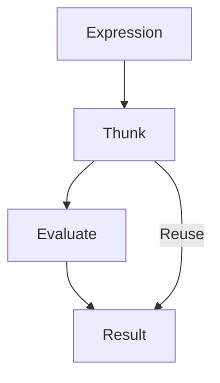

## 7.13 Lazy Evaluation Patterns

Lazy evaluation is a powerful feature of Haskell that allows computations to be deferred until their results are actually needed. This can lead to significant performance improvements, especially when dealing with large or infinite data structures. In this section, we will explore the concept of lazy evaluation, its benefits, and how to effectively use it in Haskell through various design patterns.

### Understanding Lazy Evaluation

Lazy evaluation, also known as call-by-need, is a strategy where expressions are not evaluated until their values are required. This contrasts with eager evaluation, where expressions are evaluated as soon as they are bound to a variable. Lazy evaluation can lead to more efficient programs by avoiding unnecessary computations and allowing the creation of infinite data structures.

#### Key Concepts

- **Deferred Computation**: Computations are postponed until their results are needed.
- **Thunks**: A deferred computation is represented as a thunk, which is a placeholder for the result of the computation.
- **Sharing**: Once a thunk is evaluated, its result is cached to avoid redundant computations.

### Benefits of Lazy Evaluation

1. **Efficiency**: By deferring computations, lazy evaluation can avoid unnecessary work, leading to more efficient programs.
2. **Modularity**: Lazy evaluation allows for more modular code, as functions can be composed without worrying about the order of evaluation.
3. **Infinite Data Structures**: Lazy evaluation enables the creation of infinite data structures, which can be processed incrementally.

### Patterns of Lazy Evaluation

#### Infinite Data Structures

One of the most compelling uses of lazy evaluation is the ability to define infinite data structures. These structures are only computed as needed, allowing you to work with potentially unbounded data in a finite manner.

**Example: Infinite List of Natural Numbers**

```haskell
naturals :: [Integer]
naturals = [0..]
```

In this example, `naturals` is an infinite list of natural numbers. Thanks to lazy evaluation, you can work with this list without computing all its elements upfront.

#### On-Demand Computation

Lazy evaluation allows computations to be performed on-demand. This is particularly useful in scenarios where only a subset of the data is needed.

**Example: Generating Prime Numbers**

```haskell
primes :: [Integer]
primes = sieve [2..]
  where
    sieve (p:xs) = p : sieve [x | x <- xs, x `mod` p /= 0]
```

In this example, the `primes` list is generated using the Sieve of Eratosthenes. The list is infinite, but only the required number of primes will be computed.

### Implementing Lazy Evaluation Patterns

#### Utilizing Haskell's Default Lazy Evaluation

Haskell's default evaluation strategy is lazy, which means you can leverage this feature without any additional effort. However, understanding how to effectively use lazy evaluation can help you write more efficient and expressive code.

**Example: Fibonacci Sequence**

```haskell
fibonacci :: [Integer]
fibonacci = 0 : 1 : zipWith (+) fibonacci (tail fibonacci)
```

This example demonstrates how to generate an infinite list of Fibonacci numbers using lazy evaluation. The `zipWith` function combines the list with its tail, creating the sequence incrementally.

### Design Considerations

When using lazy evaluation, it's important to be aware of potential pitfalls, such as space leaks. A space leak occurs when memory is consumed by unevaluated thunks that are never needed. To mitigate this, consider the following strategies:

- **Strictness Annotations**: Use strictness annotations to force evaluation when necessary.
- **Profiling**: Use profiling tools to identify and address space leaks.

### Haskell Unique Features

Haskell's lazy evaluation is a unique feature that distinguishes it from many other programming languages. This allows for elegant solutions to complex problems, such as infinite data structures and on-demand computation.

### Differences and Similarities

Lazy evaluation is often compared to memoization, where results of expensive function calls are cached. While both techniques aim to improve efficiency, lazy evaluation defers computation, whereas memoization stores results for reuse.

### Code Examples

Let's explore some additional code examples to further illustrate lazy evaluation patterns.

**Example: Lazy File Processing**

```haskell
import System.IO

processFile :: FilePath -> IO ()
processFile path = do
    contents <- readFile path
    let linesOfFile = lines contents
    mapM_ putStrLn (take 10 linesOfFile)
```

In this example, the file is read lazily, allowing you to process large files without loading them entirely into memory.

**Example: Lazy Evaluation with Data Structures**

```haskell
data Tree a = Leaf a | Node (Tree a) (Tree a)

infiniteTree :: Tree Integer
infiniteTree = go 0
  where
    go n = Node (Leaf n) (go (n + 1))
```

This example demonstrates how to create an infinite binary tree using lazy evaluation. The tree is only expanded as needed.

### Visualizing Lazy Evaluation

To better understand lazy evaluation, let's visualize the process of evaluating an expression lazily.



**Caption**: This diagram illustrates the process of lazy evaluation, where an expression is represented as a thunk, evaluated when needed, and the result is reused.

### Try It Yourself

To deepen your understanding of lazy evaluation, try modifying the code examples provided. Experiment with different infinite data structures or implement your own on-demand computations.

### Knowledge Check

- What is lazy evaluation, and how does it differ from eager evaluation?
- How can lazy evaluation lead to more efficient programs?
- What are some potential pitfalls of lazy evaluation, and how can they be mitigated?

### Embrace the Journey

Remember, mastering lazy evaluation is just the beginning. As you continue to explore Haskell, you'll discover even more powerful patterns and techniques. Keep experimenting, stay curious, and enjoy the journey!

### Quiz: Lazy Evaluation Patterns



### What is lazy evaluation?

- [x] A strategy where expressions are evaluated only when needed
- [ ] A strategy where expressions are evaluated immediately
- [ ] A strategy where expressions are never evaluated
- [ ] A strategy where expressions are evaluated in parallel

> **Explanation:** Lazy evaluation defers computation until the result is needed, which can improve efficiency and enable infinite data structures.

### Which of the following is an example of an infinite data structure in Haskell?

- [x] `naturals = [0..]`
- [ ] `fibonacci = [0, 1, 1, 2, 3, 5]`
- [ ] `primes = [2, 3, 5, 7]`
- [ ] `evens = [2, 4, 6, 8]`

> **Explanation:** The list `[0..]` represents an infinite list of natural numbers, made possible by lazy evaluation.

### How can lazy evaluation lead to space leaks?

- [x] By accumulating unevaluated thunks
- [ ] By evaluating expressions too early
- [ ] By caching results unnecessarily
- [ ] By using too much memory for evaluated expressions

> **Explanation:** Space leaks occur when unevaluated thunks accumulate, consuming memory without being needed.

### What is a thunk in the context of lazy evaluation?

- [x] A placeholder for a deferred computation
- [ ] A fully evaluated expression
- [ ] A type of data structure
- [ ] A function that is always evaluated eagerly

> **Explanation:** A thunk is a deferred computation that is evaluated only when its result is needed.

### Which function can be used to combine two lists in Haskell?

- [x] `zipWith`
- [ ] `concat`
- [ ] `map`
- [ ] `filter`

> **Explanation:** `zipWith` combines two lists element-wise using a specified function.

### How can you mitigate space leaks in Haskell?

- [x] Use strictness annotations
- [ ] Avoid using lazy evaluation
- [ ] Use more memory
- [ ] Increase the stack size

> **Explanation:** Strictness annotations can force evaluation, reducing the risk of space leaks.

### What is the primary benefit of lazy evaluation?

- [x] Efficiency through deferred computation
- [ ] Immediate computation of all expressions
- [ ] Increased memory usage
- [ ] Simplified syntax

> **Explanation:** Lazy evaluation improves efficiency by deferring computation until necessary.

### What is the difference between lazy evaluation and memoization?

- [x] Lazy evaluation defers computation; memoization caches results
- [ ] Lazy evaluation caches results; memoization defers computation
- [ ] Both defer computation
- [ ] Both cache results

> **Explanation:** Lazy evaluation defers computation, while memoization stores results for reuse.

### Which of the following is a potential pitfall of lazy evaluation?

- [x] Space leaks
- [ ] Immediate computation
- [ ] Reduced modularity
- [ ] Increased complexity

> **Explanation:** Space leaks can occur when unevaluated thunks accumulate, consuming memory.

### True or False: Lazy evaluation allows for the creation of infinite data structures.

- [x] True
- [ ] False

> **Explanation:** Lazy evaluation enables the creation of infinite data structures by deferring computation until needed.


