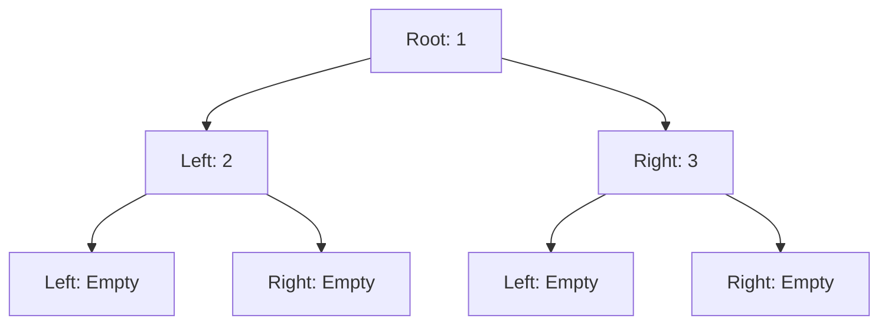

## 7.14 Functional Data Structures and Trees

Functional programming in Haskell offers a unique approach to data structures, emphasizing immutability and persistence. In this section, we delve into functional data structures and trees, exploring their implementation, benefits, and practical applications in Haskell.

### Introduction to Functional Data Structures

Functional data structures are designed to work seamlessly with the principles of functional programming. They are immutable, meaning that operations on these structures do not alter the original data but instead produce new versions. This immutability leads to **persistent data structures**, which preserve previous versions of themselves when modified.

#### Persistent Data Structures

Persistent data structures are a cornerstone of functional programming. They allow us to maintain multiple versions of a data structure efficiently, which is particularly useful in applications requiring undo functionality or version control.

- **Definition**: A data structure is persistent if it retains all previous versions of itself when it is modified.
- **Benefits**: 
  - **Immutability**: Ensures that data is not accidentally modified, leading to safer and more predictable code.
  - **Concurrency**: Multiple threads can access the same data structure without synchronization issues.
  - **Undo/Redo**: Easily implement undo and redo operations by reverting to previous versions.

### Common Functional Data Structures

Let's explore some common functional data structures, focusing on their characteristics and use cases.

#### Lists

Lists are a fundamental data structure in Haskell, providing a simple and flexible way to store sequences of elements.

- **Characteristics**:
  - **Immutable**: Lists in Haskell are immutable, meaning any operation that modifies a list returns a new list.
  - **Lazy Evaluation**: Haskell lists are evaluated lazily, allowing for efficient handling of infinite lists.

- **Operations**:
  - **Cons**: Adding an element to the front of a list.
  - **Append**: Combining two lists.
  - **Map/Filter**: Applying functions to each element or selecting elements based on a predicate.

```haskell
-- Example: Basic list operations
let list1 = [1, 2, 3]
let list2 = 4 : list1  -- Cons operation
let list3 = list1 ++ [4, 5]  -- Append operation
let list4 = map (*2) list1  -- Map operation
let list5 = filter even list1  -- Filter operation
```

#### Trees

Trees are hierarchical data structures that are particularly useful for representing data with a natural hierarchy, such as file systems or organizational charts.

- **Binary Trees**: Each node has at most two children, commonly used for search trees.
- **AVL Trees**: A type of self-balancing binary search tree.
- **Red-Black Trees**: Another self-balancing binary search tree with specific balancing rules.

##### Binary Trees

Binary trees are a simple yet powerful data structure, often used as the basis for more complex structures like binary search trees.

```haskell
-- Define a binary tree data structure
data Tree a = Empty | Node a (Tree a) (Tree a) deriving (Show, Eq)

-- Example: Creating a simple binary tree
let tree = Node 1 (Node 2 Empty Empty) (Node 3 Empty Empty)
```

##### AVL Trees

AVL trees maintain balance by ensuring that the heights of the two child subtrees of any node differ by no more than one.

```haskell
-- AVL Tree insertion example
insertAVL :: (Ord a) => a -> Tree a -> Tree a
insertAVL x Empty = Node x Empty Empty
insertAVL x (Node y left right)
  | x < y     = balance $ Node y (insertAVL x left) right
  | x > y     = balance $ Node y left (insertAVL x right)
  | otherwise = Node y left right

-- Balance function to maintain AVL property
balance :: Tree a -> Tree a
balance tree@(Node _ left right)
  | height left - height right > 1 = rotateRight tree
  | height right - height left > 1 = rotateLeft tree
  | otherwise = tree

-- Example: Balancing functions (rotateLeft, rotateRight) and height calculation
```

##### Red-Black Trees

Red-black trees are another type of self-balancing binary search tree, characterized by nodes colored red or black to ensure balance.

```haskell
-- Red-Black Tree example
data Color = Red | Black deriving (Show, Eq)
data RBTree a = RBEmpty | RBNode Color a (RBTree a) (RBTree a) deriving (Show, Eq)

-- Example: Insertion and balancing functions for red-black trees
```

### Implementation Techniques

Implementing functional data structures often involves advanced techniques to ensure efficiency and immutability.

#### Finger Trees

Finger trees are a versatile data structure that can be used to implement various abstract data types, such as sequences, priority queues, and deques.

- **Characteristics**:
  - **Amortized Constant Time**: Efficient access to both ends of the sequence.
  - **Versatility**: Can be adapted to support different operations efficiently.

```haskell
-- Example: Finger tree implementation
import Data.FingerTree

-- Define a simple sequence using finger trees
let seq = fromList [1, 2, 3, 4, 5] :: FingerTree Int

-- Access elements efficiently
let first = viewl seq
let last = viewr seq
```

### Practical Example: Functional Priority Queue

Let's implement a functional priority queue using a finger tree. A priority queue allows elements to be processed based on their priority rather than their insertion order.

```haskell
-- Priority queue using finger trees
import Data.FingerTree

-- Define a priority queue type
data PQueue a = PQueue (FingerTree (Priority a))

-- Define a priority type
data Priority a = Priority Int a deriving (Eq, Show)

instance Ord (Priority a) where
  compare (Priority p1 _) (Priority p2 _) = compare p1 p2

-- Insert an element into the priority queue
insertPQ :: Ord a => a -> PQueue a -> PQueue a
insertPQ x (PQueue ft) = PQueue (insert (Priority (priority x) x) ft)

-- Extract the element with the highest priority
extractMax :: Ord a => PQueue a -> (a, PQueue a)
extractMax (PQueue ft) = let (Priority _ x, ft') = viewr ft in (x, PQueue ft')

-- Example usage
let pq = insertPQ 5 (insertPQ 3 (insertPQ 10 (PQueue empty)))
let (maxElem, pq') = extractMax pq
```

### Design Considerations

When designing functional data structures, consider the following:

- **Efficiency**: Ensure that operations are efficient, especially for large data sets.
- **Immutability**: Maintain immutability to leverage the benefits of functional programming.
- **Concurrency**: Design data structures that can be safely used in concurrent environments.

### Haskell Unique Features

Haskell's lazy evaluation and strong type system provide unique advantages for implementing functional data structures:

- **Lazy Evaluation**: Allows for efficient handling of potentially infinite data structures.
- **Type System**: Ensures correctness and safety, reducing runtime errors.

### Differences and Similarities

Functional data structures in Haskell differ from their imperative counterparts in several ways:

- **Immutability vs. Mutability**: Functional structures are immutable, while imperative ones are often mutable.
- **Persistence**: Functional structures are inherently persistent, preserving previous versions.

### Visualizing Functional Trees

To better understand the structure and operations of functional trees, let's visualize a simple binary tree.



**Diagram Description**: This diagram represents a simple binary tree with a root node containing the value 1, a left child with the value 2, and a right child with the value 3. The leaf nodes are empty.

### Try It Yourself

Experiment with the code examples provided in this section. Try modifying the priority queue implementation to support different priority schemes or add additional operations to the binary tree.

### Knowledge Check

- What are the benefits of using persistent data structures?
- How do finger trees improve the efficiency of certain operations?
- What are the key differences between AVL trees and red-black trees?

### Embrace the Journey

Remember, mastering functional data structures in Haskell is a journey. As you explore these concepts, you'll gain a deeper understanding of functional programming and its powerful capabilities. Keep experimenting, stay curious, and enjoy the process!

## Quiz: Functional Data Structures and Trees



### What is a key characteristic of functional data structures?

- [x] Immutability
- [ ] Mutability
- [ ] Dynamic typing
- [ ] Weak typing

> **Explanation:** Functional data structures are immutable, meaning they do not change after they are created.

### What is a benefit of persistent data structures?

- [x] They preserve previous versions of themselves.
- [ ] They are always faster than mutable structures.
- [ ] They require less memory.
- [ ] They are easier to implement.

> **Explanation:** Persistent data structures retain all previous versions, which is useful for undo functionality and concurrency.

### Which data structure is commonly used for implementing sequences in Haskell?

- [x] Finger trees
- [ ] Linked lists
- [ ] Arrays
- [ ] Hash tables

> **Explanation:** Finger trees are versatile and efficient for implementing sequences in functional programming.

### What is the primary advantage of lazy evaluation in Haskell?

- [x] It allows for efficient handling of infinite data structures.
- [ ] It makes code run faster.
- [ ] It simplifies syntax.
- [ ] It reduces memory usage.

> **Explanation:** Lazy evaluation allows Haskell to handle potentially infinite data structures efficiently.

### Which tree structure ensures that the heights of the two child subtrees of any node differ by no more than one?

- [x] AVL Trees
- [ ] Red-Black Trees
- [ ] Binary Trees
- [ ] B-Trees

> **Explanation:** AVL trees maintain balance by ensuring the heights of child subtrees differ by no more than one.

### What is a key difference between AVL trees and red-black trees?

- [x] AVL trees are more strictly balanced than red-black trees.
- [ ] Red-black trees are more strictly balanced than AVL trees.
- [ ] AVL trees use colors to maintain balance.
- [ ] Red-black trees use rotations to maintain balance.

> **Explanation:** AVL trees are more strictly balanced, which can lead to more rotations during insertion and deletion.

### What is a common use case for persistent data structures?

- [x] Implementing undo functionality
- [ ] Reducing memory usage
- [ ] Simplifying algorithms
- [ ] Improving network performance

> **Explanation:** Persistent data structures are ideal for implementing undo functionality due to their ability to retain previous versions.

### How do finger trees achieve efficient access to both ends of a sequence?

- [x] By using amortized constant time operations
- [ ] By using linked lists
- [ ] By using arrays
- [ ] By using hash tables

> **Explanation:** Finger trees provide efficient access to both ends of a sequence through amortized constant time operations.

### What is a characteristic of binary trees?

- [x] Each node has at most two children.
- [ ] Each node has at most three children.
- [ ] Each node has an arbitrary number of children.
- [ ] Each node has exactly two children.

> **Explanation:** Binary trees are characterized by each node having at most two children.

### True or False: Functional data structures in Haskell are mutable.

- [ ] True
- [x] False

> **Explanation:** Functional data structures in Haskell are immutable, meaning they do not change after they are created.


