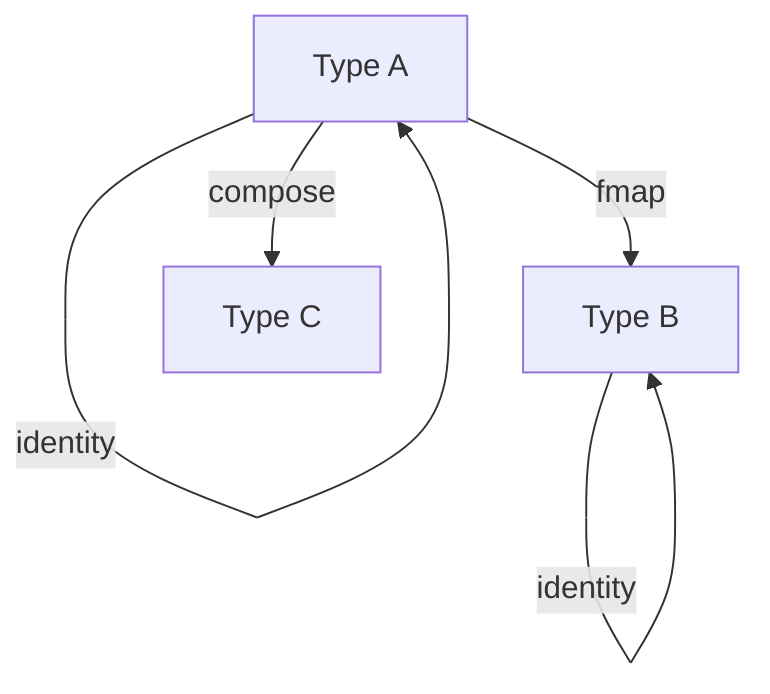
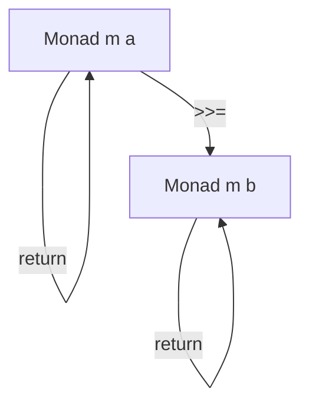

## 7.15 Category Theory Concepts in Haskell

### Overview

Category theory is a branch of mathematics that provides a high-level, abstract framework for understanding and structuring mathematical concepts. In the realm of functional programming, particularly in Haskell, category theory offers a powerful lens through which we can view and design our code. By understanding category theory, we gain deeper insights into the abstractions that Haskell provides, such as functors, monads, and natural transformations. This section will explore these concepts, demonstrating their relevance and application in Haskell programming.

### Concepts

#### 1. Categories

In category theory, a **category** consists of objects and morphisms (arrows) between these objects. The key properties of a category are:

- **Identity**: For every object, there exists an identity morphism that acts as a neutral element.
- **Composition**: Morphisms can be composed, and this composition is associative.

In Haskell, types can be seen as objects, and functions as morphisms. The identity morphism corresponds to the identity function, and function composition is the composition of morphisms.

```haskell
-- Identity function
identity :: a -> a
identity x = x

-- Function composition
compose :: (b -> c) -> (a -> b) -> (a -> c)
compose f g x = f (g x)
```

#### 2. Functors

A **functor** is a mapping between categories that preserves the structure of categories. In Haskell, a functor is a type class that applies a function over a wrapped value.

```haskell
class Functor f where
  fmap :: (a -> b) -> f a -> f b
```

The `fmap` function applies a function to the value inside a context (like a list or a `Maybe`), preserving the structure of the context.

```haskell
-- Example of Functor instance for Maybe
instance Functor Maybe where
  fmap _ Nothing  = Nothing
  fmap f (Just x) = Just (f x)

-- Usage
increment :: Maybe Int -> Maybe Int
increment = fmap (+1)

-- Try It Yourself: Modify the function to decrement instead of increment.
```

#### 3. Natural Transformations

A **natural transformation** is a way of transforming one functor into another while respecting the structure of the categories involved. In Haskell, a natural transformation is a polymorphic function between two functors.

```haskell
-- Natural transformation between two functors
transform :: (Functor f, Functor g) => f a -> g a
```

#### 4. Monoids

A **monoid** is an algebraic structure with a single associative binary operation and an identity element. In Haskell, the `Monoid` type class captures this concept.

```haskell
class Monoid m where
  mempty  :: m
  mappend :: m -> m -> m

-- Example: List as a Monoid
instance Monoid [a] where
  mempty  = []
  mappend = (++)
```

Monoids are useful for combining values in a structured way, such as concatenating lists or summing numbers.

#### 5. Monads

A **monad** is a design pattern used to handle computations defined as sequences of steps. It is a type class in Haskell that extends the concept of functors.

```haskell
class Monad m where
  return :: a -> m a
  (>>=)  :: m a -> (a -> m b) -> m b
```

Monads provide a way to chain operations together, handling context (such as state or I/O) in a clean and composable manner.

```haskell
-- Example of Monad instance for Maybe
instance Monad Maybe where
  return = Just
  Nothing >>= _ = Nothing
  Just x  >>= f = f x

-- Usage
safeDivide :: Double -> Double -> Maybe Double
safeDivide _ 0 = Nothing
safeDivide x y = Just (x / y)

-- Try It Yourself: Implement a function that uses safeDivide in a monadic context.
```

### Benefits

Understanding category theory concepts in Haskell allows developers to:

- **Gain deeper insights** into code structure and relationships.
- **Leverage powerful abstractions** to write more concise and expressive code.
- **Compose complex operations** using simple, reusable building blocks.

### Visualizing Category Theory Concepts

To better understand these concepts, let's visualize them using Mermaid.js diagrams.

#### Functors and Morphisms



**Diagram Description**: This diagram illustrates the concept of functors and morphisms in Haskell. It shows how a functor maps between types while preserving identity and composition.

#### Monads and Bind Operation



**Diagram Description**: This diagram represents the monadic bind operation, demonstrating how monads chain computations while maintaining context.

### Further Reading

For those interested in delving deeper into category theory and its application in programming, consider reading "Category Theory for Programmers" by Bartosz Milewski. This book provides an accessible introduction to category theory concepts and their relevance to software development.

### Knowledge Check

To reinforce your understanding of category theory concepts in Haskell, consider the following questions and exercises:

- **What is the role of identity and composition in categories?**
- **How does the `fmap` function relate to functors?**
- **Explain the significance of natural transformations in Haskell.**
- **Provide an example of a monoid in Haskell.**
- **Describe how monads facilitate chaining operations.**

### Embrace the Journey

Remember, mastering category theory concepts in Haskell is a journey. As you progress, you'll gain a deeper appreciation for the elegance and power of functional programming. Keep experimenting, stay curious, and enjoy the journey!

## Quiz: Category Theory Concepts in Haskell



### What is a functor in Haskell?

- [x] A type class that applies a function over a wrapped value
- [ ] A type class that represents a sequence of computations
- [ ] A type class that combines values using a binary operation
- [ ] A type class that transforms one functor into another

> **Explanation:** A functor in Haskell is a type class that allows you to apply a function over a value wrapped in a context, such as a list or a `Maybe`.

### What is the purpose of the `fmap` function?

- [x] To apply a function to a value inside a context
- [ ] To compose two functions
- [ ] To return a value wrapped in a context
- [ ] To chain computations together

> **Explanation:** The `fmap` function is used to apply a function to a value inside a context, preserving the structure of the context.

### What is a monoid in Haskell?

- [x] An algebraic structure with an associative binary operation and an identity element
- [ ] A type class that represents a sequence of computations
- [ ] A type class that applies a function over a wrapped value
- [ ] A type class that transforms one functor into another

> **Explanation:** A monoid in Haskell is an algebraic structure that includes an associative binary operation and an identity element, useful for combining values.

### How do monads facilitate chaining operations?

- [x] By providing a way to chain operations while handling context
- [ ] By applying a function to a value inside a context
- [ ] By composing two functions
- [ ] By transforming one functor into another

> **Explanation:** Monads facilitate chaining operations by allowing computations to be sequenced while managing context, such as state or I/O.

### What is a natural transformation in Haskell?

- [x] A polymorphic function between two functors
- [ ] A type class that applies a function over a wrapped value
- [ ] An algebraic structure with an associative binary operation
- [ ] A type class that represents a sequence of computations

> **Explanation:** A natural transformation in Haskell is a polymorphic function that maps between two functors, preserving the structure of the categories involved.

### What is the identity function in Haskell?

- [x] A function that returns its input unchanged
- [ ] A function that applies a function to a value inside a context
- [ ] A function that combines values using a binary operation
- [ ] A function that transforms one functor into another

> **Explanation:** The identity function in Haskell is a function that returns its input unchanged, serving as the identity morphism in category theory.

### What is the role of composition in categories?

- [x] To combine morphisms in an associative manner
- [ ] To apply a function to a value inside a context
- [ ] To return a value wrapped in a context
- [ ] To transform one functor into another

> **Explanation:** Composition in categories allows morphisms to be combined in an associative manner, maintaining the structure of the category.

### What is the `return` function in a monad?

- [x] A function that wraps a value in a monadic context
- [ ] A function that applies a function to a value inside a context
- [ ] A function that combines values using a binary operation
- [ ] A function that transforms one functor into another

> **Explanation:** The `return` function in a monad wraps a value in a monadic context, serving as the identity element for monadic operations.

### How does the `>>=` operator work in a monad?

- [x] It chains computations together while handling context
- [ ] It applies a function to a value inside a context
- [ ] It combines values using a binary operation
- [ ] It transforms one functor into another

> **Explanation:** The `>>=` operator in a monad chains computations together, allowing the result of one computation to be passed to the next while managing context.

### True or False: Functors, monads, and monoids are unrelated concepts in Haskell.

- [ ] True
- [x] False

> **Explanation:** False. Functors, monads, and monoids are related concepts in Haskell, each providing different levels of abstraction for handling computations and data structures.


