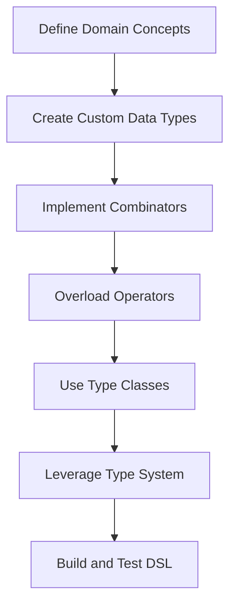

## 7.16 Designing Domain-Specific Languages (DSLs)

Designing Domain-Specific Languages (DSLs) is a powerful technique in software engineering, allowing developers to create languages tailored to specific problem domains. In Haskell, the process of designing DSLs is particularly elegant and expressive, thanks to its rich type system, higher-order functions, and syntactic flexibility. In this section, we will explore the concepts, techniques, and practical examples of designing DSLs in Haskell.

### Understanding Domain-Specific Languages (DSLs)

**DSL Concept**: A Domain-Specific Language (DSL) is a specialized language designed to solve problems within a specific domain. Unlike general-purpose languages, DSLs are tailored to provide concise and expressive syntax for domain-specific tasks.

**Types of DSLs**:
- **Internal DSLs**: Embedded within a host language, leveraging its syntax and semantics.
- **External DSLs**: Standalone languages with their own syntax and parsers.

**Benefits of DSLs**:
- **Expressiveness**: DSLs allow domain experts to express solutions in a language that closely resembles the problem domain.
- **Conciseness**: DSLs reduce boilerplate code, focusing on the essential aspects of the problem.
- **Maintainability**: DSLs can improve code readability and maintainability by abstracting complex logic.

### Implementing DSLs in Haskell

Haskell is an excellent choice for implementing DSLs due to its powerful type system, higher-order functions, and syntactic flexibility. Let's explore how to create embedded DSLs using Haskell's features.

#### Embedded DSLs in Haskell

**Embedded DSLs**: These are DSLs implemented within a host language, using its syntax and semantics. Haskell's expressive syntax and type system make it ideal for creating embedded DSLs.

**Key Techniques**:
- **Combinators**: Functions that combine smaller components into larger ones, often used to build complex expressions.
- **Custom Data Types**: Define data types that represent domain-specific concepts.
- **Operators**: Overload operators to create a more natural syntax for the DSL.

#### Example: A DSL for Querying Databases

Let's create a simple DSL for querying databases. This DSL will allow users to construct SQL-like queries using Haskell's syntax.

```haskell
-- Define a data type for SQL queries
data Query = Select [String] Table [Condition]

-- Define a data type for tables
data Table = Table String

-- Define a data type for conditions
data Condition = Equals String String
               | And Condition Condition
               | Or Condition Condition

-- Define a function to construct a SELECT query
select :: [String] -> Table -> [Condition] -> Query
select fields table conditions = Select fields table conditions

-- Define a function to represent a table
from :: String -> Table
from tableName = Table tableName

-- Define functions for conditions
equals :: String -> String -> Condition
equals field value = Equals field value

andCond :: Condition -> Condition -> Condition
andCond cond1 cond2 = And cond1 cond2

orCond :: Condition -> Condition -> Condition
orCond cond1 cond2 = Or cond1 cond2

-- Example usage
exampleQuery :: Query
exampleQuery = select ["name", "age"] (from "users") [equals "age" "30", andCond (equals "country" "USA") (equals "status" "active")]
```

In this example, we define a simple DSL for constructing SQL-like queries. The `Query` data type represents a SQL query, and we use combinators like `select`, `from`, `equals`, `andCond`, and `orCond` to construct queries.

### Techniques for Designing DSLs in Haskell

Designing DSLs in Haskell involves several techniques that leverage its functional programming paradigms and type system.

#### Using Combinators

**Combinators**: Functions that combine smaller components into larger ones. They are a fundamental technique in designing DSLs, allowing the composition of complex expressions from simpler ones.

**Example**: In the database query DSL, `select`, `from`, `equals`, `andCond`, and `orCond` are combinators that build a query from individual components.

#### Custom Data Types

**Custom Data Types**: Define data types that represent domain-specific concepts. These types form the building blocks of the DSL, encapsulating the domain's semantics.

**Example**: In the query DSL, `Query`, `Table`, and `Condition` are custom data types representing SQL queries, tables, and conditions.

#### Overloading Operators

**Operators**: Overloading operators can create a more natural syntax for the DSL, making it more expressive and concise.

**Example**: We could overload the `&&` and `||` operators to represent `andCond` and `orCond` conditions in the query DSL.

```haskell
-- Overload operators for conditions
infixr 3 &&&
(&&&) :: Condition -> Condition -> Condition
(&&&) = andCond

infixr 2 |||
(|||) :: Condition -> Condition -> Condition
(|||) = orCond

-- Example usage with overloaded operators
exampleQueryWithOperators :: Query
exampleQueryWithOperators = select ["name", "age"] (from "users") [equals "age" "30" &&& equals "country" "USA" ||| equals "status" "active"]
```

### Advanced Techniques in DSL Design

As we delve deeper into DSL design, we can explore advanced techniques that enhance the expressiveness and functionality of DSLs in Haskell.

#### Using Type Classes

**Type Classes**: Define type classes to provide polymorphic behavior in the DSL. This allows the DSL to operate on different types while maintaining a consistent interface.

**Example**: We can define a type class for serializing queries to SQL strings.

```haskell
-- Define a type class for serializing queries
class ToSQL a where
  toSQL :: a -> String

-- Implement the ToSQL type class for Query
instance ToSQL Query where
  toSQL (Select fields (Table tableName) conditions) =
    "SELECT " ++ unwords fields ++ " FROM " ++ tableName ++ " WHERE " ++ toSQL conditions

-- Implement the ToSQL type class for Condition
instance ToSQL Condition where
  toSQL (Equals field value) = field ++ " = '" ++ value ++ "'"
  toSQL (And cond1 cond2) = "(" ++ toSQL cond1 ++ " AND " ++ toSQL cond2 ++ ")"
  toSQL (Or cond1 cond2) = "(" ++ toSQL cond1 ++ " OR " ++ toSQL cond2 ++ ")"

-- Example usage
sqlString :: String
sqlString = toSQL exampleQueryWithOperators
```

#### Leveraging Haskell's Type System

Haskell's type system is a powerful tool for ensuring correctness and expressiveness in DSLs. By leveraging advanced type system features, we can create DSLs that are both safe and expressive.

**Phantom Types**: Use phantom types to encode additional information in the type system without affecting runtime behavior. This can be useful for enforcing constraints or representing different states in the DSL.

```haskell
-- Define a phantom type for query states
data QueryState = Initial | WithFields | WithTable | WithConditions

-- Define a data type for queries with a phantom type
data Query' s = Query' [String] Table [Condition]

-- Define functions that transition between query states
select' :: [String] -> Query' Initial
select' fields = Query' fields (Table "") []

from' :: Query' Initial -> String -> Query' WithTable
from' (Query' fields _ conditions) tableName = Query' fields (Table tableName) conditions

where' :: Query' WithTable -> [Condition] -> Query' WithConditions
where' (Query' fields table _) conditions = Query' fields table conditions

-- Example usage with phantom types
exampleQueryWithPhantom :: Query' WithConditions
exampleQueryWithPhantom = where' (from' (select' ["name", "age"]) "users") [equals "age" "30" &&& equals "country" "USA"]
```

### Visualizing DSL Design in Haskell

To better understand the flow and structure of DSL design in Haskell, let's visualize the process using a flowchart.



**Diagram Description**: This flowchart illustrates the process of designing a DSL in Haskell. We start by defining domain concepts, then create custom data types, implement combinators, overload operators, use type classes, leverage the type system, and finally build and test the DSL.

### Practical Considerations in DSL Design

When designing DSLs in Haskell, consider the following practical aspects:

- **Domain Understanding**: Gain a deep understanding of the problem domain to design a DSL that effectively addresses its needs.
- **User Experience**: Design the DSL with the end-user in mind, ensuring it is intuitive and easy to use.
- **Performance**: Consider the performance implications of the DSL, especially if it will be used in performance-critical applications.
- **Maintainability**: Ensure the DSL is maintainable and extensible, allowing for future enhancements and modifications.

### Haskell Unique Features in DSL Design

Haskell offers unique features that make it particularly well-suited for DSL design:

- **Lazy Evaluation**: Haskell's lazy evaluation allows for efficient handling of large data structures and deferred computations in DSLs.
- **Strong Static Typing**: The strong static typing in Haskell ensures type safety and correctness in DSLs, reducing runtime errors.
- **Higher-Order Functions**: Haskell's support for higher-order functions enables powerful abstractions and composability in DSLs.

### Differences and Similarities with Other Patterns

DSLs can be confused with other design patterns, such as:

- **Fluent Interfaces**: Both DSLs and fluent interfaces aim for readability and expressiveness, but DSLs are more focused on domain-specific tasks.
- **Builder Pattern**: The builder pattern constructs complex objects step-by-step, similar to how DSLs build complex expressions, but DSLs are more domain-focused.

### Try It Yourself: Experimenting with DSLs

Now that we've explored the concepts and techniques of designing DSLs in Haskell, let's encourage you to experiment with the examples provided. Try modifying the query DSL to support additional SQL features, such as `JOIN` operations or `ORDER BY` clauses. Experiment with different combinators and operators to enhance the expressiveness of the DSL.

### Summary

Designing Domain-Specific Languages (DSLs) in Haskell is a powerful technique for creating expressive and efficient solutions tailored to specific domains. By leveraging Haskell's rich type system, higher-order functions, and syntactic flexibility, we can create DSLs that are both expressive and safe. Remember, this is just the beginning. As you progress, you'll build more complex and interactive DSLs. Keep experimenting, stay curious, and enjoy the journey!

## Quiz: Designing Domain-Specific Languages (DSLs)



### What is a Domain-Specific Language (DSL)?

- [x] A specialized language designed to solve problems within a specific domain.
- [ ] A general-purpose language used for all types of programming.
- [ ] A language used exclusively for web development.
- [ ] A language that cannot be embedded within another language.

> **Explanation:** A DSL is a specialized language tailored to solve problems in a specific domain, unlike general-purpose languages.

### What is an embedded DSL?

- [x] A DSL implemented within a host language using its syntax and semantics.
- [ ] A standalone language with its own syntax and parsers.
- [ ] A language used for embedding multimedia content.
- [ ] A language that cannot be used in Haskell.

> **Explanation:** An embedded DSL is implemented within a host language, leveraging its syntax and semantics, as opposed to being standalone.

### Which Haskell feature is particularly useful for creating DSLs?

- [x] Higher-order functions
- [ ] Dynamic typing
- [ ] Imperative loops
- [ ] Global variables

> **Explanation:** Higher-order functions in Haskell allow for powerful abstractions and composability, making them useful for creating DSLs.

### What is a combinator in the context of DSLs?

- [x] A function that combines smaller components into larger ones.
- [ ] A data type that represents domain-specific concepts.
- [ ] An operator used for arithmetic operations.
- [ ] A type class for polymorphic behavior.

> **Explanation:** Combinators are functions that combine smaller components into larger ones, essential for building complex expressions in DSLs.

### How can Haskell's type system enhance DSL design?

- [x] By ensuring type safety and correctness.
- [ ] By allowing runtime type errors.
- [ ] By supporting dynamic typing.
- [ ] By enabling global state management.

> **Explanation:** Haskell's strong static typing ensures type safety and correctness, reducing runtime errors in DSLs.

### What is the purpose of overloading operators in a DSL?

- [x] To create a more natural and expressive syntax.
- [ ] To perform arithmetic operations.
- [ ] To manage memory allocation.
- [ ] To handle exceptions.

> **Explanation:** Overloading operators in a DSL creates a more natural and expressive syntax, enhancing readability and usability.

### What is a phantom type in Haskell?

- [x] A type that encodes additional information without affecting runtime behavior.
- [ ] A type that is visible at runtime.
- [ ] A type used for memory management.
- [ ] A type that cannot be used in DSLs.

> **Explanation:** Phantom types encode additional information in the type system without affecting runtime behavior, useful for enforcing constraints in DSLs.

### What is the benefit of using type classes in DSLs?

- [x] To provide polymorphic behavior and a consistent interface.
- [ ] To manage memory allocation.
- [ ] To handle exceptions.
- [ ] To perform arithmetic operations.

> **Explanation:** Type classes provide polymorphic behavior and a consistent interface, allowing DSLs to operate on different types.

### Which of the following is NOT a benefit of DSLs?

- [ ] Expressiveness
- [ ] Conciseness
- [ ] Maintainability
- [x] Increased complexity

> **Explanation:** DSLs aim to reduce complexity by providing expressiveness, conciseness, and maintainability, not increase it.

### True or False: DSLs can only be implemented as external languages.

- [ ] True
- [x] False

> **Explanation:** DSLs can be implemented as both internal (embedded) and external languages, depending on the use case and requirements.


