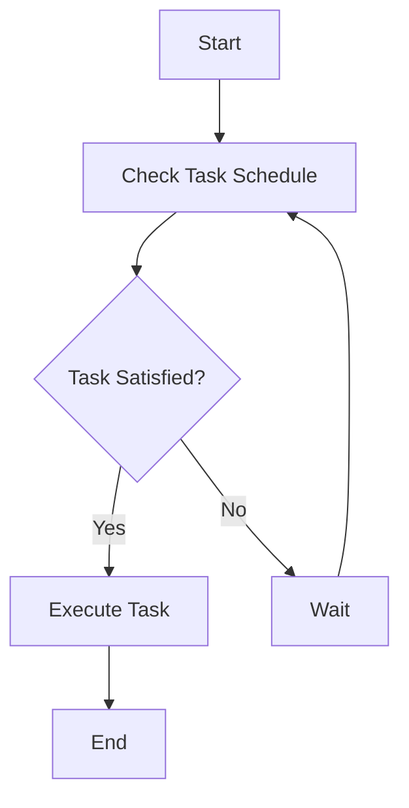

## 7.17 Time Handling and Temporal Logic Patterns

In the realm of software development, handling time and reasoning about temporal events are crucial for building applications that interact with real-world processes. In Haskell, a functional programming language known for its strong type system and expressive syntax, time handling and temporal logic patterns can be elegantly implemented. This section delves into the intricacies of managing time-based data and events, as well as reasoning about sequences of events using temporal logic. We will explore the use of Haskell libraries such as `time` and `clock`, and demonstrate how these patterns can be applied in practical scenarios like task scheduling and time-based simulations.

### Understanding Time Handling in Haskell

Time handling involves working with dates, times, durations, and time zones. In Haskell, the `time` library provides a comprehensive suite of tools for manipulating time-related data. Let's explore some key concepts and techniques for effective time handling in Haskell.

#### Key Concepts in Time Handling

1. **Time Representation**: 
   - **UTCTime**: Represents Coordinated Universal Time (UTC), a standard time format.
   - **ZonedTime**: Combines a `UTCTime` with a time zone, allowing for local time representation.
   - **NominalDiffTime**: Represents a difference between two `UTCTime` values, useful for durations.

2. **Time Zones**:
   - Handling time zones is crucial for applications that operate across different regions. The `timezone-series` library can be used to manage time zones effectively.

3. **Date and Time Arithmetic**:
   - Perform arithmetic operations on dates and times, such as adding or subtracting durations.

4. **Formatting and Parsing**:
   - Convert between time representations and human-readable strings using formatting and parsing functions.

#### Implementing Time Handling with Haskell Libraries

To handle time effectively in Haskell, we can leverage libraries like `time` and `clock`. Let's look at some examples to illustrate their usage.

```haskell
import Data.Time

-- Get the current time in UTC
getCurrentTimeExample :: IO UTCTime
getCurrentTimeExample = getCurrentTime

-- Add one day to the current time
addOneDay :: UTCTime -> UTCTime
addOneDay currentTime = addUTCTime (nominalDay) currentTime

-- Format a UTCTime to a string
formatTimeExample :: UTCTime -> String
formatTimeExample time = formatTime defaultTimeLocale "%Y-%m-%d %H:%M:%S" time

-- Parse a string to UTCTime
parseTimeExample :: String -> Maybe UTCTime
parseTimeExample timeStr = parseTimeM True defaultTimeLocale "%Y-%m-%d %H:%M:%S" timeStr
```

In the above code, we demonstrate how to obtain the current time, perform date arithmetic, and format and parse time strings. These operations form the foundation of time handling in Haskell.

### Temporal Logic Patterns in Haskell

Temporal logic is a formalism for reasoning about sequences of events in time. It is particularly useful in domains such as scheduling, simulation, and verification of concurrent systems. In Haskell, temporal logic can be implemented using various techniques and libraries.

#### Key Concepts in Temporal Logic

1. **Temporal Operators**:
   - **Always** (`□`): A condition that must always hold true.
   - **Eventually** (`◇`): A condition that must hold true at some point in the future.
   - **Until** (`U`): A condition that must hold true until another condition becomes true.

2. **Temporal Logic Formulas**:
   - Formulas are constructed using temporal operators to express complex temporal properties.

3. **Model Checking**:
   - Verify that a system satisfies a temporal logic specification using model checking techniques.

#### Implementing Temporal Logic in Haskell

To implement temporal logic in Haskell, we can use libraries like `temporal-logic` and `temporal-logic-checker`. Let's explore an example of using temporal logic for task scheduling.

```haskell
data Task = Task { taskName :: String, taskTime :: UTCTime }

-- Define a temporal logic formula for task scheduling
data TemporalFormula
  = Always TemporalFormula
  | Eventually TemporalFormula
  | Until TemporalFormula TemporalFormula
  | TaskAtTime Task UTCTime

-- Check if a task schedule satisfies a temporal formula
checkSchedule :: [Task] -> TemporalFormula -> Bool
checkSchedule tasks (Always formula) = all (\task -> checkSchedule [task] formula) tasks
checkSchedule tasks (Eventually formula) = any (\task -> checkSchedule [task] formula) tasks
checkSchedule tasks (Until formula1 formula2) = 
  any (\task -> checkSchedule [task] formula2) tasks || 
  all (\task -> checkSchedule [task] formula1) tasks
checkSchedule tasks (TaskAtTime task time) = any (\t -> taskName t == taskName task && taskTime t == time) tasks
```

In this example, we define a simple temporal logic formula for task scheduling and a function to check if a given schedule satisfies the formula. This approach can be extended to more complex temporal logic patterns and applications.

### Practical Applications of Time Handling and Temporal Logic

Time handling and temporal logic patterns are applicable in various domains. Let's explore some practical applications where these patterns can be effectively utilized.

#### Scheduling Tasks

Scheduling tasks is a common requirement in many applications, such as cron jobs, reminders, and automated workflows. By leveraging time handling and temporal logic, we can build robust scheduling systems.

```haskell
import Data.Time.Clock
import Control.Concurrent (threadDelay)

-- Schedule a task to run at a specific time
scheduleTask :: UTCTime -> IO () -> IO ()
scheduleTask scheduledTime task = do
  currentTime <- getCurrentTime
  let delay = diffUTCTime scheduledTime currentTime
  threadDelay (floor $ delay * 1000000) -- Convert delay to microseconds
  task
```

In this example, we demonstrate how to schedule a task to run at a specific time using time handling functions and concurrency primitives.

#### Time-Based Simulations

Time-based simulations are used in various fields, such as gaming, scientific modeling, and financial analysis. By using time handling and temporal logic, we can simulate complex systems with temporal dependencies.

```haskell
simulate :: UTCTime -> [Task] -> IO ()
simulate currentTime tasks = do
  putStrLn $ "Simulating at time: " ++ show currentTime
  mapM_ (executeTask currentTime) tasks
  let nextTime = addUTCTime nominalDay currentTime
  simulate nextTime tasks

executeTask :: UTCTime -> Task -> IO ()
executeTask currentTime task =
  when (taskTime task == currentTime) $
    putStrLn $ "Executing task: " ++ taskName task
```

In this simulation example, we iterate over a list of tasks and execute them at their scheduled times, advancing the simulation time by one day in each iteration.

### Visualizing Temporal Logic Patterns

To better understand temporal logic patterns, let's visualize the flow of a simple temporal logic formula using a Mermaid.js diagram.



This diagram illustrates the process of checking a task schedule against a temporal logic formula, executing the task if the formula is satisfied, and waiting otherwise.

### Haskell Unique Features for Time Handling and Temporal Logic

Haskell's unique features, such as its strong type system, lazy evaluation, and expressive syntax, make it well-suited for implementing time handling and temporal logic patterns. Here are some key features that enhance these patterns:

- **Strong Typing**: Haskell's type system ensures that time-related data is manipulated safely and correctly.
- **Lazy Evaluation**: Allows for efficient handling of infinite data structures, which can be useful in temporal logic.
- **Higher-Order Functions**: Enable the creation of reusable and composable time handling and temporal logic functions.

### Design Considerations and Pitfalls

When implementing time handling and temporal logic patterns in Haskell, consider the following:

- **Time Zone Handling**: Ensure that time zones are correctly managed to avoid errors in time calculations.
- **Precision and Accuracy**: Be mindful of the precision and accuracy of time representations, especially in applications requiring high precision.
- **Performance**: Temporal logic operations can be computationally intensive; optimize for performance where necessary.

### Try It Yourself

To deepen your understanding of time handling and temporal logic patterns in Haskell, try modifying the provided code examples. Experiment with different time formats, temporal logic formulas, and scheduling scenarios. Consider implementing a simple calendar application or a task reminder system using these patterns.

### Knowledge Check

- What are the key components of time handling in Haskell?
- How can temporal logic be applied to task scheduling?
- What are some practical applications of time handling and temporal logic patterns?

### Embrace the Journey

Remember, mastering time handling and temporal logic patterns in Haskell is a journey. As you explore these patterns, you'll gain valuable insights into building robust, time-aware applications. Keep experimenting, stay curious, and enjoy the journey!

## Quiz: Time Handling and Temporal Logic Patterns



### What is the primary purpose of the `time` library in Haskell?

- [x] To provide tools for manipulating time-related data
- [ ] To handle network communication
- [ ] To manage file I/O operations
- [ ] To perform mathematical calculations

> **Explanation:** The `time` library in Haskell is designed to provide a comprehensive suite of tools for manipulating time-related data, such as dates, times, and durations.

### Which of the following is a temporal operator used in temporal logic?

- [ ] Conjunction
- [x] Always (□)
- [ ] Disjunction
- [ ] Negation

> **Explanation:** "Always" (□) is a temporal operator used in temporal logic to specify that a condition must always hold true.

### How can you add one day to a `UTCTime` value in Haskell?

- [x] Use the `addUTCTime` function with `nominalDay`
- [ ] Use the `subtractUTCTime` function with `nominalDay`
- [ ] Use the `addDays` function with `nominalDay`
- [ ] Use the `addTime` function with `nominalDay`

> **Explanation:** The `addUTCTime` function can be used with `nominalDay` to add one day to a `UTCTime` value in Haskell.

### What is the role of the `ZonedTime` type in Haskell?

- [x] To combine a `UTCTime` with a time zone
- [ ] To represent a time interval
- [ ] To store a list of time zones
- [ ] To manage daylight saving time transitions

> **Explanation:** The `ZonedTime` type in Haskell combines a `UTCTime` with a time zone, allowing for local time representation.

### Which library can be used for managing time zones in Haskell?

- [ ] `network`
- [ ] `text`
- [x] `timezone-series`
- [ ] `bytestring`

> **Explanation:** The `timezone-series` library can be used in Haskell to manage time zones effectively.

### What is the purpose of the `Eventually` operator in temporal logic?

- [x] To specify that a condition must hold true at some point in the future
- [ ] To specify that a condition must never hold true
- [ ] To specify that a condition must hold true immediately
- [ ] To specify that a condition must hold true in the past

> **Explanation:** The `Eventually` operator in temporal logic specifies that a condition must hold true at some point in the future.

### How can you format a `UTCTime` to a string in Haskell?

- [x] Use the `formatTime` function with a format string
- [ ] Use the `show` function
- [ ] Use the `print` function
- [ ] Use the `toString` function

> **Explanation:** The `formatTime` function in Haskell can be used with a format string to convert a `UTCTime` to a human-readable string.

### What is a practical application of temporal logic patterns in Haskell?

- [ ] File compression
- [x] Task scheduling
- [ ] Image processing
- [ ] Network routing

> **Explanation:** Temporal logic patterns in Haskell can be applied to task scheduling, allowing for reasoning about sequences of events in time.

### Which of the following is a key feature of Haskell that enhances time handling?

- [ ] Dynamic typing
- [x] Strong typing
- [ ] Weak typing
- [ ] No typing

> **Explanation:** Haskell's strong typing ensures that time-related data is manipulated safely and correctly, enhancing time handling.

### True or False: Temporal logic can be used to verify that a system satisfies a temporal logic specification.

- [x] True
- [ ] False

> **Explanation:** Temporal logic can be used in model checking to verify that a system satisfies a temporal logic specification.


