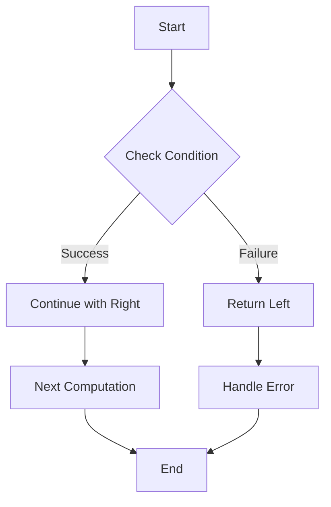

## 7.18 Advanced Error Handling with Either and ExceptT

In the world of functional programming, managing errors and exceptions is a critical aspect of building robust and reliable software. Haskell, with its strong type system and functional paradigms, offers powerful tools for error handling. In this section, we will explore advanced error handling techniques using the `Either` monad and the `ExceptT` monad transformer. These tools allow us to represent computations that may fail and handle errors gracefully in complex monadic contexts.

### Error Handling in Functional Programming

Error handling in functional programming differs significantly from traditional imperative languages. Instead of using exceptions, functional languages like Haskell prefer to represent errors explicitly in the type system. This approach has several advantages:

- **Type Safety**: Errors are part of the function's type signature, making it clear when a function can fail.
- **Composability**: Error handling can be composed with other functional constructs, leading to more modular code.
- **Predictability**: By avoiding exceptions, the flow of the program is more predictable and easier to reason about.

### The Either Monad

The `Either` monad is a fundamental tool in Haskell for representing computations that may fail. It is defined as:

```haskell
data Either a b = Left a | Right b
```

- **Left a**: Represents a failure with an error of type `a`.
- **Right b**: Represents a successful computation with a result of type `b`.

The `Either` type is a bifunctor, meaning it can map over both the error and success values. However, in the context of monads, we typically focus on the success path (`Right`).

#### Using Either for Error Handling

Let's consider a simple example where we use `Either` to handle errors in a computation:

```haskell
safeDivide :: Double -> Double -> Either String Double
safeDivide _ 0 = Left "Division by zero error"
safeDivide x y = Right (x / y)
```

In this example, `safeDivide` returns an `Either String Double`, where `Left` indicates an error, and `Right` indicates a successful division.

#### Chaining Computations with Either

The `Either` monad allows us to chain computations that may fail using the `>>=` (bind) operator:

```haskell
compute :: Double -> Double -> Double -> Either String Double
compute x y z = do
  a <- safeDivide x y
  b <- safeDivide a z
  return b
```

Here, `compute` chains two division operations, propagating any errors that occur.

### The ExceptT Transformer

While `Either` is useful for simple error handling, real-world applications often involve more complex monadic contexts, such as IO operations. The `ExceptT` monad transformer allows us to combine `Either` with other monads, enabling error handling in monad stacks.

#### Defining ExceptT

`ExceptT` is defined as:

```haskell
newtype ExceptT e m a = ExceptT { runExceptT :: m (Either e a) }
```

- `e`: The type of the error.
- `m`: The underlying monad.
- `a`: The type of the result.

#### Using ExceptT for Error Handling

Let's see how `ExceptT` can be used to handle errors in IO operations:

```haskell
import Control.Monad.Except

type AppM = ExceptT String IO

readFileSafe :: FilePath -> AppM String
readFileSafe path = ExceptT $ do
  content <- readFile path
  return (Right content)

processFile :: FilePath -> AppM ()
processFile path = do
  content <- readFileSafe path
  liftIO $ putStrLn ("File content: " ++ content)
```

In this example, `readFileSafe` reads a file and wraps the result in an `ExceptT` transformer. The `processFile` function then uses `ExceptT` to handle any errors that may occur during file reading.

#### Combining ExceptT with Other Monads

`ExceptT` can be combined with other monads to create powerful monadic stacks. For example, we can combine `ExceptT` with the `State` monad to manage stateful computations that may fail:

```haskell
import Control.Monad.State

type AppState = Int
type AppM = ExceptT String (State AppState)

incrementState :: AppM ()
incrementState = do
  state <- lift get
  if state < 10
    then lift $ put (state + 1)
    else throwError "State limit exceeded"
```

Here, `incrementState` increments a state value, but throws an error if the state exceeds a certain limit.

### Visualizing Error Handling with Either and ExceptT

To better understand how `Either` and `ExceptT` work together, let's visualize the flow of error handling in a monadic stack:



This diagram illustrates how computations flow through a monadic stack, with errors being handled at each step.

### Key Participants

- **Either**: Represents computations that may fail with an error or succeed with a result.
- **ExceptT**: A monad transformer that combines `Either` with other monads for error handling in monad stacks.
- **Monad Stack**: A combination of multiple monads to handle complex computations.

### Applicability

- Use `Either` for simple error handling in pure computations.
- Use `ExceptT` when you need to handle errors in monadic contexts, such as IO operations or stateful computations.
- Combine `ExceptT` with other monads to create flexible and powerful monadic stacks.

### Sample Code Snippet

Here's a complete example demonstrating advanced error handling with `Either` and `ExceptT`:

```haskell
import Control.Monad.Except
import Control.Monad.State

type AppState = Int
type AppM = ExceptT String (State AppState)

safeDivide :: Double -> Double -> Either String Double
safeDivide _ 0 = Left "Division by zero error"
safeDivide x y = Right (x / y)

incrementState :: AppM ()
incrementState = do
  state <- lift get
  if state < 10
    then lift $ put (state + 1)
    else throwError "State limit exceeded"

compute :: Double -> Double -> Double -> AppM Double
compute x y z = do
  a <- liftEither $ safeDivide x y
  b <- liftEither $ safeDivide a z
  incrementState
  return b

runApp :: AppM a -> AppState -> (Either String a, AppState)
runApp app initialState = runState (runExceptT app) initialState

main :: IO ()
main = do
  let (result, finalState) = runApp (compute 10 2 5) 0
  case result of
    Left err -> putStrLn $ "Error: " ++ err
    Right value -> putStrLn $ "Result: " ++ show value
  putStrLn $ "Final State: " ++ show finalState
```

### Design Considerations

- **Error Propagation**: Ensure that errors are propagated correctly through the monadic stack.
- **Error Handling**: Decide where and how to handle errors, either at the top level or within specific functions.
- **Performance**: Consider the performance implications of using monad transformers, especially in deeply nested stacks.

### Haskell Unique Features

- **Type Safety**: Haskell's type system ensures that errors are handled explicitly, reducing runtime errors.
- **Monad Transformers**: Haskell's support for monad transformers allows for flexible and composable error handling.

### Differences and Similarities

- **Either vs. Maybe**: `Either` provides more information about errors compared to `Maybe`, which only indicates the presence or absence of a value.
- **ExceptT vs. ErrorT**: `ExceptT` is the modern replacement for `ErrorT`, offering better performance and flexibility.

### Try It Yourself

Experiment with the code examples provided. Try modifying the `compute` function to handle different types of errors or add additional computations. Observe how errors propagate through the monadic stack and how they are handled.

### Knowledge Check

- What are the advantages of using `Either` for error handling in Haskell?
- How does `ExceptT` enhance error handling in monadic contexts?
- What are some common use cases for combining `ExceptT` with other monads?

### Embrace the Journey

Remember, mastering error handling in Haskell is a journey. As you progress, you'll build more complex and reliable applications. Keep experimenting, stay curious, and enjoy the journey!

## Quiz: Advanced Error Handling with Either and ExceptT



### What is the primary advantage of using `Either` for error handling in Haskell?

- [x] It provides type-safe error handling.
- [ ] It allows for unchecked exceptions.
- [ ] It simplifies error handling by ignoring errors.
- [ ] It is faster than other error handling methods.

> **Explanation:** `Either` provides type-safe error handling by making errors explicit in the type system.

### How does `ExceptT` enhance error handling in monadic contexts?

- [x] By combining `Either` with other monads.
- [ ] By replacing `Either` with `Maybe`.
- [ ] By ignoring errors in monadic contexts.
- [ ] By simplifying monadic computations.

> **Explanation:** `ExceptT` enhances error handling by combining `Either` with other monads, allowing for error handling in monadic stacks.

### What is the role of the `Left` constructor in the `Either` type?

- [x] It represents an error or failure.
- [ ] It represents a successful computation.
- [ ] It is used for logging purposes.
- [ ] It is used for debugging.

> **Explanation:** The `Left` constructor in `Either` represents an error or failure.

### Which of the following is a common use case for `ExceptT`?

- [x] Handling errors in IO operations.
- [ ] Simplifying pure computations.
- [ ] Replacing `Maybe` in simple functions.
- [ ] Ignoring errors in stateful computations.

> **Explanation:** `ExceptT` is commonly used for handling errors in IO operations and other monadic contexts.

### What is the difference between `Either` and `Maybe`?

- [x] `Either` provides more information about errors.
- [ ] `Maybe` provides more information about errors.
- [ ] `Either` is used for pure computations only.
- [ ] `Maybe` is used for error handling in monadic contexts.

> **Explanation:** `Either` provides more information about errors compared to `Maybe`, which only indicates the presence or absence of a value.

### How can you propagate errors using `Either`?

- [x] By using the `>>=` (bind) operator.
- [ ] By using the `return` function.
- [ ] By using the `map` function.
- [ ] By using the `filter` function.

> **Explanation:** Errors can be propagated using the `>>=` (bind) operator in the `Either` monad.

### What is the purpose of the `liftEither` function in the context of `ExceptT`?

- [x] To lift an `Either` value into an `ExceptT` monad.
- [ ] To convert an `ExceptT` value into an `Either`.
- [ ] To handle errors in pure computations.
- [ ] To simplify stateful computations.

> **Explanation:** The `liftEither` function is used to lift an `Either` value into an `ExceptT` monad.

### What is a potential performance consideration when using monad transformers like `ExceptT`?

- [x] Deeply nested stacks can impact performance.
- [ ] They always improve performance.
- [ ] They simplify error handling in all cases.
- [ ] They eliminate the need for error handling.

> **Explanation:** Deeply nested monad stacks can impact performance, so it's important to consider this when using monad transformers.

### What is the modern replacement for `ErrorT` in Haskell?

- [x] `ExceptT`
- [ ] `MaybeT`
- [ ] `StateT`
- [ ] `ReaderT`

> **Explanation:** `ExceptT` is the modern replacement for `ErrorT`, offering better performance and flexibility.

### True or False: `Either` and `ExceptT` are interchangeable in all contexts.

- [ ] True
- [x] False

> **Explanation:** `Either` and `ExceptT` are not interchangeable in all contexts. `ExceptT` is used for error handling in monadic stacks, while `Either` is used for simpler error handling.



By mastering `Either` and `ExceptT`, you can build more robust and reliable Haskell applications. These tools allow you to handle errors gracefully and maintain the composability and predictability of your functional code. Keep exploring and experimenting with these powerful constructs to enhance your Haskell programming skills.
