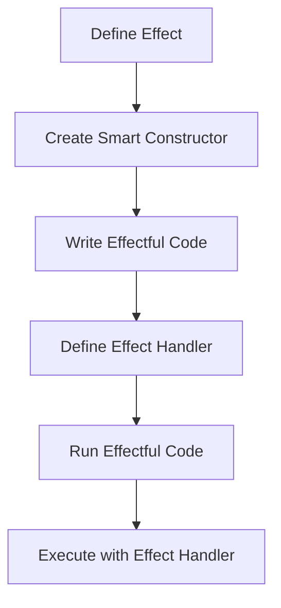

## 7.19 Using Algebraic Effects

In the realm of functional programming, **algebraic effects** offer a powerful paradigm for managing side effects in a clean, modular, and composable manner. This section delves into the concept of algebraic effects, their benefits, and how they can be implemented in Haskell using libraries like **Eff** and **Polysemy**. We will explore how algebraic effects allow us to represent side effects as first-class values, enabling us to decouple effectful code from effect handling, thus enhancing testability and maintainability.

### Understanding Algebraic Effects

Algebraic effects provide a way to describe computations that may perform side effects without committing to a specific implementation of those effects. This abstraction allows developers to write generic code that can be executed in different contexts, such as testing versus production, without altering the core logic.

#### Key Concepts

- **Effects as First-Class Values**: Algebraic effects treat side effects as values that can be manipulated, passed around, and composed just like any other value in the language.
- **Effect Handlers**: These are responsible for interpreting and executing the effects. They provide the actual implementation of the side effects described by the algebraic effects.

### Benefits of Algebraic Effects

1. **Decoupling Code from Effects**: By separating the description of effects from their implementation, we can write more modular and reusable code.
2. **Improved Testability**: With algebraic effects, we can easily swap out effect handlers, making it straightforward to test code by providing mock implementations.
3. **Enhanced Composability**: Effects can be composed and combined in flexible ways, allowing for more expressive and concise code.
4. **Separation of Concerns**: Business logic can be kept separate from effectful operations, leading to cleaner and more maintainable codebases.

### Implementing Algebraic Effects in Haskell

Haskell provides several libraries for working with algebraic effects, with **Eff** and **Polysemy** being among the most popular. These libraries offer a rich set of tools for defining and handling effects in a type-safe manner.

#### Using the Polysemy Library

**Polysemy** is a library that provides a high-level interface for working with algebraic effects in Haskell. It allows you to define effects and their handlers in a concise and expressive way.

##### Defining Effects

To define an effect in Polysemy, you create a data type representing the operations of the effect. Here's an example of a simple logging effect:

```haskell
{-# LANGUAGE GADTs, TypeOperators, DataKinds, FlexibleContexts #-}

import Polysemy

-- Define a logging effect
data Log m a where
  LogInfo :: String -> Log m ()

-- Create a smart constructor for the effect
logInfo :: Member Log r => String -> Sem r ()
logInfo msg = send (LogInfo msg)
```

In this example, we define a `Log` effect with a single operation `LogInfo`. The `logInfo` function is a smart constructor that sends the `LogInfo` operation to the effect system.

##### Handling Effects

To handle an effect, you provide an interpretation that specifies how the effect should be executed. Here's how you might handle the `Log` effect by printing messages to the console:

```haskell
import Polysemy
import Polysemy.IO

-- Interpret the Log effect
runLogIO :: Member (Embed IO) r => Sem (Log ': r) a -> Sem r a
runLogIO = interpret $ \case
  LogInfo msg -> embed (putStrLn ("INFO: " ++ msg))
```

The `runLogIO` function interprets the `Log` effect by embedding it into the `IO` monad, using `putStrLn` to print log messages.

##### Running Effects

To run a computation with effects, you use the `runM` function provided by Polysemy:

```haskell
main :: IO ()
main = do
  runM . runLogIO $ do
    logInfo "Starting the application"
    logInfo "Performing some operations"
    logInfo "Application finished"
```

In this example, we run a series of logging operations using the `runLogIO` handler, which outputs the log messages to the console.

#### Using the Eff Library

The **Eff** library is another popular choice for working with algebraic effects in Haskell. It provides a similar interface to Polysemy but with some differences in implementation and usage.

##### Defining Effects

In Eff, you define effects using GADTs (Generalized Algebraic Data Types). Here's an example of a logging effect:

```haskell
{-# LANGUAGE GADTs, TypeOperators, DataKinds, FlexibleContexts #-}

import Control.Monad.Freer

-- Define a logging effect
data Log a where
  LogInfo :: String -> Log ()

-- Create a smart constructor for the effect
logInfo :: Member Log effs => String -> Eff effs ()
logInfo msg = send (LogInfo msg)
```

##### Handling Effects

To handle an effect in Eff, you provide an interpretation using the `interpret` function:

```haskell
import Control.Monad.Freer
import Control.Monad.Freer.IO

-- Interpret the Log effect
runLogIO :: Member IO effs => Eff (Log ': effs) a -> Eff effs a
runLogIO = interpret $ \case
  LogInfo msg -> send (putStrLn ("INFO: " ++ msg))
```

##### Running Effects

To execute a computation with effects, you use the `runM` function:

```haskell
main :: IO ()
main = do
  runM . runLogIO $ do
    logInfo "Starting the application"
    logInfo "Performing some operations"
    logInfo "Application finished"
```

### Visualizing Algebraic Effects

To better understand how algebraic effects work, let's visualize the flow of effectful computations using a Mermaid.js diagram.



**Diagram Description**: This diagram illustrates the process of using algebraic effects in Haskell. We start by defining an effect and creating a smart constructor. Next, we write effectful code that uses the constructor. We then define an effect handler to interpret the effect and finally run the effectful code with the handler.

### Try It Yourself

To deepen your understanding of algebraic effects, try modifying the code examples provided. Here are some suggestions:

- **Add a new effect**: Define a new effect for error handling or state management and implement a handler for it.
- **Change the effect handler**: Modify the `runLogIO` handler to write log messages to a file instead of the console.
- **Combine multiple effects**: Create a computation that uses both logging and error handling effects, and write handlers for each.

### Design Considerations

When using algebraic effects, consider the following:

- **Performance**: While algebraic effects provide flexibility, they may introduce overhead compared to traditional monadic approaches. Profile your code to ensure performance meets your requirements.
- **Complexity**: As the number of effects grows, managing them can become complex. Use clear naming conventions and documentation to maintain readability.
- **Compatibility**: Ensure that the libraries you choose for algebraic effects are compatible with other libraries and tools in your Haskell ecosystem.

### Haskell Unique Features

Haskell's strong type system and support for higher-kinded types make it particularly well-suited for implementing algebraic effects. The language's emphasis on purity and immutability aligns well with the goals of algebraic effects, allowing for clean separation of concerns and composability.

### Differences and Similarities

Algebraic effects are often compared to monad transformers. While both approaches aim to manage side effects, algebraic effects offer a more modular and composable solution. Unlike monad transformers, which require stacking and unstacking layers, algebraic effects allow for more flexible composition and reuse of effect handlers.

### Knowledge Check

- **What are algebraic effects, and how do they differ from traditional monadic effects?**
- **How can algebraic effects improve the testability of your code?**
- **What are some potential performance considerations when using algebraic effects?**

### Embrace the Journey

Remember, mastering algebraic effects is a journey. As you explore this powerful paradigm, you'll discover new ways to write clean, modular, and testable code. Keep experimenting, stay curious, and enjoy the process of learning and growing as a Haskell developer.

## Quiz: Using Algebraic Effects



### What is the primary benefit of using algebraic effects in Haskell?

- [x] Decoupling effectful code from effect handling
- [ ] Improving runtime performance
- [ ] Simplifying syntax
- [ ] Reducing memory usage

> **Explanation:** Algebraic effects allow for the separation of effectful code from its handling, enhancing modularity and testability.


### Which library is commonly used for implementing algebraic effects in Haskell?

- [x] Polysemy
- [ ] MonadIO
- [ ] QuickCheck
- [ ] Hspec

> **Explanation:** Polysemy is a popular library for implementing algebraic effects in Haskell.


### How do algebraic effects treat side effects?

- [x] As first-class values
- [ ] As exceptions
- [ ] As monads
- [ ] As global variables

> **Explanation:** Algebraic effects treat side effects as first-class values, allowing them to be manipulated and composed like any other value.


### What is an effect handler in the context of algebraic effects?

- [x] A function that interprets and executes effects
- [ ] A data structure for storing effects
- [ ] A type class for defining effects
- [ ] A monad transformer for managing effects

> **Explanation:** An effect handler is responsible for interpreting and executing the effects described by algebraic effects.


### What is a potential drawback of using algebraic effects?

- [x] They may introduce performance overhead
- [ ] They are not type-safe
- [ ] They cannot be composed
- [ ] They are incompatible with Haskell's type system

> **Explanation:** Algebraic effects can introduce performance overhead compared to traditional monadic approaches.


### Which of the following is a key feature of the Polysemy library?

- [x] High-level interface for defining and handling effects
- [ ] Built-in support for concurrency
- [ ] Automatic memory management
- [ ] Native support for web development

> **Explanation:** Polysemy provides a high-level interface for defining and handling algebraic effects in Haskell.


### How can algebraic effects enhance testability?

- [x] By allowing easy swapping of effect handlers
- [ ] By reducing code complexity
- [ ] By improving runtime performance
- [ ] By simplifying syntax

> **Explanation:** Algebraic effects allow for easy swapping of effect handlers, making it straightforward to test code with mock implementations.


### What is the role of a smart constructor in algebraic effects?

- [x] To send operations to the effect system
- [ ] To define new data types
- [ ] To manage memory allocation
- [ ] To handle concurrency

> **Explanation:** A smart constructor sends operations to the effect system, facilitating the use of algebraic effects.


### How do algebraic effects compare to monad transformers?

- [x] They offer more modular and composable solutions
- [ ] They are less flexible
- [ ] They require more boilerplate code
- [ ] They are incompatible with Haskell's type system

> **Explanation:** Algebraic effects provide a more modular and composable solution compared to monad transformers.


### True or False: Algebraic effects can only be used in Haskell.

- [ ] True
- [x] False

> **Explanation:** Algebraic effects are a general concept that can be implemented in various programming languages, not just Haskell.


