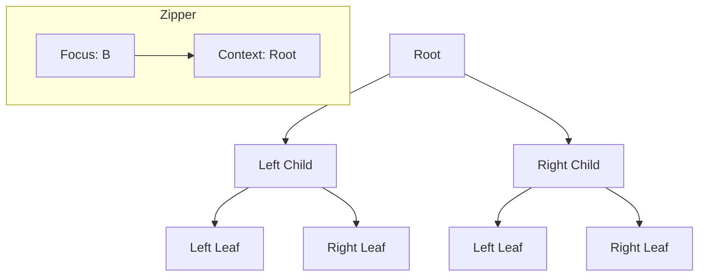

## 7.20 Zippers and Navigating Data Structures

In the world of functional programming, efficiently navigating and modifying immutable data structures is a common challenge. Zippers provide an elegant solution to this problem by allowing us to traverse and update data structures like trees and lists with ease. In this section, we'll delve into the concept of zippers, explore their usage, and demonstrate how to implement them in Haskell.

### Zipper Concept

A zipper is a data structure that allows for efficient traversal and modification of another data structure. It achieves this by maintaining a focus on a particular element within the structure, along with the context needed to reconstruct the entire structure after modifications.

#### Key Characteristics of Zippers

- **Focus and Context**: A zipper maintains a focus on a specific part of the data structure and the context required to reconstruct the whole structure.
- **Efficient Updates**: Zippers enable efficient updates by allowing modifications to be made at the focus without reconstructing the entire structure.
- **Navigation**: Zippers provide operations to move the focus around the data structure, such as moving up, down, left, or right in a tree.

### Usage of Zippers

Zippers are particularly useful in scenarios where you need to frequently navigate and update immutable data structures. Some common use cases include:

- **Editing Nested Structures**: Zippers are ideal for implementing editors for nested data structures, such as XML or JSON documents.
- **Functional Reactive Programming**: In FRP, zippers can be used to efficiently manage state changes in complex data structures.
- **Tree Traversal**: Zippers provide a convenient way to traverse and modify trees, making them useful in algorithms that require tree manipulation.

### Implementing Zippers in Haskell

To implement a zipper in Haskell, we need to define a data structure that pairs the focus with its context. Let's start by implementing a simple zipper for a binary tree.

#### Defining a Binary Tree

First, we'll define a basic binary tree data structure:

```haskell
data Tree a = Empty
            | Node a (Tree a) (Tree a)
            deriving (Show, Eq)
```

This `Tree` type represents a binary tree where each node contains a value of type `a` and two subtrees.

#### Defining the Zipper

Next, we'll define the zipper for our binary tree. The zipper will consist of a focus on a particular node and a context that allows us to reconstruct the tree:

```haskell
data TreeZipper a = TreeZipper (Tree a) (TreeContext a)
                  deriving (Show, Eq)

data TreeContext a = Top
                   | LeftContext a (Tree a) (TreeContext a)
                   | RightContext a (Tree a) (TreeContext a)
                   deriving (Show, Eq)
```

The `TreeZipper` type contains a focus on a `Tree` and a `TreeContext`. The `TreeContext` keeps track of the path taken to reach the focus, allowing us to move back up the tree.

#### Navigating the Tree

With our zipper defined, we can implement functions to navigate the tree. Let's start with moving the focus to the left child:

```haskell
goLeft :: TreeZipper a -> Maybe (TreeZipper a)
goLeft (TreeZipper (Node x l r) ctx) = Just (TreeZipper l (LeftContext x r ctx))
goLeft _ = Nothing
```

The `goLeft` function moves the focus to the left child of the current node, updating the context to reflect the move.

Similarly, we can define a function to move to the right child:

```haskell
goRight :: TreeZipper a -> Maybe (TreeZipper a)
goRight (TreeZipper (Node x l r) ctx) = Just (TreeZipper r (RightContext x l ctx))
goRight _ = Nothing
```

Finally, let's implement a function to move back up the tree:

```haskell
goUp :: TreeZipper a -> Maybe (TreeZipper a)
goUp (TreeZipper t (LeftContext x r ctx)) = Just (TreeZipper (Node x t r) ctx)
goUp (TreeZipper t (RightContext x l ctx)) = Just (TreeZipper (Node x l t) ctx)
goUp (TreeZipper _ Top) = Nothing
```

The `goUp` function reconstructs the tree by combining the focus with the context, effectively moving the focus back to the parent node.

### Example: Implementing an Editor for Nested Structures

To demonstrate the power of zippers, let's implement a simple editor for nested lists. We'll define a list zipper and provide functions to navigate and update the list.

#### Defining the List Zipper

First, we'll define a list zipper that maintains a focus on a particular element and the context of the list:

```haskell
data ListZipper a = ListZipper [a] a [a]
                  deriving (Show, Eq)
```

The `ListZipper` type consists of three parts: the elements before the focus, the focus itself, and the elements after the focus.

#### Navigating the List

We can define functions to move the focus left and right within the list:

```haskell
moveLeft :: ListZipper a -> Maybe (ListZipper a)
moveLeft (ListZipper (l:ls) x rs) = Just (ListZipper ls l (x:rs))
moveLeft _ = Nothing

moveRight :: ListZipper a -> Maybe (ListZipper a)
moveRight (ListZipper ls x (r:rs)) = Just (ListZipper (x:ls) r rs)
moveRight _ = Nothing
```

These functions update the focus and context to reflect the movement within the list.

#### Updating the List

Finally, let's implement a function to update the focused element:

```haskell
updateFocus :: a -> ListZipper a -> ListZipper a
updateFocus newVal (ListZipper ls _ rs) = ListZipper ls newVal rs
```

The `updateFocus` function replaces the focused element with a new value, allowing us to modify the list efficiently.

### Visualizing Zippers

To better understand how zippers work, let's visualize the navigation process using a binary tree. The following diagram illustrates the structure of a binary tree and how a zipper navigates through it:



In this diagram, the focus is on node B, and the context is the path back to the root. The zipper allows us to efficiently navigate and update the tree without reconstructing the entire structure.

### Haskell Unique Features

Haskell's strong type system and immutability make it an ideal language for implementing zippers. The use of algebraic data types allows us to define complex data structures with ease, while pattern matching provides a concise way to navigate and update these structures.

### Differences and Similarities

Zippers are often compared to cursors in imperative programming. While both provide a way to navigate data structures, zippers are purely functional and maintain immutability, making them more suitable for functional programming languages like Haskell.

### Try It Yourself

To deepen your understanding of zippers, try implementing a zipper for a different data structure, such as a rose tree or a doubly linked list. Experiment with adding new navigation and update functions to your zipper implementation.

### Knowledge Check

- What is a zipper, and how does it differ from traditional data structure traversal methods?
- How do zippers maintain immutability while allowing efficient updates?
- What are some common use cases for zippers in functional programming?

### Embrace the Journey

Remember, mastering zippers is just the beginning of your journey into advanced functional programming. As you continue to explore Haskell, you'll discover even more powerful techniques for working with data structures. Keep experimenting, stay curious, and enjoy the journey!

## Quiz: Zippers and Navigating Data Structures



### What is a zipper in the context of functional programming?

- [x] A data structure that allows efficient traversal and modification of another data structure.
- [ ] A function that compresses data.
- [ ] A method for sorting lists.
- [ ] A type of monad used for state management.

> **Explanation:** A zipper is a data structure that provides a way to traverse and modify another data structure efficiently by maintaining a focus and context.

### How does a zipper maintain immutability?

- [x] By keeping a focus and context that allows reconstruction of the entire structure.
- [ ] By using mutable state internally.
- [ ] By copying the entire data structure on each update.
- [ ] By using global variables to track changes.

> **Explanation:** Zippers maintain immutability by keeping a focus on a specific part of the data structure and the context needed to reconstruct the whole structure after modifications.

### What is the primary advantage of using zippers?

- [x] Efficient navigation and updates of immutable data structures.
- [ ] Simplifying the syntax of Haskell code.
- [ ] Reducing the need for recursion.
- [ ] Improving the performance of sorting algorithms.

> **Explanation:** The primary advantage of using zippers is that they allow efficient navigation and updates of immutable data structures without reconstructing the entire structure.

### Which of the following is a common use case for zippers?

- [x] Implementing editors for nested structures.
- [ ] Sorting large lists.
- [ ] Performing arithmetic operations.
- [ ] Managing concurrent processes.

> **Explanation:** Zippers are commonly used for implementing editors for nested structures, as they allow efficient navigation and updates.

### How does the `goLeft` function work in a tree zipper?

- [x] It moves the focus to the left child and updates the context.
- [ ] It moves the focus to the right child and updates the context.
- [ ] It moves the focus to the parent node.
- [ ] It deletes the current node.

> **Explanation:** The `goLeft` function moves the focus to the left child of the current node and updates the context to reflect the move.

### What is the role of the `TreeContext` in a tree zipper?

- [x] To keep track of the path taken to reach the focus.
- [ ] To store the values of all nodes in the tree.
- [ ] To manage memory allocation for the tree.
- [ ] To perform garbage collection.

> **Explanation:** The `TreeContext` keeps track of the path taken to reach the focus, allowing the zipper to move back up the tree.

### What is a key difference between zippers and cursors in imperative programming?

- [x] Zippers maintain immutability, while cursors often involve mutable state.
- [ ] Zippers are used for sorting, while cursors are not.
- [ ] Zippers are specific to Haskell, while cursors are not.
- [ ] Zippers are slower than cursors.

> **Explanation:** A key difference is that zippers maintain immutability, making them more suitable for functional programming, while cursors in imperative programming often involve mutable state.

### Which Haskell feature is particularly useful for implementing zippers?

- [x] Algebraic data types and pattern matching.
- [ ] Lazy evaluation.
- [ ] List comprehensions.
- [ ] Type classes.

> **Explanation:** Algebraic data types and pattern matching are particularly useful for implementing zippers, as they allow for concise and expressive definitions of complex data structures.

### What is the purpose of the `updateFocus` function in a list zipper?

- [x] To replace the focused element with a new value.
- [ ] To move the focus to the next element.
- [ ] To delete the focused element.
- [ ] To sort the list.

> **Explanation:** The `updateFocus` function replaces the focused element with a new value, allowing for efficient updates to the list.

### True or False: Zippers can only be used with tree data structures.

- [ ] True
- [x] False

> **Explanation:** False. Zippers can be used with various data structures, including lists, trees, and more complex nested structures.


