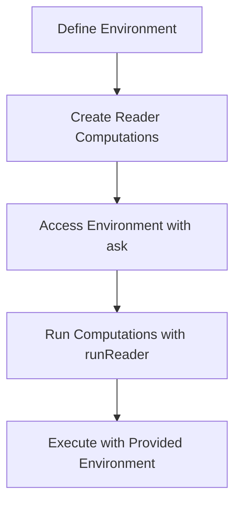

## 7.3 The Reader Monad Pattern

In the realm of functional programming, the Reader Monad Pattern stands out as a powerful tool for managing shared environments or configurations. This pattern is particularly useful in Haskell, where it simplifies the process of passing shared data through a series of computations. In this section, we will delve into the concept of the Reader Monad Pattern, explore its benefits, and demonstrate its implementation with practical examples.

### Concept

The Reader Monad Pattern is designed to simplify functions that require access to a shared environment or configuration. In many applications, functions often need to access common data, such as application settings, database connections, or other shared resources. Traditionally, this would involve passing the environment explicitly to each function, which can lead to cumbersome and error-prone code.

The Reader Monad Pattern addresses this issue by encapsulating the environment within a monad, allowing functions to access the shared data without explicitly passing it around. This results in cleaner, more maintainable code.

### Benefits

The primary benefits of using the Reader Monad Pattern include:

- **Simplified Code**: By removing the need to pass the environment explicitly, the code becomes cleaner and easier to read.
- **Decoupling**: Functions become decoupled from the environment, making them more reusable and easier to test.
- **Centralized Configuration**: The environment is managed in a centralized manner, reducing the risk of inconsistencies.
- **Enhanced Maintainability**: Changes to the environment structure require minimal modifications to the existing codebase.

### Implementation

The Reader Monad is implemented using the `Reader` type, which is defined in the `Control.Monad.Reader` module. The `Reader` type encapsulates a computation that depends on a shared environment. Let's explore how to implement the Reader Monad Pattern in Haskell.

#### Defining the Environment

First, we define the environment that will be shared across functions. This environment can be any data structure that holds the necessary configuration or shared data.

```haskell
-- Define the environment
data AppConfig = AppConfig
  { appName :: String
  , appVersion :: String
  , appPort :: Int
  }
```

In this example, `AppConfig` is a simple data structure that holds application configuration details such as the name, version, and port number.

#### Using the Reader Monad

Next, we use the `Reader` monad to access the shared environment within computations. The `Reader` monad provides a convenient way to access the environment without passing it explicitly.

```haskell
import Control.Monad.Reader

-- Define a function that uses the Reader monad
getAppName :: Reader AppConfig String
getAppName = do
  config <- ask
  return (appName config)

-- Another function using the Reader monad
getAppDetails :: Reader AppConfig String
getAppDetails = do
  config <- ask
  return $ "App: " ++ appName config ++ ", Version: " ++ appVersion config
```

In these examples, `getAppName` and `getAppDetails` are functions that use the `Reader` monad to access the `AppConfig` environment. The `ask` function is used to retrieve the environment within the monadic context.

#### Running Reader Computations

To execute a computation within the `Reader` monad, we use the `runReader` function, which takes a `Reader` computation and an environment as arguments.

```haskell
-- Run the Reader computations
main :: IO ()
main = do
  let config = AppConfig "MyApp" "1.0.0" 8080
  putStrLn $ runReader getAppName config
  putStrLn $ runReader getAppDetails config
```

In the `main` function, we create an instance of `AppConfig` and use `runReader` to execute the `getAppName` and `getAppDetails` computations with the provided environment.

### Example: Accessing Application Settings

Let's consider a more comprehensive example where the Reader Monad Pattern is used to manage application settings and perform dependency injection.

```haskell
import Control.Monad.Reader

-- Define the environment
data AppConfig = AppConfig
  { dbConnectionString :: String
  , logLevel :: String
  }

-- Define a function to get the database connection string
getDbConnectionString :: Reader AppConfig String
getDbConnectionString = do
  config <- ask
  return (dbConnectionString config)

-- Define a function to get the log level
getLogLevel :: Reader AppConfig String
getLogLevel = do
  config <- ask
  return (logLevel config)

-- Define a function that performs a task using the environment
performTask :: Reader AppConfig ()
performTask = do
  dbConn <- getDbConnectionString
  logLvl <- getLogLevel
  liftIO $ putStrLn $ "Connecting to database: " ++ dbConn
  liftIO $ putStrLn $ "Log level set to: " ++ logLvl

-- Main function to run the Reader computations
main :: IO ()
main = do
  let config = AppConfig "localhost:5432" "DEBUG"
  runReader performTask config
```

In this example, we define an `AppConfig` environment that includes a database connection string and a log level. The `performTask` function uses the Reader monad to access these settings and perform a task, such as connecting to a database and setting the log level.

### Visualizing the Reader Monad Pattern

To better understand the flow of data in the Reader Monad Pattern, let's visualize the process using a Mermaid.js diagram.



**Diagram Description**: This diagram illustrates the flow of the Reader Monad Pattern. We start by defining the environment, create Reader computations that access the environment using `ask`, and finally run these computations with `runReader` using the provided environment.

### Design Considerations

When using the Reader Monad Pattern, consider the following design considerations:

- **Complexity**: While the Reader Monad Pattern simplifies access to shared environments, it can introduce complexity if overused. Use it judiciously where it adds value.
- **Testing**: The decoupling of functions from the environment makes testing easier, as functions can be tested independently of the environment.
- **Performance**: The Reader Monad Pattern introduces minimal overhead, making it suitable for performance-sensitive applications.

### Haskell Unique Features

Haskell's strong static typing and type inference make the Reader Monad Pattern particularly powerful. The type system ensures that the environment is used consistently across computations, reducing the risk of runtime errors.

### Differences and Similarities

The Reader Monad Pattern is often compared to dependency injection in object-oriented programming. Both patterns aim to decouple functions from their dependencies, but the Reader Monad Pattern achieves this in a purely functional manner.

### Try It Yourself

To deepen your understanding of the Reader Monad Pattern, try modifying the code examples provided. Experiment with different environment structures, add new functions that access the environment, and observe how the pattern simplifies code management.

### Knowledge Check

- **Question**: What is the primary benefit of using the Reader Monad Pattern?
- **Exercise**: Implement a Reader Monad Pattern to manage configuration settings for a web server application.

### Embrace the Journey

Remember, mastering the Reader Monad Pattern is just the beginning of your journey in functional programming with Haskell. As you progress, you'll discover more patterns and techniques that will enhance your ability to build robust, maintainable applications. Keep experimenting, stay curious, and enjoy the journey!

## Quiz: The Reader Monad Pattern



### What is the primary purpose of the Reader Monad Pattern?

- [x] To simplify access to a shared environment or configuration
- [ ] To manage state changes in a program
- [ ] To handle errors and exceptions
- [ ] To perform input/output operations

> **Explanation:** The Reader Monad Pattern is primarily used to simplify access to a shared environment or configuration, allowing functions to access shared data without explicitly passing it around.

### Which function is used to retrieve the environment within the Reader monad?

- [x] ask
- [ ] tell
- [ ] put
- [ ] get

> **Explanation:** The `ask` function is used within the Reader monad to retrieve the environment.

### What is the role of the `runReader` function?

- [x] To execute a Reader computation with a provided environment
- [ ] To modify the environment within the Reader monad
- [ ] To handle errors in the Reader monad
- [ ] To perform input/output operations

> **Explanation:** The `runReader` function is used to execute a Reader computation with a provided environment.

### How does the Reader Monad Pattern enhance code maintainability?

- [x] By decoupling functions from the environment
- [ ] By introducing mutable state
- [ ] By increasing code complexity
- [ ] By requiring explicit environment passing

> **Explanation:** The Reader Monad Pattern enhances code maintainability by decoupling functions from the environment, making them more reusable and easier to test.

### What is a potential drawback of overusing the Reader Monad Pattern?

- [x] Increased complexity
- [ ] Reduced performance
- [ ] Difficulty in testing
- [ ] Inconsistent environment usage

> **Explanation:** Overusing the Reader Monad Pattern can lead to increased complexity, so it should be used judiciously where it adds value.

### In Haskell, what feature ensures consistent use of the environment across computations?

- [x] Strong static typing
- [ ] Dynamic typing
- [ ] Mutable state
- [ ] Implicit environment passing

> **Explanation:** Haskell's strong static typing ensures consistent use of the environment across computations, reducing the risk of runtime errors.

### What is a common use case for the Reader Monad Pattern?

- [x] Dependency injection
- [ ] State management
- [ ] Error handling
- [ ] Input/output operations

> **Explanation:** A common use case for the Reader Monad Pattern is dependency injection, where it decouples functions from their dependencies.

### How does the Reader Monad Pattern compare to dependency injection in object-oriented programming?

- [x] Both aim to decouple functions from their dependencies
- [ ] Both introduce mutable state
- [ ] Both require explicit environment passing
- [ ] Both increase code complexity

> **Explanation:** Both the Reader Monad Pattern and dependency injection in object-oriented programming aim to decouple functions from their dependencies, but the Reader Monad Pattern achieves this in a purely functional manner.

### What is the `Reader` type used for in Haskell?

- [x] Encapsulating a computation that depends on a shared environment
- [ ] Managing mutable state
- [ ] Handling errors and exceptions
- [ ] Performing input/output operations

> **Explanation:** The `Reader` type in Haskell is used to encapsulate a computation that depends on a shared environment.

### True or False: The Reader Monad Pattern introduces significant performance overhead.

- [ ] True
- [x] False

> **Explanation:** The Reader Monad Pattern introduces minimal overhead, making it suitable for performance-sensitive applications.


