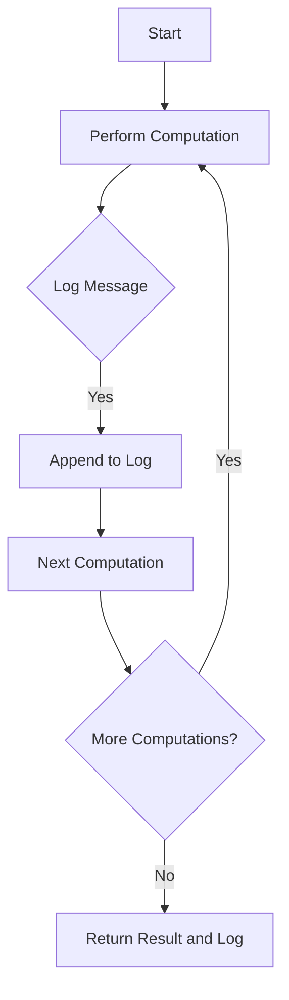

## 7.4 The Writer Monad Pattern

In the realm of functional programming, maintaining purity while performing computations is a core principle. However, there are scenarios where we need to collect additional information, such as logs or intermediate results, alongside our computations. The Writer Monad Pattern in Haskell provides an elegant solution to this challenge. In this section, we'll delve into the Writer Monad, exploring its concepts, benefits, implementation, and practical applications.

### Concept

The Writer Monad is a design pattern that allows us to perform computations while accumulating outputs, such as logs or other auxiliary data. It achieves this by pairing each computation with a monoid, which is a mathematical structure that supports an associative binary operation and an identity element. This pattern is particularly useful when we want to keep our computations pure and free of side effects, yet still need to gather additional information.

### Benefits

- **Purity**: The Writer Monad allows us to maintain pure functions, as it separates the logic of computation from the logic of output accumulation.
- **Modularity**: By using the Writer Monad, we can easily add or remove logging or other output-related functionalities without altering the core logic of our computations.
- **Composability**: The monoidal nature of the Writer Monad enables us to compose multiple computations seamlessly, accumulating results along the way.

### Implementation

The Writer Monad is implemented using the `Writer` type, which pairs a value with a monoidal output. Let's explore how to implement and use the Writer Monad in Haskell.

#### The Writer Type

The `Writer` type is defined as follows:

```haskell
import Control.Monad.Writer

newtype Writer w a = Writer { runWriter :: (a, w) }
```

Here, `w` is the type of the monoidal output, and `a` is the type of the computed value. The `runWriter` function extracts the pair of the computed value and the accumulated output.

#### Monoid Requirement

For the Writer Monad to work, the output type `w` must be a monoid. A monoid is defined by the `Monoid` type class in Haskell:

```haskell
class Monoid m where
    mempty  :: m
    mappend :: m -> m -> m
```

- `mempty` is the identity element.
- `mappend` is the associative binary operation.

Common examples of monoids include lists (with concatenation as `mappend`) and numbers (with addition or multiplication as `mappend`).

#### Monad Instance

The `Writer` type is an instance of the `Monad` type class, which allows us to use monadic operations like `>>=` (bind) and `return`:

```haskell
instance (Monoid w) => Monad (Writer w) where
    return x = Writer (x, mempty)
    (Writer (x, v)) >>= f = let (Writer (y, v')) = f x
                            in Writer (y, v `mappend` v')
```

- `return` creates a Writer with the given value and an empty output.
- `>>=` (bind) applies a function to the computed value, combining the outputs using `mappend`.

### Example: Logging Operations

Let's consider a practical example where we use the Writer Monad to log operations within a calculation without side effects.

```haskell
import Control.Monad.Writer

type Log = [String]

-- A simple computation that logs its steps
computeWithLog :: Int -> Writer Log Int
computeWithLog x = do
    tell ["Starting computation with " ++ show x]
    let result = x * 2
    tell ["Doubled the number to " ++ show result]
    let finalResult = result + 3
    tell ["Added 3 to get " ++ show finalResult]
    return finalResult

-- Running the computation
main :: IO ()
main = do
    let (result, log) = runWriter (computeWithLog 5)
    putStrLn $ "Result: " ++ show result
    mapM_ putStrLn log
```

In this example, `computeWithLog` is a computation that logs each step of its process. The `tell` function is used to append messages to the log. When we run the computation, we get both the final result and the accumulated log.

### Visualizing the Writer Monad

To better understand the flow of data in the Writer Monad, let's visualize it using a Mermaid.js diagram.



This diagram illustrates how computations and logging are interwoven in the Writer Monad. Each computation step can log a message, which is appended to the log, and the process continues until all computations are complete.

### Key Participants

- **Writer Monad**: The core structure that pairs computations with monoidal outputs.
- **Monoid**: The mathematical structure used to accumulate outputs.
- **tell**: A function that appends a message to the log.

### Applicability

The Writer Monad Pattern is applicable in scenarios where:

- You need to accumulate outputs, such as logs, alongside computations.
- You want to maintain purity and avoid side effects in your functions.
- You require a modular and composable approach to logging or output accumulation.

### Design Considerations

- **Performance**: Be mindful of the performance implications of accumulating large logs or outputs, as this can affect memory usage.
- **Monoid Choice**: Choose an appropriate monoid for your output type. For example, use lists for logs or numbers for numerical accumulations.
- **Separation of Concerns**: Keep the logic of computation separate from the logic of output accumulation to maintain clarity and modularity.

### Haskell Unique Features

Haskell's strong type system and support for monads make it an ideal language for implementing the Writer Monad Pattern. The use of type classes, such as `Monoid`, allows for flexible and reusable code.

### Differences and Similarities

The Writer Monad Pattern is similar to other monadic patterns, such as the State Monad, in that it pairs computations with additional data. However, the Writer Monad specifically focuses on accumulating outputs, whereas the State Monad deals with state transformations.

### Try It Yourself

To deepen your understanding of the Writer Monad Pattern, try modifying the example code:

- Change the type of log messages to a different monoid, such as `Sum` for numerical accumulation.
- Add more complex computations and log additional details.
- Experiment with different monoidal operations and observe their effects on the accumulated output.

### Knowledge Check

Before we conclude, let's reinforce our understanding with a few questions:

- What is the primary purpose of the Writer Monad?
- How does the Writer Monad maintain purity in computations?
- What role does the `Monoid` type class play in the Writer Monad Pattern?

### Embrace the Journey

Remember, mastering the Writer Monad Pattern is just one step in your journey as a Haskell developer. As you continue to explore functional programming, you'll discover more powerful patterns and techniques. Keep experimenting, stay curious, and enjoy the journey!

## Quiz: The Writer Monad Pattern



### What is the primary purpose of the Writer Monad?

- [x] To accumulate outputs, such as logs, alongside computations
- [ ] To manage state transformations
- [ ] To handle asynchronous computations
- [ ] To perform input/output operations

> **Explanation:** The Writer Monad is used to accumulate outputs, such as logs, alongside computations while maintaining purity.

### How does the Writer Monad maintain purity in computations?

- [x] By separating computation logic from output accumulation
- [ ] By using mutable state
- [ ] By performing side effects
- [ ] By using global variables

> **Explanation:** The Writer Monad maintains purity by separating the logic of computation from the logic of output accumulation, ensuring that functions remain pure.

### What is a monoid in the context of the Writer Monad?

- [x] A mathematical structure with an associative binary operation and an identity element
- [ ] A type of monad used for state transformations
- [ ] A function that performs logging
- [ ] A data structure for storing logs

> **Explanation:** In the context of the Writer Monad, a monoid is a mathematical structure that supports an associative binary operation and an identity element, used to accumulate outputs.

### Which function is used to append messages to the log in the Writer Monad?

- [x] tell
- [ ] return
- [ ] bind
- [ ] fmap

> **Explanation:** The `tell` function is used to append messages to the log in the Writer Monad.

### What is the role of the `runWriter` function?

- [x] To extract the pair of the computed value and the accumulated output
- [ ] To perform the computation
- [ ] To initialize the Writer Monad
- [ ] To append messages to the log

> **Explanation:** The `runWriter` function extracts the pair of the computed value and the accumulated output from the Writer Monad.

### What is a common example of a monoid used in the Writer Monad?

- [x] Lists with concatenation as `mappend`
- [ ] Arrays with indexing
- [ ] Trees with traversal
- [ ] Graphs with adjacency lists

> **Explanation:** A common example of a monoid used in the Writer Monad is lists, with concatenation as the `mappend` operation.

### How can you modify the example code to use a different monoid?

- [x] Change the type of log messages to a different monoid, such as `Sum`
- [ ] Use mutable state
- [ ] Perform side effects
- [ ] Use global variables

> **Explanation:** To use a different monoid, change the type of log messages to a different monoid, such as `Sum` for numerical accumulation.

### What is the main difference between the Writer Monad and the State Monad?

- [x] The Writer Monad focuses on accumulating outputs, while the State Monad deals with state transformations
- [ ] The Writer Monad is used for asynchronous computations
- [ ] The Writer Monad is used for input/output operations
- [ ] The Writer Monad is used for error handling

> **Explanation:** The main difference is that the Writer Monad focuses on accumulating outputs, such as logs, while the State Monad deals with state transformations.

### What should you be mindful of when using the Writer Monad?

- [x] Performance implications of accumulating large logs or outputs
- [ ] Using mutable state
- [ ] Performing side effects
- [ ] Using global variables

> **Explanation:** Be mindful of the performance implications of accumulating large logs or outputs, as this can affect memory usage.

### True or False: The Writer Monad allows for modular and composable logging.

- [x] True
- [ ] False

> **Explanation:** True. The Writer Monad allows for modular and composable logging by separating computation logic from output accumulation.


