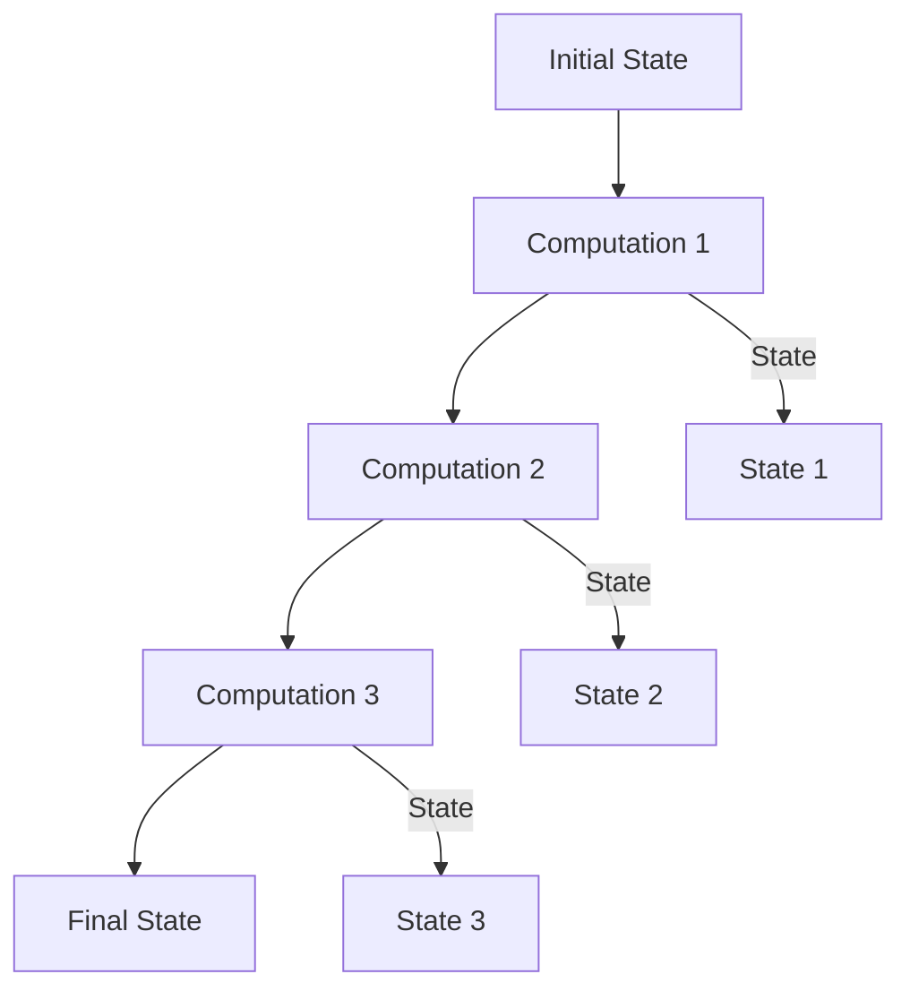

## 7.5 The State Monad Pattern

In the realm of functional programming, managing state is often seen as a challenge due to the immutable nature of data. However, Haskell provides a powerful abstraction known as the **State Monad** to elegantly handle stateful computations while maintaining purity. In this section, we will delve into the State Monad Pattern, exploring its concepts, benefits, implementation, and practical applications.

### Concept

The State Monad Pattern is a design pattern used to model stateful computations in a purely functional way. It allows us to encapsulate state transformations without resorting to mutable variables, thus preserving the functional paradigm's core principles.

#### Key Concepts

- **Stateful Computations**: These are computations that depend on or modify some state. In imperative languages, this is often achieved using mutable variables. In Haskell, we use the State Monad to achieve similar results without mutability.
- **State Monad**: A monad that threads state through a sequence of computations, allowing each computation to read from and write to the state.

### Benefits

The State Monad Pattern offers several benefits:

- **Encapsulation of State**: It encapsulates state transformations, making it easier to reason about state changes.
- **Purity**: By avoiding mutable variables, it maintains the purity of functions, ensuring that functions have no side effects.
- **Composability**: The State Monad allows for the composition of stateful computations, enabling complex state transformations to be built from simpler ones.

### Implementation

To implement the State Monad Pattern, we utilize the `State` monad provided by Haskell's `Control.Monad.State` module. This monad allows us to thread state through a series of computations seamlessly.

#### Basic Structure

The `State` monad is defined as follows:

```haskell
newtype State s a = State { runState :: s -> (a, s) }
```

- `s` represents the type of the state.
- `a` represents the type of the result produced by the computation.

The `State` monad provides two primary operations:

- **`get`**: Retrieves the current state.
- **`put`**: Updates the state with a new value.

#### Example: Random Number Generator

Let's explore a practical example of using the State Monad Pattern to implement a random number generator where the state carries the seed.

```haskell
import Control.Monad.State

type RandomState = State Int

-- A simple random number generator
randomNumber :: RandomState Int
randomNumber = do
  seed <- get
  let newSeed = (seed * 1103515245 + 12345) `mod` 2147483648
  put newSeed
  return (newSeed `mod` 100)

-- Generate a list of random numbers
randomNumbers :: Int -> RandomState [Int]
randomNumbers 0 = return []
randomNumbers n = do
  r <- randomNumber
  rs <- randomNumbers (n - 1)
  return (r : rs)

-- Running the random number generator with an initial seed
main :: IO ()
main = do
  let initialState = 42
      (numbers, finalState) = runState (randomNumbers 10) initialState
  putStrLn $ "Random Numbers: " ++ show numbers
  putStrLn $ "Final State (Seed): " ++ show finalState
```

In this example, we define a simple random number generator using the `State` monad. The state represents the seed, and each call to `randomNumber` updates the seed and returns a random number.

### Visualizing the State Monad

To better understand how the State Monad works, let's visualize the flow of state through a sequence of computations.



In this diagram, we see how the initial state is passed through a series of computations, with each computation potentially modifying the state. The final state is the result of all these transformations.

### Key Participants

The State Monad Pattern involves several key participants:

- **State Monad**: The core abstraction that encapsulates stateful computations.
- **State Transformer Functions**: Functions that operate on the state, often using `get` and `put`.
- **Stateful Logic**: The logic that defines how the state is transformed through a sequence of computations.

### Applicability

The State Monad Pattern is applicable in scenarios where:

- You need to manage state in a purely functional way.
- You want to encapsulate state transformations without mutable variables.
- You need to compose complex stateful computations from simpler ones.

### Design Considerations

When using the State Monad Pattern, consider the following:

- **State Size**: Be mindful of the size of the state being threaded through computations, as large states can impact performance.
- **State Dependencies**: Ensure that state dependencies are well-defined and do not lead to unintended side effects.
- **Testing**: The State Monad Pattern can simplify testing by isolating stateful logic from side effects.

### Haskell Unique Features

Haskell's type system and monadic abstractions make the State Monad Pattern particularly powerful. The ability to define custom monads and leverage Haskell's strong typing ensures that stateful computations are both safe and expressive.

### Differences and Similarities

The State Monad Pattern is often compared to other monadic patterns, such as the Reader Monad Pattern. While both patterns involve threading data through computations, the State Monad Pattern focuses on mutable state, whereas the Reader Monad Pattern deals with read-only environments.

### Try It Yourself

To deepen your understanding of the State Monad Pattern, try modifying the random number generator example:

- Change the range of random numbers generated.
- Implement a different stateful computation, such as a simple counter.
- Experiment with threading multiple pieces of state through computations.

### Knowledge Check

Before we conclude, let's reinforce our understanding with a few questions:

- How does the State Monad Pattern encapsulate state transformations?
- What are the primary operations provided by the State Monad?
- How can the State Monad Pattern simplify testing of stateful logic?

### Embrace the Journey

Remember, mastering the State Monad Pattern is just one step in your journey as a Haskell developer. As you continue to explore functional programming, you'll discover even more powerful abstractions and patterns. Keep experimenting, stay curious, and enjoy the journey!

## Quiz: The State Monad Pattern



### What is the primary purpose of the State Monad Pattern in Haskell?

- [x] To model stateful computations in a pure functional way
- [ ] To handle side effects in a program
- [ ] To manage asynchronous operations
- [ ] To optimize performance of computations

> **Explanation:** The State Monad Pattern is used to model stateful computations in a purely functional way, allowing state transformations without mutable variables.

### Which operation in the State Monad retrieves the current state?

- [x] `get`
- [ ] `put`
- [ ] `modify`
- [ ] `return`

> **Explanation:** The `get` operation retrieves the current state in the State Monad.

### What does the `put` operation do in the State Monad?

- [x] Updates the state with a new value
- [ ] Retrieves the current state
- [ ] Composes two stateful computations
- [ ] Returns the result of a computation

> **Explanation:** The `put` operation updates the state with a new value in the State Monad.

### How does the State Monad Pattern maintain purity in Haskell?

- [x] By encapsulating state transformations without mutable variables
- [ ] By using mutable variables internally
- [ ] By avoiding stateful computations altogether
- [ ] By using side effects to manage state

> **Explanation:** The State Monad Pattern maintains purity by encapsulating state transformations without mutable variables, ensuring functions have no side effects.

### What is a common use case for the State Monad Pattern?

- [x] Implementing a random number generator
- [ ] Handling asynchronous events
- [ ] Managing network connections
- [ ] Optimizing database queries

> **Explanation:** A common use case for the State Monad Pattern is implementing a random number generator, where the state carries the seed.

### How can the State Monad Pattern simplify testing?

- [x] By isolating stateful logic from side effects
- [ ] By introducing mutable variables
- [ ] By making state transformations implicit
- [ ] By avoiding stateful computations

> **Explanation:** The State Monad Pattern simplifies testing by isolating stateful logic from side effects, making it easier to test state transformations.

### What is the type signature of the `runState` function?

- [x] `State s a -> s -> (a, s)`
- [ ] `s -> State s a -> (a, s)`
- [ ] `State a s -> s -> (a, s)`
- [ ] `s -> a -> State s a`

> **Explanation:** The `runState` function has the type signature `State s a -> s -> (a, s)`, where it takes a stateful computation and an initial state, returning a result and a new state.

### Which monad is often compared to the State Monad Pattern?

- [x] Reader Monad
- [ ] IO Monad
- [ ] List Monad
- [ ] Maybe Monad

> **Explanation:** The Reader Monad is often compared to the State Monad Pattern, as both involve threading data through computations, but the Reader Monad deals with read-only environments.

### What should be considered when using the State Monad Pattern?

- [x] State size and dependencies
- [ ] Network latency
- [ ] Database schema
- [ ] User interface design

> **Explanation:** When using the State Monad Pattern, consider the size of the state and its dependencies to avoid performance issues and unintended side effects.

### True or False: The State Monad Pattern can only be used for simple stateful computations.

- [ ] True
- [x] False

> **Explanation:** False. The State Monad Pattern can be used for both simple and complex stateful computations, allowing for the composition of state transformations.


