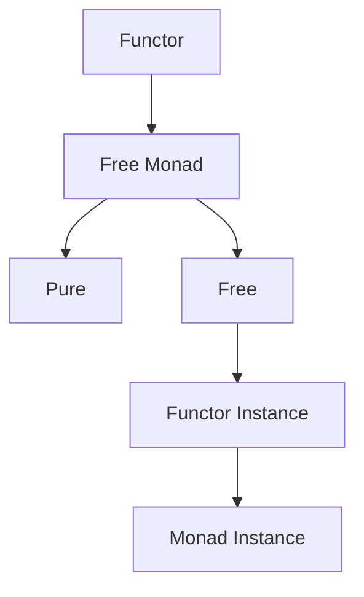
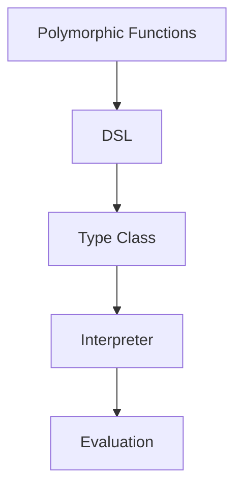

## 7.6 The Free Monad and Tagless Final Style

In the realm of functional programming, Haskell stands out for its expressive power and ability to abstract complex computations. Two advanced design patterns that exemplify this capability are the **Free Monad** and the **Tagless Final Style**. These patterns are pivotal for building domain-specific languages (DSLs) and facilitating flexible, composable, and interpretable code. This section delves into these patterns, illustrating their implementation and advantages.

### Understanding Free Monads

#### Intent

The Free Monad pattern allows developers to construct monads from functors, representing computations as data structures. This approach is particularly useful for creating DSLs where the computation logic can be separated from its execution.

#### Key Participants

- **Functor**: A type class that defines how functions can be mapped over a data structure.
- **Free Monad**: A monad constructed from a functor, enabling the representation of computations as data.

#### Applicability

Use Free Monads when you need to:

- Build interpretable and composable DSLs.
- Separate the definition of computations from their execution.
- Facilitate testing and optimization by abstracting execution logic.

#### Sample Code Snippet

Let's start by defining a simple DSL for arithmetic operations using Free Monads.

```haskell
{-# LANGUAGE DeriveFunctor #-}

-- Define a functor for arithmetic operations
data ExprF a
  = Val Int
  | Add a a
  | Mul a a
  deriving (Functor)

-- Define the Free Monad
data Free f a
  = Pure a
  | Free (f (Free f a))

-- Functor instance for Free
instance Functor f => Functor (Free f) where
  fmap f (Pure a) = Pure (f a)
  fmap f (Free fa) = Free (fmap (fmap f) fa)

-- Monad instance for Free
instance Functor f => Monad (Free f) where
  return = Pure
  Pure a >>= f = f a
  Free fa >>= f = Free (fmap (>>= f) fa)

-- Smart constructors for the DSL
val :: Int -> Free ExprF Int
val x = Free (Val x)

add :: Free ExprF Int -> Free ExprF Int -> Free ExprF Int
add x y = Free (Add x y)

mul :: Free ExprF Int -> Free ExprF Int -> Free ExprF Int
mul x y = Free (Mul x y)

-- Example expression
expr :: Free ExprF Int
expr = add (val 1) (mul (val 2) (val 3))
```

#### Design Considerations

- **Interpretation**: Free Monads allow multiple interpretations of the same computation, enabling flexibility in execution.
- **Optimization**: By representing computations as data, you can optimize or transform them before execution.
- **Testing**: The separation of computation logic from execution facilitates easier testing and debugging.

### Visualizing Free Monads

Below is a diagram illustrating the structure of a Free Monad and its components.



**Diagram Description**: This diagram shows how a Functor is used to construct a Free Monad, which consists of `Pure` and `Free` components. The `Free` component contains a functor instance, and the entire structure forms a Monad.

### Exploring Tagless Final Style

#### Intent

The Tagless Final Style defines computations as polymorphic functions, avoiding specific data types. This approach provides flexibility in interpretation and execution, making it ideal for building DSLs that can be adapted to various contexts.

#### Key Participants

- **Polymorphic Functions**: Functions that can operate on any type, providing flexibility in computation.
- **DSL**: A domain-specific language defined using polymorphic functions.

#### Applicability

Use Tagless Final Style when you need to:

- Define computations that can be interpreted in multiple ways.
- Avoid the overhead of constructing and deconstructing data types.
- Leverage Haskell's type system for flexible and safe DSLs.

#### Sample Code Snippet

Let's define a similar arithmetic DSL using the Tagless Final Style.

```haskell
-- Define a type class for arithmetic operations
class Expr repr where
  val :: Int -> repr Int
  add :: repr Int -> repr Int -> repr Int
  mul :: repr Int -> repr Int -> repr Int

-- An interpreter for the DSL
newtype Eval a = Eval { runEval :: a }

instance Expr Eval where
  val x = Eval x
  add (Eval x) (Eval y) = Eval (x + y)
  mul (Eval x) (Eval y) = Eval (x * y)

-- Example expression
expr :: Expr repr => repr Int
expr = add (val 1) (mul (val 2) (val 3))

-- Evaluate the expression
result :: Int
result = runEval expr
```

#### Design Considerations

- **Flexibility**: Tagless Final Style allows for flexible interpretation of computations, adapting to different contexts without changing the core logic.
- **Efficiency**: By avoiding specific data types, this style reduces the overhead associated with data construction and deconstruction.
- **Safety**: Leveraging Haskell's type system ensures that computations are type-safe and free from runtime errors.

### Visualizing Tagless Final Style

Below is a diagram illustrating the structure of the Tagless Final Style and its components.



**Diagram Description**: This diagram shows how polymorphic functions are used to define a DSL, which is then interpreted by a type class and evaluated by an interpreter.

### Differences and Similarities

- **Free Monad vs. Tagless Final**: While Free Monads represent computations as data structures, Tagless Final Style uses polymorphic functions to define computations. Both approaches facilitate flexible interpretation, but they differ in their representation and execution strategies.
- **Use Cases**: Free Monads are ideal for scenarios where computations need to be transformed or optimized before execution. Tagless Final Style is suited for contexts requiring flexible and efficient interpretation.

### Haskell Unique Features

- **Type System**: Haskell's strong static typing and type inference are leveraged in both patterns to ensure safety and flexibility.
- **Higher-Order Functions**: Both patterns make extensive use of higher-order functions to define and manipulate computations.
- **Lazy Evaluation**: Haskell's lazy evaluation model complements these patterns by allowing computations to be defined without immediate execution.

### Try It Yourself

Experiment with the provided code examples by:

- Modifying the arithmetic operations to include subtraction or division.
- Creating new interpreters for the DSLs, such as one that generates a string representation of the expression.
- Extending the DSLs to support additional features, such as variables or conditionals.

### Knowledge Check

- How do Free Monads facilitate the separation of computation logic from execution?
- What are the advantages of using Tagless Final Style over Free Monads?
- How does Haskell's type system contribute to the safety and flexibility of these patterns?

### Embrace the Journey

Remember, mastering these patterns is just the beginning. As you continue to explore Haskell's capabilities, you'll discover new ways to leverage its expressive power for building complex and efficient applications. Keep experimenting, stay curious, and enjoy the journey!

## Quiz: The Free Monad and Tagless Final Style



### What is the primary advantage of using Free Monads?

- [x] They allow computations to be represented as data structures.
- [ ] They eliminate the need for functors.
- [ ] They are faster than other monad implementations.
- [ ] They simplify the Haskell type system.

> **Explanation:** Free Monads represent computations as data structures, enabling flexible interpretation and optimization.

### How does the Tagless Final Style differ from Free Monads?

- [x] It uses polymorphic functions instead of data structures.
- [ ] It requires more boilerplate code.
- [ ] It is less flexible than Free Monads.
- [ ] It does not support DSLs.

> **Explanation:** Tagless Final Style defines computations as polymorphic functions, avoiding specific data structures.

### What is a key benefit of using the Tagless Final Style?

- [x] It provides flexible interpretation of computations.
- [ ] It requires less type safety.
- [ ] It is only suitable for simple DSLs.
- [ ] It mandates the use of monads.

> **Explanation:** Tagless Final Style allows for flexible interpretation of computations, adapting to different contexts.

### Which Haskell feature is crucial for both Free Monads and Tagless Final Style?

- [x] Strong static typing
- [ ] Dynamic typing
- [ ] Implicit conversions
- [ ] Weak typing

> **Explanation:** Haskell's strong static typing ensures safety and flexibility in both patterns.

### What is a common use case for Free Monads?

- [x] Building interpretable and composable DSLs
- [ ] Simplifying arithmetic operations
- [ ] Enhancing runtime performance
- [ ] Reducing code complexity

> **Explanation:** Free Monads are ideal for creating DSLs where computation logic is separated from execution.

### How can you extend the arithmetic DSL in the Tagless Final Style?

- [x] By adding new operations like subtraction or division
- [ ] By removing the existing operations
- [ ] By converting it to a Free Monad
- [ ] By using only pure functions

> **Explanation:** You can extend the DSL by adding new operations, leveraging the flexibility of the Tagless Final Style.

### What does the `Expr` type class represent in the Tagless Final Style example?

- [x] A set of operations for the arithmetic DSL
- [ ] A monad transformer
- [ ] A data structure for storing expressions
- [ ] A functor instance

> **Explanation:** The `Expr` type class defines a set of operations for the arithmetic DSL.

### Why is lazy evaluation beneficial for these patterns?

- [x] It allows computations to be defined without immediate execution.
- [ ] It forces all computations to be executed immediately.
- [ ] It simplifies the Haskell syntax.
- [ ] It eliminates the need for type classes.

> **Explanation:** Lazy evaluation enables computations to be defined without immediate execution, complementing these patterns.

### What is a potential drawback of using Free Monads?

- [x] They can introduce performance overhead due to data structure manipulation.
- [ ] They lack flexibility in interpretation.
- [ ] They are not compatible with Haskell's type system.
- [ ] They require dynamic typing.

> **Explanation:** Free Monads can introduce performance overhead due to the manipulation of data structures.

### True or False: Both Free Monads and Tagless Final Style can be used to build DSLs in Haskell.

- [x] True
- [ ] False

> **Explanation:** Both patterns are well-suited for building DSLs in Haskell, offering different advantages and trade-offs.


