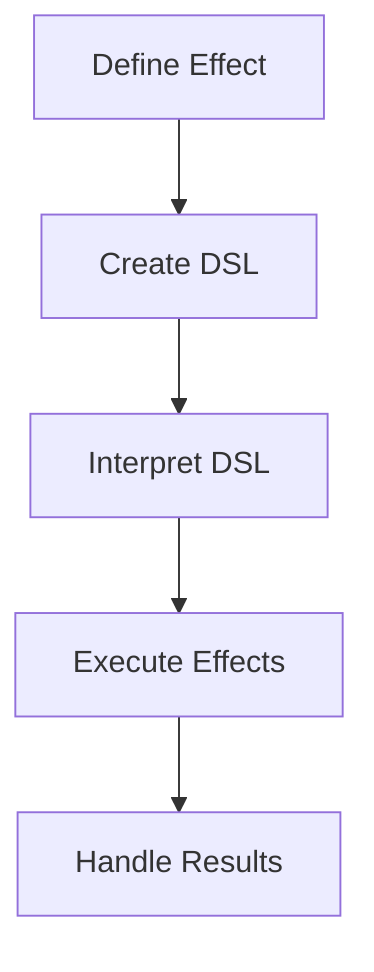

## 7.7 Effect Systems and Effect Management

Effect systems and effect management are crucial concepts in Haskell, enabling developers to handle side effects in a modular and composable manner. In this section, we will delve into the intricacies of effect systems, explore various techniques for managing effects, and provide practical examples to illustrate these concepts.

### Introduction to Effect Systems

In functional programming, side effects are operations that interact with the outside world or alter the state of a program. Examples include reading from a file, writing to a database, or modifying a global variable. Haskell, being a purely functional language, emphasizes immutability and referential transparency, which makes handling side effects a unique challenge.

Effect systems provide a structured way to manage side effects by separating effectful computations from their execution. This separation allows for greater modularity, testability, and composability in Haskell programs.

### Techniques for Effect Management

There are several techniques for managing effects in Haskell, each with its own strengths and trade-offs. The most common techniques include:

1. **Monad Transformers**: Monad transformers allow you to stack multiple monads, enabling the combination of different effects in a single computation.
2. **Free Monads**: Free monads provide a way to define effectful computations as data structures, which can be interpreted in various ways.
3. **Algebraic Effects**: Algebraic effects offer a more flexible and composable approach to effect management, allowing for the definition of custom effects and handlers.

Let's explore each of these techniques in detail.

### Monad Transformers

Monad transformers are a powerful tool for combining multiple monads into a single computation. They allow you to layer effects, such as state, logging, and IO, in a modular way. The `MonadTrans` type class provides the `lift` function, which is used to lift computations from an inner monad to the transformed monad.

#### Example: Combining State and IO

Consider a simple application that maintains a counter and logs messages to the console. We can use the `StateT` and `IO` monads to manage state and perform IO operations, respectively.

```haskell
import Control.Monad.State
import Control.Monad.IO.Class

type App = StateT Int IO

incrementCounter :: App ()
incrementCounter = do
    modify (+1)
    count <- get
    liftIO $ putStrLn $ "Counter: " ++ show count

main :: IO ()
main = evalStateT (replicateM_ 5 incrementCounter) 0
```

In this example, `StateT Int IO` is a monad transformer stack that combines state management and IO. The `incrementCounter` function increments the counter and logs the current value to the console.

#### Key Considerations

- **Modularity**: Monad transformers allow you to compose effects in a modular way, making it easy to add or remove effects as needed.
- **Complexity**: Stacking multiple monad transformers can lead to complex type signatures and boilerplate code.

### Free Monads

Free monads provide a way to define effectful computations as data structures, which can be interpreted in various ways. This approach decouples the definition of effects from their execution, allowing for greater flexibility and testability.

#### Example: Defining a Simple DSL

Let's define a simple domain-specific language (DSL) for a logging application using free monads.

```haskell
{-# LANGUAGE DeriveFunctor #-}

import Control.Monad.Free

data LogF next
    = LogMessage String next
    | End
    deriving (Functor)

type Log = Free LogF

logMessage :: String -> Log ()
logMessage msg = liftF $ LogMessage msg ()

end :: Log ()
end = liftF End

runLog :: Log a -> IO a
runLog (Free (LogMessage msg next)) = do
    putStrLn msg
    runLog next
runLog (Free End) = return ()
runLog (Pure r) = return r

main :: IO ()
main = runLog $ do
    logMessage "Starting application..."
    logMessage "Performing some operations..."
    logMessage "Ending application."
    end
```

In this example, we define a `LogF` functor representing logging operations and use the `Free` monad to build a logging DSL. The `runLog` function interprets the DSL by printing log messages to the console.

#### Key Considerations

- **Flexibility**: Free monads allow you to define custom DSLs and interpret them in different ways, making them highly flexible.
- **Performance**: Free monads can introduce performance overhead due to the additional layer of abstraction.

### Algebraic Effects

Algebraic effects offer a more flexible and composable approach to effect management. They allow you to define custom effects and handlers, providing a high level of abstraction and control over effectful computations.

#### Example: Custom Effect for Logging

Let's define a custom effect for logging using algebraic effects.

```haskell
{-# LANGUAGE GADTs #-}
{-# LANGUAGE FlexibleContexts #-}
{-# LANGUAGE TypeOperators #-}
{-# LANGUAGE DataKinds #-}
{-# LANGUAGE PolyKinds #-}
{-# LANGUAGE ScopedTypeVariables #-}

import Control.Eff
import Control.Eff.Lift
import Control.Eff.Writer.Lazy

data Log v where
    LogMessage :: String -> Log ()

logMessage :: Member Log r => String -> Eff r ()
logMessage msg = send (LogMessage msg)

runLog :: Eff (Log ': r) w -> Eff r w
runLog = handleRelay return (\\(LogMessage msg) k -> lift (putStrLn msg) >>= k)

main :: IO ()
main = runLift $ runLog $ do
    logMessage "Starting application..."
    logMessage "Performing some operations..."
    logMessage "Ending application."
```

In this example, we define a `Log` effect using the `Eff` library and implement a handler `runLog` that interprets the effect by printing log messages to the console.

#### Key Considerations

- **Composability**: Algebraic effects provide a high level of composability, allowing you to define and combine custom effects easily.
- **Complexity**: Algebraic effects can be complex to implement and understand, especially for developers new to the concept.

### Visualizing Effect Management

To better understand how effect systems work, let's visualize the flow of effectful computations using a Mermaid.js diagram.



This diagram illustrates the process of defining an effect, creating a DSL, interpreting the DSL, executing effects, and handling results.

### Haskell Unique Features

Haskell's type system and functional programming paradigm make it uniquely suited for effect management. Key features include:

- **Strong Static Typing**: Haskell's type system ensures that effects are explicitly managed and tracked, reducing the risk of unintended side effects.
- **Immutability**: Haskell's emphasis on immutability makes it easier to reason about effectful computations and their impact on program state.
- **Lazy Evaluation**: Haskell's lazy evaluation model allows for efficient handling of effects, enabling the creation of infinite data structures and deferred computations.

### Differences and Similarities

Effect systems in Haskell can be compared to other approaches, such as:

- **Monad Transformers vs. Free Monads**: Monad transformers provide a more direct way to combine effects, while free monads offer greater flexibility and abstraction.
- **Algebraic Effects vs. Monad Transformers**: Algebraic effects provide a higher level of composability and abstraction, but can be more complex to implement.

### Design Considerations

When choosing an effect management technique, consider the following:

- **Complexity**: Evaluate the complexity of the technique and its impact on code readability and maintainability.
- **Performance**: Consider the performance implications of each technique, especially in performance-critical applications.
- **Flexibility**: Assess the flexibility of the technique and its ability to adapt to changing requirements.

### Try It Yourself

To deepen your understanding of effect systems, try modifying the examples provided:

- **Experiment with Monad Transformers**: Add additional effects, such as error handling or logging, to the monad transformer stack.
- **Extend the Free Monad DSL**: Add new operations to the logging DSL and implement different interpreters.
- **Create Custom Algebraic Effects**: Define your own effects and handlers, and explore different ways to compose them.

### Knowledge Check

- **What are the key benefits of using effect systems in Haskell?**
- **How do monad transformers differ from free monads?**
- **What are algebraic effects, and how do they enhance composability?**

### Conclusion

Effect systems and effect management are essential tools for handling side effects in Haskell. By leveraging techniques such as monad transformers, free monads, and algebraic effects, developers can create modular, composable, and testable programs. As you continue your journey with Haskell, remember to experiment with different effect management techniques and explore their potential to enhance your applications.

## Quiz: Effect Systems and Effect Management



### What is the primary purpose of effect systems in Haskell?

- [x] To manage side effects in a modular and composable way
- [ ] To improve performance of pure functions
- [ ] To simplify syntax of Haskell programs
- [ ] To enhance type inference capabilities

> **Explanation:** Effect systems are designed to manage side effects in a modular and composable manner, allowing for greater flexibility and testability in Haskell programs.

### Which technique allows you to stack multiple monads to combine different effects?

- [x] Monad Transformers
- [ ] Free Monads
- [ ] Algebraic Effects
- [ ] Type Classes

> **Explanation:** Monad transformers allow you to stack multiple monads, enabling the combination of different effects in a single computation.

### What is a key advantage of using free monads?

- [x] Flexibility in defining and interpreting custom DSLs
- [ ] Improved performance over monad transformers
- [ ] Simplified type signatures
- [ ] Automatic error handling

> **Explanation:** Free monads provide flexibility by allowing you to define effectful computations as data structures, which can be interpreted in various ways.

### How do algebraic effects enhance composability?

- [x] By allowing the definition of custom effects and handlers
- [ ] By reducing the need for type annotations
- [ ] By automatically optimizing effectful computations
- [ ] By providing built-in error handling

> **Explanation:** Algebraic effects enhance composability by allowing developers to define custom effects and handlers, providing a high level of abstraction and control.

### What is a potential drawback of using monad transformers?

- [x] Complex type signatures and boilerplate code
- [ ] Limited flexibility in defining custom effects
- [ ] Poor performance in effectful computations
- [ ] Lack of support for IO operations

> **Explanation:** Monad transformers can lead to complex type signatures and boilerplate code, especially when stacking multiple transformers.

### Which feature of Haskell ensures that effects are explicitly managed and tracked?

- [x] Strong Static Typing
- [ ] Lazy Evaluation
- [ ] Immutability
- [ ] Higher-Order Functions

> **Explanation:** Haskell's strong static typing ensures that effects are explicitly managed and tracked, reducing the risk of unintended side effects.

### What is a common use case for free monads in Haskell?

- [x] Defining domain-specific languages (DSLs)
- [ ] Optimizing pure functions
- [ ] Simplifying type inference
- [ ] Enhancing concurrency

> **Explanation:** Free monads are commonly used to define domain-specific languages (DSLs) and interpret them in various ways.

### How do algebraic effects differ from monad transformers?

- [x] Algebraic effects provide a higher level of composability and abstraction
- [ ] Algebraic effects are simpler to implement
- [ ] Algebraic effects automatically handle errors
- [ ] Algebraic effects are limited to IO operations

> **Explanation:** Algebraic effects provide a higher level of composability and abstraction compared to monad transformers, allowing for more flexible effect management.

### What is a key benefit of separating effectful computations from their execution?

- [x] Improved modularity and testability
- [ ] Enhanced performance of pure functions
- [ ] Simplified syntax of Haskell programs
- [ ] Automatic type inference

> **Explanation:** Separating effectful computations from their execution improves modularity and testability, allowing for greater flexibility in managing effects.

### True or False: Free monads can introduce performance overhead due to the additional layer of abstraction.

- [x] True
- [ ] False

> **Explanation:** Free monads can introduce performance overhead due to the additional layer of abstraction, which may impact performance in certain scenarios.



Remember, mastering effect systems and effect management in Haskell is a journey. Keep experimenting, stay curious, and enjoy the process of building more modular and composable applications!


