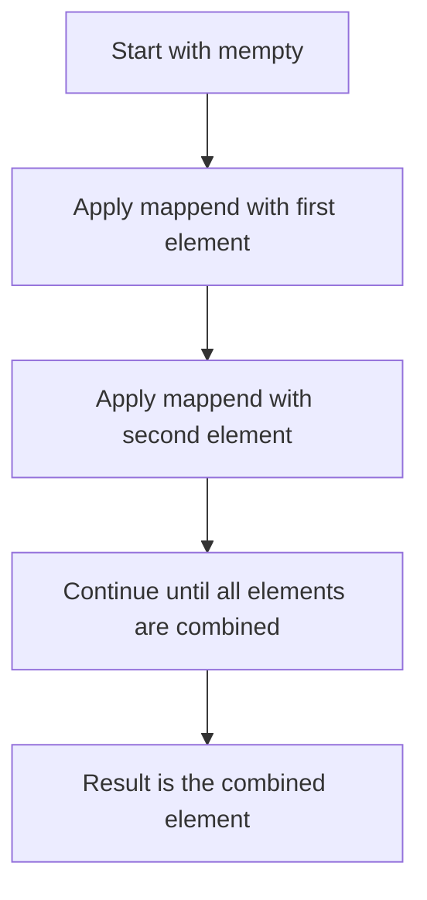
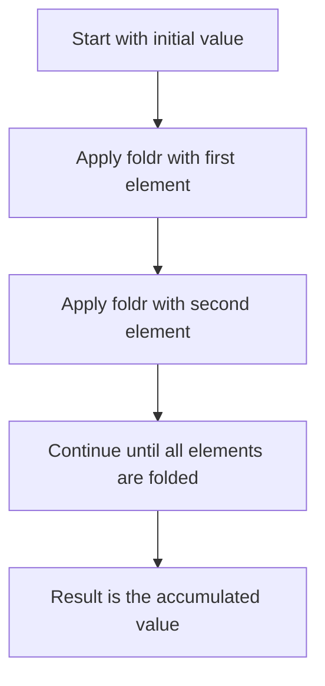

## 7.8 Monoid and Foldable Patterns

In the realm of functional programming, Haskell stands out with its powerful abstractions that simplify complex operations. Among these abstractions, the concepts of **Monoid** and **Foldable** play a crucial role in data manipulation and aggregation. In this section, we will delve deep into these patterns, exploring their theoretical foundations, practical applications, and how they can be leveraged to write elegant and efficient Haskell code.

### Understanding Monoids

#### Monoid Concept

A **Monoid** is an algebraic structure that consists of:

1. **An associative binary operation**: This operation combines two elements of the monoid to form another element of the same type.
2. **An identity element**: This element acts as a neutral element for the binary operation, meaning that combining any element with the identity element leaves the element unchanged.

In Haskell, a type is a monoid if it implements the `Monoid` type class, which is defined as follows:

```haskell
class Monoid m where
    mempty  :: m
    mappend :: m -> m -> m
    mconcat :: [m] -> m
    mconcat = foldr mappend mempty
```

- **`mempty`**: Represents the identity element.
- **`mappend`**: Represents the associative binary operation.
- **`mconcat`**: Combines a list of monoid elements into a single element using `mappend`.

#### Key Participants

- **Types**: Any type that can define `mempty` and `mappend` can be a monoid.
- **Operations**: `mappend` and `mconcat` are the primary operations used to combine elements.

#### Applicability

Monoids are applicable in scenarios where you need to aggregate results or combine data. They are particularly useful in parallel processing, where the associative property allows for flexible computation order.

#### Example: Summing Numbers

Consider the task of summing a list of numbers. The `Sum` type in Haskell is a monoid, where `mempty` is `0` and `mappend` is addition:

```haskell
import Data.Monoid

sumNumbers :: [Int] -> Int
sumNumbers = getSum . mconcat . map Sum

-- Usage
main :: IO ()
main = print $ sumNumbers [1, 2, 3, 4, 5]  -- Output: 15
```

### Visualizing Monoid Operations

To better understand how monoids work, let's visualize the process of combining elements using a flowchart:



### Foldable Patterns

#### Foldable Concept

The **Foldable** type class abstracts the pattern of folding (reducing) data structures. It provides a way to traverse a data structure and accumulate results. The `Foldable` type class is defined as:

```haskell
class Foldable t where
    fold    :: Monoid m => t m -> m
    foldMap :: Monoid m => (a -> m) -> t a -> m
    foldr   :: (a -> b -> b) -> b -> t a -> b
    foldl   :: (b -> a -> b) -> b -> t a -> b
```

- **`fold`**: Reduces a structure of monoid elements to a single element.
- **`foldMap`**: Maps each element to a monoid and then folds the structure.
- **`foldr`** and **`foldl`**: Right and left folds, respectively, which reduce a structure using a binary function.

#### Key Participants

- **Data Structures**: Any data structure that can be traversed and reduced can implement `Foldable`.
- **Operations**: `fold`, `foldMap`, `foldr`, and `foldl` are the primary operations for folding.

#### Applicability

Foldable patterns are applicable when you need to traverse and reduce data structures, such as lists, trees, or custom data types. They are essential for operations like summing, finding maximum/minimum, and more.

#### Example: Concatenating Lists

Let's see how to concatenate a list of lists using `Foldable`:

```haskell
concatLists :: [[a]] -> [a]
concatLists = foldr (++) []

-- Usage
main :: IO ()
main = print $ concatLists [[1, 2], [3, 4], [5]]  -- Output: [1, 2, 3, 4, 5]
```

### Visualizing Foldable Operations

Here's a diagram to illustrate the process of folding a list:



### Combining Monoid and Foldable

The true power of monoids and foldables comes when they are combined. By using `foldMap`, we can map each element of a structure to a monoid and then fold the structure in one go. This is particularly useful for complex data transformations.

#### Example: Counting Elements

Suppose we want to count the number of elements in a list. We can use `foldMap` with the `Sum` monoid:

```haskell
countElements :: [a] -> Int
countElements = getSum . foldMap (const (Sum 1))

-- Usage
main :: IO ()
main = print $ countElements [1, 2, 3, 4, 5]  -- Output: 5
```

### Design Considerations

When using monoids and foldables, consider the following:

- **Associativity**: Ensure that the binary operation is associative, as this is crucial for the correctness of the monoid.
- **Identity Element**: Define a meaningful identity element that does not affect the result when combined with other elements.
- **Performance**: Be mindful of the performance implications of folding large data structures, especially with left folds (`foldl`) which can lead to stack overflow.

### Haskell Unique Features

Haskell's strong type system and type classes make it uniquely suited for defining and using monoids and foldables. The language's emphasis on immutability and pure functions aligns perfectly with the algebraic nature of these patterns.

### Differences and Similarities

Monoids and foldables are often confused with other patterns like functors and applicatives. The key difference is that monoids focus on combining elements, while foldables focus on reducing data structures. Functors and applicatives, on the other hand, are about applying functions to wrapped values.

### Try It Yourself

To deepen your understanding, try modifying the code examples:

- **Experiment with different monoids**: Create your own monoid types and implement `mempty` and `mappend`.
- **Use `foldMap` with different data structures**: Try folding trees or other custom data types.
- **Optimize performance**: Explore the differences between `foldr` and `foldl` and their impact on performance.

### Knowledge Check

- **What is a monoid?** Describe its components and provide an example.
- **How does `foldMap` work?** Explain its role in combining monoids and foldables.
- **What are the performance considerations when using foldable patterns?**

### Embrace the Journey

Remember, mastering monoids and foldables is just the beginning. These patterns are foundational to functional programming and will open the door to more advanced concepts. Keep experimenting, stay curious, and enjoy the journey!

## Quiz: Monoid and Foldable Patterns



### What are the two main components of a monoid?

- [x] An associative binary operation and an identity element
- [ ] A binary operation and a neutral element
- [ ] A unary operation and an identity element
- [ ] A commutative operation and a zero element

> **Explanation:** A monoid consists of an associative binary operation and an identity element.

### Which Haskell type class is used to define monoids?

- [x] Monoid
- [ ] Foldable
- [ ] Functor
- [ ] Applicative

> **Explanation:** The `Monoid` type class is used to define monoids in Haskell.

### What is the purpose of the `foldMap` function?

- [x] To map each element to a monoid and then fold the structure
- [ ] To concatenate lists
- [ ] To apply a function to each element of a list
- [ ] To reverse a list

> **Explanation:** `foldMap` maps each element to a monoid and then folds the structure.

### What is the identity element for the `Sum` monoid?

- [x] 0
- [ ] 1
- [ ] -1
- [ ] 10

> **Explanation:** The identity element for the `Sum` monoid is `0`.

### Which function is used to combine a list of monoid elements?

- [x] mconcat
- [ ] mappend
- [ ] foldr
- [ ] foldl

> **Explanation:** `mconcat` is used to combine a list of monoid elements.

### What is the main advantage of using monoids in parallel processing?

- [x] The associative property allows for flexible computation order
- [ ] They are faster than other operations
- [ ] They require less memory
- [ ] They are easier to implement

> **Explanation:** The associative property of monoids allows for flexible computation order, which is beneficial in parallel processing.

### What is the result of `foldr (++) [] [[1, 2], [3, 4], [5]]`?

- [x] [1, 2, 3, 4, 5]
- [ ] [[1, 2], [3, 4], [5]]
- [ ] [5, 4, 3, 2, 1]
- [ ] [1, 2, 3, 4]

> **Explanation:** `foldr (++) []` concatenates the lists, resulting in `[1, 2, 3, 4, 5]`.

### What is the difference between `foldr` and `foldl`?

- [x] `foldr` processes elements from right to left, `foldl` from left to right
- [ ] `foldr` is faster than `foldl`
- [ ] `foldl` is more memory efficient than `foldr`
- [ ] `foldr` is used for lists, `foldl` for trees

> **Explanation:** `foldr` processes elements from right to left, while `foldl` processes them from left to right.

### Which of the following is a valid instance of a monoid?

- [x] Lists with concatenation as the operation
- [ ] Integers with subtraction as the operation
- [ ] Strings with multiplication as the operation
- [ ] Booleans with XOR as the operation

> **Explanation:** Lists with concatenation form a valid monoid.

### True or False: Every Foldable is also a Functor.

- [x] True
- [ ] False

> **Explanation:** In Haskell, every `Foldable` is also a `Functor`.




