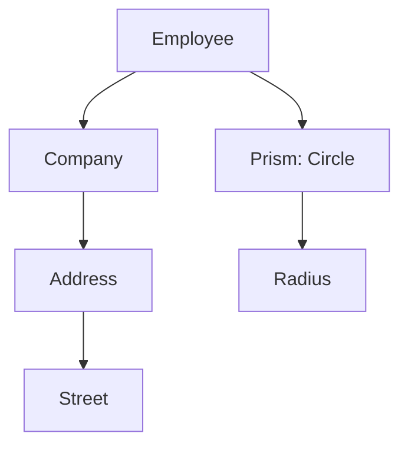

## 7.9 Lenses, Prisms, and Optics

In the realm of functional programming, Haskell stands out for its expressive power and abstraction capabilities. One of the most compelling features that Haskell offers is the concept of **optics**, which includes **lenses**, **prisms**, and other related constructs. These tools provide a powerful way to access and modify data structures in a composable and declarative manner. In this section, we will delve into the world of optics, exploring how they work, their applications, and how they can transform the way you handle data in Haskell.

### Understanding Optics

**Optics** are abstractions that allow you to focus on specific parts of a data structure. They enable you to view, update, and manipulate data without having to deal with the boilerplate code typically associated with such operations. Optics are composable, meaning you can combine them to create complex data access patterns.

#### Key Concepts

- **Composable Tools**: Optics are designed to be combined, allowing you to build complex operations from simple ones.
- **Data Access and Modification**: Optics provide a unified interface for both reading and writing data.
- **Declarative Syntax**: Optics allow you to express data manipulation in a clear and concise way.

### Lenses: Focusing on Data

**Lenses** are a type of optic that focus on a part of a data structure. They are particularly useful for accessing and updating fields within nested records. A lens is essentially a pair of functions: one for getting a value and another for setting a value.

#### Creating Lenses

Let's start by creating a simple lens manually. Consider the following data structure:

```haskell
data Person = Person
  { name :: String
  , age  :: Int
  } deriving (Show)
```

To create a lens for the `name` field, we define two functions: one to get the name and another to set it.

```haskell
-- Getter for the 'name' field
getName :: Person -> String
getName (Person n _) = n

-- Setter for the 'name' field
setName :: String -> Person -> Person
setName newName (Person _ a) = Person newName a
```

While this approach works, it quickly becomes cumbersome as the complexity of the data structure increases. This is where the **Lens** library comes into play.

#### Using the Lens Library

The [Lens Library](https://hackage.haskell.org/package/lens) provides a rich set of tools for working with lenses. Let's see how we can use it to simplify our code.

First, import the necessary modules:

```haskell
{-# LANGUAGE TemplateHaskell #-}

import Control.Lens
```

Now, we can use Template Haskell to automatically generate lenses for our data structure:

```haskell
makeLenses ''Person
```

This generates a lens for each field in the `Person` data type. You can now use these lenses to access and modify data:

```haskell
-- Accessing the 'name' field
john :: Person
john = Person "John Doe" 30

johnName :: String
johnName = john ^. name

-- Updating the 'name' field
johnUpdated :: Person
johnUpdated = john & name .~ "John Smith"
```

#### Lens Composition

One of the most powerful features of lenses is their ability to compose. You can combine multiple lenses to focus on deeply nested data structures.

Consider a more complex data structure:

```haskell
data Address = Address
  { street :: String
  , city   :: String
  } deriving (Show)

data Company = Company
  { companyName :: String
  , address     :: Address
  } deriving (Show)

data Employee = Employee
  { employeeName :: String
  , company      :: Company
  } deriving (Show)

makeLenses ''Address
makeLenses ''Company
makeLenses ''Employee
```

To access the `street` of an `Employee`'s `Company`'s `Address`, you can compose lenses:

```haskell
-- Accessing the 'street' field
employeeStreet :: Employee -> String
employeeStreet emp = emp ^. company . address . street

-- Updating the 'street' field
updateStreet :: String -> Employee -> Employee
updateStreet newStreet emp = emp & company . address . street .~ newStreet
```

### Prisms: Working with Sum Types

**Prisms** are another type of optic, designed to work with sum types (also known as variant types or tagged unions). They allow you to focus on one possibility of a sum type, providing a way to construct and deconstruct values.

#### Creating Prisms

Consider the following sum type:

```haskell
data Shape
  = Circle Double
  | Rectangle Double Double
  deriving (Show)

makePrisms ''Shape
```

The `makePrisms` function generates prisms for each constructor of the `Shape` type. You can use these prisms to work with specific constructors:

```haskell
-- Constructing a 'Circle'
circle :: Shape
circle = Circle 5.0

-- Using a prism to match and extract a 'Circle'
isCircle :: Shape -> Maybe Double
isCircle s = s ^? _Circle

-- Updating a 'Circle' radius
updateCircleRadius :: Double -> Shape -> Shape
updateCircleRadius newRadius s = s & _Circle .~ newRadius
```

#### Prism Composition

Like lenses, prisms can also be composed. This allows you to work with complex data structures that involve both product and sum types.

### Optics in Practice

Optics are not limited to lenses and prisms. The Lens library provides a variety of other optics, such as **traversals**, **isomorphisms**, and **folds**, each with its own use cases.

#### Traversals

**Traversals** are optics that focus on multiple parts of a data structure. They are useful for applying a function to each element in a collection.

```haskell
-- Using a traversal to increment each element in a list
incrementAll :: [Int] -> [Int]
incrementAll = over traverse (+1)
```

#### Isomorphisms

**Isomorphisms** are optics that represent a reversible transformation between two types. They are useful for converting between different representations of the same data.

```haskell
-- An isomorphism between a list and a string
listToString :: Iso' [Char] String
listToString = iso id id

-- Using the isomorphism
exampleString :: String
exampleString = ["H", "e", "l", "l", "o"] ^. listToString
```

### Visualizing Optics

To better understand how optics work, let's visualize the process of composing lenses and prisms.



**Diagram Explanation**: This diagram illustrates how lenses and prisms can be composed to access and modify deeply nested data structures. The path from `Employee` to `Street` represents lens composition, while the path from `Employee` to `Radius` represents prism usage.

### Design Considerations

When using optics, consider the following:

- **Performance**: While optics provide a clean and declarative way to manipulate data, they can introduce overhead. Profiling and optimization may be necessary for performance-critical applications.
- **Complexity**: Overuse of optics can lead to complex and hard-to-read code. Use optics judiciously and document their usage.
- **Type Safety**: Optics leverage Haskell's type system to ensure safe data manipulation. However, incorrect usage can lead to runtime errors, especially with prisms.

### Haskell Unique Features

Haskell's strong type system and support for higher-order functions make it an ideal language for implementing optics. The Lens library takes full advantage of these features, providing a powerful and flexible toolkit for data manipulation.

### Differences and Similarities

Optics are often compared to traditional getter and setter functions. However, optics offer several advantages:

- **Composability**: Optics can be composed to create complex data access patterns.
- **Declarative Syntax**: Optics provide a clear and concise way to express data manipulation.
- **Unified Interface**: Optics offer a consistent interface for both reading and writing data.

### Try It Yourself

Experiment with the code examples provided in this section. Try modifying the data structures and see how lenses and prisms can simplify your code. Consider creating your own optics for custom data types and explore the rich set of features offered by the Lens library.

### Knowledge Check

- What are the main differences between lenses and prisms?
- How can you compose lenses to access deeply nested data?
- What are some potential pitfalls of using optics in Haskell?

### Embrace the Journey

Remember, mastering optics in Haskell is a journey. As you become more comfortable with lenses, prisms, and other optics, you'll find new and creative ways to manipulate data in your applications. Keep experimenting, stay curious, and enjoy the process of learning and discovery!

## Quiz: Lenses, Prisms, and Optics



### What is the primary purpose of a lens in Haskell?

- [x] To focus on a part of a data structure for access and modification
- [ ] To handle concurrency in Haskell
- [ ] To perform type-level programming
- [ ] To manage side effects

> **Explanation:** Lenses are used to focus on a specific part of a data structure, allowing for easy access and modification.

### How do prisms differ from lenses?

- [x] Prisms work with sum types, while lenses work with product types
- [ ] Prisms are used for concurrency, while lenses are not
- [ ] Prisms are more efficient than lenses
- [ ] Prisms are used for type-level programming

> **Explanation:** Prisms are designed to work with sum types, allowing you to focus on one possibility of a sum type, whereas lenses work with product types.

### Which library provides a rich set of optics in Haskell?

- [x] Lens
- [ ] Conduit
- [ ] Aeson
- [ ] Warp

> **Explanation:** The Lens library provides a comprehensive set of tools for working with optics in Haskell.

### What is a key advantage of using optics over traditional getter and setter functions?

- [x] Composability
- [ ] Simplicity
- [ ] Performance
- [ ] Type inference

> **Explanation:** Optics offer composability, allowing you to combine them to create complex data access patterns.

### Which optic would you use to apply a function to each element in a collection?

- [x] Traversal
- [ ] Lens
- [ ] Prism
- [ ] Isomorphism

> **Explanation:** Traversals are used to focus on multiple parts of a data structure, such as applying a function to each element in a collection.

### What is an isomorphism in the context of optics?

- [x] A reversible transformation between two types
- [ ] A way to handle side effects
- [ ] A method for concurrency
- [ ] A type-level programming construct

> **Explanation:** Isomorphisms represent a reversible transformation between two types, allowing conversion between different representations of the same data.

### How can you generate lenses for a data type using the Lens library?

- [x] Use the `makeLenses` function with Template Haskell
- [ ] Manually define getter and setter functions
- [ ] Use the `deriveLenses` function
- [ ] Import the `Lens` module

> **Explanation:** The `makeLenses` function, used with Template Haskell, automatically generates lenses for each field in a data type.

### What is a potential drawback of overusing optics in Haskell?

- [x] Increased code complexity
- [ ] Reduced type safety
- [ ] Poor performance
- [ ] Lack of composability

> **Explanation:** Overusing optics can lead to complex and hard-to-read code, so it's important to use them judiciously.

### Which optic would you use to construct and deconstruct values of a sum type?

- [x] Prism
- [ ] Lens
- [ ] Traversal
- [ ] Isomorphism

> **Explanation:** Prisms are used to construct and deconstruct values of a sum type, focusing on one possibility of the type.

### True or False: Optics in Haskell provide a unified interface for both reading and writing data.

- [x] True
- [ ] False

> **Explanation:** Optics offer a consistent interface for both reading and writing data, making them a powerful tool for data manipulation.


