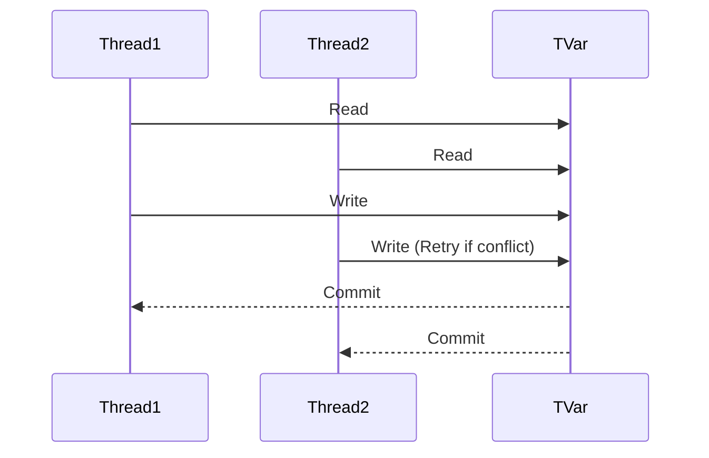

## 8.1 Concurrent Programming with Software Transactional Memory (STM)

Concurrent programming is a critical aspect of building scalable and efficient software systems. In Haskell, Software Transactional Memory (STM) offers a powerful abstraction for managing concurrency without the pitfalls of traditional locking mechanisms. This section delves into the concept of STM, its benefits, implementation, and practical applications, such as building a thread-safe in-memory cache.

### Understanding STM: A High-Level Overview

**STM Concept**:
Software Transactional Memory (STM) is a concurrency control mechanism that simplifies concurrent programming by allowing multiple threads to execute transactions on shared memory. It is analogous to database transactions, where operations are grouped into atomic units that either complete entirely or have no effect at all.

**Benefits of STM**:
- **Simplifies Concurrency**: STM abstracts away the complexities of locks, reducing the risk of deadlocks and race conditions.
- **Composability**: Transactions can be composed together, allowing for more modular and maintainable code.
- **Optimistic Concurrency**: STM uses an optimistic approach, assuming that conflicts are rare and handling them when they occur, which can lead to better performance in many scenarios.

### Key Components of STM in Haskell

To effectively use STM in Haskell, it's essential to understand its core components:

- **`STM` Monad**: The `STM` monad encapsulates computations that can be executed atomically. It provides a context for defining transactions.
- **`TVar`**: A `TVar` (Transactional Variable) is a mutable variable that can be read and written within an `STM` transaction. It serves as the primary means of sharing state between concurrent threads.

### Implementing STM in Haskell

Let's explore how to implement STM in Haskell with a practical example: building a thread-safe in-memory cache.

#### Step 1: Setting Up the Environment

First, ensure you have the necessary Haskell environment set up. You can use the `stack` tool to manage dependencies and build your project.

```bash
stack new stm-example
cd stm-example
stack setup
```

Add the `stm` package to your project's dependencies in the `package.yaml` file:

```yaml
dependencies:
- base >= 4.7 && < 5
- stm
```

#### Step 2: Defining the Cache

We'll define a simple in-memory cache using `TVar`s to store key-value pairs.

```haskell
import Control.Concurrent.STM
import Control.Monad (forM_)

type Cache k v = TVar [(k, v)]

-- Initialize an empty cache
newCache :: STM (Cache k v)
newCache = newTVar []

-- Insert a key-value pair into the cache
insertCache :: Eq k => Cache k v -> k -> v -> STM ()
insertCache cache key value = do
    kvs <- readTVar cache
    let kvs' = (key, value) : filter ((/= key) . fst) kvs
    writeTVar cache kvs'

-- Lookup a value by key
lookupCache :: Eq k => Cache k v -> k -> STM (Maybe v)
lookupCache cache key = do
    kvs <- readTVar cache
    return $ lookup key kvs
```

#### Step 3: Using the Cache in Concurrent Code

Now, let's demonstrate how to use this cache in a concurrent setting. We'll create multiple threads that interact with the cache concurrently.

```haskell
import Control.Concurrent
import Control.Concurrent.STM
import Control.Monad (forever, replicateM_)

main :: IO ()
main = do
    cache <- atomically newCache

    -- Spawn multiple threads to interact with the cache
    forM_ [1..10] $ \i -> forkIO $ do
        let key = "key" ++ show i
        atomically $ insertCache cache key (i * 10)
        value <- atomically $ lookupCache cache key
        putStrLn $ "Thread " ++ show i ++ " found value: " ++ show value

    -- Allow threads to complete
    threadDelay 1000000
```

### Visualizing STM Transactions

To better understand how STM transactions work, let's visualize the process using a sequence diagram.



**Diagram Explanation**:
- Both `Thread1` and `Thread2` read from the `TVar`.
- If `Thread1` writes first, `Thread2` will retry its transaction if a conflict occurs.
- Once conflicts are resolved, both transactions commit successfully.

### Design Considerations

When using STM, consider the following:

- **Granularity**: Choose the appropriate granularity for your `TVar`s. Too fine-grained can lead to excessive retries, while too coarse-grained can reduce concurrency.
- **Performance**: While STM simplifies concurrency, it may introduce overhead due to transaction retries. Profile your application to ensure performance meets your requirements.
- **Composability**: Leverage the composability of STM to build complex transactions from simpler ones.

### Haskell Unique Features

Haskell's type system and purity make STM particularly powerful:

- **Type Safety**: The `STM` monad ensures that side effects are controlled and transactions are atomic.
- **Purity**: Haskell's pure functions make it easier to reason about concurrent code, reducing the likelihood of bugs.

### Differences and Similarities

STM is often compared to traditional locking mechanisms. Here's how they differ:

- **Locks**: Require explicit management and can lead to deadlocks and race conditions.
- **STM**: Provides a higher-level abstraction, avoiding common pitfalls of locks.

### Try It Yourself

Experiment with the cache example by modifying the number of threads or the operations they perform. Observe how STM handles concurrency and ensures consistency.

### Knowledge Check

- **Question**: What is the primary advantage of using STM over traditional locks?
- **Exercise**: Modify the cache example to include a delete operation. Ensure it handles concurrent access correctly.

### Embrace the Journey

Remember, mastering STM is just the beginning. As you progress, you'll build more complex and concurrent systems. Keep experimenting, stay curious, and enjoy the journey!

## Quiz: Concurrent Programming with Software Transactional Memory (STM)



### What is the primary benefit of using STM in Haskell?

- [x] Simplifies concurrent programming by avoiding locks and race conditions
- [ ] Increases the speed of single-threaded applications
- [ ] Reduces memory usage
- [ ] Provides a graphical user interface

> **Explanation:** STM simplifies concurrent programming by providing a higher-level abstraction that avoids the pitfalls of locks and race conditions.

### Which Haskell type is used to represent a mutable variable in STM?

- [ ] MVar
- [x] TVar
- [ ] IORef
- [ ] Chan

> **Explanation:** `TVar` is the type used in STM to represent a mutable variable that can be read and written within transactions.

### How does STM handle conflicts between concurrent transactions?

- [ ] By using locks
- [ ] By aborting all transactions
- [x] By retrying the conflicting transaction
- [ ] By ignoring the conflict

> **Explanation:** STM uses an optimistic concurrency control mechanism, where conflicting transactions are retried until they can be completed without conflict.

### What is the role of the `STM` monad in Haskell?

- [ ] To perform input/output operations
- [x] To encapsulate computations that can be executed atomically
- [ ] To manage memory allocation
- [ ] To provide a graphical user interface

> **Explanation:** The `STM` monad encapsulates computations that can be executed atomically, ensuring consistency in concurrent operations.

### Which of the following is a key feature of STM?

- [x] Composability of transactions
- [ ] Use of explicit locks
- [ ] Manual memory management
- [ ] Graphical user interface support

> **Explanation:** STM allows transactions to be composed together, enabling more modular and maintainable concurrent code.

### In the provided cache example, what does the `lookupCache` function return if the key is not found?

- [ ] An empty string
- [ ] A default value
- [x] `Nothing`
- [ ] An error message

> **Explanation:** The `lookupCache` function returns `Nothing` if the key is not found in the cache, indicating the absence of a value.

### What is a potential downside of using STM?

- [ ] Increased risk of deadlocks
- [x] Overhead due to transaction retries
- [ ] Difficulty in reasoning about code
- [ ] Lack of type safety

> **Explanation:** While STM simplifies concurrency, it may introduce overhead due to transaction retries, especially in high-contention scenarios.

### How can you ensure that a transaction in STM is atomic?

- [ ] By using locks
- [x] By executing it within the `atomically` function
- [ ] By using `IO` operations
- [ ] By manually managing memory

> **Explanation:** Transactions in STM are executed atomically by wrapping them in the `atomically` function, ensuring they are completed as a single unit.

### What is the primary purpose of the `newTVar` function in STM?

- [ ] To delete a `TVar`
- [ ] To read a `TVar`
- [x] To create a new `TVar`
- [ ] To update a `TVar`

> **Explanation:** The `newTVar` function is used to create a new `TVar`, which can then be used to store mutable state in STM transactions.

### True or False: STM in Haskell requires explicit lock management.

- [ ] True
- [x] False

> **Explanation:** STM in Haskell abstracts away explicit lock management, providing a higher-level concurrency control mechanism that avoids the pitfalls of locks.


