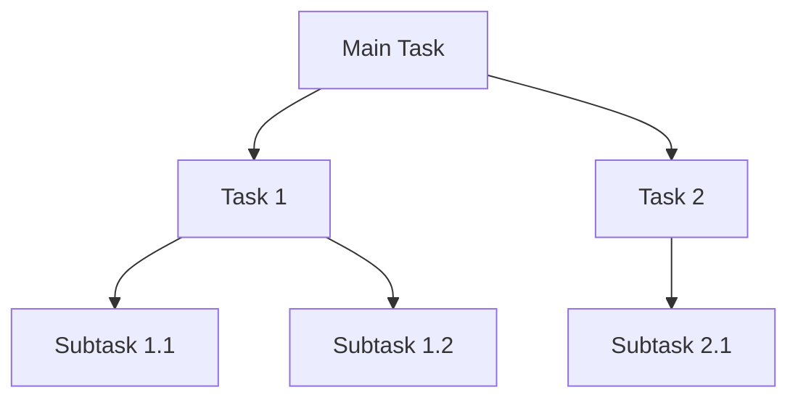

## 8.10 Structured Concurrency in Haskell

Structured concurrency is a paradigm that emphasizes organizing concurrent operations with a clear structure, scopes, and lifetimes. In Haskell, this approach is particularly powerful due to its strong type system and functional programming principles. In this section, we will delve into the concepts, implementation, and practical applications of structured concurrency in Haskell.

### Understanding Structured Concurrency

Structured concurrency aims to make concurrent programming more predictable and manageable by ensuring that concurrent tasks are organized in a hierarchical manner. This approach helps prevent common concurrency issues such as resource leaks, race conditions, and orphaned threads.

#### Key Concepts

- **Hierarchical Task Management**: Tasks are organized in a tree-like structure, where parent tasks manage the lifecycle of their child tasks.
- **Scope and Lifetime**: Each task has a well-defined scope and lifetime, ensuring that resources are properly allocated and released.
- **Error Propagation**: Errors in child tasks are propagated to parent tasks, allowing for centralized error handling.

### Implementing Structured Concurrency in Haskell

Haskell provides several libraries and abstractions that facilitate structured concurrency. Let's explore some of these tools and how they can be used to implement structured concurrency patterns.

#### Using the `async` Library

The `async` library in Haskell provides a simple and powerful way to manage concurrent tasks. It allows you to run tasks asynchronously and wait for their results, while ensuring that resources are properly managed.

```haskell
import Control.Concurrent.Async

main :: IO ()
main = do
    result <- runConcurrently $ (,) <$> Concurrently task1 <*> Concurrently task2
    print result

task1 :: IO String
task1 = do
    putStrLn "Running task 1"
    return "Result from task 1"

task2 :: IO String
task2 = do
    putStrLn "Running task 2"
    return "Result from task 2"
```

In this example, `task1` and `task2` are run concurrently using the `Concurrently` wrapper. The `runConcurrently` function ensures that both tasks are completed before proceeding, and their results are combined into a tuple.

#### Managing Task Lifetimes

One of the key aspects of structured concurrency is managing the lifetimes of tasks. The `async` library provides functions like `withAsync` and `wait` to help manage task lifetimes effectively.

```haskell
import Control.Concurrent.Async

main :: IO ()
main = do
    withAsync task1 $ \a1 ->
        withAsync task2 $ \a2 -> do
            result1 <- wait a1
            result2 <- wait a2
            print (result1, result2)

task1 :: IO String
task1 = do
    putStrLn "Running task 1"
    return "Result from task 1"

task2 :: IO String
task2 = do
    putStrLn "Running task 2"
    return "Result from task 2"
```

In this example, `withAsync` is used to start `task1` and `task2` asynchronously. The `wait` function ensures that the main thread waits for both tasks to complete before proceeding.

#### Error Handling in Structured Concurrency

Structured concurrency also emphasizes robust error handling. The `async` library provides mechanisms to propagate errors from child tasks to parent tasks.

```haskell
import Control.Concurrent.Async
import Control.Exception

main :: IO ()
main = do
    result <- try $ withAsync task1 $ \a1 ->
        withAsync task2 $ \a2 -> do
            r1 <- wait a1
            r2 <- wait a2
            return (r1, r2)
    case result of
        Left (SomeException e) -> putStrLn $ "An error occurred: " ++ show e
        Right res -> print res

task1 :: IO String
task1 = do
    putStrLn "Running task 1"
    return "Result from task 1"

task2 :: IO String
task2 = do
    putStrLn "Running task 2"
    error "Task 2 failed"
```

In this example, if `task2` fails, the exception is caught and handled in the main thread, demonstrating how structured concurrency facilitates centralized error handling.

### Visualizing Structured Concurrency

To better understand structured concurrency, let's visualize the hierarchical task management using a Mermaid.js diagram.



**Diagram Description**: This diagram illustrates a main task that manages two child tasks (`Task 1` and `Task 2`). Each child task can have its own subtasks, forming a hierarchical structure.

### Haskell's Unique Features for Structured Concurrency

Haskell's strong type system and functional programming paradigm provide unique advantages for implementing structured concurrency:

- **Immutability**: Haskell's immutable data structures help prevent race conditions and ensure thread safety.
- **Pure Functions**: Pure functions make it easier to reason about concurrent code and ensure that tasks do not have unintended side effects.
- **Type Safety**: Haskell's type system helps catch concurrency-related errors at compile time, reducing runtime issues.

### Differences and Similarities with Other Concurrency Patterns

Structured concurrency is often compared to other concurrency patterns, such as actor-based concurrency and event-driven concurrency. Here are some key differences and similarities:

- **Actor-Based Concurrency**: Both patterns emphasize task isolation, but structured concurrency focuses more on hierarchical task management.
- **Event-Driven Concurrency**: Structured concurrency provides a more predictable and manageable approach to concurrency compared to event-driven models, which can lead to complex state management.

### Practical Applications of Structured Concurrency

Structured concurrency is particularly useful in scenarios where predictable and manageable concurrency is essential. Some practical applications include:

- **Web Servers**: Managing concurrent requests in a web server can benefit from structured concurrency to ensure that resources are properly allocated and released.
- **Data Processing Pipelines**: Structured concurrency can help manage the lifecycle of tasks in a data processing pipeline, ensuring that each stage is completed before moving to the next.
- **Real-Time Systems**: In real-time systems, structured concurrency can help ensure that tasks are completed within their deadlines, preventing resource leaks and orphaned threads.

### Design Considerations

When implementing structured concurrency in Haskell, consider the following design considerations:

- **Task Granularity**: Determine the appropriate granularity for tasks to balance performance and manageability.
- **Error Propagation**: Design a robust error propagation mechanism to handle errors in child tasks effectively.
- **Resource Management**: Ensure that resources are properly allocated and released to prevent leaks and orphaned threads.

### Try It Yourself

To deepen your understanding of structured concurrency in Haskell, try modifying the code examples provided. Experiment with different task structures, error handling mechanisms, and resource management strategies. Consider implementing a small web server or data processing pipeline using structured concurrency principles.

### Knowledge Check

- What are the key benefits of structured concurrency?
- How does Haskell's type system aid in implementing structured concurrency?
- What are some practical applications of structured concurrency?

### Embrace the Journey

Remember, mastering structured concurrency in Haskell is a journey. As you progress, you'll build more complex and efficient concurrent systems. Keep experimenting, stay curious, and enjoy the process of learning and applying these powerful concurrency patterns.

## Quiz: Structured Concurrency in Haskell



### What is the primary goal of structured concurrency?

- [x] To organize concurrent operations with clear structure, scopes, and lifetimes
- [ ] To maximize CPU usage
- [ ] To minimize memory usage
- [ ] To simplify code syntax

> **Explanation:** Structured concurrency aims to organize concurrent operations with a clear structure, scopes, and lifetimes, making concurrency more predictable and manageable.

### Which Haskell library is commonly used for structured concurrency?

- [x] async
- [ ] STM
- [ ] MVar
- [ ] Par

> **Explanation:** The `async` library in Haskell provides tools for managing concurrent tasks, making it suitable for implementing structured concurrency.

### How does structured concurrency handle errors in child tasks?

- [x] Errors are propagated to parent tasks for centralized handling
- [ ] Errors are ignored
- [ ] Errors are logged but not handled
- [ ] Errors are handled locally within each task

> **Explanation:** Structured concurrency propagates errors from child tasks to parent tasks, allowing for centralized error handling.

### What is a key advantage of using Haskell for structured concurrency?

- [x] Strong type system and immutability
- [ ] Dynamic typing
- [ ] Object-oriented programming
- [ ] Manual memory management

> **Explanation:** Haskell's strong type system and immutability provide advantages for implementing structured concurrency, helping prevent race conditions and ensuring thread safety.

### In structured concurrency, how are tasks typically organized?

- [x] In a hierarchical, tree-like structure
- [ ] In a flat list
- [ ] In a circular buffer
- [ ] In a random order

> **Explanation:** Tasks in structured concurrency are organized in a hierarchical, tree-like structure, where parent tasks manage the lifecycle of their child tasks.

### What is the role of the `withAsync` function in Haskell's `async` library?

- [x] To start a task asynchronously and manage its lifecycle
- [ ] To block the main thread until a task completes
- [ ] To handle errors in a task
- [ ] To synchronize multiple tasks

> **Explanation:** The `withAsync` function is used to start a task asynchronously and manage its lifecycle, ensuring proper resource management.

### Which of the following is a practical application of structured concurrency?

- [x] Managing concurrent requests in a web server
- [ ] Writing a single-threaded application
- [ ] Implementing a simple calculator
- [ ] Designing a static website

> **Explanation:** Structured concurrency is useful for managing concurrent requests in a web server, ensuring that resources are properly allocated and released.

### What is a common challenge in event-driven concurrency that structured concurrency addresses?

- [x] Complex state management
- [ ] High CPU usage
- [ ] Low memory usage
- [ ] Simple error handling

> **Explanation:** Structured concurrency addresses the challenge of complex state management in event-driven concurrency by providing a more predictable and manageable approach.

### How does structured concurrency ensure resource management?

- [x] By defining clear scopes and lifetimes for tasks
- [ ] By using global variables
- [ ] By ignoring resource allocation
- [ ] By relying on manual memory management

> **Explanation:** Structured concurrency ensures resource management by defining clear scopes and lifetimes for tasks, preventing resource leaks and orphaned threads.

### True or False: Structured concurrency in Haskell can help prevent race conditions.

- [x] True
- [ ] False

> **Explanation:** True. Haskell's immutability and strong type system help prevent race conditions, making structured concurrency more reliable.


