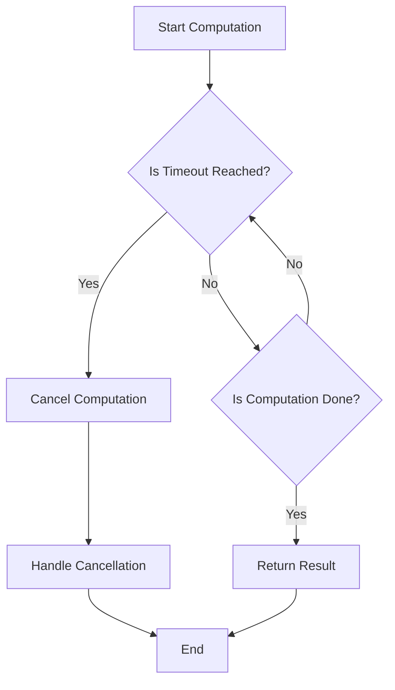

## 8.11 Handling Cancellation and Timeouts

In the realm of concurrent and asynchronous programming, handling cancellation and timeouts is crucial for building responsive and resilient systems. In Haskell, these concepts are elegantly managed using its rich type system and functional paradigms. Let's delve into how we can effectively implement cancellation and timeouts in Haskell, ensuring our applications are both efficient and robust.

### Understanding Cancellation and Timeouts

Before diving into implementation, it's essential to understand the core concepts:

- **Cancellation**: This involves aborting a running computation when it is no longer needed. For instance, if a user navigates away from a page, any ongoing network requests related to that page should be cancelled to free up resources.

- **Timeouts**: This refers to limiting the execution time of an operation. If an operation takes longer than a specified duration, it should be terminated to prevent blocking the system.

### Key Functions and Libraries

Haskell provides several functions and libraries to handle cancellation and timeouts effectively:

- **`async`**: Part of the `async` library, this function allows you to run IO operations concurrently. It provides mechanisms to cancel these operations if needed.

- **`race`**: This function runs two IO operations concurrently and returns the result of the one that finishes first. It's useful for implementing timeouts by racing an operation against a delay.

- **`timeout`**: Available in the `System.Timeout` module, this function runs an IO operation with a specified time limit, returning `Nothing` if the operation times out.

### Implementing Cancellation

Cancellation is a vital feature in concurrent programming, allowing us to stop operations that are no longer needed. In Haskell, we can achieve this using the `async` library.

#### Using `async` for Cancellation

The `async` library provides a straightforward way to manage concurrent operations. Here's how you can use it to implement cancellation:

```haskell
import Control.Concurrent.Async

main :: IO ()
main = do
    -- Start a long-running computation
    computation <- async longRunningComputation

    -- Cancel the computation if a condition is met
    cancel computation

longRunningComputation :: IO ()
longRunningComputation = do
    putStrLn "Starting long-running computation..."
    -- Simulate a long-running task
    threadDelay 10000000
    putStrLn "Computation finished."
```

In this example, we start a long-running computation using `async`. We can cancel this computation at any point using the `cancel` function.

#### Handling Exceptions

When cancelling an asynchronous operation, it's important to handle exceptions that may arise. The `async` library provides the `waitCatch` function to safely wait for an operation to complete and catch any exceptions:

```haskell
import Control.Exception (SomeException)
import Control.Concurrent.Async

main :: IO ()
main = do
    computation <- async longRunningComputation
    result <- waitCatch computation
    case result of
        Left ex -> putStrLn $ "Computation failed with exception: " ++ show (ex :: SomeException)
        Right _ -> putStrLn "Computation completed successfully."
```

### Implementing Timeouts

Timeouts are essential for ensuring that operations do not block indefinitely. Haskell's `System.Timeout` module provides a convenient `timeout` function to handle this.

#### Using `timeout` for Timeouts

The `timeout` function runs an IO operation with a specified time limit. If the operation completes within the time limit, it returns `Just` the result; otherwise, it returns `Nothing`.

```haskell
import System.Timeout (timeout)

main :: IO ()
main = do
    result <- timeout 5000000 longRunningComputation
    case result of
        Nothing -> putStrLn "Computation timed out."
        Just _  -> putStrLn "Computation completed within time limit."

longRunningComputation :: IO ()
longRunningComputation = do
    putStrLn "Starting long-running computation..."
    threadDelay 10000000
    putStrLn "Computation finished."
```

In this example, the `longRunningComputation` is given a timeout of 5 seconds. If it doesn't complete within this time, the program prints "Computation timed out."

### Combining Cancellation and Timeouts

Often, we need to combine cancellation and timeouts to build robust systems. The `race` function from the `async` library is perfect for this purpose.

#### Using `race` for Combined Control

The `race` function runs two IO operations concurrently and returns the result of the one that finishes first. This is useful for implementing timeouts by racing an operation against a delay.

```haskell
import Control.Concurrent.Async
import Control.Concurrent (threadDelay)

main :: IO ()
main = do
    result <- race longRunningComputation (threadDelay 5000000)
    case result of
        Left _  -> putStrLn "Computation completed before timeout."
        Right _ -> putStrLn "Computation timed out."
```

In this example, `longRunningComputation` is raced against a 5-second delay. If the computation finishes first, the program prints "Computation completed before timeout." Otherwise, it prints "Computation timed out."

### Design Considerations

When implementing cancellation and timeouts, consider the following:

- **Resource Management**: Ensure that resources are properly released when a computation is cancelled or times out. This includes closing file handles, network connections, etc.

- **Exception Safety**: Handle exceptions gracefully to prevent your application from crashing. Use functions like `waitCatch` to manage exceptions in asynchronous operations.

- **Performance**: Be mindful of the performance implications of using timeouts and cancellations. Excessive use can lead to resource contention and degraded performance.

### Haskell Unique Features

Haskell's strong type system and functional paradigms provide unique advantages in handling cancellation and timeouts:

- **Purity and Immutability**: These features make it easier to reason about the state of your application, reducing the likelihood of race conditions and other concurrency issues.

- **Lazy Evaluation**: Haskell's lazy evaluation model can be leveraged to defer computations until they're needed, potentially avoiding unnecessary work if a computation is cancelled or times out.

- **Monads and Functors**: These abstractions provide powerful tools for managing side effects and asynchronous operations, making it easier to implement complex concurrency patterns.

### Differences and Similarities

Cancellation and timeouts are often confused with each other, but they serve different purposes:

- **Cancellation** is about stopping an operation that is no longer needed, while **timeouts** are about limiting the time an operation can take.

- Both can be implemented using similar techniques, such as the `async` library, but they address different concerns in concurrent programming.

### Try It Yourself

To deepen your understanding, try modifying the examples above:

- **Experiment with Different Timeouts**: Change the timeout duration and observe how it affects the behavior of the program.

- **Implement a Real-World Scenario**: Use cancellation and timeouts to manage network requests in a simple client-server application.

- **Combine with Other Patterns**: Integrate cancellation and timeouts with other concurrency patterns, such as `STM` (Software Transactional Memory), to build more complex systems.

### Visualizing Cancellation and Timeouts

To better understand how cancellation and timeouts work, let's visualize the process using a flowchart:



**Figure 1: Flowchart of Cancellation and Timeout Handling**

This flowchart illustrates the decision-making process involved in handling cancellation and timeouts. The computation is continuously checked against the timeout condition, and appropriate actions are taken based on whether the timeout is reached or the computation completes.

### References and Links

For further reading on concurrency and asynchronous programming in Haskell, consider these resources:

- [Haskell `async` Library Documentation](https://hackage.haskell.org/package/async)
- [System.Timeout Module Documentation](https://hackage.haskell.org/package/base/docs/System-Timeout.html)
- [Concurrency in Haskell](https://wiki.haskell.org/Concurrency)

### Knowledge Check

To reinforce your understanding, consider these questions:

- How does the `async` library facilitate cancellation in Haskell?
- What is the difference between `race` and `timeout` functions?
- How can you ensure resources are properly managed when a computation is cancelled?

### Embrace the Journey

Remember, mastering cancellation and timeouts is just one step in your journey to becoming an expert in Haskell's concurrency and asynchronous patterns. Keep experimenting, stay curious, and enjoy the process of building robust and efficient systems.

## Quiz: Handling Cancellation and Timeouts



### What is the primary purpose of cancellation in concurrent programming?

- [x] To abort a running computation when it is no longer needed
- [ ] To limit the execution time of an operation
- [ ] To handle exceptions in asynchronous operations
- [ ] To manage resources efficiently

> **Explanation:** Cancellation is used to stop operations that are no longer needed, freeing up resources.

### Which Haskell function is used to run two IO operations concurrently and return the result of the one that finishes first?

- [ ] async
- [x] race
- [ ] timeout
- [ ] waitCatch

> **Explanation:** The `race` function runs two IO operations concurrently and returns the result of the one that finishes first.

### What does the `timeout` function return if an operation exceeds the specified time limit?

- [ ] The result of the operation
- [ ] An exception
- [x] Nothing
- [ ] A default value

> **Explanation:** The `timeout` function returns `Nothing` if the operation exceeds the specified time limit.

### How can you safely handle exceptions in asynchronous operations in Haskell?

- [ ] Using the `async` function
- [ ] Using the `race` function
- [ ] Using the `timeout` function
- [x] Using the `waitCatch` function

> **Explanation:** The `waitCatch` function is used to safely wait for an operation to complete and catch any exceptions.

### What is a key advantage of using Haskell's lazy evaluation in handling cancellation and timeouts?

- [x] It can defer computations until they're needed, potentially avoiding unnecessary work
- [ ] It makes the code run faster
- [ ] It simplifies the syntax
- [ ] It automatically handles exceptions

> **Explanation:** Lazy evaluation can defer computations until they're needed, which can be beneficial in cancellation and timeout scenarios.

### Which library provides the `async` function in Haskell?

- [x] async
- [ ] base
- [ ] concurrent
- [ ] system

> **Explanation:** The `async` function is provided by the `async` library in Haskell.

### What is the purpose of the `cancel` function in the `async` library?

- [x] To stop a running asynchronous operation
- [ ] To start a new asynchronous operation
- [ ] To handle exceptions in asynchronous operations
- [ ] To limit the execution time of an operation

> **Explanation:** The `cancel` function is used to stop a running asynchronous operation.

### How does the `race` function help in implementing timeouts?

- [ ] By running operations sequentially
- [x] By racing an operation against a delay
- [ ] By handling exceptions
- [ ] By managing resources

> **Explanation:** The `race` function runs two operations concurrently and returns the result of the one that finishes first, which can be used to implement timeouts.

### What should be considered when implementing cancellation and timeouts?

- [x] Resource management and exception safety
- [ ] Code readability
- [ ] Syntax simplicity
- [ ] Automatic error handling

> **Explanation:** Resource management and exception safety are crucial when implementing cancellation and timeouts.

### True or False: Cancellation and timeouts serve the same purpose in concurrent programming.

- [ ] True
- [x] False

> **Explanation:** Cancellation and timeouts serve different purposes; cancellation stops operations that are no longer needed, while timeouts limit the execution time of operations.


