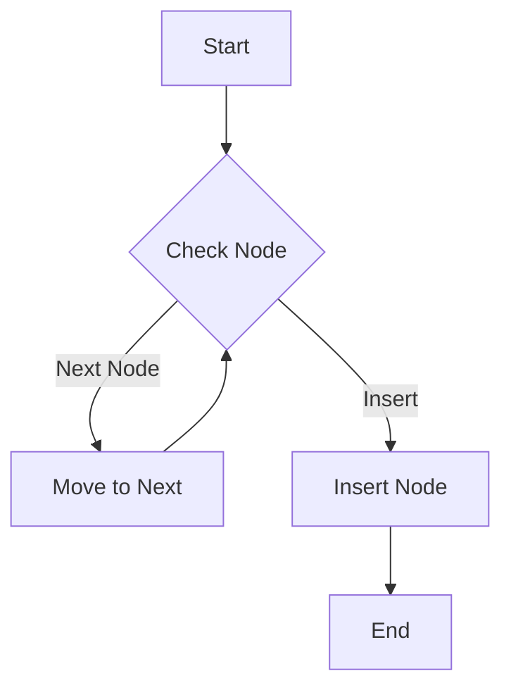

## 8.12 Lock-Free and Wait-Free Data Structures

In the realm of concurrent programming, lock-free and wait-free data structures are pivotal for achieving high performance and scalability. These structures allow multiple threads to operate on shared data without the need for traditional locking mechanisms, which can lead to contention and bottlenecks. In this section, we will delve into the concepts, benefits, and implementation of lock-free and wait-free data structures in Haskell, a language renowned for its strong support for functional programming and concurrency.

### Understanding Lock-Free and Wait-Free Concepts

**Lock-Free Structures**: These are data structures that allow multiple threads to operate on them without mutual exclusion. The key characteristic of lock-free structures is that they ensure that at least one thread makes progress in a finite number of steps, even if other threads are delayed.

**Wait-Free Structures**: These are a step further, guaranteeing that every thread will complete its operation in a finite number of steps, regardless of the actions of other threads. This makes wait-free structures more robust but often more complex to implement.

#### Benefits of Lock-Free and Wait-Free Structures

- **Reduced Contention**: By eliminating locks, these structures reduce contention among threads, leading to improved performance.
- **Scalability**: They scale better with the number of threads, making them suitable for multi-core processors.
- **Fault Tolerance**: They are inherently more fault-tolerant, as they do not suffer from deadlocks or priority inversion.

### Implementing Lock-Free Structures in Haskell

Haskell provides powerful abstractions for implementing lock-free data structures, primarily through atomic operations and Software Transactional Memory (STM). Let's explore these concepts and how they can be used to implement a concurrent skip list, a common lock-free data structure.

#### Atomic Operations

Atomic operations are low-level operations that are completed in a single step relative to other threads. Haskell's `atomicModifyIORef` and `atomicWriteIORef` are examples of atomic operations that can be used to implement lock-free structures.

```haskell
import Data.IORef
import Control.Concurrent

-- Example of atomic operation using IORef
incrementCounter :: IORef Int -> IO ()
incrementCounter ref = atomicModifyIORef' ref (\x -> (x + 1, ()))

main :: IO ()
main = do
    counter <- newIORef 0
    let threads = replicate 10 (forkIO $ incrementCounter counter)
    sequence_ threads
    finalValue <- readIORef counter
    print finalValue
```

In this example, `atomicModifyIORef'` ensures that the increment operation is atomic, preventing race conditions.

#### Software Transactional Memory (STM)

STM is a higher-level abstraction that allows for composable atomic transactions. It simplifies the implementation of lock-free structures by handling conflicts and retries automatically.

```haskell
import Control.Concurrent.STM
import Control.Monad

-- Example of using STM for a lock-free counter
incrementCounterSTM :: TVar Int -> STM ()
incrementCounterSTM tvar = modifyTVar' tvar (+1)

mainSTM :: IO ()
mainSTM = do
    counter <- newTVarIO 0
    let threads = replicate 10 (forkIO $ atomically $ incrementCounterSTM counter)
    sequence_ threads
    finalValue <- atomically $ readTVar counter
    print finalValue
```

Here, `TVar` is used to create a transactional variable, and `atomically` ensures that the transaction is executed without interference from other threads.

### Example: Implementing a Concurrent Skip List

A skip list is a probabilistic data structure that allows for fast search, insertion, and deletion operations. Implementing a concurrent skip list in Haskell involves using atomic operations and STM to manage concurrent access.

#### Skip List Structure

A skip list consists of multiple levels of linked lists, where each level is a subset of the level below. This allows for efficient search operations by skipping over large portions of the list.

```haskell
data Node a = Node
    { value :: a
    , next  :: TVar (Maybe (Node a))
    }

data SkipList a = SkipList
    { head :: TVar (Node a)
    }

-- Initialize a new skip list
newSkipList :: a -> IO (SkipList a)
newSkipList val = do
    headNode <- newTVarIO (Node val (newTVarIO Nothing))
    return $ SkipList headNode
```

#### Insertion Operation

The insertion operation involves finding the appropriate position in the list and updating the pointers atomically.

```haskell
insert :: Ord a => SkipList a -> a -> STM ()
insert (SkipList head) val = do
    current <- readTVar head
    insertNode current
  where
    insertNode node = do
        nextNode <- readTVar (next node)
        case nextNode of
            Just n | value n < val -> insertNode n
            _ -> do
                newNode <- newTVar (Node val (next node))
                writeTVar (next node) (Just newNode)
```

#### Search Operation

The search operation traverses the list, leveraging the skip list's structure to efficiently locate the desired element.

```haskell
search :: Ord a => SkipList a -> a -> STM Bool
search (SkipList head) val = do
    current <- readTVar head
    searchNode current
  where
    searchNode node = do
        nextNode <- readTVar (next node)
        case nextNode of
            Just n | value n == val -> return True
                   | value n < val  -> searchNode n
            _ -> return False
```

### Visualizing Lock-Free and Wait-Free Operations

To better understand the operations of lock-free and wait-free structures, let's visualize the process using Mermaid.js diagrams.



This diagram illustrates the insertion process in a skip list, where the algorithm checks each node and decides whether to move to the next node or insert a new node.

### Design Considerations

When implementing lock-free and wait-free data structures, consider the following:

- **Complexity**: These structures can be complex to implement correctly, especially ensuring that all operations are atomic and free from race conditions.
- **Performance**: While lock-free structures reduce contention, they may still suffer from performance issues due to retries in the presence of high contention.
- **Use Cases**: Evaluate whether the benefits of lock-free structures outweigh the complexity for your specific use case.

### Haskell's Unique Features

Haskell's strong type system and STM make it uniquely suited for implementing lock-free and wait-free data structures. The language's emphasis on immutability and pure functions further enhances the reliability and predictability of concurrent operations.

### Differences and Similarities

Lock-free and wait-free structures are often confused due to their similar goals. However, the key difference lies in the guarantees they provide: lock-free structures ensure progress for at least one thread, while wait-free structures guarantee progress for all threads.

### Try It Yourself

To deepen your understanding, try modifying the skip list implementation to support deletion operations. Consider how atomic operations and STM can be used to ensure that deletions are performed safely and efficiently.

### Knowledge Check

- What are the key differences between lock-free and wait-free data structures?
- How does Haskell's STM simplify the implementation of lock-free structures?
- What are the benefits of using a skip list over a traditional linked list?

### Embrace the Journey

Remember, mastering lock-free and wait-free data structures is a journey. As you progress, you'll gain a deeper understanding of concurrency and performance optimization in Haskell. Keep experimenting, stay curious, and enjoy the journey!

## Quiz: Lock-Free and Wait-Free Data Structures



### What is a key characteristic of lock-free data structures?

- [x] At least one thread makes progress in a finite number of steps.
- [ ] All threads make progress in a finite number of steps.
- [ ] No threads make progress.
- [ ] Threads are blocked until they can proceed.

> **Explanation:** Lock-free data structures ensure that at least one thread makes progress in a finite number of steps, even if others are delayed.

### What is the primary benefit of using lock-free structures?

- [x] Reduced contention among threads.
- [ ] Increased memory usage.
- [ ] Simplified code structure.
- [ ] Guaranteed progress for all threads.

> **Explanation:** Lock-free structures reduce contention among threads, leading to improved performance.

### Which Haskell feature is commonly used to implement lock-free structures?

- [x] Software Transactional Memory (STM)
- [ ] Lazy Evaluation
- [ ] Pattern Matching
- [ ] List Comprehensions

> **Explanation:** STM is a powerful abstraction in Haskell for implementing lock-free structures by handling conflicts and retries automatically.

### What is a skip list?

- [x] A probabilistic data structure for fast search, insertion, and deletion.
- [ ] A type of binary tree.
- [ ] A sorting algorithm.
- [ ] A data compression technique.

> **Explanation:** A skip list is a probabilistic data structure that allows for efficient search, insertion, and deletion operations.

### How does STM ensure atomicity in Haskell?

- [x] By executing transactions atomically without interference.
- [ ] By using locks and mutexes.
- [ ] By delaying operations until all threads are ready.
- [ ] By using lazy evaluation.

> **Explanation:** STM ensures atomicity by executing transactions atomically, preventing interference from other threads.

### What is a key difference between lock-free and wait-free structures?

- [x] Lock-free ensures progress for at least one thread, wait-free ensures progress for all threads.
- [ ] Lock-free ensures progress for all threads, wait-free ensures progress for at least one thread.
- [ ] Lock-free uses locks, wait-free does not.
- [ ] Lock-free is slower than wait-free.

> **Explanation:** Lock-free structures ensure progress for at least one thread, while wait-free structures guarantee progress for all threads.

### What is the role of `atomicModifyIORef` in Haskell?

- [x] To perform atomic modifications on `IORef` variables.
- [ ] To create new `IORef` variables.
- [ ] To delete `IORef` variables.
- [ ] To read `IORef` variables non-atomically.

> **Explanation:** `atomicModifyIORef` is used to perform atomic modifications on `IORef` variables, ensuring thread safety.

### Why are lock-free structures more fault-tolerant?

- [x] They do not suffer from deadlocks or priority inversion.
- [ ] They use more memory.
- [ ] They are easier to implement.
- [ ] They rely on lazy evaluation.

> **Explanation:** Lock-free structures are more fault-tolerant because they do not suffer from deadlocks or priority inversion.

### What is a common challenge when implementing lock-free structures?

- [x] Ensuring all operations are atomic and free from race conditions.
- [ ] Reducing memory usage.
- [ ] Simplifying code readability.
- [ ] Increasing the number of threads.

> **Explanation:** A common challenge is ensuring that all operations are atomic and free from race conditions.

### True or False: Wait-free structures guarantee progress for all threads.

- [x] True
- [ ] False

> **Explanation:** Wait-free structures guarantee that every thread will complete its operation in a finite number of steps, ensuring progress for all threads.


