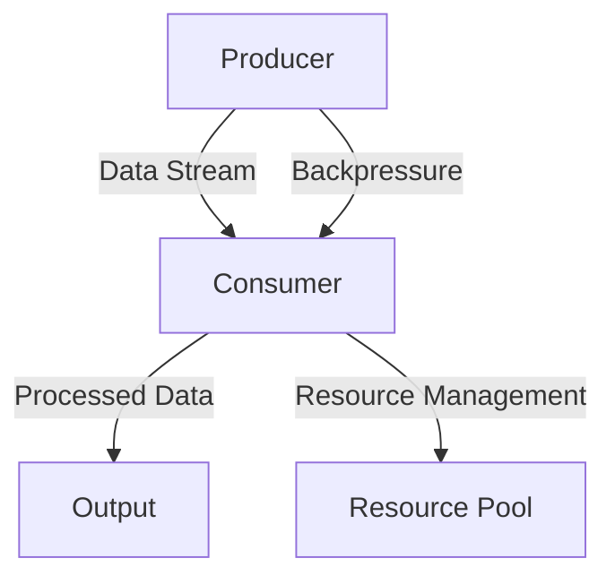

## 8.13 Concurrency Abstractions with Streaming Libraries

Concurrency is a fundamental aspect of modern software systems, enabling applications to perform multiple tasks simultaneously, thereby improving performance and responsiveness. In Haskell, concurrency is elegantly handled through functional abstractions, and streaming libraries like **Conduit**, **Pipes**, and **Streaming** provide powerful tools for managing data flows in concurrent environments. This section delves into these libraries, exploring their features, implementation strategies, and practical applications.

### Introduction to Streaming Libraries

Streaming libraries in Haskell are designed to handle large or infinite data streams efficiently. They provide abstractions for processing data incrementally, which is crucial for applications that deal with real-time data, such as log processing, network communication, and data transformation pipelines.

#### Key Streaming Libraries

- **Conduit**: A library for building composable data processing pipelines. It emphasizes resource management and backpressure handling.
- **Pipes**: Offers a simple and elegant way to work with data streams, focusing on composability and efficiency.
- **Streaming**: Provides a minimalistic approach to streaming, leveraging Haskell's lazy evaluation to process data incrementally.

### Concurrency Features in Streaming Libraries

Concurrency in streaming libraries involves managing multiple data streams simultaneously, ensuring efficient resource utilization and responsiveness. Key features include:

- **Backpressure Management**: Ensures that producers do not overwhelm consumers with data, maintaining a balance between data production and consumption.
- **Resource Allocation and Cleanup**: Manages resources such as file handles and network connections, ensuring they are allocated and released appropriately.
- **Composing Producers and Consumers**: Allows for the composition of data producers and consumers, enabling concurrent execution and data transformation.

### Implementing Concurrency with Streaming Libraries

Let's explore how to implement concurrency using streaming libraries in Haskell. We'll focus on composing producers and consumers, managing backpressure, and ensuring efficient resource allocation.

#### Composing Producers and Consumers

In streaming libraries, producers generate data, and consumers process it. Composing these components allows for concurrent data processing.

**Example with Conduit:**

```haskell
import Conduit

-- Producer: Generates a stream of numbers
numberProducer :: Monad m => ConduitT () Int m ()
numberProducer = yieldMany [1..100]

-- Consumer: Sums the numbers in the stream
sumConsumer :: Monad m => ConduitT Int Void m Int
sumConsumer = foldlC (+) 0

-- Composing Producer and Consumer
main :: IO ()
main = do
    result <- runConduit $ numberProducer .| sumConsumer
    print result  -- Output: 5050
```

In this example, `numberProducer` generates a stream of numbers, and `sumConsumer` processes the stream to calculate the sum. The `.|` operator composes the producer and consumer, enabling concurrent execution.

#### Managing Backpressure

Backpressure is crucial in streaming systems to prevent data producers from overwhelming consumers. Streaming libraries provide mechanisms to handle backpressure effectively.

**Example with Pipes:**

```haskell
import Pipes
import qualified Pipes.Prelude as P

-- Producer: Generates a stream of numbers
numberProducer :: Producer Int IO ()
numberProducer = each [1..100]

-- Consumer: Prints numbers with a delay to simulate slow processing
slowConsumer :: Consumer Int IO ()
slowConsumer = P.mapM_ (\n -> do
    putStrLn $ "Processing: " ++ show n
    threadDelay 1000000)  -- 1 second delay

-- Composing Producer and Consumer with backpressure
main :: IO ()
main = runEffect $ numberProducer >-> slowConsumer
```

In this example, `slowConsumer` processes numbers with a delay, simulating a slow consumer. The `>->` operator composes the producer and consumer, automatically handling backpressure.

#### Resource Allocation and Cleanup

Efficient resource management is essential in streaming systems to prevent resource leaks and ensure system stability.

**Example with Streaming:**

```haskell
import Streaming
import qualified Streaming.Prelude as S

-- Producer: Reads lines from a file
fileProducer :: FilePath -> Stream (Of String) IO ()
fileProducer filePath = S.readFile filePath

-- Consumer: Counts the number of lines
lineCounter :: Stream (Of String) IO () -> IO Int
lineCounter = S.length_

-- Composing Producer and Consumer with resource management
main :: IO ()
main = do
    lineCount <- lineCounter $ fileProducer "example.txt"
    putStrLn $ "Number of lines: " ++ show lineCount
```

In this example, `fileProducer` reads lines from a file, and `lineCounter` counts the lines. The `Streaming` library ensures that file handles are managed efficiently, preventing resource leaks.

### Visualizing Concurrency with Streaming Libraries

To better understand how streaming libraries manage concurrency, let's visualize the flow of data between producers and consumers.



**Diagram Description**: This diagram illustrates the flow of data from a producer to a consumer, with backpressure and resource management mechanisms in place. The producer generates a data stream, which is processed by the consumer. Backpressure ensures that the consumer is not overwhelmed, while resource management handles the allocation and cleanup of resources.

### Practical Applications of Streaming Libraries

Streaming libraries are versatile tools that can be applied to various real-world scenarios. Let's explore some practical applications.

#### Real-Time Log Processing

Streaming libraries are ideal for processing real-time log data, enabling efficient filtering, transformation, and aggregation.

**Example with Conduit:**

```haskell
import Conduit
import Data.Time.Clock

-- Producer: Simulates a stream of log entries
logProducer :: MonadIO m => ConduitT () String m ()
logProducer = do
    yield "INFO: Application started"
    liftIO $ threadDelay 1000000
    yield "ERROR: An error occurred"
    liftIO $ threadDelay 1000000
    yield "INFO: Application stopped"

-- Consumer: Filters and processes log entries
logConsumer :: MonadIO m => ConduitT String Void m ()
logConsumer = awaitForever $ \logEntry -> do
    currentTime <- liftIO getCurrentTime
    liftIO $ putStrLn $ show currentTime ++ " - " ++ logEntry

-- Composing Producer and Consumer
main :: IO ()
main = runConduit $ logProducer .| logConsumer
```

In this example, `logProducer` generates a stream of log entries, and `logConsumer` processes and timestamps each entry. This setup can be extended to filter specific log levels or aggregate statistics.

#### Network Data Processing

Streaming libraries can handle network data streams, enabling real-time data transformation and analysis.

**Example with Pipes:**

```haskell
import Pipes
import qualified Pipes.Network.TCP as TCP
import qualified Pipes.Prelude as P

-- Producer: Reads data from a network socket
networkProducer :: TCP.HostName -> TCP.ServiceName -> Producer ByteString IO ()
networkProducer host port = TCP.connect host port $ \\(socket, _) ->
    TCP.fromSocket socket 4096

-- Consumer: Processes network data
networkConsumer :: Consumer ByteString IO ()
networkConsumer = P.mapM_ (putStrLn . show)

-- Composing Producer and Consumer
main :: IO ()
main = runEffect $ networkProducer "localhost" "8080" >-> networkConsumer
```

In this example, `networkProducer` reads data from a network socket, and `networkConsumer` processes the data. This setup can be used for real-time data analysis or transformation.

### References and Further Reading

- [Conduit Library](https://hackage.haskell.org/package/conduit)
- [Pipes Library](https://hackage.haskell.org/package/pipes)
- [Streaming Library](https://hackage.haskell.org/package/streaming)

### Try It Yourself

Experiment with the code examples provided in this section. Try modifying the producers and consumers to handle different types of data or implement additional processing steps. Consider how backpressure and resource management affect the performance and stability of your streaming applications.

### Knowledge Check

- What are the key features of streaming libraries in Haskell?
- How do streaming libraries handle backpressure?
- What are some practical applications of streaming libraries?

### Summary

In this section, we explored concurrency abstractions in Haskell using streaming libraries like Conduit, Pipes, and Streaming. We learned how to compose producers and consumers, manage backpressure, and ensure efficient resource allocation. Streaming libraries provide powerful tools for handling real-time data streams, making them essential for modern software systems.

### Embrace the Journey

Remember, mastering concurrency and streaming in Haskell is an ongoing journey. As you continue to explore these concepts, you'll discover new ways to optimize and enhance your applications. Keep experimenting, stay curious, and enjoy the journey!

## Quiz: Concurrency Abstractions with Streaming Libraries



### What is a key feature of streaming libraries in Haskell?

- [x] Backpressure management
- [ ] Dynamic typing
- [ ] Object-oriented design
- [ ] Manual memory management

> **Explanation:** Streaming libraries in Haskell manage backpressure to ensure that producers do not overwhelm consumers.

### Which operator is used to compose producers and consumers in Conduit?

- [x] .|
- [ ] >>
- [ ] <-
- [ ] ++

> **Explanation:** The `. |` operator is used in Conduit to compose producers and consumers.

### How do streaming libraries handle resource allocation?

- [x] By managing resources like file handles and network connections
- [ ] By using global variables
- [ ] By relying on garbage collection
- [ ] By manual memory management

> **Explanation:** Streaming libraries manage resources efficiently to prevent leaks and ensure stability.

### What is the purpose of backpressure in streaming systems?

- [x] To prevent producers from overwhelming consumers
- [ ] To increase data production speed
- [ ] To reduce memory usage
- [ ] To enhance security

> **Explanation:** Backpressure ensures a balance between data production and consumption.

### Which library provides a minimalistic approach to streaming in Haskell?

- [x] Streaming
- [ ] Conduit
- [ ] Pipes
- [ ] Network

> **Explanation:** The Streaming library offers a minimalistic approach to handling data streams.

### What is a practical application of streaming libraries?

- [x] Real-time log processing
- [ ] Static website generation
- [ ] Image rendering
- [ ] Video editing

> **Explanation:** Streaming libraries are ideal for processing real-time data, such as logs.

### How can you simulate slow processing in a consumer?

- [x] By introducing a delay in the consumer
- [ ] By increasing the producer's speed
- [ ] By using a faster network connection
- [ ] By reducing the data size

> **Explanation:** Introducing a delay simulates slow processing in a consumer.

### What does the `runEffect` function do in Pipes?

- [x] It executes the composed producer and consumer
- [ ] It creates a new thread
- [ ] It allocates memory
- [ ] It compiles the code

> **Explanation:** `runEffect` executes the composed producer and consumer in Pipes.

### Which library emphasizes resource management and backpressure handling?

- [x] Conduit
- [ ] Streaming
- [ ] Pipes
- [ ] Network

> **Explanation:** Conduit emphasizes resource management and backpressure handling.

### True or False: Streaming libraries in Haskell can handle infinite data streams.

- [x] True
- [ ] False

> **Explanation:** Streaming libraries are designed to handle large or infinite data streams efficiently.




