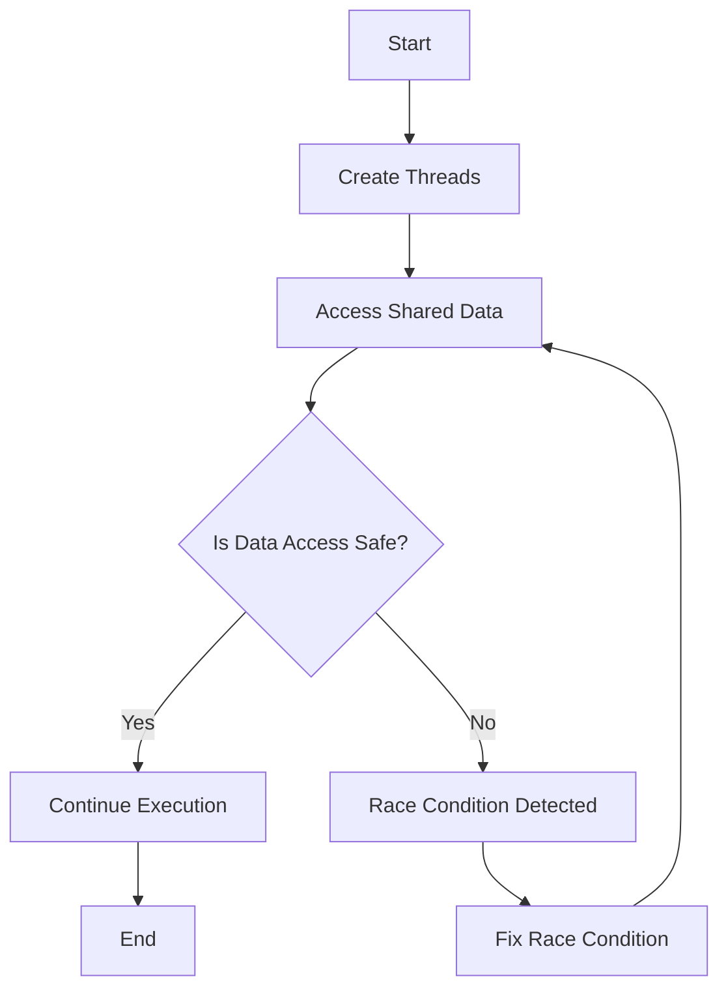

## 8.14 Thread Safety and Race Conditions

Concurrency in Haskell offers powerful abstractions for building scalable and efficient applications. However, with great power comes the responsibility to manage thread safety and prevent race conditions. In this section, we will explore these concepts in depth, providing you with the knowledge and tools necessary to write robust concurrent Haskell programs.

### Understanding Thread Safety

**Thread Safety** refers to the property of a program or code segment that guarantees safe execution by multiple threads at the same time. In a thread-safe program, shared data is accessed and modified in a way that prevents data corruption or unexpected behavior.

#### Key Concepts in Thread Safety

- **Mutual Exclusion**: Ensures that only one thread can access a critical section of code at a time.
- **Atomic Operations**: Operations that complete in a single step relative to other threads.
- **Synchronization**: Coordinating the sequence of thread execution to ensure correct program behavior.

### Race Conditions Explained

**Race Conditions** occur when the behavior of a software system depends on the relative timing of events, such as thread execution order. This can lead to unpredictable results and bugs that are difficult to reproduce and fix.

#### Identifying Race Conditions

- **Non-Deterministic Behavior**: The program produces different results on different runs with the same input.
- **Data Races**: Multiple threads access shared data simultaneously, and at least one of the accesses is a write.

### Strategies for Preventing Race Conditions

Haskell provides several mechanisms to prevent race conditions and ensure thread safety:

#### Software Transactional Memory (STM)

STM is a concurrency control mechanism that simplifies writing concurrent programs by allowing mutable shared memory to be accessed in a transactional manner.

- **Atomic Transactions**: STM ensures that a series of operations on shared memory are atomic, consistent, and isolated.
- **Retry and OrElse**: STM provides composable control structures for retrying transactions and handling alternative actions.

```haskell
import Control.Concurrent.STM
import Control.Monad (replicateM_)

-- Example: Safe Counter using STM
main :: IO ()
main = do
    counter <- atomically $ newTVar 0
    let increment = atomically $ modifyTVar' counter (+1)
    replicateM_ 1000 increment
    finalCount <- atomically $ readTVar counter
    print finalCount
```

#### MVar for Mutual Exclusion

`MVar` is a mutable location that can be empty or contain a value, providing a way to enforce mutual exclusion.

- **Blocking Operations**: `takeMVar` and `putMVar` block until the `MVar` is empty or full, respectively.
- **Non-Blocking Variants**: `tryTakeMVar` and `tryPutMVar` offer non-blocking alternatives.

```haskell
import Control.Concurrent
import Control.Concurrent.MVar

-- Example: Safe Counter using MVar
main :: IO ()
main = do
    counter <- newMVar 0
    let increment = modifyMVar_ counter (return . (+1))
    replicateM_ 1000 increment
    finalCount <- readMVar counter
    print finalCount
```

#### Immutable Data Structures

Haskell's emphasis on immutability helps prevent race conditions by ensuring that data cannot be modified once created.

- **Pure Functions**: Functions that do not have side effects and always produce the same output for the same input.
- **Persistent Data Structures**: Data structures that preserve previous versions of themselves when modified.

### Example: Updating a Shared Counter Safely

Let's explore a practical example of updating a shared counter safely across multiple threads using STM:

```haskell
import Control.Concurrent
import Control.Concurrent.STM
import Control.Monad (replicateM_)

-- Function to increment a counter safely using STM
incrementCounter :: TVar Int -> IO ()
incrementCounter counter = atomically $ modifyTVar' counter (+1)

-- Main function to demonstrate safe counter update
main :: IO ()
main = do
    counter <- atomically $ newTVar 0
    threads <- replicateM 10 $ forkIO $ replicateM_ 1000 (incrementCounter counter)
    mapM_ wait threads
    finalCount <- atomically $ readTVar counter
    print finalCount

-- Helper function to wait for a thread to finish
wait :: ThreadId -> IO ()
wait tid = do
    mvar <- newEmptyMVar
    forkIO $ do
        threadDelay 1000000
        putMVar mvar ()
    takeMVar mvar
```

### Visualizing Thread Safety and Race Conditions

To better understand the concepts of thread safety and race conditions, let's visualize the flow of a concurrent program using a diagram:



**Diagram Description**: This flowchart illustrates the process of creating threads, accessing shared data, checking for race conditions, and ensuring safe execution.

### Haskell's Unique Features for Concurrency

Haskell's concurrency model is built on several unique features that make it well-suited for concurrent programming:

- **Lightweight Threads**: Haskell's runtime supports lightweight threads, allowing thousands of threads to be managed efficiently.
- **Non-blocking I/O**: Haskell's I/O operations are non-blocking, enabling better concurrency performance.
- **Lazy Evaluation**: Haskell's lazy evaluation model can be leveraged to defer computations until necessary, reducing contention.

### Design Considerations

When designing concurrent Haskell programs, consider the following:

- **Granularity of Locks**: Use fine-grained locks to minimize contention and improve performance.
- **Deadlock Prevention**: Ensure that locks are acquired in a consistent order to prevent deadlocks.
- **Scalability**: Design your program to scale with the number of available cores and threads.

### Differences and Similarities with Other Languages

Haskell's approach to concurrency differs from imperative languages like Java or C++:

- **Immutable Data**: Haskell's immutability reduces the risk of race conditions compared to mutable state in imperative languages.
- **STM vs. Locks**: STM provides a higher-level abstraction than traditional locks, making concurrent programming easier and less error-prone.

### Try It Yourself

Experiment with the code examples provided by modifying the number of threads or iterations. Observe how the program behaves with different configurations and try introducing intentional race conditions to see their effects.

### Knowledge Check

- What is the primary purpose of STM in Haskell?
- How does `MVar` ensure mutual exclusion?
- Why is immutability important for thread safety?

### Embrace the Journey

Remember, mastering concurrency in Haskell is a journey. As you progress, you'll build more complex and efficient concurrent applications. Keep experimenting, stay curious, and enjoy the journey!

## Quiz: Thread Safety and Race Conditions



### What is the primary purpose of STM in Haskell?

- [x] To provide atomic, consistent, and isolated transactions for shared memory access
- [ ] To replace all mutable data structures
- [ ] To eliminate the need for threads
- [ ] To simplify I/O operations

> **Explanation:** STM allows operations on shared memory to be performed atomically, ensuring consistency and isolation.

### How does `MVar` ensure mutual exclusion?

- [x] By allowing only one thread to access the `MVar` at a time
- [ ] By using locks internally
- [ ] By copying data for each thread
- [ ] By using lazy evaluation

> **Explanation:** `MVar` ensures mutual exclusion by blocking other threads until the `MVar` is empty or full.

### Why is immutability important for thread safety?

- [x] It prevents data from being modified by multiple threads simultaneously
- [ ] It makes programs run faster
- [ ] It simplifies garbage collection
- [ ] It allows for dynamic typing

> **Explanation:** Immutability ensures that data cannot be changed, preventing race conditions.

### What is a race condition?

- [x] A situation where the program's behavior depends on the timing of uncontrollable events
- [ ] A type of deadlock
- [ ] A performance optimization technique
- [ ] A method for improving thread safety

> **Explanation:** Race conditions occur when the outcome of a program depends on the sequence or timing of events.

### Which of the following is a strategy to prevent race conditions?

- [x] Using STM
- [ ] Using global variables
- [x] Using immutable data
- [ ] Ignoring thread synchronization

> **Explanation:** STM and immutability are effective strategies for preventing race conditions.

### What is the role of `modifyTVar'` in STM?

- [x] To atomically modify the value of a `TVar`
- [ ] To create a new `TVar`
- [ ] To read the value of a `TVar`
- [ ] To delete a `TVar`

> **Explanation:** `modifyTVar'` is used to atomically update the value of a `TVar`.

### What is the advantage of using lightweight threads in Haskell?

- [x] They allow for efficient management of thousands of threads
- [ ] They eliminate the need for concurrency
- [x] They improve I/O performance
- [ ] They simplify error handling

> **Explanation:** Lightweight threads enable efficient concurrency and better I/O performance.

### How can deadlocks be prevented in concurrent programs?

- [x] By acquiring locks in a consistent order
- [ ] By using more threads
- [ ] By avoiding I/O operations
- [ ] By using global variables

> **Explanation:** Acquiring locks in a consistent order helps prevent deadlocks.

### What is the benefit of using non-blocking I/O in Haskell?

- [x] It improves concurrency performance
- [ ] It simplifies code
- [ ] It eliminates the need for error handling
- [ ] It allows for dynamic typing

> **Explanation:** Non-blocking I/O enables better concurrency performance by not blocking threads.

### True or False: Haskell's lazy evaluation model can help reduce contention in concurrent programs.

- [x] True
- [ ] False

> **Explanation:** Lazy evaluation defers computations, which can reduce contention in concurrent programs.


