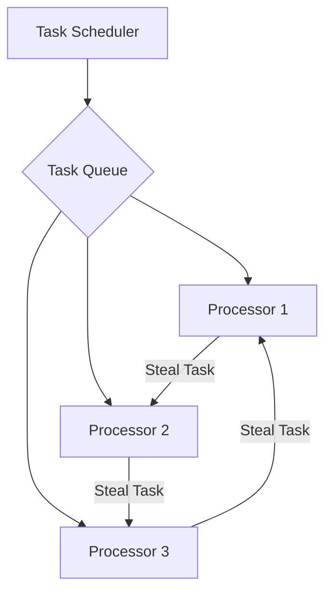

## 8.15 Load Balancing and Work Distribution

In the realm of distributed systems and parallel computing, **load balancing** and **work distribution** are critical concepts that ensure efficient utilization of resources and optimal performance. In this section, we will delve into these concepts within the context of Haskell, a language renowned for its strong support for concurrency and parallelism. We will explore various strategies and patterns for distributing work across multiple processors or nodes, leveraging Haskell's unique features to build scalable and fault-tolerant systems.

### Understanding Load Balancing

**Load balancing** refers to the process of distributing workloads evenly across multiple computing resources, such as processors, servers, or nodes in a cluster. The primary goal is to optimize resource utilization, minimize response time, and avoid overloading any single resource. In Haskell, load balancing can be achieved through various techniques, including task scheduling, work stealing, and dynamic load distribution.

#### Key Concepts

- **Task Scheduling**: Assigning tasks to available resources based on predefined criteria, such as priority or resource availability.
- **Work Stealing**: A dynamic load balancing technique where idle processors "steal" tasks from busy processors to balance the workload.
- **Dynamic Load Distribution**: Adjusting the distribution of tasks in real-time based on the current load and resource availability.

### Implementing Load Balancing in Haskell

Haskell provides several libraries and frameworks that facilitate load balancing and work distribution. Let's explore some of these tools and how they can be used to implement effective load balancing strategies.

#### Parallel and Concurrent Haskell

Haskell's `Control.Parallel` and `Control.Concurrent` modules offer foundational support for parallel and concurrent programming. These modules provide abstractions for spawning parallel computations and managing concurrent threads, which are essential for implementing load balancing.

```haskell
import Control.Parallel (par, pseq)
import Control.Concurrent (forkIO, threadDelay)

-- Example of parallel computation using par and pseq
compute :: Int -> Int
compute x = x * x

main :: IO ()
main = do
  let a = compute 5
      b = compute 10
  a `par` (b `pseq` print (a + b))
```

In this example, the `par` and `pseq` functions are used to evaluate computations in parallel, demonstrating a basic form of load balancing by distributing computations across available processors.

#### Work Distribution with Haskell's Par Monad

The `Par` monad, provided by the `Control.Monad.Par` library, offers a higher-level abstraction for parallel programming in Haskell. It allows for deterministic parallel computations, making it easier to reason about and implement work distribution.

```haskell
import Control.Monad.Par

-- Example of using the Par monad for parallel computation
parExample :: Par Int
parExample = do
  a <- spawnP (compute 5)
  b <- spawnP (compute 10)
  aVal <- get a
  bVal <- get b
  return (aVal + bVal)

main :: IO ()
main = print $ runPar parExample
```

In this example, `spawnP` is used to spawn parallel computations, and `get` retrieves the results. The `Par` monad ensures that computations are executed in parallel, distributing the workload effectively.

### Advanced Load Balancing Techniques

For more complex systems, advanced load balancing techniques may be required. These techniques often involve dynamic task allocation, real-time monitoring, and adaptive algorithms to ensure optimal performance.

#### Work Stealing

Work stealing is a popular technique for dynamic load balancing, where idle processors dynamically "steal" tasks from busy processors. This approach is particularly effective in environments with unpredictable workloads.

```haskell
-- Pseudocode for work stealing
workStealing :: [Task] -> IO ()
workStealing tasks = do
  let numProcessors = getNumProcessors
  taskQueues <- initializeTaskQueues numProcessors tasks
  mapM_ (forkIO . worker) taskQueues

worker :: TaskQueue -> IO ()
worker queue = do
  task <- tryDequeue queue
  case task of
    Just t  -> executeTask t >> worker queue
    Nothing -> stealTask queue >>= maybe (return ()) executeTask
```

In this pseudocode, tasks are distributed across multiple queues, each associated with a processor. Workers attempt to dequeue tasks from their assigned queue and, if empty, attempt to steal tasks from other queues.

#### Dynamic Load Distribution

Dynamic load distribution involves continuously monitoring the system's load and redistributing tasks as needed. This approach requires real-time data collection and analysis to make informed decisions about task allocation.

```haskell
-- Pseudocode for dynamic load distribution
dynamicLoadDistribution :: [Task] -> IO ()
dynamicLoadDistribution tasks = do
  let numNodes = getNumNodes
  taskQueues <- initializeTaskQueues numNodes tasks
  monitorLoad taskQueues

monitorLoad :: [TaskQueue] -> IO ()
monitorLoad queues = do
  loadData <- collectLoadData queues
  redistributeTasks loadData queues
  threadDelay monitoringInterval
  monitorLoad queues
```

In this pseudocode, the system continuously monitors the load on each node and redistributes tasks based on the collected data, ensuring balanced workloads across the cluster.

### Visualizing Load Balancing

To better understand the flow of load balancing and work distribution, let's visualize the process using a Mermaid.js diagram.



**Diagram Description**: This diagram illustrates a basic load balancing setup with a task scheduler distributing tasks to a queue. Processors dequeue tasks and can steal tasks from each other to balance the workload.

### Haskell's Unique Features for Load Balancing

Haskell's strong static typing, purity, and lazy evaluation provide unique advantages for implementing load balancing and work distribution:

- **Strong Static Typing**: Ensures type safety and reduces runtime errors, which is crucial for distributed systems.
- **Purity**: Facilitates reasoning about code and ensures that computations can be safely distributed across nodes.
- **Lazy Evaluation**: Allows for efficient resource utilization by deferring computations until necessary.

### Differences and Similarities with Other Patterns

Load balancing and work distribution in Haskell share similarities with other concurrency patterns, such as the Actor Model and CSP (Communicating Sequential Processes). However, Haskell's emphasis on purity and strong typing distinguishes its approach, providing more predictable and reliable behavior.

### Design Considerations

When implementing load balancing in Haskell, consider the following:

- **Task Granularity**: Ensure tasks are appropriately sized to avoid excessive overhead from task management.
- **Resource Monitoring**: Implement real-time monitoring to adapt to changing workloads and resource availability.
- **Fault Tolerance**: Design systems to handle node failures gracefully, ensuring continued operation.

### Try It Yourself

Experiment with the provided code examples by modifying task sizes, adding more processors, or implementing custom load balancing strategies. Observe how these changes affect performance and resource utilization.

### Knowledge Check

- What is the primary goal of load balancing?
- How does the `Par` monad facilitate parallel programming in Haskell?
- Describe the work stealing technique and its benefits.
- What are the advantages of using Haskell's strong static typing for load balancing?

### Embrace the Journey

Remember, mastering load balancing and work distribution is a journey. As you explore these concepts, you'll gain deeper insights into building efficient, scalable systems. Keep experimenting, stay curious, and enjoy the process!

## Quiz: Load Balancing and Work Distribution



### What is the primary goal of load balancing?

- [x] To distribute workloads evenly across resources
- [ ] To increase the number of tasks
- [ ] To decrease the number of processors
- [ ] To eliminate concurrency

> **Explanation:** Load balancing aims to distribute workloads evenly across resources to optimize utilization and performance.

### Which Haskell module provides foundational support for parallel programming?

- [x] Control.Parallel
- [ ] Data.List
- [ ] System.IO
- [ ] Network.HTTP

> **Explanation:** The `Control.Parallel` module provides foundational support for parallel programming in Haskell.

### What is work stealing?

- [x] A technique where idle processors steal tasks from busy processors
- [ ] A method to increase task priority
- [ ] A way to decrease processor count
- [ ] A technique to eliminate tasks

> **Explanation:** Work stealing is a dynamic load balancing technique where idle processors steal tasks from busy processors to balance the workload.

### How does the `Par` monad help in parallel programming?

- [x] It allows for deterministic parallel computations
- [ ] It increases the number of processors
- [ ] It decreases task size
- [ ] It eliminates concurrency

> **Explanation:** The `Par` monad allows for deterministic parallel computations, making it easier to reason about and implement work distribution.

### What is the advantage of Haskell's strong static typing in load balancing?

- [x] Ensures type safety and reduces runtime errors
- [ ] Increases task size
- [ ] Decreases processor count
- [ ] Eliminates concurrency

> **Explanation:** Haskell's strong static typing ensures type safety and reduces runtime errors, which is crucial for distributed systems.

### What is dynamic load distribution?

- [x] Adjusting task distribution in real-time based on load
- [ ] Increasing task size
- [ ] Decreasing processor count
- [ ] Eliminating concurrency

> **Explanation:** Dynamic load distribution involves adjusting the distribution of tasks in real-time based on the current load and resource availability.

### What is the role of task granularity in load balancing?

- [x] Ensures tasks are appropriately sized to avoid excessive overhead
- [ ] Increases task size
- [ ] Decreases processor count
- [ ] Eliminates concurrency

> **Explanation:** Task granularity ensures tasks are appropriately sized to avoid excessive overhead from task management.

### What is the benefit of lazy evaluation in Haskell for load balancing?

- [x] Allows for efficient resource utilization by deferring computations
- [ ] Increases task size
- [ ] Decreases processor count
- [ ] Eliminates concurrency

> **Explanation:** Lazy evaluation allows for efficient resource utilization by deferring computations until necessary.

### What is a key consideration when implementing load balancing in Haskell?

- [x] Fault tolerance
- [ ] Increasing task size
- [ ] Decreasing processor count
- [ ] Eliminating concurrency

> **Explanation:** Fault tolerance is a key consideration when implementing load balancing to ensure continued operation in case of node failures.

### True or False: Load balancing eliminates concurrency.

- [ ] True
- [x] False

> **Explanation:** Load balancing does not eliminate concurrency; it optimizes resource utilization and performance by distributing workloads evenly.


