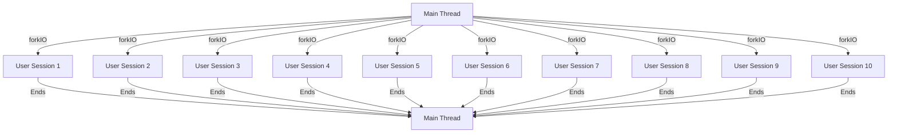

## 8.16 Green Threads and Lightweight Concurrency

Concurrency is a cornerstone of modern software development, enabling applications to perform multiple tasks simultaneously. In Haskell, concurrency is achieved through the use of green threads and lightweight concurrency mechanisms provided by the Glasgow Haskell Compiler (GHC). This section delves into the concepts of green threads, the benefits of lightweight concurrency, and how Haskell's runtime system facilitates efficient thread management.

### Understanding Green Threads

**Green threads** are user-level threads that are managed by the runtime system rather than the operating system (OS). Unlike native threads, which are scheduled by the OS kernel, green threads are scheduled in user space, allowing for more control and flexibility. This approach provides several advantages:

- **Efficiency**: Green threads are lightweight and consume fewer resources compared to OS threads. This allows for the creation and management of thousands of threads without significant overhead.
- **Portability**: Since green threads are managed by the runtime, they can be implemented consistently across different platforms, ensuring portability of concurrent applications.
- **Flexibility**: Developers have more control over scheduling and execution, enabling fine-tuned performance optimizations.

### GHC and Lightweight Concurrency

The Glasgow Haskell Compiler (GHC) is renowned for its robust support for concurrency. GHC's runtime system provides lightweight threads through the `forkIO` function, which allows developers to spawn new threads with minimal overhead. These threads are managed by GHC's runtime, which efficiently schedules them across available processor cores.

#### Key Features of GHC's Concurrency Model

- **Non-blocking I/O**: GHC's runtime supports non-blocking I/O operations, allowing threads to perform I/O without blocking other threads.
- **Preemptive Scheduling**: GHC uses a preemptive scheduling model, ensuring that threads are given fair access to CPU time.
- **Bound Threads**: For scenarios where interaction with foreign libraries is required, GHC provides bound threads, which are tied to specific OS threads.

### Benefits of Lightweight Concurrency

Lightweight concurrency in Haskell offers several benefits that make it an attractive choice for building concurrent applications:

- **Scalability**: The ability to manage thousands of threads efficiently allows applications to scale seamlessly, handling increased workloads without degradation in performance.
- **Responsiveness**: By leveraging concurrency, applications can remain responsive even under heavy load, improving user experience.
- **Simplified Code**: Haskell's functional programming paradigm, combined with its concurrency model, enables developers to write concise and expressive concurrent code.

### Example: Simulating Concurrent User Sessions

Let's explore a practical example of using green threads to simulate concurrent user sessions in a server application. We'll create a simple server that handles multiple user sessions concurrently, demonstrating the power of Haskell's lightweight concurrency.

```haskell
import Control.Concurrent (forkIO, threadDelay)
import Control.Monad (forever)
import System.Random (randomRIO)

-- Simulate a user session
userSession :: Int -> IO ()
userSession userId = do
    putStrLn $ "User " ++ show userId ++ " session started."
    sessionDuration <- randomRIO (1, 5) :: IO Int
    threadDelay (sessionDuration * 1000000) -- Simulate session activity
    putStrLn $ "User " ++ show userId ++ " session ended."

-- Main server function
main :: IO ()
main = do
    putStrLn "Starting server..."
    -- Simulate 10 concurrent user sessions
    mapM_ (\userId -> forkIO (userSession userId)) [1..10]
    -- Keep the main thread alive
    forever $ threadDelay 1000000
```

In this example, we simulate 10 concurrent user sessions using `forkIO` to spawn a new thread for each session. Each session runs independently, simulating activity for a random duration before ending. The `forever` loop in the `main` function keeps the main thread alive, allowing the server to continue running.

### Visualizing Green Threads and Concurrency

To better understand the flow of green threads and concurrency in Haskell, let's visualize the process using a Mermaid.js diagram.



**Diagram Description**: This diagram illustrates the main thread spawning multiple user sessions using `forkIO`. Each session runs concurrently and independently, eventually returning control to the main thread.

### Design Considerations

When implementing green threads and lightweight concurrency in Haskell, consider the following:

- **Thread Safety**: Ensure that shared resources are accessed safely to prevent race conditions. Use synchronization primitives like `MVar` or `STM` (Software Transactional Memory) to manage shared state.
- **Error Handling**: Handle exceptions within threads to prevent crashes. Use mechanisms like `Control.Exception` to catch and manage exceptions.
- **Resource Management**: Be mindful of resource usage, especially when spawning a large number of threads. Monitor memory and CPU usage to avoid resource exhaustion.

### Haskell Unique Features

Haskell's unique features, such as its strong static typing and purity, enhance its concurrency model:

- **Type Safety**: Haskell's type system ensures that concurrent code is type-safe, reducing the risk of runtime errors.
- **Immutability**: The immutability of data structures in Haskell simplifies concurrent programming by eliminating the need for locks in many cases.
- **Lazy Evaluation**: Haskell's lazy evaluation model can be leveraged to defer computations until necessary, optimizing resource usage in concurrent applications.

### Differences and Similarities

Green threads in Haskell are often compared to other concurrency models, such as:

- **Native Threads**: Unlike native threads, green threads are managed by the runtime, offering more control and efficiency.
- **Coroutines**: Green threads are similar to coroutines in that they allow for cooperative multitasking, but they are preemptively scheduled by the runtime.

### Try It Yourself

To deepen your understanding of green threads and lightweight concurrency in Haskell, try modifying the example code:

- **Increase the Number of Sessions**: Experiment with simulating more user sessions to observe how Haskell handles a large number of concurrent threads.
- **Add Logging**: Implement logging to track the start and end times of each session, providing insights into thread execution.
- **Introduce Shared State**: Modify the example to include shared state among sessions, using `MVar` or `STM` to manage access.

### Knowledge Check

- **What are green threads, and how do they differ from native threads?**
- **How does GHC's runtime system facilitate lightweight concurrency in Haskell?**
- **What are the benefits of using green threads for concurrent programming?**

### Embrace the Journey

Remember, mastering concurrency in Haskell is a journey. As you explore green threads and lightweight concurrency, you'll gain valuable insights into building efficient, scalable applications. Keep experimenting, stay curious, and enjoy the process of learning and discovery.

## Quiz: Green Threads and Lightweight Concurrency



### What are green threads?

- [x] User-level threads managed by the runtime
- [ ] OS-level threads managed by the kernel
- [ ] Threads that are always green in color
- [ ] Threads that run only on green hardware

> **Explanation:** Green threads are user-level threads managed by the runtime rather than the OS kernel.

### What function does GHC provide for spawning lightweight threads?

- [x] forkIO
- [ ] forkProcess
- [ ] createThread
- [ ] spawnThread

> **Explanation:** GHC provides the `forkIO` function to spawn lightweight threads.

### What is a key benefit of using green threads?

- [x] They are lightweight and consume fewer resources.
- [ ] They are always faster than native threads.
- [ ] They can only run on specific hardware.
- [ ] They are managed by the OS kernel.

> **Explanation:** Green threads are lightweight and consume fewer resources compared to native threads.

### How does GHC's runtime system schedule green threads?

- [x] Preemptively
- [ ] Cooperatively
- [ ] Randomly
- [ ] Sequentially

> **Explanation:** GHC uses a preemptive scheduling model for green threads.

### What is a potential challenge when using green threads?

- [x] Managing shared state safely
- [ ] Running out of green hardware
- [ ] Ensuring threads are always green
- [ ] Making threads visible to the OS

> **Explanation:** Managing shared state safely is a challenge when using green threads.

### What is the purpose of the `threadDelay` function in the example?

- [x] To simulate session activity
- [ ] To terminate threads
- [ ] To create new threads
- [ ] To change thread priority

> **Explanation:** The `threadDelay` function is used to simulate session activity by pausing the thread.

### What is a bound thread in GHC?

- [x] A thread tied to a specific OS thread
- [ ] A thread that cannot be terminated
- [ ] A thread that is always bound to a variable
- [ ] A thread that runs only in the background

> **Explanation:** A bound thread in GHC is tied to a specific OS thread, useful for foreign library interactions.

### What is a common use case for green threads in Haskell?

- [x] Simulating concurrent user sessions
- [ ] Running graphics-intensive applications
- [ ] Managing hardware resources
- [ ] Performing single-threaded computations

> **Explanation:** Green threads are commonly used to simulate concurrent user sessions in server applications.

### What is the role of `MVar` in concurrent Haskell programming?

- [x] To manage shared state safely
- [ ] To create new threads
- [ ] To terminate threads
- [ ] To delay thread execution

> **Explanation:** `MVar` is used to manage shared state safely in concurrent Haskell programming.

### True or False: Green threads are always faster than native threads.

- [ ] True
- [x] False

> **Explanation:** Green threads are not always faster than native threads; their efficiency depends on the context and workload.



By understanding and leveraging green threads and lightweight concurrency in Haskell, you can build highly efficient and scalable applications. Keep exploring and experimenting with these concepts to unlock the full potential of concurrent programming in Haskell.
