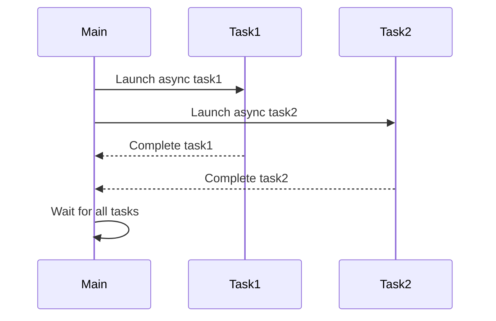

## 8.2 Asynchronous Programming with Async and Futures

Asynchronous programming is a powerful paradigm that allows us to run computations concurrently without blocking the execution of our programs. In Haskell, the `async` library provides a high-level interface for managing asynchronous tasks, making it easier to write concurrent programs. In this section, we will explore the concepts of asynchronous execution, the use of the `async` library, and how to implement asynchronous patterns using `async`, `wait`, `waitAny`, and `waitAll` functions. We will also provide practical examples, including fetching data from multiple web services concurrently.

### Understanding Asynchronous Execution

Asynchronous execution refers to the ability to perform tasks concurrently, allowing other operations to continue without waiting for the completion of the asynchronous tasks. This is particularly useful in scenarios where tasks involve I/O operations, such as network requests or file reading, which can be time-consuming.

#### Key Concepts

- **Concurrency vs. Parallelism**: Concurrency involves managing multiple tasks at the same time, while parallelism involves executing multiple tasks simultaneously. Asynchronous programming focuses on concurrency, allowing tasks to be interleaved.
- **Non-blocking Operations**: Asynchronous tasks do not block the main execution thread, enabling other tasks to proceed without delay.
- **Callbacks and Promises**: In many programming languages, asynchronous operations are managed using callbacks or promises. In Haskell, we use the `async` library to achieve similar functionality.

### Introduction to the Async Library

The `async` library in Haskell provides a simple and powerful way to manage asynchronous tasks. It abstracts the complexities of thread management and offers a high-level API for running and synchronizing tasks.

#### Key Functions

- **`async`**: Launches an asynchronous computation and returns an `Async` handle.
- **`wait`**: Waits for an asynchronous computation to complete and returns its result.
- **`waitAny`**: Waits for any of a list of asynchronous computations to complete.
- **`waitAll`**: Waits for all asynchronous computations in a list to complete.

#### Installation

To use the `async` library, you need to add it to your project's dependencies. You can do this by adding the following line to your `cabal` file:

```haskell
build-depends: async >= 2.2
```

Alternatively, if you are using Stack, add it to your `stack.yaml` file:

```yaml
extra-deps:
  - async-2.2.3
```

### Implementing Asynchronous Patterns

Let's explore how to implement asynchronous patterns using the `async` library. We will start with basic examples and gradually move to more complex scenarios.

#### Basic Asynchronous Task

The simplest way to run an asynchronous task is by using the `async` function. Here's a basic example:

```haskell
import Control.Concurrent.Async

main :: IO ()
main = do
    putStrLn "Starting asynchronous task..."
    a <- async (return "Hello, Async!")
    result <- wait a
    putStrLn $ "Result: " ++ result
```

In this example, we launch an asynchronous task that returns a string. We then wait for the task to complete using `wait` and print the result.

#### Running Multiple Asynchronous Tasks

We can run multiple asynchronous tasks and wait for them to complete using `waitAny` or `waitAll`. Here's an example:

```haskell
import Control.Concurrent.Async

task1 :: IO String
task1 = do
    putStrLn "Running task 1..."
    return "Task 1 completed"

task2 :: IO String
task2 = do
    putStrLn "Running task 2..."
    return "Task 2 completed"

main :: IO ()
main = do
    putStrLn "Starting multiple asynchronous tasks..."
    a1 <- async task1
    a2 <- async task2
    results <- mapM wait [a1, a2]
    mapM_ putStrLn results
```

In this example, we run two asynchronous tasks and wait for both to complete using `mapM wait`.

#### Fetching Data from Multiple Web Services

A common use case for asynchronous programming is fetching data from multiple web services concurrently. Here's how we can achieve this using the `async` library:

```haskell
import Control.Concurrent.Async
import Network.HTTP.Simple

fetchData :: String -> IO String
fetchData url = do
    response <- httpLBS (parseRequest_ url)
    return $ "Fetched data from " ++ url

main :: IO ()
main = do
    let urls = ["http://example.com", "http://example.org"]
    asyncs <- mapM (async . fetchData) urls
    results <- mapM wait asyncs
    mapM_ putStrLn results
```

In this example, we define a `fetchData` function that fetches data from a given URL. We then use `mapM` to launch asynchronous tasks for each URL and wait for all tasks to complete.

### Visualizing Asynchronous Execution

To better understand how asynchronous tasks are managed, let's visualize the process using a sequence diagram.



This diagram illustrates how the main program launches two asynchronous tasks and waits for both to complete.

### Design Considerations

When implementing asynchronous patterns, consider the following:

- **Error Handling**: Use exception handling to manage errors in asynchronous tasks. The `async` library provides functions like `waitCatch` to handle exceptions.
- **Resource Management**: Ensure that resources are properly managed and released when tasks complete.
- **Performance**: Asynchronous programming can improve performance by reducing idle time, but it may also introduce complexity. Profile your application to ensure that concurrency is beneficial.

### Haskell Unique Features

Haskell's strong type system and purity make it well-suited for asynchronous programming. The `async` library leverages these features to provide a safe and efficient way to manage concurrency.

- **Purity**: Haskell's purity ensures that asynchronous tasks do not have side effects, making them easier to reason about.
- **Type Safety**: The `Async` type provides a safe way to manage asynchronous computations, reducing the risk of runtime errors.

### Differences and Similarities

The `async` library in Haskell is similar to futures and promises in other languages, but it leverages Haskell's unique features to provide a more robust and type-safe interface. Unlike callbacks, which can lead to callback hell, the `async` library provides a more structured approach to managing asynchronous tasks.

### Try It Yourself

Experiment with the examples provided by modifying the tasks or adding new ones. Try fetching data from different web services or running computationally intensive tasks asynchronously.

### References and Links

- [async Library](https://hackage.haskell.org/package/async)
- [Concurrency in Haskell](https://wiki.haskell.org/Concurrency)
- [Haskell Documentation](https://www.haskell.org/documentation/)

### Knowledge Check

- What is the difference between concurrency and parallelism?
- How does the `async` library manage asynchronous tasks in Haskell?
- What are the benefits of using asynchronous programming in Haskell?

### Embrace the Journey

Remember, this is just the beginning. As you progress, you'll build more complex and interactive applications using asynchronous programming. Keep experimenting, stay curious, and enjoy the journey!

## Quiz: Asynchronous Programming with Async and Futures



### What is the primary purpose of asynchronous programming?

- [x] To run computations concurrently without blocking
- [ ] To execute tasks sequentially
- [ ] To simplify code readability
- [ ] To reduce memory usage

> **Explanation:** Asynchronous programming allows tasks to run concurrently without blocking the main execution thread.

### Which Haskell library provides high-level concurrency for asynchronous tasks?

- [x] async
- [ ] base
- [ ] containers
- [ ] bytestring

> **Explanation:** The `async` library provides high-level concurrency for managing asynchronous tasks in Haskell.

### What function is used to launch an asynchronous computation in Haskell?

- [x] async
- [ ] wait
- [ ] forkIO
- [ ] threadDelay

> **Explanation:** The `async` function is used to launch an asynchronous computation and returns an `Async` handle.

### How do you wait for an asynchronous computation to complete and return its result?

- [x] wait
- [ ] async
- [ ] forkIO
- [ ] threadDelay

> **Explanation:** The `wait` function waits for an asynchronous computation to complete and returns its result.

### Which function waits for any of a list of asynchronous computations to complete?

- [x] waitAny
- [ ] wait
- [ ] async
- [ ] forkIO

> **Explanation:** The `waitAny` function waits for any of a list of asynchronous computations to complete.

### What is a common use case for asynchronous programming?

- [x] Fetching data from multiple web services concurrently
- [ ] Sorting a list
- [ ] Calculating the factorial of a number
- [ ] Printing a message to the console

> **Explanation:** Asynchronous programming is commonly used for tasks like fetching data from multiple web services concurrently.

### What is the benefit of using Haskell's purity in asynchronous programming?

- [x] It ensures that asynchronous tasks do not have side effects
- [ ] It makes code execution faster
- [ ] It simplifies syntax
- [ ] It reduces memory usage

> **Explanation:** Haskell's purity ensures that asynchronous tasks do not have side effects, making them easier to reason about.

### How does the `Async` type in Haskell help with concurrency?

- [x] It provides a safe way to manage asynchronous computations
- [ ] It speeds up execution
- [ ] It reduces code complexity
- [ ] It simplifies syntax

> **Explanation:** The `Async` type provides a safe way to manage asynchronous computations, reducing the risk of runtime errors.

### What is a potential pitfall of asynchronous programming?

- [x] Increased complexity
- [ ] Reduced performance
- [ ] Simplified error handling
- [ ] Improved readability

> **Explanation:** Asynchronous programming can introduce complexity, making it harder to manage tasks and resources.

### True or False: The `async` library in Haskell is similar to futures and promises in other languages.

- [x] True
- [ ] False

> **Explanation:** The `async` library in Haskell is similar to futures and promises in other languages, providing a structured approach to managing asynchronous tasks.


