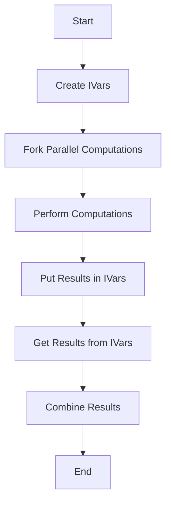

## 8.3 Parallel Programming with the Par Monad

Parallel programming is a powerful technique that allows us to execute multiple computations simultaneously, taking full advantage of multi-core processors. In Haskell, the **Par Monad** is a library designed to facilitate deterministic parallelism, enabling developers to write parallel code that is both composable and predictable. This section will delve into the Par Monad, its advantages, implementation, and provide practical examples to illustrate its use.

### Understanding the Par Monad

The Par Monad is a high-level abstraction for parallel programming in Haskell. It provides a way to express parallel computations in a deterministic manner, meaning that the results of the computations are independent of the scheduling of the parallel tasks. This is a significant advantage over traditional concurrent programming, where non-determinism can lead to unpredictable results and difficult-to-reproduce bugs.

#### Key Concepts

- **Deterministic Parallelism**: Ensures that parallel computations yield the same result regardless of execution order.
- **Composable Parallel Code**: Allows for building complex parallel computations from simpler ones.
- **Separation of Concerns**: The Par Monad separates the logic of computation from the details of parallel execution.

### Advantages of the Par Monad

1. **Determinism**: The Par Monad guarantees that the parallel computations will produce the same result every time they are run with the same inputs, regardless of how the tasks are scheduled.

2. **Composability**: It allows developers to compose complex parallel computations from simpler ones, making it easier to build and maintain parallel applications.

3. **Ease of Use**: The Par Monad abstracts away the low-level details of parallel execution, allowing developers to focus on the logic of their computations.

4. **Performance**: By leveraging multi-core processors, the Par Monad can significantly improve the performance of computation-intensive applications.

### Implementation of the Par Monad

To use the Par Monad, we need to understand its core components: `runPar`, `Par` monad operations, and `IVar`s.

#### `runPar` and `Par` Monad Operations

The `runPar` function is the entry point for executing parallel computations. It takes a computation expressed in the Par Monad and executes it, returning the result.

```haskell
import Control.Monad.Par

parallelComputation :: Par Int
parallelComputation = do
  x <- new
  y <- new
  fork $ put x (expensiveComputation1)
  fork $ put y (expensiveComputation2)
  a <- get x
  b <- get y
  return (a + b)

main :: IO ()
main = print $ runPar parallelComputation
```

- **`new`**: Creates a new `IVar` (immutable variable) that can be used to store the result of a computation.
- **`fork`**: Spawns a new parallel computation.
- **`put`**: Writes a value to an `IVar`.
- **`get`**: Reads a value from an `IVar`, blocking if the value is not yet available.

#### `IVar`s

`IVar`s are a central concept in the Par Monad. They are write-once, read-many variables that facilitate communication between parallel computations.

### Example: Parallelizing a Computation-Intensive Algorithm

Let's consider a practical example where we parallelize a computation-intensive algorithm using the Par Monad. Suppose we have a function that performs a heavy computation on a list of numbers, and we want to parallelize this computation to improve performance.

```haskell
import Control.Monad.Par

-- A computation-intensive function
expensiveComputation :: Int -> Int
expensiveComputation n = sum [1..n]

-- Parallelizing the computation
parallelSum :: [Int] -> Par Int
parallelSum nums = do
  ivars <- mapM (spawnP . expensiveComputation) nums
  results <- mapM get ivars
  return (sum results)

main :: IO ()
main = do
  let nums = [1000000, 2000000, 3000000, 4000000]
  print $ runPar (parallelSum nums)
```

In this example, we use `spawnP` to create parallel computations for each element in the list. The `spawnP` function is a convenience function that combines `fork` and `put`, allowing us to write parallel computations more succinctly.

### Visualizing Parallel Computation with the Par Monad

To better understand how the Par Monad orchestrates parallel computations, let's visualize the process using a flowchart.



**Figure 1**: Flowchart illustrating the parallel computation process using the Par Monad.

### Design Considerations

When using the Par Monad, it's important to consider the following:

- **Granularity**: Ensure that the tasks being parallelized are sufficiently large to justify the overhead of parallel execution.
- **Resource Management**: Be mindful of the resources available on the system, such as the number of CPU cores, to avoid overloading the system with too many parallel tasks.
- **Error Handling**: Consider how errors in parallel computations will be handled, as they can affect the overall result.

### Haskell Unique Features

Haskell's strong type system and purity make it particularly well-suited for parallel programming with the Par Monad. The type system ensures that parallel computations are safe and free from side effects, while purity guarantees that computations can be parallelized without unintended interactions.

### Differences and Similarities with Other Patterns

The Par Monad is often compared to other concurrency patterns in Haskell, such as Software Transactional Memory (STM) and the `async` library. While STM is designed for concurrent programming with shared mutable state, the Par Monad focuses on deterministic parallelism with immutable data. The `async` library, on the other hand, provides a simpler interface for asynchronous programming but does not guarantee determinism.

### Try It Yourself

To gain a deeper understanding of the Par Monad, try modifying the code examples provided:

- Experiment with different computation functions to see how they affect performance.
- Adjust the size of the input list to observe how it impacts parallel execution.
- Implement error handling to manage exceptions in parallel computations.

### References and Further Reading

For more information on the Par Monad and parallel programming in Haskell, consider the following resources:

- [Par Monad Documentation](https://hackage.haskell.org/package/monad-par)
- "Parallel and Concurrent Programming in Haskell" by Simon Marlow
- Haskell Wiki: [Parallelism and Concurrency](https://wiki.haskell.org/Parallelism_and_concurrency)

### Knowledge Check

Before moving on, let's review some key concepts:

- What is deterministic parallelism, and why is it important?
- How does the Par Monad ensure composability of parallel computations?
- What role do `IVar`s play in the Par Monad?

### Embrace the Journey

Remember, mastering parallel programming with the Par Monad is a journey. As you continue to explore and experiment, you'll develop a deeper understanding of how to leverage Haskell's powerful features to write efficient, parallel code. Keep experimenting, stay curious, and enjoy the journey!

## Quiz: Parallel Programming with the Par Monad



### What is the primary advantage of using the Par Monad in Haskell?

- [x] Deterministic parallelism
- [ ] Simplified syntax
- [ ] Enhanced error handling
- [ ] Improved memory management

> **Explanation:** The Par Monad provides deterministic parallelism, ensuring that parallel computations yield the same result regardless of execution order.

### Which function is used to execute a computation in the Par Monad?

- [ ] fork
- [ ] get
- [x] runPar
- [ ] put

> **Explanation:** `runPar` is used to execute a computation expressed in the Par Monad.

### What is an `IVar` in the context of the Par Monad?

- [x] A write-once, read-many variable
- [ ] A mutable variable
- [ ] A thread-safe counter
- [ ] A logging mechanism

> **Explanation:** An `IVar` is a write-once, read-many variable used for communication between parallel computations.

### How does the Par Monad ensure composability?

- [x] By allowing complex computations to be built from simpler ones
- [ ] By providing a global state
- [ ] By enforcing strict evaluation
- [ ] By using mutable variables

> **Explanation:** The Par Monad allows developers to compose complex parallel computations from simpler ones, enhancing composability.

### Which of the following is a key feature of the Par Monad?

- [x] Determinism
- [ ] Asynchronous execution
- [ ] Shared mutable state
- [ ] Dynamic typing

> **Explanation:** The Par Monad is known for its deterministic execution of parallel computations.

### What is the role of `fork` in the Par Monad?

- [x] To spawn a new parallel computation
- [ ] To read a value from an `IVar`
- [ ] To execute a computation
- [ ] To handle errors

> **Explanation:** `fork` is used to spawn a new parallel computation in the Par Monad.

### How can you handle errors in parallel computations with the Par Monad?

- [ ] By using mutable variables
- [ ] By ignoring them
- [x] By implementing error handling logic
- [ ] By using global state

> **Explanation:** Implementing error handling logic is necessary to manage exceptions in parallel computations.

### What is the purpose of `put` in the Par Monad?

- [ ] To execute a computation
- [x] To write a value to an `IVar`
- [ ] To spawn a new computation
- [ ] To read a value from an `IVar`

> **Explanation:** `put` is used to write a value to an `IVar` in the Par Monad.

### What is the significance of `spawnP` in the Par Monad?

- [x] It combines `fork` and `put` for succinct parallel computations
- [ ] It reads a value from an `IVar`
- [ ] It handles errors
- [ ] It manages global state

> **Explanation:** `spawnP` is a convenience function that combines `fork` and `put`, allowing for succinct parallel computations.

### True or False: The Par Monad guarantees that parallel computations will produce the same result every time they are run with the same inputs.

- [x] True
- [ ] False

> **Explanation:** The Par Monad guarantees deterministic parallelism, ensuring consistent results for the same inputs.


