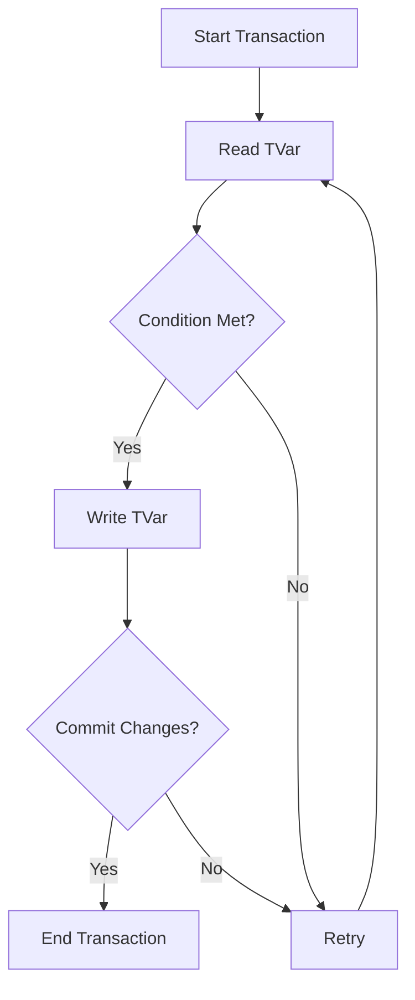

## 8.4 Software Transactional Memory Patterns

In the realm of concurrent programming, managing shared state between threads can be a daunting task. Traditional locking mechanisms often lead to complex, error-prone code. Haskell offers a powerful alternative: Software Transactional Memory (STM). STM allows developers to compose complex concurrent transactions with ease, providing a higher level of abstraction for managing shared state. In this section, we'll delve into advanced STM patterns, exploring retry mechanisms, choice, and conditional synchronization. We'll also demonstrate these concepts with a practical example: implementing a concurrent, blocking queue.

### Understanding Software Transactional Memory

Software Transactional Memory (STM) is a concurrency control mechanism akin to database transactions for memory operations. It allows multiple threads to operate on shared memory concurrently, ensuring consistency and isolation. STM in Haskell is built on the concept of atomic transactions, which are sequences of memory operations that appear indivisible to other threads.

#### Key Concepts of STM

- **Atomicity**: Transactions are executed atomically, meaning they either complete entirely or have no effect at all.
- **Consistency**: Transactions maintain the consistency of shared memory.
- **Isolation**: Transactions are isolated from each other, preventing race conditions.
- **Composability**: STM transactions can be composed to form larger transactions.

### Advanced STM Patterns

#### Composing Complex Concurrent Transactions

One of the strengths of STM is its ability to compose transactions. This composability allows developers to build complex concurrent operations from simpler ones. Let's explore how to compose transactions using STM.

##### Using `retry` and `orElse`

The `retry` and `orElse` functions are fundamental to composing transactions in STM.

- **`retry`**: This function aborts the current transaction and retries it when the state of the transactional variables changes. It's useful for waiting until a certain condition is met.

- **`orElse`**: This function allows for alternative transactions. If the first transaction retries, the second transaction is attempted.

Here's a simple example demonstrating the use of `retry` and `orElse`:

```haskell
import Control.Concurrent.STM
import Control.Monad (forever)

-- A simple transactional variable
type TVarInt = TVar Int

-- Function to increment a TVarInt if it's less than a threshold
incrementIfBelow :: TVarInt -> Int -> STM ()
incrementIfBelow tvar threshold = do
    value <- readTVar tvar
    if value < threshold
        then writeTVar tvar (value + 1)
        else retry

-- Function to decrement a TVarInt if it's above a threshold
decrementIfAbove :: TVarInt -> Int -> STM ()
decrementIfAbove tvar threshold = do
    value <- readTVar tvar
    if value > threshold
        then writeTVar tvar (value - 1)
        else retry

-- Composing transactions using orElse
adjustValue :: TVarInt -> Int -> Int -> STM ()
adjustValue tvar low high = incrementIfBelow tvar high `orElse` decrementIfAbove tvar low

main :: IO ()
main = do
    tvar <- atomically $ newTVar 0
    atomically $ adjustValue tvar 0 10
    finalValue <- atomically $ readTVar tvar
    putStrLn $ "Final value: " ++ show finalValue
```

In this example, `adjustValue` attempts to increment the value if it's below a certain threshold or decrement it if it's above another threshold. The use of `orElse` ensures that one of the transactions will succeed if possible.

#### Retry Mechanisms and Conditional Synchronization

Retry mechanisms in STM allow transactions to wait for certain conditions to be met before proceeding. This is particularly useful for implementing conditional synchronization, where a transaction waits for a specific state before executing.

Consider a scenario where we want to implement a simple producer-consumer pattern using STM. The producer should wait if the buffer is full, and the consumer should wait if the buffer is empty.

```haskell
import Control.Concurrent.STM
import Control.Monad (forever)

type Buffer = TVar [Int]

-- Producer function
produce :: Buffer -> Int -> STM ()
produce buffer item = do
    items <- readTVar buffer
    if length items < 10 -- Assuming buffer size is 10
        then writeTVar buffer (item : items)
        else retry

-- Consumer function
consume :: Buffer -> STM Int
consume buffer = do
    items <- readTVar buffer
    case items of
        [] -> retry
        (x:xs) -> do
            writeTVar buffer xs
            return x

main :: IO ()
main = do
    buffer <- atomically $ newTVar []
    atomically $ produce buffer 1
    item <- atomically $ consume buffer
    putStrLn $ "Consumed item: " ++ show item
```

In this example, the producer waits if the buffer is full, and the consumer waits if the buffer is empty. The `retry` function is used to block the transaction until the condition changes.

### Implementing a Concurrent, Blocking Queue

Let's put these concepts into practice by implementing a concurrent, blocking queue using STM. A blocking queue is a data structure that allows multiple producers and consumers to operate concurrently, blocking operations when the queue is full or empty.

#### Queue Data Structure

We'll define a simple queue data structure using transactional variables:

```haskell
import Control.Concurrent.STM

data Queue a = Queue (TVar [a]) (TVar [a])

newQueue :: STM (Queue a)
newQueue = do
    front <- newTVar []
    back <- newTVar []
    return $ Queue front back
```

The queue consists of two lists: `front` and `back`. The `front` list holds the elements to be dequeued, while the `back` list holds the elements to be enqueued.

#### Enqueue Operation

The enqueue operation adds an element to the back of the queue:

```haskell
enqueue :: Queue a -> a -> STM ()
enqueue (Queue _ back) item = do
    items <- readTVar back
    writeTVar back (item : items)
```

#### Dequeue Operation

The dequeue operation removes an element from the front of the queue. If the front list is empty, it reverses the back list and swaps them:

```haskell
dequeue :: Queue a -> STM a
dequeue (Queue front back) = do
    frontItems <- readTVar front
    case frontItems of
        (x:xs) -> do
            writeTVar front xs
            return x
        [] -> do
            backItems <- readTVar back
            case reverse backItems of
                [] -> retry
                (y:ys) -> do
                    writeTVar front ys
                    writeTVar back []
                    return y
```

In this implementation, the `dequeue` operation retries if both the front and back lists are empty, effectively blocking until an item is available.

#### Testing the Blocking Queue

Let's test our blocking queue implementation with a simple producer-consumer scenario:

```haskell
import Control.Concurrent
import Control.Concurrent.STM
import Control.Monad (forever, replicateM_)

producer :: Queue Int -> IO ()
producer queue = forever $ do
    atomically $ enqueue queue 1
    putStrLn "Produced 1"
    threadDelay 1000000 -- 1 second delay

consumer :: Queue Int -> IO ()
consumer queue = forever $ do
    item <- atomically $ dequeue queue
    putStrLn $ "Consumed " ++ show item
    threadDelay 1500000 -- 1.5 seconds delay

main :: IO ()
main = do
    queue <- atomically newQueue
    forkIO $ producer queue
    forkIO $ consumer queue
    threadDelay 10000000 -- Run for 10 seconds
```

In this example, the producer adds an item to the queue every second, while the consumer removes an item every 1.5 seconds. The queue ensures that the consumer waits if the queue is empty.

### Visualizing STM Transactions

To better understand how STM transactions work, let's visualize the process using a flowchart. This diagram illustrates the flow of a transaction, including reading and writing transactional variables, retrying, and committing changes.



**Diagram Description**: This flowchart represents the lifecycle of an STM transaction. It begins by reading a transactional variable (TVar). If a condition is met, it writes to the TVar and attempts to commit the changes. If the condition is not met, it retries the transaction. The transaction ends successfully when changes are committed.

### Design Considerations for STM

When using STM, consider the following design considerations:

- **Granularity**: Choose the appropriate level of granularity for transactional variables. Fine-grained transactions can lead to better concurrency but may increase complexity.
- **Performance**: While STM simplifies concurrency, it may introduce overhead compared to lock-based approaches. Profile and optimize as needed.
- **Deadlocks**: STM eliminates many deadlock scenarios, but careful design is still required to avoid livelocks and starvation.
- **Composability**: Leverage the composability of STM to build complex transactions from simpler ones.

### Haskell's Unique Features in STM

Haskell's STM implementation is unique due to its integration with the language's type system and purity. The use of `STM` monad ensures that transactions are pure and composable, aligning with Haskell's functional programming paradigm.

### Differences and Similarities with Other Patterns

STM shares similarities with database transactions, providing atomicity, consistency, and isolation. However, unlike traditional locking mechanisms, STM allows for composable transactions and eliminates many concurrency pitfalls.

### Try It Yourself

Experiment with the provided code examples by modifying the buffer size or the producer and consumer delays. Observe how these changes affect the behavior of the queue. Try implementing additional features, such as a bounded queue or priority queue, using STM.

### Knowledge Check

- What are the key benefits of using STM over traditional locking mechanisms?
- How does the `retry` function work in STM transactions?
- What is the purpose of the `orElse` function in STM?
- How can STM be used to implement a producer-consumer pattern?

### Embrace the Journey

Remember, mastering STM is just one step in your journey to becoming an expert in concurrent programming with Haskell. As you progress, you'll discover more advanced patterns and techniques. Keep experimenting, stay curious, and enjoy the journey!

## Quiz: Software Transactional Memory Patterns



### What is the primary advantage of using STM over traditional locking mechanisms?

- [x] Composability of transactions
- [ ] Simplicity of implementation
- [ ] Better performance in all cases
- [ ] Easier debugging

> **Explanation:** STM allows for composable transactions, which is a significant advantage over traditional locking mechanisms.

### Which function in STM is used to abort and retry a transaction?

- [ ] orElse
- [x] retry
- [ ] atomically
- [ ] newTVar

> **Explanation:** The `retry` function is used to abort and retry a transaction when a condition is not met.

### How does the `orElse` function enhance STM transactions?

- [x] It allows for alternative transactions if the first one retries.
- [ ] It improves performance by optimizing transactions.
- [ ] It simplifies the syntax of STM transactions.
- [ ] It ensures transactions are always successful.

> **Explanation:** The `orElse` function provides an alternative transaction path if the first transaction retries.

### In the context of STM, what does atomicity ensure?

- [x] Transactions are executed completely or not at all.
- [ ] Transactions are faster than lock-based approaches.
- [ ] Transactions can be interrupted at any point.
- [ ] Transactions are always successful.

> **Explanation:** Atomicity ensures that transactions are executed completely or not at all, maintaining consistency.

### What is a potential drawback of using STM?

- [ ] Increased complexity compared to locks
- [ ] Higher risk of deadlocks
- [x] Potential performance overhead
- [ ] Lack of composability

> **Explanation:** STM may introduce performance overhead compared to lock-based approaches, especially in high-contention scenarios.

### Which of the following is a key feature of STM in Haskell?

- [x] Integration with the type system
- [ ] Use of global locks
- [ ] Lack of isolation
- [ ] Requirement of manual memory management

> **Explanation:** Haskell's STM is integrated with the type system, ensuring purity and composability.

### How can STM help prevent deadlocks?

- [x] By eliminating the need for locks
- [ ] By using global locks
- [ ] By enforcing strict ordering of transactions
- [ ] By allowing transactions to be interrupted

> **Explanation:** STM eliminates the need for locks, reducing the risk of deadlocks.

### What is the role of the `atomically` function in STM?

- [x] It executes a transaction atomically.
- [ ] It retries a transaction if it fails.
- [ ] It optimizes the performance of transactions.
- [ ] It simplifies the syntax of STM transactions.

> **Explanation:** The `atomically` function executes a transaction atomically, ensuring its consistency and isolation.

### True or False: STM transactions in Haskell are impure.

- [ ] True
- [x] False

> **Explanation:** STM transactions in Haskell are pure, aligning with the functional programming paradigm.

### Which pattern is commonly used with STM to implement conditional synchronization?

- [x] Retry mechanisms
- [ ] Lock-based synchronization
- [ ] Global locks
- [ ] Manual memory management

> **Explanation:** Retry mechanisms are commonly used with STM to implement conditional synchronization.


