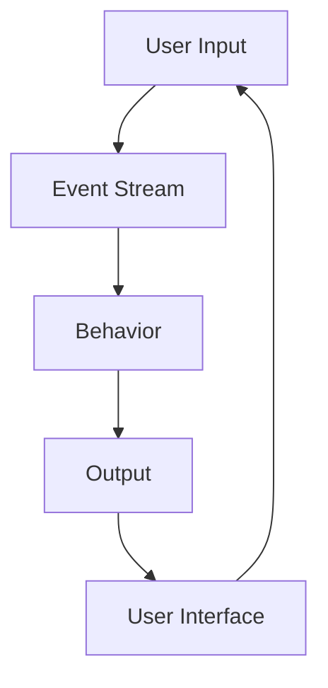

## 8.5 Reactive Programming with FRP Libraries

Reactive Programming is a paradigm that has gained significant traction in the world of software development, particularly for building responsive and interactive applications. In Haskell, this paradigm is elegantly expressed through Functional Reactive Programming (FRP), which leverages the language's strengths in handling pure functions and immutable data. This section delves into the world of FRP in Haskell, exploring popular libraries such as Yampa, Reflex, and reactive-banana, and demonstrating how they can be used to model time-varying values and event streams.

### Understanding Reactive Programming

Reactive Programming is an asynchronous programming paradigm focused on data streams and the propagation of change. It allows developers to express dynamic behavior in a declarative manner, making it easier to manage complex interactions and state changes over time.

#### Key Concepts

- **Data Streams**: Continuous flows of data that can be observed and manipulated.
- **Propagation of Change**: Automatic updating of dependent computations when the underlying data changes.
- **Declarative Style**: Expressing the logic of computation without explicitly describing control flow.

### Functional Reactive Programming (FRP)

FRP extends Reactive Programming by incorporating functional programming principles, such as immutability and pure functions. This combination results in a powerful paradigm for building applications that react to changes in a predictable and composable manner.

#### Core Components of FRP

- **Behaviors**: Represent time-varying values, akin to variables that change over time.
- **Events**: Discrete occurrences that can trigger changes in behaviors or other events.

### Popular FRP Libraries in Haskell

Haskell's rich type system and emphasis on purity make it an ideal language for implementing FRP. Several libraries have been developed to facilitate FRP in Haskell, each with its own strengths and use cases.

#### Yampa

Yampa is a domain-specific language for FRP in Haskell, particularly well-suited for modeling hybrid systems, such as simulations and games. It is built on the concept of signal functions, which transform input signals into output signals over time.

- **Signal Functions**: Central to Yampa, these are functions that take a signal as input and produce a signal as output.
- **Arrow Syntax**: Yampa leverages Haskell's arrow syntax to compose signal functions.

#### Reflex

Reflex is a powerful FRP library designed for building interactive web applications. It provides a high-level abstraction for managing dynamic behavior and user interactions in a declarative manner.

- **Dynamic**: Represents a value that can change over time, similar to a behavior.
- **Event**: Represents a stream of discrete occurrences.

#### reactive-banana

reactive-banana is a lightweight FRP library that focuses on simplicity and ease of use. It is suitable for a wide range of applications, from GUIs to data processing.

- **Behavior**: Represents a time-varying value.
- **Event**: Represents a stream of discrete events.

### Implementing FRP with Haskell Libraries

Let's explore how to implement FRP concepts using these libraries, starting with modeling time-varying values and event streams.

#### Modeling Time-Varying Values

In FRP, time-varying values are represented as behaviors. These can be thought of as variables that change over time, and they are central to modeling dynamic systems.

##### Example: Modeling a Simple Counter

```haskell
import Reactive.Banana
import Reactive.Banana.Frameworks

main :: IO ()
main = do
    (addEvent, fireAdd) <- newAddHandler
    network <- compile $ do
        eAdd <- fromAddHandler addEvent
        let bCounter = accumB 0 ((+1) <$ eAdd)
        reactimate $ fmap print bCounter
    actuate network
    fireAdd ()
    fireAdd ()
```

In this example, we use reactive-banana to model a simple counter that increments each time an event occurs. The `accumB` function creates a behavior that accumulates changes over time.

#### Creating Interactive Simulations or Games

FRP is particularly well-suited for creating interactive simulations and games, where the state of the system changes in response to user input or other events.

##### Example: A Simple Pong Game with Yampa

```haskell
import FRP.Yampa
import Graphics.Gloss.Interface.Pure.Game

type Ball = (Float, Float)
type Velocity = (Float, Float)

ball :: SF () Ball
ball = proc _ -> do
    rec
        pos <- integral -< vel
        vel <- integral -< (0, -9.8)
    returnA -< pos

main :: IO ()
main = play (InWindow "Pong" (800, 600) (100, 100))
            white
            60
            ()
            draw
            handleInput
            update

draw :: () -> Picture
draw _ = circleSolid 10

handleInput :: Event -> () -> ()
handleInput _ = id

update :: Float -> () -> ()
update _ = id
```

In this example, we use Yampa to model the movement of a ball in a simple Pong game. The `integral` function is used to compute the position and velocity of the ball over time.

### Visualizing FRP Concepts

To better understand how FRP works, let's visualize the flow of data in an FRP system using a Mermaid.js diagram.



**Diagram Description**: This diagram illustrates the flow of data in an FRP system. User input generates an event stream, which updates behaviors. These behaviors produce output that is rendered in the user interface, creating a feedback loop.

### Design Considerations

When using FRP in Haskell, there are several design considerations to keep in mind:

- **Performance**: FRP systems can become complex, and performance may degrade if not managed carefully. Consider optimizing event handling and minimizing unnecessary computations.
- **Composability**: Leverage Haskell's strong type system and functional composition to build modular and reusable components.
- **Debugging**: Debugging FRP systems can be challenging due to the declarative nature of the paradigm. Use logging and visualization tools to trace data flow and identify issues.

### Haskell Unique Features

Haskell's unique features, such as its strong static typing, lazy evaluation, and purity, make it an excellent choice for implementing FRP. These features enable developers to write concise, expressive, and safe code that is easy to reason about.

### Differences and Similarities

FRP shares similarities with other reactive programming paradigms, such as ReactiveX, but it is distinguished by its emphasis on functional programming principles. Unlike imperative reactive systems, FRP in Haskell is purely functional, allowing for more predictable and composable code.

### Try It Yourself

To deepen your understanding of FRP in Haskell, try modifying the examples provided:

- **Experiment with different event sources**: Modify the counter example to respond to different types of events, such as keyboard input or network messages.
- **Enhance the Pong game**: Add user controls to move paddles and detect collisions with the ball.

### Knowledge Check

Before moving on, let's review some key concepts:

- What are the core components of FRP?
- How do behaviors and events differ in FRP?
- What are some design considerations when using FRP in Haskell?

### Embrace the Journey

Remember, mastering FRP in Haskell is a journey. As you experiment with different libraries and build more complex applications, you'll gain a deeper understanding of this powerful paradigm. Stay curious, keep exploring, and enjoy the process!

## Quiz: Reactive Programming with FRP Libraries



### What is the primary focus of Reactive Programming?

- [x] Asynchronous data streams and change propagation
- [ ] Synchronous data processing
- [ ] Static data modeling
- [ ] Object-oriented design

> **Explanation:** Reactive Programming is centered around asynchronous data streams and the propagation of changes.

### Which Haskell library is particularly well-suited for building web applications with FRP?

- [ ] Yampa
- [x] Reflex
- [ ] reactive-banana
- [ ] Gloss

> **Explanation:** Reflex is designed for building interactive web applications using FRP.

### What is a Behavior in FRP?

- [x] A time-varying value
- [ ] A discrete event
- [ ] A static variable
- [ ] A function

> **Explanation:** In FRP, a Behavior represents a value that changes over time.

### What is the role of Signal Functions in Yampa?

- [x] Transform input signals into output signals over time
- [ ] Handle user input events
- [ ] Manage state transitions
- [ ] Render graphics

> **Explanation:** Signal Functions in Yampa are used to transform input signals into output signals over time.

### Which function in reactive-banana is used to accumulate changes over time?

- [x] accumB
- [ ] reactimate
- [ ] integral
- [ ] compile

> **Explanation:** The `accumB` function in reactive-banana accumulates changes over time to create a Behavior.

### What is a key advantage of using FRP in Haskell?

- [x] Predictable and composable code
- [ ] Faster execution than imperative code
- [ ] Easier debugging
- [ ] Automatic memory management

> **Explanation:** FRP in Haskell allows for predictable and composable code due to its functional nature.

### How does Reflex represent a stream of discrete occurrences?

- [x] Event
- [ ] Behavior
- [ ] Signal
- [ ] Dynamic

> **Explanation:** In Reflex, an Event represents a stream of discrete occurrences.

### What is a common challenge when debugging FRP systems?

- [x] Tracing data flow and identifying issues
- [ ] Managing memory allocation
- [ ] Handling user input
- [ ] Rendering graphics

> **Explanation:** Debugging FRP systems can be challenging due to the declarative nature of the paradigm, making it difficult to trace data flow and identify issues.

### What is a key feature of Haskell that benefits FRP?

- [x] Strong static typing
- [ ] Dynamic typing
- [ ] Object-oriented design
- [ ] Automatic garbage collection

> **Explanation:** Haskell's strong static typing is a key feature that benefits FRP by enabling safe and expressive code.

### True or False: FRP in Haskell is purely functional.

- [x] True
- [ ] False

> **Explanation:** FRP in Haskell is purely functional, allowing for more predictable and composable code.




